IOT-Tree Server
==
 <a href="./web/doc/cn/README.md" target="_blank">中文</a>
 <!--
 <a href="./web/doc/jp/README.md" target="_blank">日本語</a>
 -->

<a href="https://github.com/bambooww/iot-tree/releases" target="_blank">Download</a>

<a href="https://pan.baidu.com/s/15uQT4G0CoV9obc0qn6IPjg?pwd=tuf3" target="_blank">Download pan.baidu.com<a>

IOT-Tree Server is a service software system designed for IoT access, data normalization, human-machine interaction display, scheduling control, and data utilization. It is primarily developed using Java, and its management interface is entirely web-based.

[Actual project Case][wiki]

The main functionalities are divided into two major parts:

1. Root Part of the tree

This part focuses on the access (interconnection) of devices or other systems. Using a clear and structured architecture, it comprises multiple layers such as communication access, channels, device drivers, and data tags, which are ultimately managed and organized in a tree structure.

Within this tree-structured organizational management, human-machine interaction nodes can also be established, providing support for online UI creation to meet the needs of traditional automation monitoring software.

2. The upper part of the tree

In the upper part of the tree, IOT-Tree implements a visual message flow running mechanism based on messages. This message flow allows you to easily implement control logic for automated environments and, through continuously expanding operational nodes, meet various data scheduling and utilization needs.

For example, real-time data based on tags at the root of the tree can be used to trigger control processes on a scheduled or event basis, achieving complex control needs on site. At the same time, various docking functions can also be achieved through internal message processing nodes such as external communication support (MQTT, Kafka, Mail), data output support (Excel, CSV), and data storage support (Database). Standard device simulation nodes (such as Modbus Slave, BACnet) can also be used to simulate standard devices externally.

<table style="background-color:#1e1e1e;border:1px solid #dddddd;">
 <tr>
  <td width="50%" style="text-align:right;background-color:#1e1e1e;border:0px">
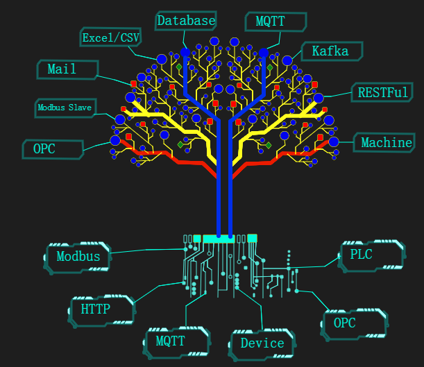
  </td>
  <td style="text-align:left;background-color:#1e1e1e;border:0px">
  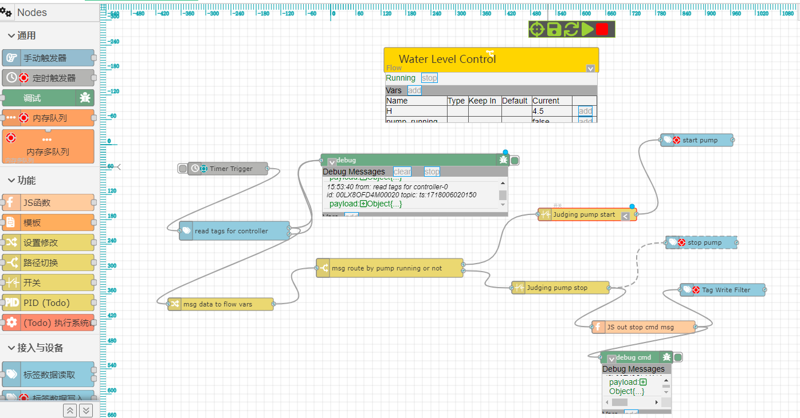
    
  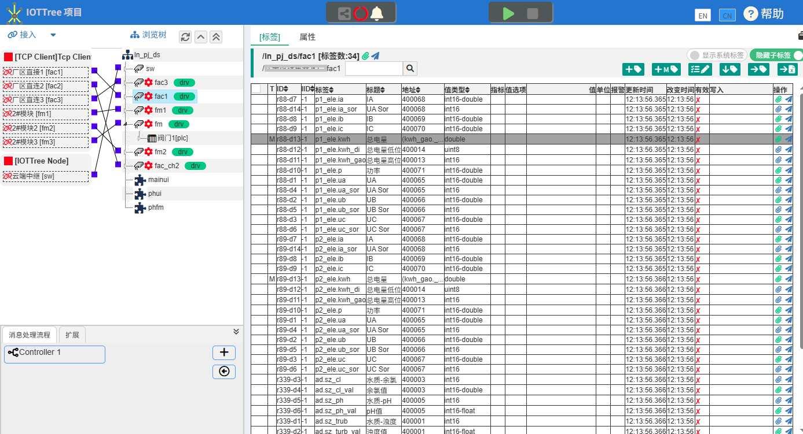
  </td>
</table>

[Quick Start][quick_start]

[Document Menu][nav]

[Demo][demo_link]

[Download][dl_link]

## 1 What does IOT-Tree Server do?

### 1.1 It can be used as an industrial field(SCADA) or edge computing node

You can use IOT-Tree server as the PC side configuration software in the industrial field.

Select the appropriate access mode according to the field communication situation, and select the appropriate driver and associated devices. You can quickly make field projects orderly and clear at the computer management end. Then, you can quickly configure the human-computer interaction according to the operating conditions.

If a device or sub station is complex, you can design the sub control ui first, and then reference it in the general control ui.

If a device is complex but has defined the ui elements it can provide, you only need to introduce the device, and the ui elements associated with the device can directly become the referenced content in your project.

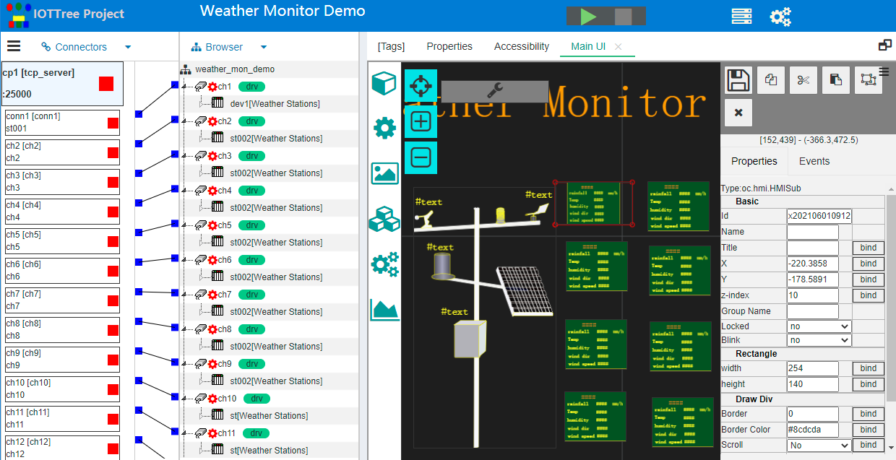

running...

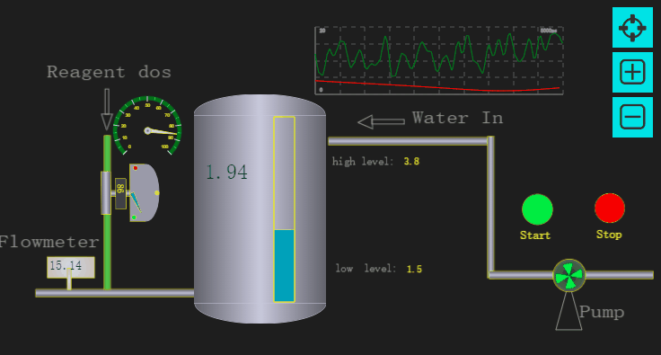

#### Use Case

[Demonstration of Industrial Automation][case_auto_demo]

### 1.2 Data access integration and provision of standard interfaces to outer

IOT-Tree Server supports access to data from different data sources (different standards):

Communication protocol: Modbus (Modbus RTU/Modbus TCP), Siemens PPI/S7 protocol (PLC S7-200/300/1200/1500),Mitsubishi PLC protocol, Omron PLC protocol

Application Protocols: OPC (OPC UA, OPC DA) related protocols, HTTP, MQTT

Database: MySQL, SQL Server and Oracle

IOT-Tree Server provides support for the unified standard interface for industrial OPC. Through simple and clear management of the access devices and data sources, the differences between the underlying complex devices and data sources are shielded, and the interconnection of industry, automation systems, Internet of Things systems and the Internet is achieved with great ease of operation.

IOT-Tree Server provides strong support for access to inter-network resources, such as accurate crawling for HTTP access, precise data extraction in Web pages, and integration into unified data management.

On the other hand, IOT-Tree is also a professional OPC UA Server that can easily provide external access by OPC UA Server after connecting various devices and system data. Not only that, IOT-Tree can also provide BACnet and Modbus analog device interfaces to the outside world.

[IOT‐Tree connects various devices to OPC UA Server output](https://github.com/bambooww/iot-tree/wiki/IOT%E2%80%90Tree-connects-various-devices-to-OPC-UA-Server-output)

### 1.3 embedded into the device

If you have an embedded device with sufficient performance to run Java virtual machine, IOT-Tree Server can easily make your device a controller. And the controller can support online configuration and UI design, and provide online real-time operation services.

[Embedded Demo][embed_ctrl_demo]

### 1.4 as an IOT Middleware

At the intermediate level from the IOT sensing layer to the cloud, the IOT-Tree Server node is deployed to collect local relevant IOT data. By integrating the publication and subscription of the message bus of the system, it can provide efficient and flexible data interaction for the high-level management system (MES or ERP, etc).

The development of the top-level production management system can be based on the existing mature database and it technology framework. The IOT-Tree Server shields the complex professional knowledge of the bottom production line, greatly reducing the development difficulty of the top-level management system.

### 1.5 As a IOT Server

If you are an Internet company, you have just come into contact with the Internet of things project. Limited by the lack of experience in professional device access and data management, or you research and develop relevant device access protocols and data collection management from scratch. This process will take up a lot of your development resources and time at the same time.

You can try IOT-Tree Server, just like database service, and make it a server supported behind your project.

If your devices happens to be supported by our built-in driver, IOT-Tree Server is expected to give you a surprise.

According to our open source strategy, most of your projects can be used for free. A very important point is that over time, we will support more and more drivers. I hope IOT-Tree Server can save you a lot of costs and get more benefits.

### 1.6 As a node of distributed applications

IOT-Tree Server can be deployed as a shared node based on multiple communication modes by project. The local node is a complete automatic monitoring site that can run independently. Other IOT-Tree Servers in the network can refer to this node in the project to become a part of themselves and become the upper level node of this node.

This distributed function can greatly facilitate the linkage of cross regional monitoring sites. For example, each monitoring site only needs broadband for secure communication with the cloud message queue server, which can easily form a hierarchical relationship. The top IOT-Tree Server node system can monitor the communication link and use this communication state as the system communication exception to deal with multiple related functions.

[Center-substation remote monitoring][center_substation]

## 2 Composition of IOT-Tree Server

### 2.1 project based management mechanism

IOT-Tree Server is basically composed of projects. You can set up different projects in different applications according to your needs. Each project includes data access, channel devices organization and management, data items, human-computer interaction UI, control logic, etc.

### 2.2 Device library management mechanism

The IOT-Tree Server device library function is independent of the project and can be shared by all projects. You can accumulate your own devices according to your own business needs to facilitate subsequent project development.

In the project, the device belongs to the content below the channel. A device can include data items, data organization levels and human-computer interaction UI. In a project, you can add the newly defined device to the library at any time, so that it can be directly used by other projects.

### 2.3 online UI editing function

The project or the device definition in the device library can add UI items, and can be edited online directly. The system provides powerful WYSIWYG editing tools online support.

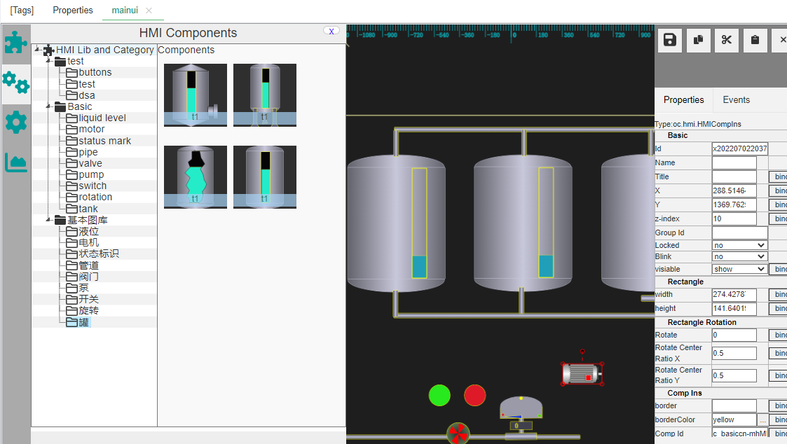

### 2.4 Mechanism of UI element library

IOT-Tree Server provides an independent UI element primitive library function, which is managed through different libraries - Classification - UI Element, and also provides online editing function.

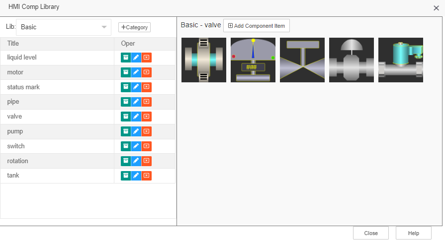

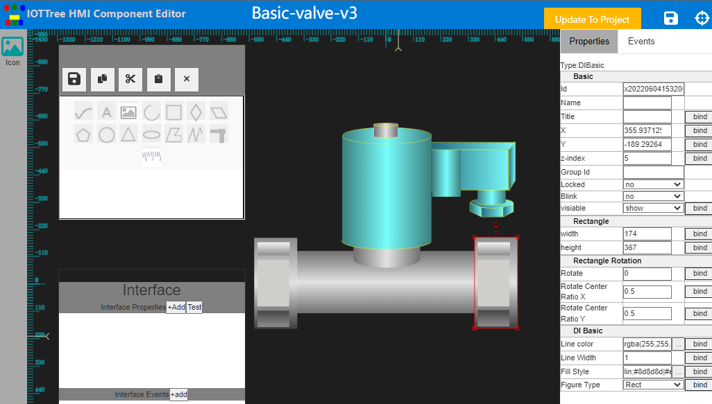

### 2.5 Flexible, intuitive, and powerful Message Flow/Net

Starting from version 1.7.0, IOT-Tree provides powerful message based flow processing capabilities. This function provides various functional nodes, allowing users to define flow online according to their needs and achieve the business functions they need.

Starting from this version, IOT-Tree will not update and maintain previous modules such as task scheduling (including control implementation), alert function, data routing, and data storage. Because all of these can be implemented by message flow and can provide greater flexibility.

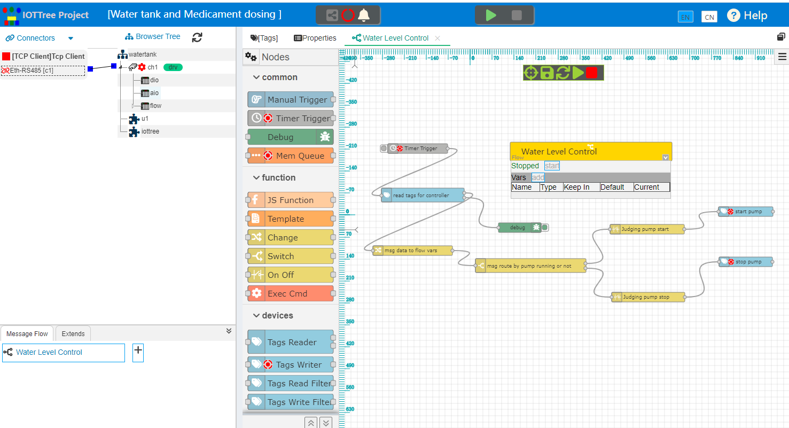

### 2.6 Client support
The IOT-Tree Server internally supports gRPC services. Once enabled, you can develop your client programs using various other languages and technologies. These client programs can benefit from the high-performance support provided by the gRPC interface.

You can refer to [Implement Your Own .Net Client][iottree.net_doc] and the accompanying [Open-source C#.Net gRPC Wrapper Library][iottree.net]

Also,IOT-Tree provides a client program for monitoring UI to facilitate the use of on-site computers (or all-in-one PCs that support touch functionality) in the monitoring system. It can facilitate automatic startup of the device and fill the monitoring screen.

[iottree.net_doc]: ./web/doc/en/doc/util/iottree.net.md
[iottree.net]: https://github.com/bambooww/iottree.net

<table>
<tr><td>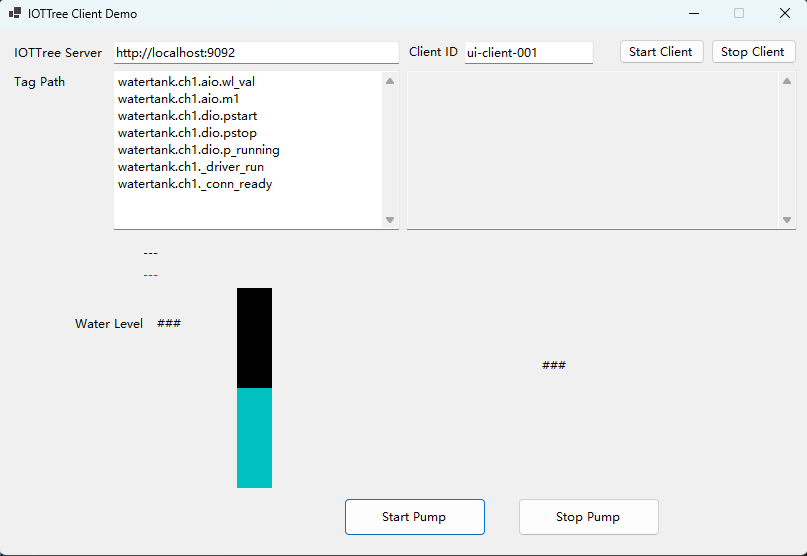</td><td>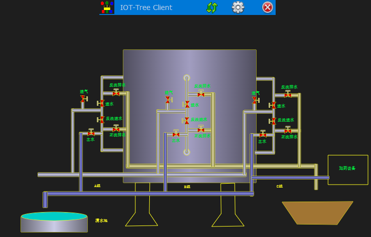</td>
</tr>
</table>

### 2.7 Custom management UI

You can use the standard Java Webapp development method to implement your custom management navigation UI and web front-end and back-end, and deploy them to the IOT-Tree Server. As a result, you can seamlessly integrate project data and real-time monitoring HMI in IOT-Tree, providing users with a richer SCADA system (such as cockpit, 3D and GIS map support).

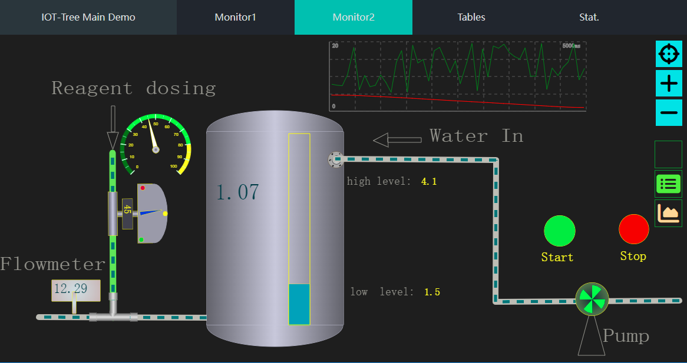

## Know more

[Quick Start][quick_start]

[Document Menu][nav]

[Demo][demo_link]

If you encounter problems with the system or have suggestions, you can send us email feedback: iottree@hotmail.com

[quick_start]: ./web/doc/en/doc/quick_start.md
[nav]: ./web/doc/en/nav.md
[demo_link]: ./web/doc/en/doc/case/index.md
[dl_link]: https://github.com/bambooww/iot-tree/releases
[case_auto_demo]: ./web/doc/en/doc/case/case_auto.md

[pump_demo]: ./web/doc/en/doc/case/example_psd.md
[lamp_demo]: ./web/doc/en/doc/case/example_lamp_demo.md
[embed_ctrl_demo]: ./web/doc/en/doc/case/example_embed.md
[center_substation]: ./web/doc/en/doc/advanced/main_sub_station.md
[wiki]: https://github.com/bambooww/iot-tree/wiki

## 📜 Licensing Model

This project adopts a **dual licensing agreement**:

| **License Type** | **Applicable Scenario** | **Main Content** |
|-------------|------------|------------|
| **MPL 2.0** | Open source users | Except for some third-party drivers (without source code) and third-party functional plugins (without source code) in the Release package
| **Commercial License** | Enterprise Users | Third-party drivers (without source code) and third-party feature plugins (without source code) in the Release package • No secondary distribution allowed • Includes technical support |

## ⚠️ Important Notice

• For details of the disclaimer, please refer to [DISCLAIMER.md](DISCLAIMER.md)

• Third-party component licensing is detailed in [NOTICE](NOTICE)

• Commercial licensing inquiries: iottree@hotmail.com

