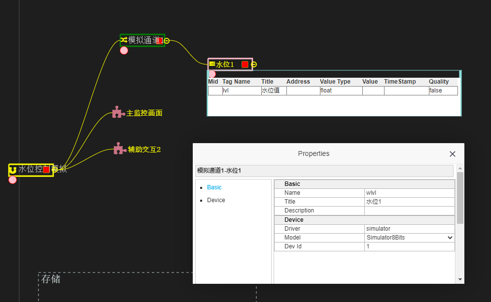
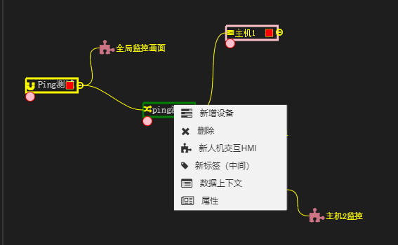
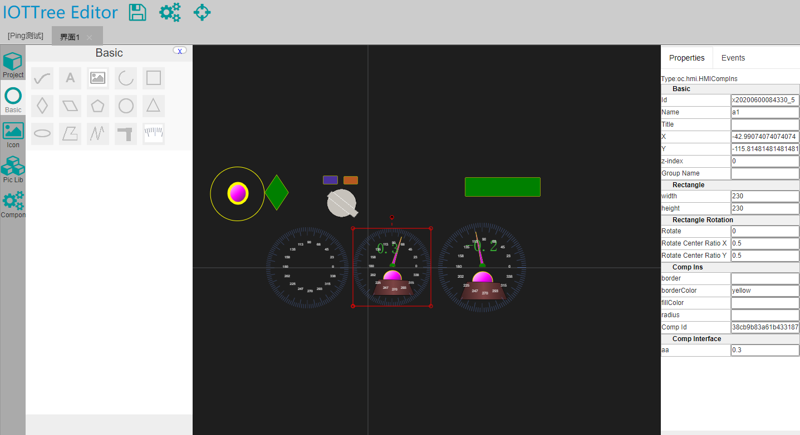
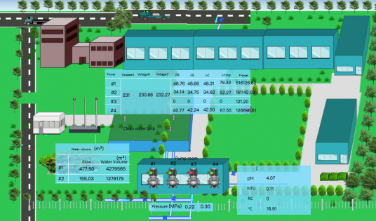

# IOT-Tree基本概念

## 1 IoT Tree Server总体思路

IoT Tree提供快速为用户创建物联网应用的服务端软件系统，它包含了底层设备设计管理、设备驱动、数据利用（展示、存储等）三部分。该解决方案如同一棵树，形象的为用户表达了物联网应用情景下，从底层设备（树根）、中间数据获取（树干）到顶层数据使用（开花结果）几个层次描述。

系统通过提供直观的可视化方式，提供每个层次的管理和定义功能，用户可以轻松快速的定义自己的物联网系统，并且方便的进行跟踪、展示

IoT Tree Server内嵌web服务器，对外通过http方式提供复杂的定制管理和相关

对于物联网信息系统来说，主要关心的是计算机系统如何获取相关传感器/控制器的数据和这些数据如何存储和利用的事，也即是树干和花果部分。所以，从规划上IOT Tree Server第一个版本主要支持这两个部分，第二个版本开始支持底层设备（树根）的部分，主要提供底层传感器/控制器、供电、接线等图示化支持。因此，以下介绍的顺序也就从树干（IOT Tree Trunk）、花果(IOT Flowers and Fruits)和树根(IOT Tree Root)进行。

## 2 树干(IOT Tree Trunk)

IOT Tree Server的树干部分类似于工业OPC Server软件，通过提供相关的硬件驱动来支持底层各种传感器/控制器的接入和数据获取，屏蔽各种设备参数、通信链路和协议的差异，形成统一的树状数据结构，并对上层提供统一的数据访问接口，这个树状数据结构就是树干。

### 2.1 设备驱动

系统内部定义统一的驱动程序框架，可以根据适配定义的要求，根据不同设备的通信协议实现相关的驱动程序。本部分与OPC软件类似，请参考相关软件。

### 2.2 数据组织

系统从通道-设备-标签（含标签组），三个层次组织数据。

### 2.3 对外接口

系统提供http等接口，可以对外提供xml或json格式的数据获取接口。

## 3 花果(IOT Flowers and Fruits)

IOT Tree Server的花果是整个系统创造价值的部分。基于树干提供的统一数据结构，花果部分根据业务的需要，对数据进行存储、展示和利用。

### 3.1 数据存储

基于统一的数据结构，系统可以定义多种多样的存储实例（存储果实）。如可以选定某些特定的数据，根据一定的时间间隔，扫描存储到关系数据库中（或时序数据库）。由此，其他业务系统可以基于存储的数据，根据自身的需要进行展示分析。

### 3.2 人机交互组态

系统提供在线可视化人机交互组态编辑工具，并且内部提供丰富的组件和图元。使得用户可以在自己的工程下面定义现场监控人机交互画面。不仅监控画面可以根据需要在线编辑，系统还支持自定义组件的编辑。

每个画面可以通过http方式进行访问（同时支持权限判定插件支持，用户可以根据访问路径进行监控画面输出权限控制）。

### 3.3 数据分析

### 3.4 控制任务逻辑

系统通过提供任务定义，并且支持js脚本实现控制逻辑。可以实现相关设备根据当前运行的数据参数进行控制输出。此部分内容可以使得系统作为控制器存在。

## 4 树根(IOT Tree Root)

TODO：2.x版本提供

## 5 IOT Tree Server使用情景

## 5.1 作为物联网云端数据接入服务

系统可以直接基于树干和存储的功能，部署之后配置设备通信接入，定义数据组织，并且设定存储策略。轻松实现工业、家庭等现场监控设备的接入和数据存储。

在零代码的情况下，为其他云端业务提供简单的数据接口。并且还可以获得直观的设备运行情况等监视功能。

## 5.2 作为物联网Web应用的一个内部服务

系统可以在接入服务基础之上，定义自己的项目，并且在项目中定义相关的监控画面。
在零代码的情况下，实现对工业、家庭等现场各种设备的组态监控。并把这些监控画面整合到其他需要的系统中。

### 5.3 作为嵌入式程序成为现地控制单元
系统可以在ARM Linux Java运行环境下进行部署。可以在实时性要求不高的场合，作为现地控制器存在。

此控制器可以通过浏览器进行在线调整控制逻辑，设计人机交互画面。并支持与上位系统进行对接。

## 6 总结

IoT Tree Server打通设备和 IT之间的壁垒，能够应用在任何想进行物联解决方案的行业，简化工作、节省时间同时带来更多利益。

## 7附件1：用例

（本部分一会可以根据需要，按照每个用例做个教程文档）。并且第一个版本只需要实现教程文档，就可以作为版本发布

### 7.1 直接作为自动化监控现场本地组态监控（免费）

可以在一定程度上替代传统的组态软件。可以找个相对简单的使用情景，从数据接入、配置树干、制作界面，最后访问运行。

### 7.2 智能家居（免费）

作为家庭智能家居中控中心，每个家庭可以有多个显示控制终端，包含手机端。
本部分免费只针对每个家庭部署一个中控中心，如果中控中心部署在物业或云端，一次给多个家庭提供服务，不免费

### 7.3 作为云端微服务架构监控管理组件（仅自己使用免费，作为平台提供给第三方使用收费）

云端微服务架构各种组件状态监控，访问接入控制等。提供整个系统图示化结构和实时运行状态，自动化维护控制等（如升级某个组件进行外部访问链接切换控制等）。
深度整合成一个对外服务网站，对不同用户提供服务（不免费并需要获得许可）

### 7.4 作为嵌入式控制器（个人使用免费，作为产品销售收费）

