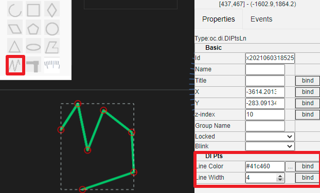
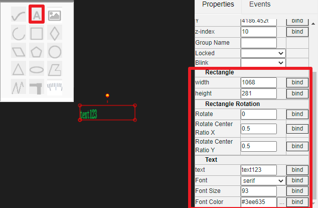
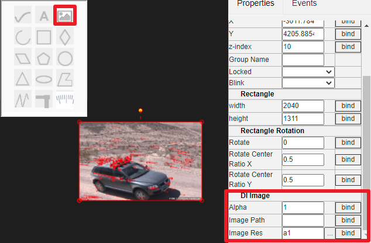

HMI editing instructions
==

It is recommended that the HMI be carried out on the PC. The editing interface uses stepless zoom, which can be carried out quickly mainly through the cooperation of mouse and simple keyboard.

## 1 mouse operation instructions

### 1.1 zoom in and out

The editing area is zoomed in and out through the middle wheel of the mouse. And the zoom is centered on the current position of the mouse.

### 1.2 Overall roaming

Press the right mouse button (do not release) and move. You can move the drawing area as a whole.

### 1.3 single selection

Left click an drawitem to select a single element. If there are multiple superimposed elements at the position of the mouse, you can click multiple times to switch the single selection on the premise of ensuring that the mouse does not move.

### 1.4 Multiple selection

Press the left mouse button at the position where there are no drawitem or no items have been selected. If you do not release the mouse button to move, a rectangular multi selection area of dotted box will appear. The elements in this area (excluding locked elements) can be selected after releasing the left mouse button.

### 1.5 Move items

On a single drawitem or multiple items that have been selected, press the left mouse button and move to drag the selected element to a new location.

### 2.1 Copy paste

When selecting an drawitem, use the keyboard combination Ctrl + C to copy the currently selected element.

Then, use the keyboard combination Ctrl + V to paste the copied item at the mouse position in the drawing area. When you move the mouse, the copied element moves with the mouse. You can move the mouse to the appropriate position and click the left mouse button to place it.

If you want to discard the paste, right-click.

IOT tree server supports copy and paste across drawing areas.

### 2.2 Delete operation
Select an drawitem and press del to delete the drawitem

### 2.3 rollback

## 3 Edit property bar description
On the right side of the drawing area is the properties editing area. When the mouse selects an element, the property area displays all the properties of the element. As shown below

### 3.1 Basic properties

All items have basic properties, as shown in the above figure. The basic properties include ID, name, title, coordinate position x, y, stack height Z-index. Locked or not.

The ID is automatically generated by the system, and the name must be unique in the UI editing area and meet the name naming qualification. The coordinate position is the coordinate of the upper left corner of this entity in the drawing area (Cartesian coordinate system).

As the stacking height of items, Z-index is similar to Z-index in CSS. The higher the value, the later the painting order. When an item overlaps with other items, the larger the display effect Z-index is, the more it is displayed on the following items.

If the locked property is set to yes, the item is locked in the drawing area. The mouse cannot drag this. And when the mouse selects multiple items in a rectangular area, the locked items will not be selected. However, you can make a single selection of the locked element by clicking the mouse. At this time, you can also modify or unlock the properties.

### 3.2 Base drawitems and properties

Basic primitives include polyline, polygon, circle, ellipse, arc, text, picture, pipe (not implemented), Bezier curve, etc. they all have their own properties and characteristics.

In the upper left corner of the drawing area, there is a basic item toolbar. Click one of the items to select. When the mouse cursor moves to the back area, it will become a cross. Click and move the left mouse button to start drawing the corresponding basic item. When you release the left key, the currently created item is selected by default. You can then make adjustments and attribute modifications

#### 3.2.1 Polyline editing and properties

Click the toolbar , then left click in the drawing area and move the drawing polyline. When the polyline drawing is completed, click the right mouse button to finish the drawing operation.

When the polyline is selected, the intersection of each line segment can be dragged with the mouse to support the adjustment and modification of the polyline.

In the attribute area, you can modify the line color and line width of the line. As shown below:

#### 3.2.2 Polygon editing and properties

Click the toolbar , then left click in the drawing area and move the drawing polygon. When the polygon drawing is completed, right-click to finish the drawing operation.

When a polygon is selected, the intersection of each line segment can be dragged with the mouse to support the adjustment and modification of the polygon.

In the property area, you can modify the line color and line width of the line.

At the same time, the polygon belongs to the surface graph, and the fill style can be set, as shown in the following figure:

#### 3.2.3 Text editing and properties
Click the toolbar , and then click place text box in the drawing area.

The text box itself is a rectangular box. When selected, you can use the mouse to adjust the size and other basic operations.

Text attributes include rectangle size, rotation size, text attribute, font and font color. As shown below:

#### 3.2.4 图片显示、资源及属性

Click the toolbar , and then click in the drawing area to draw a rectangular area, which is also the picture display area.

The picture area itself is a rectangular box. When selected, you can use the mouse to adjust the size and other basic operations.

Text attributes include rectangle size, rotation size, and picture path or picture resources. As shown below:

For project resources, please refer to [quick understanding of associated resources in IOT tree][qn_res]

### 3.3 Subgraph item property

[qn_res]: ./quick_know_res.md
