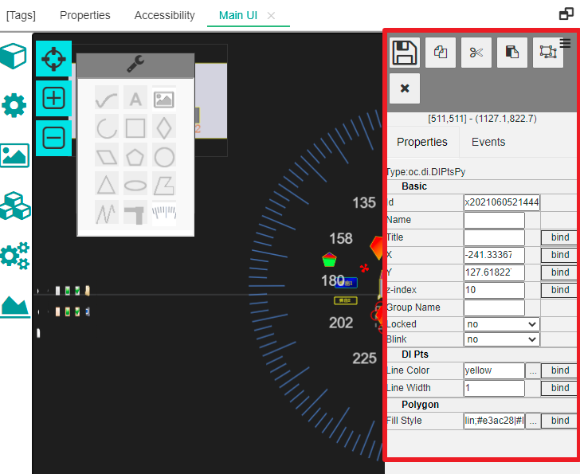
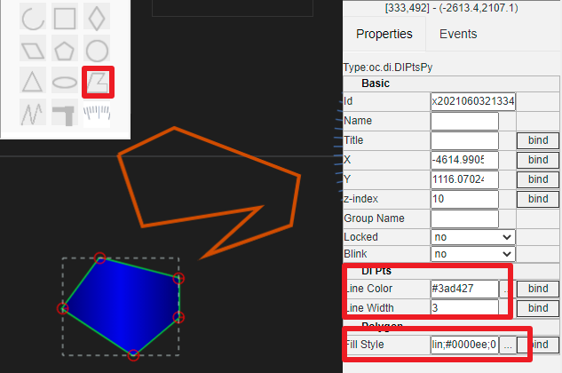

人机交互UI(HMI UI)编辑操作说明
==

人机交互界面建议在pc端进行。编辑界面使用无极缩放的方式，主要通过鼠标和简单的键盘配合就可以快速进行。

## 1 鼠标操作说明

### 1.1 放大和缩小

编辑界面通过鼠标中间滚轮进行放大和缩小。并且缩放以鼠标当前位置的为中心点。

### 1.2 整体漫游

通过鼠标右键按下（不松开），并移动。可以从整体上移动绘图区域。

### 1.3 图元单选

鼠标在某个图元上单击左键，可以进行单个图元的选择。如果鼠标所在的位置有多个叠加的图元，则在保证鼠标不移动的前提下，多次点击就可以进行单选切换。

### 1.4 图元多选

鼠标在没有图元或未有图元已经被选择的位置按下左键，不松开移动，则会出现一个虚线框的矩形多选区域，在此区域内的图元（不包含被锁定图元），在松开鼠标左键之后，都可以被选中。

### 1.5 移动图元

在已经被选中的单个图元或多个图元上面，按下鼠标左键并移动，可以拖拽被选中图元到新的位置。

## 2 键盘操作说明

### 2.1 复制粘贴

在选中图元时，使用键盘组合键Ctrl+C，可以对当前选中的图元进行复制。

然后，再使用键盘组合键Ctrl+V，可以绘图区鼠标位置粘贴被复制的图元。此时移动鼠标时，被复制图元会跟着鼠标移动。你可以移动鼠标在合适的位置，点击鼠标左键进行放置。

如果要放弃粘贴，则点击鼠标右键即可。

IOT-Tree Server支持跨绘图区复制粘贴。

### 2.2 删除操作

选中图元，按键del就可以删除对于的图元。

### 2.3 回退

## 3 编辑属性栏说明

在绘图区右边，是属性编辑区域。当鼠标选中某个图元时，属性区会显示此图元对于的所有属性。如下图：

### 3.1 基本属性

所有的图元都有基本属性，如上图所示。基本属性包含Id,Name,Title,坐标位置x,y，堆叠高度z-index。是否锁定等Locked。

其中，Id由系统自动生成，名称在此UI编辑区域必须唯一，并且符合名称命名限定。坐标位置是此图元左上角在绘图区域中的坐标（笛卡尔坐标系）。

z-index作为图元的堆叠高度，和css中的z-index类似，值越大，绘画顺序越靠后。当一个图元和其他图元有重叠时，其显示效果z-index越大，越显示在下面的图元之上。

Locked属性如果设定为yes,则图元将在绘图区域被锁定。鼠标无法对此进行拖动。并且鼠标在一个矩形区域多选图元时，被锁定的图元将不会被选中。不过，单击鼠标选择还是可以对被锁定图元进行单个选择的，此时，你还可以对此进行属性修改或解锁操作。

### 3.2 基础图元和属性

基础图元有折线、多边形、圆形、椭圆、圆弧、文字、图片、管道（未实现）、贝塞尔曲线等。他们都有各自的属性和特点。

在绘图区左上角，有个基本图元工具栏。点击其中的某个图元进行选择，鼠标光标移动到回去区域之后会变成十字，点击鼠标左键并移动，就可以开始绘制对应的基础图元。释放左键之后，当前新建的图元缺省被选中。你可以接着进行调整和属性修改。

#### 3.2.1 折线编辑及属性

点击工具栏,然后在绘图区点击左键并移动绘画折线。当折线绘图完成，点击鼠标右键进行绘图结束操作。

当折线被选中时，每个线段上的交点都可以用鼠标进行拖动，以此支持对折线进行调整修改。

在属性区可以对线的颜色Line Color和线宽Line Width进行修改。如下图：

#### 3.2.2 多边形编辑及属性

点击工具栏,然后在绘图区点击左键并移动绘画多边形。当多边形绘图完成，点击鼠标右键进行绘图结束操作。

当多边形被选中时，每个线段上的交点都可以用鼠标进行拖动，以此支持对多边形进行调整修改。

在属性区可以对线的颜色Line Color和线宽Line Width进行修改。

同时，多边形属于面图，还有填充属性（Fill Style）可以进行设置，如下图：

#### 3.2.3 文字编辑及属性

点击工具栏,然后在绘图区点击放置文本框。

文本框本身是个矩形框，被选中时，可以用鼠标进行尺寸调整等基本操作。

文字属性有矩形框尺寸，旋转尺寸，以及文字属性Text、字体及字体颜色等属性。如下图：

#### 3.2.4 图片显示、资源及属性

点击工具栏,然后在绘图区点击绘制一个矩形区域，此区域也即是图片显示区域。

图片区域本身是个矩形框，被选中时，可以用鼠标进行尺寸调整等基本操作。

文字属性有矩形框尺寸，旋转尺寸，以及图片路径或图片资源。如下图：

有关项目资源请参考[快速理解IOT-Tree中的关联资源][qn_res]

### 3.3 子图图元属性

[qn_res]: ./quick_know_res.md