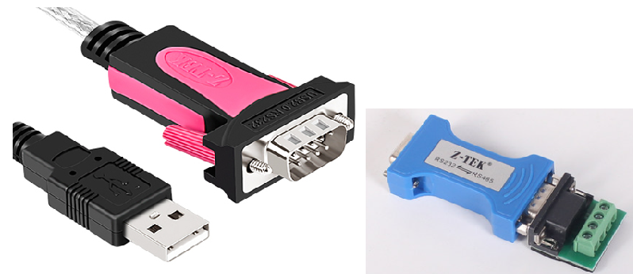

快速了解 - 灯光控制演示
==

[en]
Quick Know IOTTree - Lamp Demo
==
[/en]

# 最简单得例子（控制一个灯光）

本文的通过最简单得演示，可以让你在5分钟之内直观了解IOTTree能给你代理的价值。

演示中只有一个灯光，灯光设备通过RS485 Modbus RTU接口提供对接。灯光设备已经在IOTTree中的设备管理中定义，如果你想深入了解设备是如何定义的，那么你需要了解Modbus RTU协议，和更深入的教程（设备定义）。

我们的软件运行在windows上，通过USB-RS485接口进行对接。

灯光通过简单的供电，并且通过RS485链接之后，我们

好了，让我们直接看看IOTTree能给我们带来了哪些方便。

# 