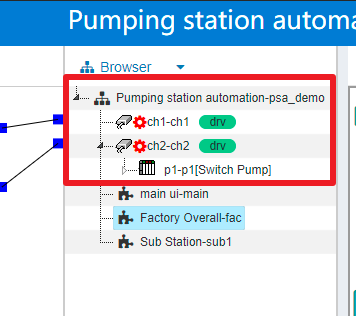
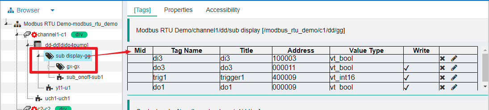
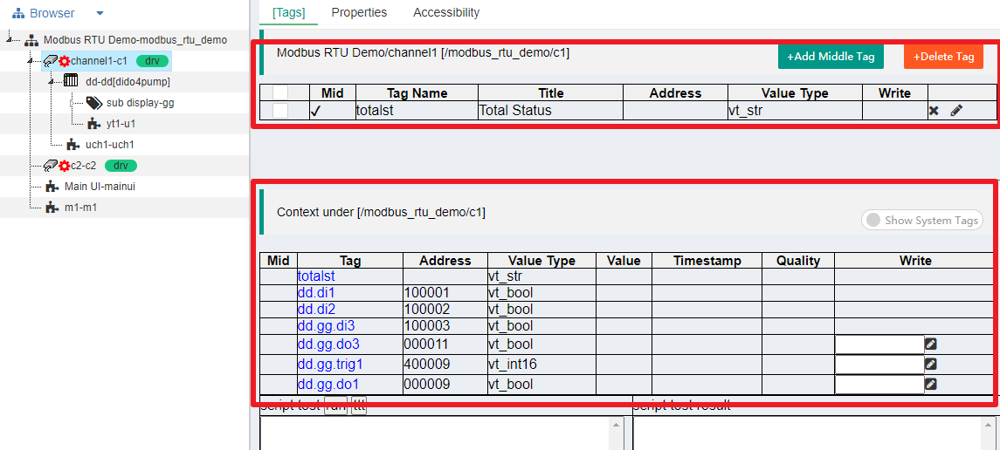

快速理解IOT-Tree Server的树
==
本部分内容是理解IOT-Tree Server整体的关键部分。IOT-Tree Server建立的项目，某种意义上就是一颗树（一颗倒置的树或树根结构）。树的顶部是项目(Project)，接下来是通道(Channel)（通道可以关联设备驱动Device Driver和接入Connector），通道下面是设备(Device)。

## 1 树的层次和内部数据

### 1.1 树的层次

为了便于理解和方便使用，IOT-Tree Server的每个项目，其主要的结构都是  Project->Channel->Device三个层次。

其中，设备(Device)可以是一个简单开关量模块对应的设备，也可以是一个复杂的设备组合，甚至可以是一个工业现场子站。当然，也可以是另一个IOT-Tree Server分布式运行节点。

那么，你可能就会问了，既然设备(Device)这么复杂，在通道(Channel)下面这么单一的层次能描述这么多内容么。当然不可能，接着在设备下面，如果要描述更复杂的层次关系，则还可也加入标签组（Tag Group),并且在标签组下面还可也增加子标签组。现在，我们一个复杂一些的项目数状层次就可以是如下结构：

Project->Channel->Device->Tag Group*->TagGroup*

很明显，设备越复杂，越需要在内部分层，你只需要多加一些Tag Group就行了。

### 1.2 树结构下面的数据标签Tag

接下来，你肯定也能想到，我的项目-通道-设备-组层次关系有了，那就剩下在这个树形结构里面的数据了。我们把不同层次树节点内部的数据，统一为标签Tag。一个树节点可以包含多个Tag。

如下图，通道下面定义的标签

又如，设备下面预先定义的标签

标签组及标签组下面的标签

### 1.3 节点其他包含的内容（功能节点）

树形节点除了标签之外，还可也定义一些其他元素。如人机交互UI、存储策略等。这些节点的存在，都限定于上面规定的整体结构。

你可能已经猜到，我在某个设备下面定义了一个UI画面，那么设备下面的所有的标签都应该可以被这个UI画面所使用。同理，我在通道下面定义的UI画面，应该可以引用这个通道下面的所有设备数据，或者更进一步，UI画面还可也把下面的设备UI作为子画面组件直接包含到自身的画面中——这个使用情景想想都让人感到激动，对吧。好用的软件系统就应该这样的。

嗯，对的，IOT-Tree Server就是这么为你考虑的。这个就涉及到另一个规定，节点之间的关系约定。

## 2 树形节点间的关系

### 2.1 约定

某个树节点内部的功能节点，可以访问同级或底层被包含节点的所有资源。

命名约定：
IOT-Tree Server所有节点的名称都必须符合以下规定
1 必须以a-z A-Z开头，后续字母必须在a-z A-Z _ 范围内。不允许出现任何其他字母。（因为以'_'开始名称是系统内部命名）
2 同一个树节点下的子节点，名称不能重复。

之所以对命名如此规定，是因为IOT-Tree Server对我提供的接口，基本以命名为基础，严格规定是为了方便外部系统的调用，同时减少出错的可能性。

### 2.2 约定-例子说明

上面约定可能让你没啥激动的感觉，还是举个例子吧：

如上图，在项目节点下面定义的UI节点mainui,就可以使用同级的另外两个UI定义节点fac和sub1，还可也使用两个通道ch1，ch2及通道下面的所有资源。

在此UI编辑过程中，可以引用这些节点下的所有tag，绑定到自己的某个图元上。或者，可以直接把其他UI节点作为自己的一部分。很明显，这个约定不仅简单清晰，同时也给项目的实现带来了很大的组织方便。比如，某个界面UI可能会被多个地方使用，则可以先单独进行定义，然后被其他界面UI直接引用即可。

### 2.3 节点上下文

对于标签（Tag）来说，每个节点可以访问自身及所有子节点的全部标签。在不同的节点下，所有的标签列表组成了此节点的上下文(Context).如下图：

通道channel1下面的自身标签，及此节点下的所有节点。上下文每个节点相对于c1，不同层级以符号"."作为间隔。

## 3 总结
如果你了解了本部分内容。那么你后续对IOT-Tree Server其他部分的理解就省心了。
IOT-Tree Server看似复杂，其实整体思路还是很简洁的。只要牢牢抓住这颗“树”，你会发现她是多么简单，同时又能满足你的复杂业务需求。

## 4 补充
### 4.1 接入-通道-驱动之间的关系
IOT-Tree基于本文所说的树形结构的基础之上，还有两个概念比较重要。那就是围绕通道(Channel)关联的接入和设备驱动。
 
详细内容请点击查看
[接入(Connector)-通道(Channel)-驱动(Driver)之间的关系][cn_conn_drv]

### 4.2 设备定义

[cn_conn_drv]: ./quick_know_ch_conn_drv.md