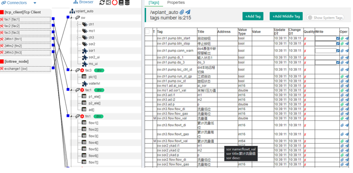

IOT-Tree Server 是什么
==

IOT-Tree Server是一个物联网接入、数据规整、人机交互展示的一个服务软件系统。

她使用一套清晰明了的架构，内部包含通信接入、通道、设备驱动、数据标签等多个层次进行构建。使得物联网系统在各个方面统一以树状方式进行管理和组织。

在此树状管理基础之上，IOT-Tree Server提供了基于Web方式的在线组态界面（人机交互界面）的设计、配置和在线应用。

IOT-Tree Server是使用Java开发的开源软件。其管理界面完全基于Web方式。

[快速开始][quick_start]

[快速入门][quick_link]

[案例演示][demo_link]

<a href="https://github.com/bambooww/iot-tree/releases" target="_blank">下载<a>

# 1 IOT-Tree Server能干什么

## 1.1 能够作为一个工业现场组态软件（SCADA）

您可以使用IOT-Tree Server作为工业现场的PC端组态软件。

通过现场通信情况选择合适的接入方式，并且选择合适的驱动及关联设备。您可以迅速地使得现场项目在计算机管理端变有序和清晰。接着，您可以根据运行工况快速配置人机交互组态界面。

如果某个设备或子站比较复杂，您可以先设计子的控制界面，然后在总的控制界面进行引用。

如果一个设备比较复杂，但已经定义好了自身能够提供的界面元素，那么你只需要引入此设备，设备关联的界面元素可以直接成为您项目中被引用的内容。

### 参考案例

[灯光控制][lamp_demo] 

[一个工业控制现场][case_auto_demo]

## 1.2 数据接入和整合能力

IOT-Tree Server支持接入来自不同数据源（不同标准）的数据： 
通讯协议：Modbus (Modbus RTU/Modbus TCP)，西门子PPI/S7协议(PLC S7-200/300/1200/1500)
应用协议：OPC（OPC UA、OPC DA）相关协议，HTTP、MQTT
数据库： MySQL、SQL Server 和 Oracle

IOT-Tree Server提供了工业OPC统一标准接口的支持。通过对接入的设备和数据来源进行简单明了的管理，屏蔽了底层复杂的设备和数据源的差异性，以极大的易操作性实现工业、自动化系统、物联网系统和互联网的互联。

IOT-Tree Server特别针对互网络资源的接入提供强大的支持，如HTTP接入的网页精准爬虫功能，在网页中精确提取数据，整合到统一数据管理中。

## 1.3 系统能够嵌入设备成为一个控制器

如果您有个嵌入式设备，性能足以运行Java虚拟机，那么IOT-Tree Server可以方便的使得您的设备成为一个控制器。并且这个控制器能够支持在线配置和UI的设计，同时提供在线实时运行服务。

[嵌入式控制器例子][embed_ctrl_demo]  

## 1.4 作为物联网中间件
在物联网传感层到云端的中间层级，部署IOT-Tree Server节点，可以汇总本地相关的物联网数据。通过整合系统的消息总线的发布和订阅，可以为高层的管理系统（MES or ERP etc）提供高效灵活的数据交互。

高层生产管理系统的开发可以基于现有的成熟的数据库和IT技术框架，IOT-Tree Server屏蔽了底层生产线复杂的专业知识，极大的降低顶层管理系统的开发难度。

## 1.5 系统可以作为云端专用物联网server

如果您是个互联网公司，刚刚接触物联网项目。受限于对专业设备接入、数据管理经验的缺乏，或者您从头开始研究开发相关设备接入协议和数据收集管理。这个过程会同时占用您大量的开发资源和时间。

你可以尝试IOT-Tree Server，就像数据库服务一样，让她成为你的项目后面支撑的一个服务器。

如果您的接入设备恰好能够被我们内部自带的驱动支持，那么IOT-Tree Server估计会给你一个惊喜。

按照我们的开源策略，您的大部分项目都可以免费使用。很重要的一点是，随着时间的推移，我们支持的驱动肯定会越来越多，希望IOT-Tree Server能给你节省大量的成本，并且获得更多的收益。

## 1.6 系统可以成为分布式应用的一个节点

IOT-Tree Server可以以项目为单位，基于多种通信方式部署成一个共享节点。节点本地是一个可以独立运行的完整自动化监控现场。而网络中的其他IOT-Tree Server，在项目中可以引用此节点成为自身的一部分，成为此节点的上一级节点。

此分布式功能可以极大的方便跨区域监控现场的联动。如每个监控现场只需要有宽带，对接云端消息队列服务器进行安全的通信，就可以方便的形成上下级关系，顶端IOT-Tree Server节点系统可以对通信链路进行监视，并可以利用此通信状态作为系统通信异常来多相关应对的功能。

# 2 IOT-Tree Server组成内容
## 2.1 基于项目的管理机制
IOT-Tree Server以项目为基本组成，您可以根据需要在不同的应用场合建立不同的项目，每个项目包含了数据接入、通道设备组织管理、数据项、人机交互UI、控制逻辑等内容。

## 2.2 设备库管理机制
IOT-Tree Server设备库功能独立于项目，可以被所有项目共享。您可以根据自身的业务需要积累自己的设备，方便后续的项目开发。
在项目中，设备属于通道下面的内容，一个设备可以包含数据项、数据组织层次和人机交互UI。在项目中，您可以随时对新定义的设备加入到设备库中，这样可以直接被其他项目使用。
## 2.3 在线组态画面编辑功能
IOT-Tree Server的项目或设备库中的设备定义都可以定义相关的组态交互UI，并且可以直接进行在线编辑。系统提供强大的所见即所得的编辑工具在线支持。

## 2.4 组态画面图元库管理机制
IOT-Tree Server提供了独立的人机交互图元库功能，通过不同的库-分类-图元进行管理，同时也提供了在线图库编辑功能。

## 其他

如果您想深入了解，请参考相关资料。

[快速开始][quick_start]

[快速入门][quick_link]

[案例演示][demo_link]

如果你使用系统碰到问题或者有好的建议，可以给我们发邮件反馈：iottree@hotmail.com

[quick_start]: ./doc/quick_start.md
[quick_link]: ./doc/quick/index.md
[demo_link]: ./doc/case/index.md

[dl_link]: https://github.com/bambooww/iot-tree/releases

[pump_demo]: ./doc/case/example_psd.md
[case_auto_demo]: ./doc/case/case_auto.md
[lamp_demo]: ./doc/case/example_lamp_demo.md

[embed_ctrl_demo]: ./doc/case/example_embed.md
