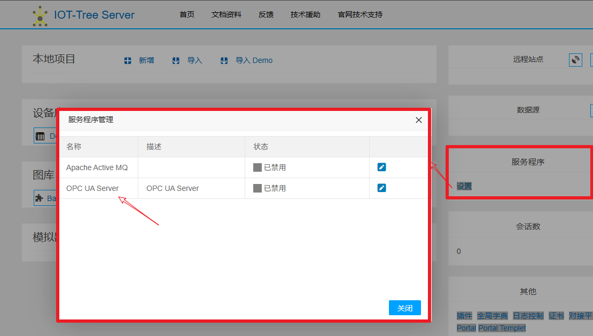
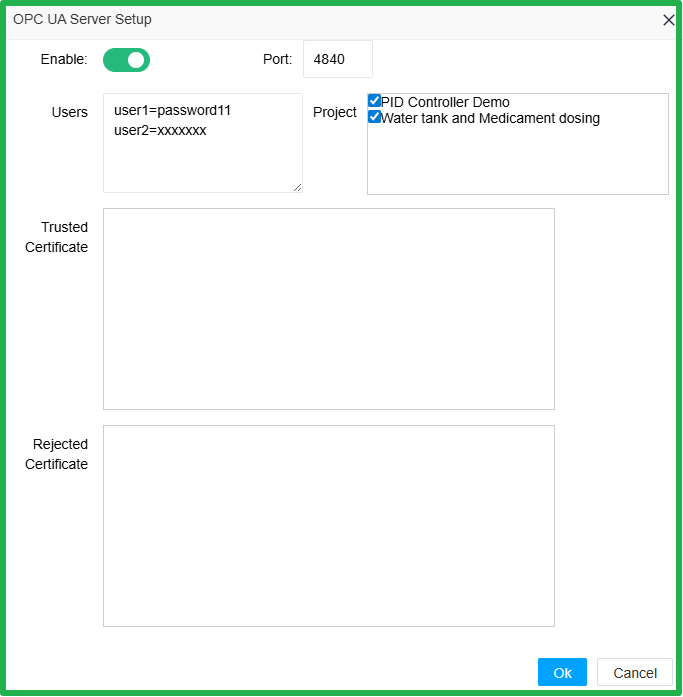
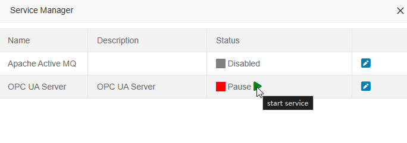
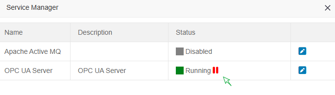
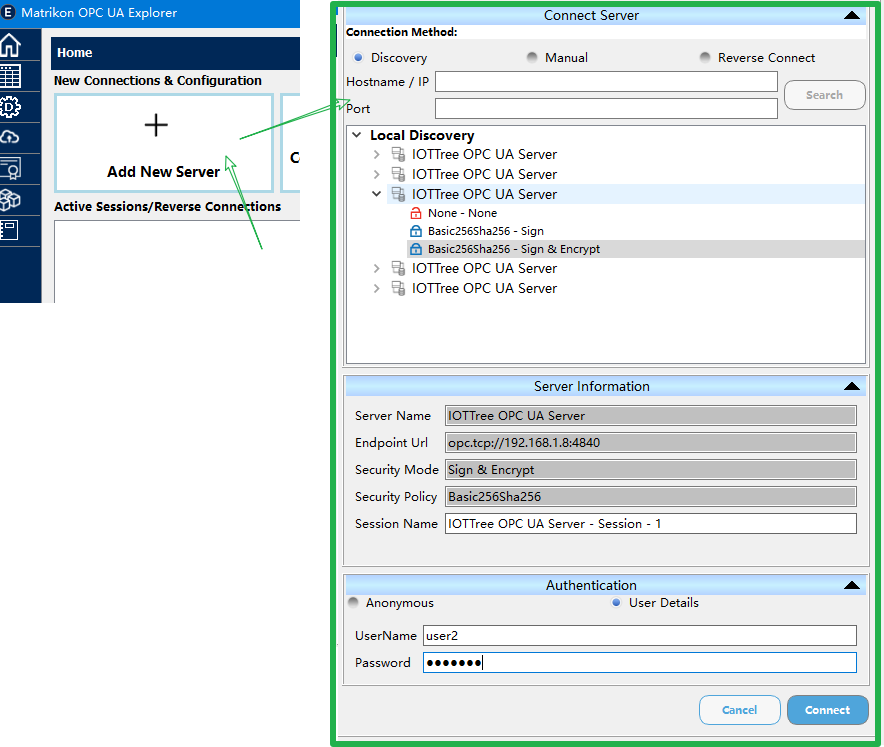
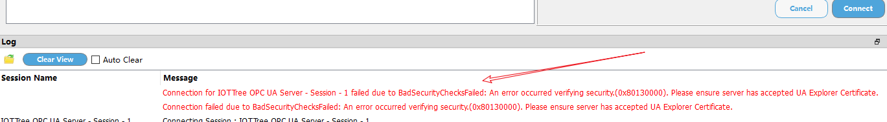
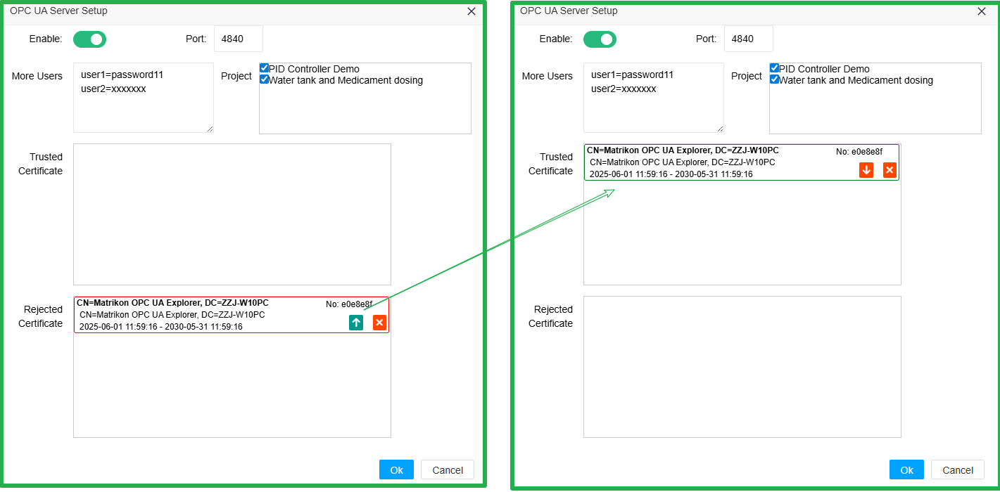
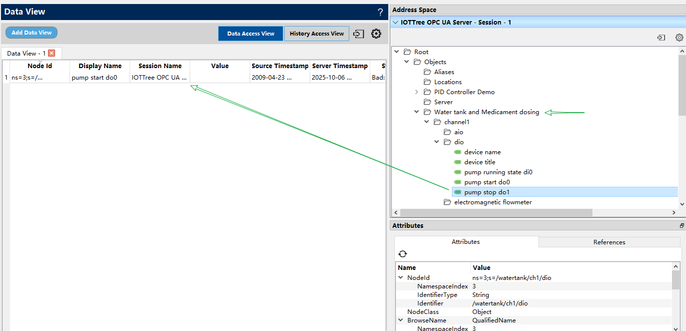

对外提供OPC UA接口
==

## 1 IOT-Tree Server的OPC UA 服务


IOT-Tree Server直接提供对外OPC UA Server支持，此Server通过Service方式提供。在IOT-Tree Server实例管理主界面中，点击"服务程序"的"设置”按钮，就可以在弹出对话框列中看到“OPC UA Server”这个服务程序。你可以设置这个服务程序的参数或控制启动停止。如图：



点击编辑按钮，弹出详细的参数设置界面：



缺省情况下，OPC UA Server没有被使能，并且使用端口4840。你可以修改端口，这是起用OPC UA Server。

你可以设置OPC UA Client访问时需要的用户验证，每一行代表一个用户和密码，格式如下：

```
user1=password11
user2=xxxxxxx
```

在项目列表中，你可以看到这个IOT-Tree实例包含的所有项目。你可以勾选需要对外提供OPC访问的项目。

下方的信任证书和拒绝证书，则是OPC UA Client访问本OPC UA Server需要的证书管理，详细内容请看后续内容。


## 2 使用OPC UA Client访问


以上参数设置成功之后，在Service列表中，点击启动服务按钮成功之后，本IOT-Tree Server运行实例就支持OPC UA Server了


<table>
<tr>
 <td></td>
 <td></td>
</tr>
</table>


你可以在你的电脑上安装一个“Matrikon OPC UA Explorer”软件，本文使用此软件代表OPC UA Client。打开软件，点击“Add New Server”。你可以看到右边“Connect Server”区域直接显示了Local Discovery列表，因为上面配置的OPC UA Server端口是缺省端口，并且这个Client软件和IOT-Tree运行在同一台电脑上。因此，此Client能够直接发现我们配置好的Server。如果不是缺省端口且在同一台电脑，你可以手工输入主机和端口，点击"Search"就可以查找出对应的Server。如下图：





其中，展开对应的一个IOT-Tree OPC Server节点，可以看到此节点对应的访问方式。里面有匿名访问、签名（证书）访问、签名（证书）且加密访问。

在下方，你还可以填写连接Server需要的用户名和密码，这个需要和上面配置的用户密码匹配。

根据上图，我们选择了签名（证书）且加密访问方式，并且填写了用户和密码。点击"Connect"按钮。可以看到失败了，如下图：





**这是因为证书验证连接方式下，Client会自动创建证书并提交给OPC UA Server，但Server对于第一次访问会自动记录下证书，并且直接拒绝。你需要在IOT-Tree OPC UA Server管理端，对新的Client证书进行授信**

回到OPC UA Server服务管理中，点击编辑按钮，你可以看到弹出的界面有了变化：在拒绝证书列表中，出现了一个连接证书。你只需要点击向上箭头按钮，设置信任，使得此证书转移到信任列表中，就完成了访问Client的授信操作。如下图：





回到“Matrikon OPC UA Explorer”软件（注意输入用户密码），再次点击"Connect"按钮，可以发现连接成功。在这个连接成功的话会中，你可以在右上角树形目录中找到对应的项目，展开设置需要监听的节点。如下图：



