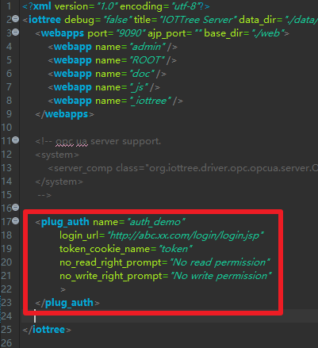

权限插件
==

IOT-Tree内部自带了一个很简单的权限管理。如果你要访问IOT-Tree的管理界面"http://host:port/admin"，则系统会自动让你提供管理员和密码。除此之外，系统对于运行中，项目监控画面和数据读取没有任何限定。如果要在监控画面中下达指令，则还可以根据需要配置数据写权限，你只需要填写配置好的用户密码即可。

很明显，这个简单的权限限定很可能不满足你的需要。你可能需要在你的业务系统中，直接引用IOT-Tree的监控画面、实时JSON数据或写数据。而且，你的业务系统已经有了自己的一套用户验证和权限子系统，那么你肯定也希望IOT-Tree能够共用这套用户和权限控制。

这个就需要用到IOT-Tree支持的权限Authority插件了。Authority插件可以使得IOT-Tree Server在对外提供服务的前，使用您已经有的用户和权限机制进行验证。

如果你对IOT-Tree Server的插件机制不了解，请先查看 [插件开发][plug]。

## 0 IOT-Tree共享业务系统cookie中的令牌token

你的业务系统如果要整合IOT-Tree相关URL监控画面，或通过ajax方式访问某些URL的实时数据，并且使用权限插件统一用户限定。

那么你需要把你的业务系统URL访问和IOT-Tree部署之后的Web访问统一到一个域名空间下，这样在你的业务系统用户登录之后，就可以共享http请求头部资源。

典型的方法是使用nginx作为前端统一入口，在业务系统登录之后，在当前会话http请求中cookie中，写入一个令牌cookie_name=token代表当前用户临时标识。那么，IOT-Tree也可以通过这个token调用权限插件进行用户权限验证。

基于共享cookie中的token内容，IOT-Tree权限插件验证就有了一个基础，接下来就可以具体实现了。

## 1 Java类开发

你可以使用任何工具进行这个Java类的开发，IOT-Tree对权限插件的Java类仅有一些命名上的限定。并没有提供java接口(interface)或抽象类给你实现或继承。这样你开发这个类的时候不需要依赖IOT-Tree提供的任何东西。当然，你实现的这个类有自己的特殊依赖，那就参考[插件开发][plug]里面规定的lib/或classes/目录中存放即可。

### 1.1 Java插件类的实现规定

#### 1.1.1 用户类User定义

由于权限和用户登录信息有个，IOT-Tree插件必须有个用户对象作为验证之后的用户对象返回值。你实现这个用户类时，类的名称不限定。你可以使用User，XxUser等。IOT-Tree规定这个类内部必须包含以下几个函数。

```
public String getId()

public String getRegName()

public String getFullName()
```

这几个函数分别对应用户唯一Id，用户注册名(登录名)，用户全称。典型的实现如下：

```
package com.xxx.plug;

public class User
{
	String id,regName,fullName ;
	
	public User(String id,String regname,String fulln)
	{
		this.id = id ;
		this.regName = regname ;
		this.fullName = fulln ;
	}
	
	/**
	 * unique id  (option method)
	 * 
	 *  
	 * @return
	 */
	public String getId()
	{
		return this.id ;
	}
	
	/**
	 * get registion name (unique name for login)  (must have method)
	 * @return
	 */
	public String getRegName()
	{
		return this.regName ;
	}
	
	/**
	 * get display name (option method)
	 * @return
	 */
	public String getFullName()
	{
		return this.fullName ;
	}
}

```

有了这个基础的用户类之后，你就可以编写插件类了。我们假设插件类名为AuthDemo，那么在其内部必须包含以下函数。

#### 1.1.2 插件类初始化函数init_plug

在插件类内部必须有个初始化插件函数，定义如下：

```
void init_plug(File plugdir, HashMap<String, String> params)
```

这个函数名称必须为init_plug，并且有两个参数一个是本插件部署之后所在的目录，另一个是输入参数。在插件被装载使用前，这个函数会被自动调用。你可以在里面根据插件目录和输入的参数进行一些初始化工作。大致可以有如下内容:

>你可以通过plugdir提供的插件根目录，定位到插件部署绝对位置，装载插件运行需要的特定文件。这些文件由插件实现自己决定，比如你可以通过这个目录定位到一个特殊的配置文件。

>你可以通过params参数（这些参数来自于插件配置config.json中的内容），初始化后续运行需要的内容。如，对于邮件发送，你可以配置邮件服务器地址端口、用户和验证信息。

#### 1.1.3 插件类checkAdminUser函数

```
public User checkAdminUser(String reg_name,String password)
```
此函数用来支持IOT-Tree自身的项目管理界面管理员用户验证，所以只需要用户注册名和密码作为参数，如果验证成功，则返回对应的User对象。

#### 1.1.4 插件类checkUserByToken函数

```
public User checkUserByToken(String token)
```
此函数用来支持IOT-Tree自身的当前普通用户访问验证，通过共享cookie中的token进行用户验证。IOT-Tree在页面被访问时会获取当前用户的token，然后调用此函数判断相关权限，如果验证成功，则返回对应的User对象。

很明显，插件实现此函数时会和你的业务系统权限进行沟通，典型的方式是你使用redis做当前登录用户的token信息存储。然后在此函数中访问redis接口，获取用户信息即可。

#### 1.1.5 插件类checkReadRight函数

```
public boolean checkReadRight(String node_path,String reg_name)
```
此函数用来判断某个节点是否允许某个注册用户访问，IOT-Tree的资源都以树形路径方式对我提供URL服务，如hmi和json。

你只需要在IOT-Tree项目树中的节点上鼠标右键，选择"Access"就可以打开新的流量器窗口，对相关资源进行访问——请仔细观察新打开浏览器的url路径，你会发现里面包含对应节点的路径。这个路径也即是我们实现这个函数的第一个参数node_path。

第二个参数就是当前注册用户名。

#### 1.1.6 插件类checkWriteRight函数

```
public boolean checkWriteRight(String node_path,String reg_name)
```
此函数用来判断某个节点是否允许某个注册用户写操作，IOT-Tree的资源都以树形路径方式对我提供URL服务，如hmi和json。第二个参数就是当前注册用户名。

在HMI界面中，如果要下达指令，那么此函数会被调用，用来验证当前用户对节点（对应node_path）是否有写入权限。


### 1.2 具体的实现例子

可以看到，权限的插件实现也很简单，只需要按照规定实现init_plug和以上规定的函数即可。下面就是这个验证插件的全部代码。
```
package com.xxx.plug;

import java.io.*;
import java.util.*;

/**
 * auth demo plugin for
 * IOT-Tree Server
 * 
 * You can implement the methods in this plug-in by sharing data.
 *  For example, through relational database, redis, WebService or other
 *  
 *  
 *  
 *  The key point is that you need to bind the node tree in the IOT-Tree Server 
 *  as a resource with your user system.
 * 
 * @author demo
 *
 */
public class AuthDemo
{
	/**
	 * this method will be called when plug is inited.
	 * you can do some initial work here
	 * 
	 * @param plugdir
	 * @param params
	 * @throws FileNotFoundException
	 * @throws IOException
	 */
	void init_plug(File plugdir, HashMap<String, String> params) throws Exception
	{
		
	}
	
	/**
	 * option method
	 * 
	 * when you access http://iot_tree_server_host:port/admin,you must login by register name and password
	 * 
	 *  if this method is here,the default user authentication provided by the system will be ignored.
	 *  
	 *  
	 * @param reg_name
	 * @param password
	 * @return
	 */
	public User checkAdminUser(String reg_name,String password)
	{
		if("admin".equals(reg_name) && "123456".equals(password))
			return new User("","admin","Adminstrator") ;
		
		return null ;
	}

	/**
	 * Obtain user information according to the token
	 * 
	 * @param token provided by page cookie or other ways
	 * @return
	 */
	public User checkUserByToken(String token)
	{
		if(token==null||"".equals(token))
			return null ;
		
		if(token.startsWith("user1"))
			return new User("","user1","User1") ;
		else if(token.startsWith("admin"))
			return new User("","admin","Adminstrator") ;
		return null ;
	}
	
	/**
	 * this method will be called when outer will access node path in iottree like /prjname/n1/u1
	 * 
	 * The node related to this path may be a context node that returns JSON data. 
	 * Or the HMI UI node outputs the UI picture
	 * 
	 * @param node_path  like /prjname/n1   /prjname/n1/u1
	 * @param reg_name login user name or null or empty
	 * @return
	 */
	public boolean checkReadRight(String node_path,String reg_name)
	{
		if("admin".equals(reg_name)||"user1".equals(reg_name))
			return true ;
		return false;
	}
	
	/**
	 * this method will be called when outer will write some data to node path in iottree like /prjname/n1/u1
	 * 
	 * this may be update some tag value in node or send cmd in hmi
	 * 
	 * @param node_path
	 * @param reg_name
	 * @return
	 */
	public boolean checkWriteRight(String node_path,String reg_name)
	{
		if("admin".equals(reg_name))
			return true ;
		return false;
	}
}

```

以上代码仅仅为了演示使用，实现非常简单。在你的业务中，可以调用redis或数据库相关接口。

## 2 插件部署

### 2.1 插件部署目录

对Java类进行编译，生成 User.class 和 AuthDemo.class这两个文件。如果你实现的类依赖一些库文件，则这些jar文件放到lib目录中。

前提，你可以按照配置好了IOT-Tree运行环境，然后在IOT-Tree安装目录下找到 data/plugins/这个目录。在里面新建一个目录auth_demo。

整体部署目录和文件结构如下：

```
│  config.json
│  readme.txt
│
├─classes
│  └─com
│      └─xxx
│          └─plug
│                  AuthDemo.class
│                  User.class
│
├─lib
└─src
    └─com
        └─xxx
            └─plug
                    AuthDemo.java
                    User.java
```

文件和目录部署之后，我们还需要编辑配置文件config.json，这样才能最终完成插件的部署

### 2.2 验证插件配置

因为config.json不仅支持Auto插件，同时也支持其他插件类型，所以Auto仅仅是这个配置文件中的一部分。

同理，我们完全可以在一个插件目录中，发布多个JsApi内容。在插件目录下的config.json文件中，和权限验证相关的配置都在"auth"属性下面，"auth"对应一个JSON数组，数组每个成员都是一个JSON对象，每个对象对应一个auth的对象。（本例只有一个）

如下:
```
{
	"name":"auth_demo","title":"Auth Plug,a demo for auth",
	"js_api":
	[
	],

	"auth":
	[
		{
			name:"auth_demo",
            class:"com.xxx.plug.AuthDemo",
            params:{}
		}
	]
}
```
每个js_api对应的对象，有如下属性"name","class"和"params"。其中，"name"和"class"是必不可少的。并且，"name"属性的值是个符合js变量命名的字符串，"class"这是配套提供的java对象全名称。这个类必须在插件目录下的"classes/"或"lib/"中的某个jar文件中存在。
"params"是对应插件init_plug初始化函数需要用到的参数，可以根据插件具体实现的提供格式定义和支持。

本例子这个验证插件名称为auth_demo。

对于IOT-Tree的一般插件，到此配置已经完成了。但权限验证插件很特殊，一个IOT-Tree部署实例只允许一个权限验证插件起作用。然后，我们在plugins这个目录下面，很可能有多个验证插件，那么应该选用哪个呢？

很明显，我们需要明确指定当前IOT-Tree运行实例使用哪个。这个就必须编辑IOT-Tree Server安装目录下面的总配置文件 config.xml。在里面指定具体使用验证插件内容，同时还包含一些其他参数。



如上图所示，我们在总配置文件config.xml中，新增一个plug_auth xml元素，内部有如下参数：

```
name="auth_demo" 
login_url="http://abc.xx.com/login/login.jsp"
token_cookie_name="token"
no_read_right_prompt="No read permission"
no_write_right_prompt="No write permission"
```

其中，name指定了使用已经部署的插件名称，login_url用来跳转登录页面，token_cookie_name用来指定cookie中存放共享token的cookie名称。剩下两个参数分别对应当前用户没有读权限和没有写权限的提示信息。

从以上配置要求我们可以看出，如果总配置文件config.xml内部没有指定使用哪个权限插件，则就不会有任何权限插件起作用。

通过这样配置之后，我们需要重新启动IOT-Tree Server程序，才会起作用。

## 3 插件使用和测试

在我们的发布版本中，auth_demo已经配套存在，你只需要修改config.xml文件，去掉对应注释信息，然后重启IOT-Tree Server即可。

你会发现，如果启用了权限插件，管理员登录验证就和缺省情况不相同了。你也可以打印出几个权限验证输入参数，查看我们访问某个资源内容时，输入的节点路径信息是什么。由此反过来，你就可以把这个节点路径作为资源，放入你的业务权限系统中进行管理。

[plug]: ./adv_plugin.md
