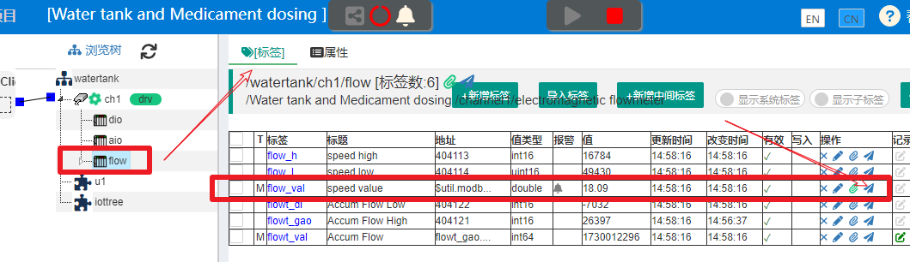
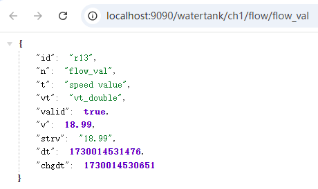
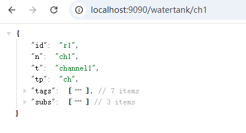
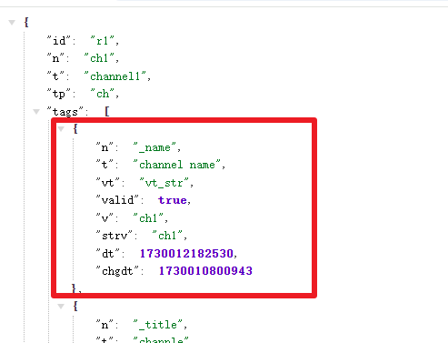
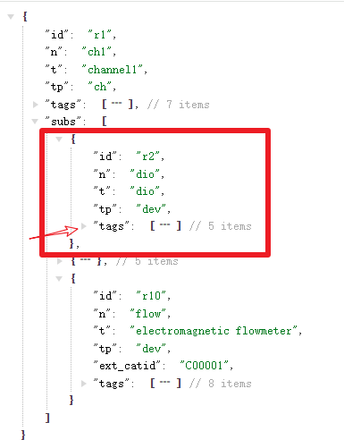
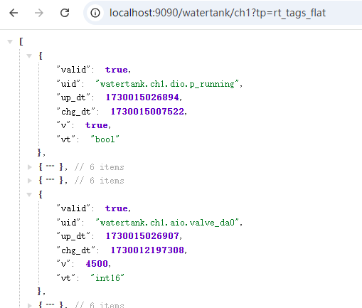
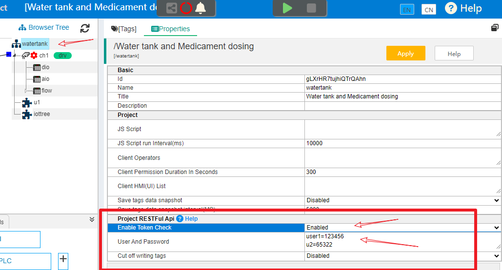
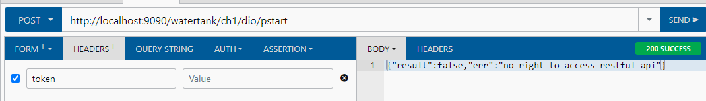

对外提供RESTFul接口
==


IOTTree中的项目提供对外RESTFul接口，对比OPC UA来说，RESTFul通过http方式读写有组织的数据，更适合当前互联网相关技术架构，同时也更加简单。

只要你的IOT-Tree部署环境满足RESTFul调用，建议都使用这种方式。

任何容器节点，只要鼠标右键，选择"访问"菜单选项。都可以弹出以这个容器节点为根的树形数据输出——输出格式是JSON结构。同时，在容器节点对应的标签列表，点击标签右边“操作”列的“访问”图标，也可以弹出此标签的RESTFul URL连接，输出格式也是JSON结构的标签当前状态和数据。


## 1 HTTP GET方式获取数据

### 1.1 标签Tag数据获取


我们以IOT-Tree自带的Demo项目"Water tank and Medicament dosing"为例。如果对这个Demo项目不了解，请参考：


<a href="../quick_start.md"> 快速开始</a>


正常启动运行此项目之后，点击浏览树中的节点"flow"，并在右边的标签列表中点击标签"flow_val"对应的“访问”图标，弹出一个新的页面窗口：


<table>
 <tr>
   <td></td>
   <td></td>
 </tr>
</table>

我们可以看到，弹出的URL地址为：

```
http://localhost:9090/watertank/ch1/flow/flow_val
```


url中的访问路径符合："/项目名称/通道/设备/标签名称" 这样的层次结构。这也是为什么IOT-Tree对节点名称的取值较为严格的原因，通过符合程序变量命名限制，在后续的数据使用过程中，可以带来很大的方便。

另外，我们也可以看到，由于标签是叶子节点，输出的JSON只是一个简单的JSON对象，内部有这个标签的相关属性


```
{
    "id": "r13",
    "n": "flow_val",
    "t": "speed value",
    "vt": "vt_double",
    "valid": true,
    "v": 8.63,
    "strv": "8.63",
    "dt": 1730012429054,
    "chgdt": 1730012428849
}
```

属性 "id"代表节点id，"n"代表节点名称，"t"代表节点标题，"vt"代表标签值类型,"valid"代表标签值的有效性，"v"代表标签值，"strv"代表标签值的字符串形式，"dt"代表这个标签值的更新时间,"chgdt"代表标签值的上一次变化时间。


### 1.2 容器节点数据获取


我们在项目浏览树中，鼠标右键“ch1”这个通道节点，选择"访问"菜单选项。弹出新页面URL如下（很明显可以直接修改上面的url路径即可）：


```
http://localhost:9090/watertank/ch1
```



可以看到，输出也是一个JSON对象，只是比较复杂，除了基本属性，还有一个节点类型属性"tp"。

接着我们可以看到对象中，还有两个数组成员"tags"和"subs"。展开tags可以看到数组里面每个成员都是一个标签JSON对象。具体格式参考上一节内容：





展开subs，可以看到这个数组成员下面每个设备对应的JSON对象，每个设备对象又有自己的数组成员"tags",如图：





可以想象，如果容器节点下面还有标签组，则还可以包含更多的层级。


### 1.3 参数 tp=rt_tags_flat


上面直接输出树形结构的某个节点的数据，基本可以满足你的程序获取数据的需要。不过由于树状结构层次可能比较多，你的程序很可能需要不断的循环处理数据才能满足要求。

很多时候，你只需要调用IOT-Tree的标签实时数据，不希望通过复杂的树状层次进行数据过滤提取。此时你可以在url中加入参数tp=rt_tags_flat。还是以上面ch1通道访问url做例子，你只需要访问：


```
http://localhost:9090/watertank/ch1?tp=rt_tags_flat
```

此URL GET方式输出一个JSON数组，数组内部每个对象都是标签数据，如下图：





其中，标签对象有个"uid"属性，这个属性是从项目根名称开始，到标签名称的唯一标识。其他基本只有实时数据值、有效性、时间和数据类型，可以很方便的直接基于标签进行数据获取。


## 2 HTTP POST 写标签

### 2.1 可写标签Tags写入说明


在一些驱动通道下面的标签，写入值最终会触发对应的设备驱动产生设备写指令（或控制指令）。因此除了上述的GET方法我们可以读取IOT-Tree项目中的标签数据，还可以通过POST方式反过来写标签数据。

我们还是查看Demo项目中的 “/watertank/ch1/dio/pstart” 这个标签对应的URL地址：


```
http://localhost:9090/watertank/ch1/dio/pstart
```

使用浏览器RESTFul插件，进行如下设置和操作：


可以看到，对上面的pstart标签url，使用form方式post参数"_pv=1"，就可以触发演示水泵的启动。（测试时应确保模拟设备和Demo项目正常启动）。并且写入成功之后，返回JSON结果


```
{"result":true}
```

下面我们把Demo项目停止运行，然后再次点击“send”，可以看到返回错误：


```
{"result":false,"err":"JS_set _pv=1 err in tag /watertank/ch1/dio/pstart err:write to driver failed"}
```

### 2.2 写标签支持的参数

#### 2.2.1 _pv


本参数会根据标签类型做最根本的写入动作。如果标签对应某个驱动，则会最终调用驱动做写入动作；如果是本地标签(Local Tag)，则可能会触发标签本地存储记录。


#### 2.2.2 _value

本参数只支持内存中的标签数据更改。

#### 2.2.3 _func

函数调用，可以支持对容器或标签更复杂的操作。（TODO 未来支持）


## 3 安全验证和调试支持


IOT-Tree接入现场各种各样的设备，各种设备运行状态不同。一些只做采集的物联网设备由于数据只是只读的，对接不存在安全隐患（但也存在数据泄露风险）；而工业现场很多设备就不同，对接的时候如果设备正在运行，随便下达控制指令可能会造成严重后果。因此，为了能够保证安全的前提下，使得上位（云端）系统能够有效的对接IOT-Tree，IOT-Tree提供了RESTFul接口的一些限定措施。

<font color="red">首先有个建议：IOT-Tree对外提供RESTFul接口调用时，最好都在内网系统之间进行，相关的基本网络安全由内网安全防护提供。</font>

同时，为了避免其他系统能够随意访问IOT-Tree提供的URL，增加了Token方式的验证支持；另外，为了满足对接调试需要，同时又不会影响现场设备的运行，IOT-Tree还提供了写入请求的截断和调试支持。


### 3.1 RESTFul调用的Token限制


IOT-Tree为了能够避免URL被不相关的系统随便访问，可以在IOT-Tree项目中设置Token验证支持。

在项目管理主界面中点击根节点，右边“属性”选项卡中，可以看到"RESTFul Api"属性组：





设置"Enable Token check"=Enabled,并且设置一个或多个用户密码。本例使用如下用户密码用以说明：


```
user1=123456
```


保存之后就启动了RESTFul接口的验证，在后续的RESTFul请求中，每次请求都必须在HTTP头的token属性设置一个验证token字符串。这个字符串每次生成只能使用一次，后续的每个请求都必须再次生成一个新的。

Token的计算生成请参考本文后面的附件 Token.java。调用方先通过提供的用户名和密码构建一个Token对象：


```
Token tk = new Token("user1","123456") ;
```

然后在每次发起RESTFul请求前，使用如下代码生成一个新的，并放入到http头部token属性中即可:


```
String tknew = tk.createNew() ;
```


附件中的Token.java代码建议直接复制到你的项目中使用即可。

我们还是查看之前的请求例子：





可以看到，由于我们启用了Token验证，http 头部没有设置token，直接返回错误


```
{"result":false,"err":"no right to access restful api"}
```

我们用Token生成一个验证字符串如下,填写入http的HEADER中，点击"send",可以发现返回成功。


```
user1|AB387BC9A831BD46F58A99D5B5F86A1F5E4EBE382A8F50F21C6F68BD1DD6A06C6C287ADCEAFEF47A
```


但是，如果你不修改此token值，再次发送相同请求，就会返回失败：“no right to access restful api”。因为刚才的token已经被使用，需要再次生成新的token才允许。

IOT-Tree使用token中的用户查找密码，解密后续的加密串，获取每次请求的UUID，并作记录。如果下次使用相同的UUID则拒绝。


### 3.2 写标签截断与调试


在实际项目场合，上位系统调用IOT-Tree RESTFul接口写标签都会触发标签关联的设备驱动做写动作，进而对现场的设备产生真正的执行指令。这就会带来一个很大的问题，我们上位系统需要开发调试，然而很多现场的设备正在生产运行中，此时是不允许随便进行写指令动作的。那么该如何调试呢？

我们当然可以把IOT-Tree运行实例和设备断开，但此时读取数据也就没有了，上位系统很可能就失去了当前运行状态，进入一种非正常状态，很可能不满足测试条件了。而且仔细考虑会发现，这肯定是个蠢方法。

IOT-Tree提供了RESTFul写标签访问截断测试支持，还是上面根节点"RESTFul Api"属性组。你只需要使能"Cut off writing tags",点击"Apply"保存之后，后续的所有RESTFul请求都会被接受，并返回result=true。但不会继续往下写入，只会在IOT-Tree运行控制台（或日志）打印信息。


```
2024-10-30 12:34:15 [WARN] PrjFilter - cut off write tag [/watertank/ch1/dio/pstart] with _pv=1
2024-10-30 12:34:34 [WARN] PrjFilter - cut off write tag [/watertank/ch1/dio/pstart] with _pv=1
```

由此，你可以在IOT-Tree日志或控制台输出配合调用方查看是否调用正确，而不会影响正在运行的设备。


## 附件 Token.java

```
import java.security.SecureRandom;
import java.util.ArrayList;
import java.util.List;
import java.util.StringTokenizer;
import java.util.UUID;

import javax.crypto.Cipher;
import javax.crypto.SecretKey;
import javax.crypto.SecretKeyFactory;
import javax.crypto.spec.DESKeySpec;

/**
 * Token token = Token(user,psw) ;
 * 
 * Every time it is called, a new Restful HTTP header token attribute must be create new one
 * 
 * String newtoken = token.createNew() ;
 * 
 * @author jason.zhu
 *
 */
public class Token
{
	public static final String KEY_ALGORITHM = "DES";

	public static final String CIPHER_ALGORITHM = "DES/ECB/NoPadding";

	String user;

	String psw;

	SecretKey secretKey;

	Cipher encCipher;

	Cipher decCipher;

	public Token(String user, String psw) throws Exception
	{
		if (user == null || "".equals(user) || psw == null || "".equals(psw))
			throw new IllegalArgumentException("user psw cannot be null or empty");

		this.user = user;
		this.psw = psw;

		byte input[] = psw.getBytes("UTF-8");
		byte[] kbs = "00000000".getBytes();
		System.arraycopy(input, 0, kbs, 0, input.length <= 8 ? input.length : 8);
		DESKeySpec desKey = new DESKeySpec(kbs);
		SecretKeyFactory keyFactory = SecretKeyFactory.getInstance(KEY_ALGORITHM);
		secretKey = keyFactory.generateSecret(desKey);

		encCipher = Cipher.getInstance(CIPHER_ALGORITHM);
		SecureRandom random = new SecureRandom();
		encCipher.init(Cipher.ENCRYPT_MODE, secretKey, random);

		decCipher = Cipher.getInstance(CIPHER_ALGORITHM);
		decCipher.init(Cipher.DECRYPT_MODE, secretKey);
	}

	public String createNew() throws Exception
	{
		String uuid = UUID.randomUUID().toString();
		//System.out.println("new uuid=" + uuid);
		String dd = user+"="+uuid;

		byte[] bs = dd.getBytes("UTF-8");
		int blen = 0;
		if ((blen = bs.length % 8) != 0)
		{
			byte[] newbs = new byte[bs.length + 8 - blen];
			System.arraycopy(bs, 0, newbs, 0, bs.length);
			for (int i = bs.length; i < newbs.length; i++)
				newbs[i] = 0;
			bs = newbs;
		}
		bs = encCipher.doFinal(bs);
		return user + "|" + byteArray2HexStr(bs);
	}

	private static String byteArray2HexStr(byte[] bs)
	{
		return byteArray2HexStr(bs, 0, bs.length);
	}

	private static String byteArray2HexStr(byte[] bs, int offset, int len)
	{
		return byteArray2HexStr(bs, offset, len, null);
	}

	private static String byteArray2HexStr(byte[] bs, int offset, int len, String delim)
	{
		if (bs == null)
			return null;

		if (bs.length == 0 || len <= 0)
			return "";

		StringBuilder sb = new StringBuilder();
		for (int i = 0; i < len; i++)
		{
			if (i > 0 && delim != null)
				sb.append(delim);
			int tmpi = 255;
			tmpi = tmpi & bs[i + offset];
			String s = Integer.toHexString(tmpi);
			if (s.length() == 1)
				s = "0" + s;
			sb.append(s);
		}
		return sb.toString().toUpperCase();
	}

	private static byte[] hexStr2ByteArray(String hexstr)
	{
		if (hexstr == null)
			return null;

		if (hexstr.equals(""))
			return new byte[0];

		if (hexstr.indexOf(' ') < 0)
		{
			int s = hexstr.length() / 2;
			byte[] ret = new byte[s];
			for (int i = 0; i < s; i++)
			{
				ret[i] = (byte) Short.parseShort(hexstr.substring(i * 2, i * 2 + 2), 16);
			}
			return ret;
		}

		List<String> ss = splitStrWith(hexstr, " ");
		int s = ss.size();
		byte[] ret = new byte[s];
		for (int i = 0; i < s; i++)
		{
			ret[i] = (byte) Short.parseShort(ss.get(i), 16);
		}
		return ret;
	}

	private static List<String> splitStrWith(String str, String delimi)
	{
		if (isNullOrEmpty(str))
			return null;

		ArrayList<String> rets = new ArrayList<String>();
		StringTokenizer st = new StringTokenizer(str, delimi);
		while (st.hasMoreTokens())
			rets.add(st.nextToken());

		return rets;
	}

	private static boolean isNullOrEmpty(String s)
	{
		if (s == null)
			return true;

		return s.equals("");
	}

}

```
