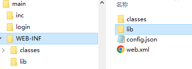
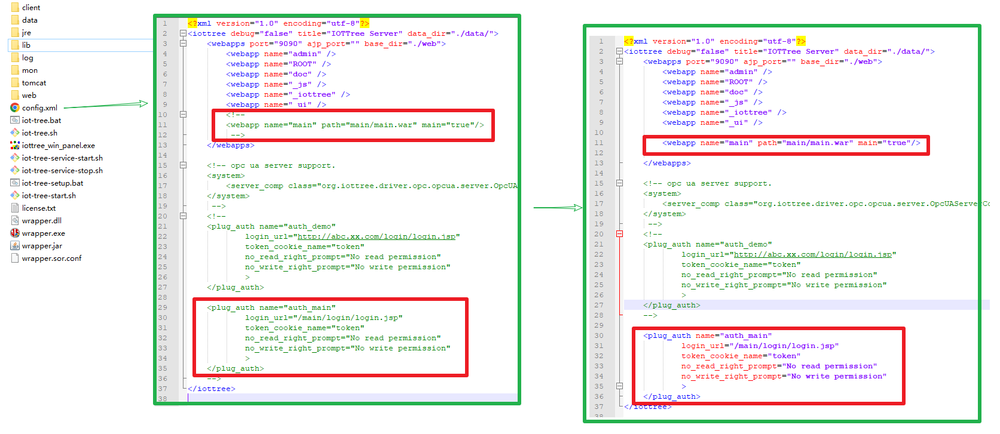
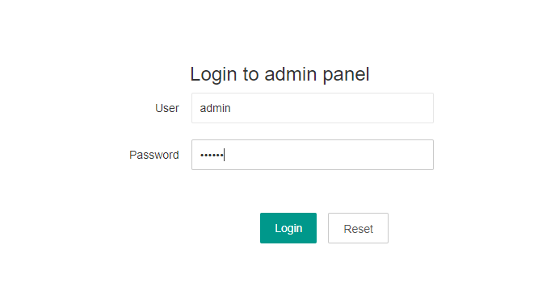
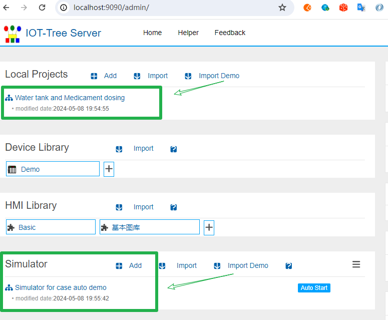
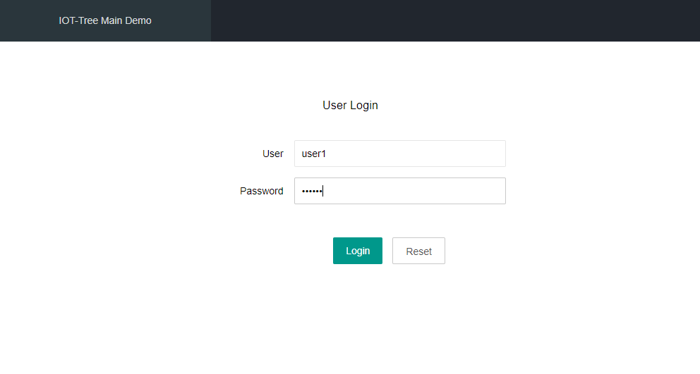
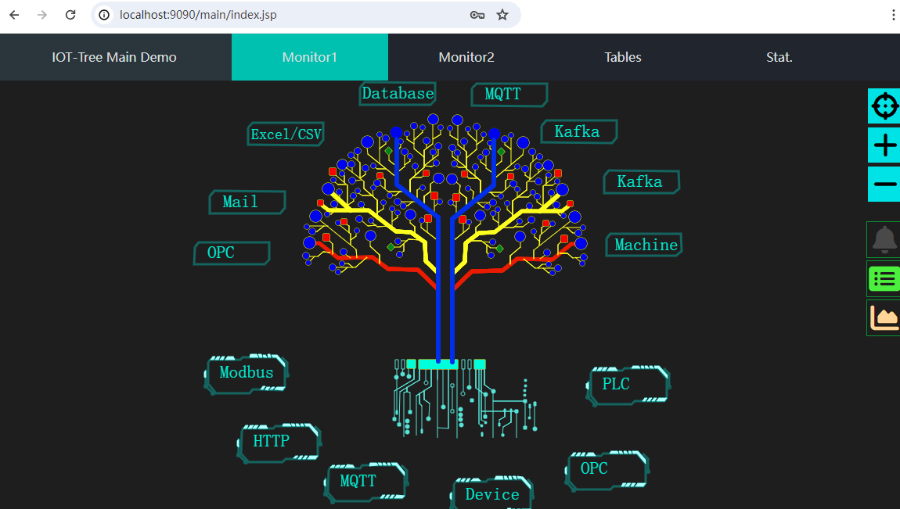
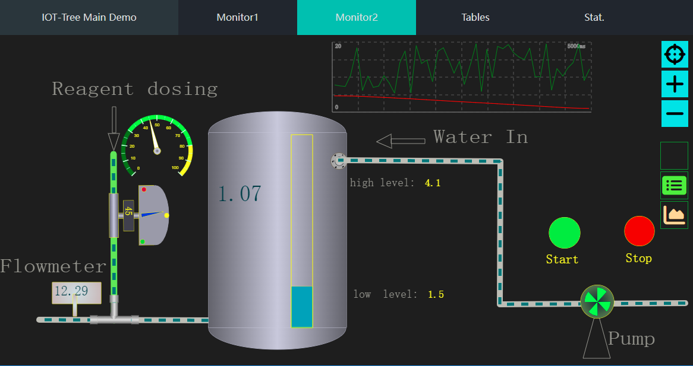

自定义项目管理(Webapp)
==


在很多传统的SCADA软件系统中，要支持有一定规模的现场监控和业务，往往需要在软件中配置很多的界面内容，然后使用特定的导航组件进行整合。由于监控画面采用的技术有着一定的局限,限制了你的发挥，稍微复杂一些的业务功能就不容易实现。比如，对于Web开发很容易的导航菜单，对于传统组态来说就有着不少限制。

如果你需要使用IOT-Tree实现一个规模大一些的SCADA系统，界面要求和很多当前流行的管理系统类似——有导航、本地数据库、监控画面、图表统计分析、GIS地图功能、3D展示效果等。应该如何实现呢？

你完全可以使用Webapp相关的开发方法，实现顶层SCADA业务，然后整合独立运行的IOT-Tree里面的监控画面和json数据。通过nginx作为前端统一入口,使得IOT-Tree和你的webapp在同一个域空间（能够共享cookie），实现权限的统一。具体可以参考：


[插件开发 - Authority][plugin_auth]


上述的方法前提是你的业务系统非常庞大复杂，整个系统由多个web server实例组成，日常维护等工作都不小。对于大部分SCADA系统来说，没有必要弄这么复杂，那有没有更好的选择呢——这就是本文的内容。


## 1 自定义webapp技术背景

在我们原先规划中，也考虑了使用传统组态画面方式——通过提供专门的导航图元+配置参数定义导航内容，然后使用若干js api，支持画面切换和对话框调用，后来我们认为——完全没必要。主要有如下理由:

1) 为了实现SCADA软件在不同位置、不同用户登录之后，监控画面和导航内容不相同（含不同的权限限制）。很多传统的SCADA软件客户端最终效果和我们使用的浏览器差别不大，本质也是数据中心汇总现场数据，统一提供服务，然后客户端根据权限装载不同的监控画面（含导航）。可以这么说，当前浏览器支持的渲染能力完全可以替代这样的客户端。

2) 当前顶层业务数据和管理功能已经基本被浏览器垄断。这块你只要做过web应用系统，就会深有体会，基于浏览器的前端技术飞速发展，展示的交互能力越来越强大。而客户端方式不仅开发难度高，部署之后的后期维护更是令人头疼的麻烦。除非你开发的是一些特殊工具软件或专有系统，你基本不会考虑使用客户端方式开发软件系统。事实上，IOT-Tree提供了完全基于Web方式的监控画面，也是基于此因——这更能适应物联网+互联网的环境。

3) IOT-Tree Server使用Java开发，内嵌Tomcat这个Web容器，可以充分利用Tomcat的优势。你只需要能够开发标准的Java Servlet/JSP Webapp，就可以把这个部署到IOT-Tree Server中，然后只需要添加一些插件类和简单的配置文件，就可以使得你的这个Webapp成为IOT-Tree Server主界面，可以轻松完成有一定复杂程度SCADA系统。

你如果不了解Java Webapp，建议你稍微花一点时间学习一下吧，比较技不压身；或者你可以找个java程序员，稍微帮助你一下。本文基于release版本自带的main webapp，会详细说明这个webapp的实现方法，这也是个很好的学习内容。

你如果熟悉Java Webapp开发，那么不管你用什么技术（如spring等），请最好打包出war文件，然后部署到IOT-Tree Server的对于目录下，具体内容请往下看。


## 2 main webapp总体说明


在IOT-Tree release版本中，解压之后在目录web/main/下面，你可以看到main.war这个java webapp的文件。war文件本质是个zip的压缩文件，解压之后，你可以看到里面有web页面相关的资源文件。其中，WEB-INF/目录是Webapp Server端程序信息，里面有classes/和lib/目录，分别存放java类和jar库文件，以及配置文件web.xml。其中，里面的config.json是IOT-Tree插件相关的配置文件。





下面，本文以这个main demo相关代码进行整体说明。

IOT-Tree的部署安装请参考其他文档，本文不做叙述，Server启用的端口为9090。


### 2.1 启用main webapp


缺省情况下，IOT-Tree Release版本中的配置没有启用这个webapp。此时，请打开IOT-Tree Server部署根目录下的config.xml文件,对里面两部分被注释的配置内容，进行注释解除。如下图：




```
<webapp name="main" path="main/main.war" main="true"/> 
```

此配置启用main webapp，main="true"说明此webapp是这个IOT-Tree中的主webapp。这代表了当访问IOT-Tree的URL地址http://host:port/ 时，系统会自动跳转到http://host:port/main/。


```
<plug_auth name="auth_main" 
        login_url="/main/login/login.jsp"
        token_cookie_name="token"
        no_read_right_prompt="No read permission"
        no_write_right_prompt="No write permission"
        >
</plug_auth>
```

此配置说明此IOT-Tree部署实例使用auth_main这个权限插件。这个auth_main也是有main webapp提供——也即是WEB-INF/config.json配置的插件信息，此内容后续会详细说明。


### 2.2 启动IOT-Tree，并准备依赖demo项目


首先启动IOT-Tree Server，然后访问http://localhost:9090/admin/，进入项目管理登录界面：





<font color="red">请注意，此时admin登录验证已经由main webapp中的插件接管，请输入密码: 123456 进行登录。</font>

为了体现项目中的监控画面和这个webapp的整合效果，我们还需要导入release版本中自带的demo项目："Water tank and Medicament dosing"；这个demo项目又依赖设备模拟器项目"Simulator for case auto demo"。我们通过"Import Demo"按钮分别进行导入。最终如下图：




我们分别启动设备模拟器和项目——两个项目内容，请参考：

 [工业现场自动化系统使用案例][case_auto]

现在，我们可以查看main webapp的运行效果了。

### 2.3 运行效果


访问地址 http://localhost:9090/ 你会发现 页面自动会跳转到 http://localhost:9090/main/login/login.jsp。这是main webapp给最终用户使用的登录界面。如下图：





这个登录界面完全由main webapp自己控制，你可以想象，如果这是你的java webapp，那么就应该是你自己定义的登录界面。事实上，IOT-Tree在访问http://localhost:9090/时，跳转的地址是 http://localhost:9090/main/，此时就被main webapp接管，在main webapp权限判断中，自动跳转到登录url。

请填写用户名 user1 ，密码 123456。登录之后，进入带有导航功能的界面如下：





main webapp演示的功能很简单，就上方一级导航，点击之后，下方主内容区能够切换内容。如，点击"Monitor2",界面如下：





以上两个导航内容，分别对应"Water tank and Medicament dosing"这个demo项目中的两个UI实时监控画面，而剩下的导航菜单"Table"和"Stat."代表main webapp自身的表格和统计功能，相关内容只是做个显示说明。

下面，我们进入这个项目的代码和配置，详细说明这个webapp的实现和配置过程。


## 3 main webapp的实现说明

### 3.1 java webapp简单说明

#### 3.1.1 main webapp的过滤器和配置


java webapp的过滤器，可以在对webapp的url访问进行请求截获。从中，你可以根据当前的请求信息，判断用户是否登录，如果没有用户登录，则可以强制跳转到登录界面。如果发现已经登录，则可以判断此url是否允许当前用户访问。

此演示main webapp中对应的类为 com.xxx.app.AppFilter 


```
package com.xxx.app;

import java.io.IOException;
...

public class AppFilter implements Filter
{
	public static final String TK = "token";
    
	@Override
	public void init(FilterConfig filterConfig) throws ServletException
	{
		
	}

	
	@Override
	public void doFilter(ServletRequest request, ServletResponse response, FilterChain chain)
			throws IOException, ServletException
	{
		HttpServletRequest req = (HttpServletRequest) request;
		HttpServletResponse resp = (HttpServletResponse) response;
		HttpSession session = req.getSession();
		//this.getServletContext()..getRequestDispatcher(getServletInfo())
		response.setContentType("text/html;charset=UTF-8");
		String cxtp = req.getContextPath() ;
		String path = req.getServletPath() ;
		//System.out.println("uri="+uri +"  qs="+qs);
		if(path.startsWith("/login/"))
		{
			chain.doFilter(request, response);
			return ;
		}
		
		String tk = (String)session.getAttribute(TK) ;
		if(tk!=null&&!tk.equals(""))
		{
			chain.doFilter(request, response);
			return ;
		}
		
		resp.sendRedirect(cxtp+"/login/login.jsp");
	}
	
	
	@Override
	public void destroy()
	{
		
	}

}

```

这个过滤器实现判断会话中是否有某个token，如果没有说明当前没有用户登录,强制跳转到登录url。如果有，则允许页面输出。这个过滤器需要配置到WEB-INF/web.xml文件中，如下：


```
<?xml version="1.0" encoding="utf-8"?>
<web-app ...>
    <description></description>
    <display-name>main</display-name>
    
    <filter>
        <filter-name>AppFilter</filter-name>
        <filter-class>com.xxx.app.AppFilter</filter-class>
        <init-param>
            <param-name></param-name>
            <param-value></param-value>
        </init-param>
    </filter>
    <filter-mapping>
        <filter-name>AppFilter</filter-name>
        <url-pattern>*.jsp</url-pattern>
    </filter-mapping>
</web-app>
```

#### 3.1.2 登录页面


在 login/目录下，有login.jsp和login_ajax.jsp这两个文件。其中login.jsp展示登录界面，用户输入用户密码，点击登录时会提交数据到login_ajax.jsp这个jsp。在这个jsp内容进行具体的登录过程。

login_ajax.jsp代码如下：


```
<%@ page contentType="text/html;charset=UTF-8" isELIgnored="false"%><%@ page import="java.util.*,
				java.io.*,
				java.net.*,
				java.util.*,
				org.iottree.core.*,
				org.iottree.core.util.*,
				java.net.*"%><%
	String op = request.getParameter("op") ;
	String user = request.getParameter("user") ;
	String psw = request.getParameter("psw") ;
	if(op==null)
		op="" ;
	switch(op)
	{
	case "login":
		if("user1".equals(user) && "123456".equals(psw))
		{
			session.setAttribute("token", "user1_1111111") ;
			Cookie ck = new Cookie("token","user1_1111111") ;
			ck.setPath("/") ;
			response.addCookie(ck) ;
			out.print("ok") ;
		}
		else if("admin".equals(user) && "123456".equals(psw))
		{
			session.setAttribute("token", "admin_1111111") ;
			Cookie ck = new Cookie("token","user1_1111111") ;
			ck.setPath("/") ;
			response.addCookie(ck) ;
			out.print("ok") ;
		}
		else
		{
			out.print("login failed") ;
		}
		return ;
	case "logout":
		out.print("ok") ;
		return ;
	default:
		out.print("unknown op") ;
		return ;
	}
%>
```

这个登录过程仅仅是演示使用，就支持user1和admin两个账户，验证成功时，会在当前会话session中放入"token"这个属性（前面的AppFilter就是以这个作为是否登录的判断内容）。

接下来就比较重要了，我们还需要在浏览器的cookie中放入这个token，这样可以使得这个token能被IOT-Tree中的监控画面页面共享使用，这样也才有机会让这些监控画面被main webapp控制输出。这个内容，请看后面的权限插件。


#### 3.1.3 带导航的主页面 index.jsp


此页面因为仅仅是演示实验，实现非常简单。页面内容分为上下两部分，上面是导航菜单，下面是具体内容。点击某个导航菜单，都会调用nav_to这个js函数，这个函数根据导航内容，在主内容区设定内容。其中，如果是引用监控画面，则在主内容区中设置iframe内容，如下代码：


```
<script>

function nav_to(p)
{
	$(".nav_item").removeClass("nav_sel") ;
	$("#ni_"+p).addClass("nav_sel") ;
	switch(p)
	{
	case "iottree":
		$("#main").html(`<iframe src="/watertank/iottree" style="width:100%;height:100%;overflow:hidden;border:0px;"></iframe>`) ;
		return ;
	case "u1":
		$("#main").html(`<iframe src="/watertank/u1"  style="width:100%;height:100%;overflow:hidden;border:0px;"></iframe>`) ;
		return ;
	case "tb":
		$("#main").html(`Your table data here:<br><table style="width:80%"><tr><td>1</td><td>2</td><td>3</td></tr></table>`) ;
		return ;
	case "st":
		$("#main").html(`Your stat data here`) ;
		return  ;
	default:
		alert('navigate to '+p) ;
		return ;
	}
}

nav_to('iottree');
</script>
```

其中，如下代码是设定主内容区包含演示项目的u1监控画面"/watertank/u1":


```
$("#main").html(`<iframe src="/watertank/u1"  style="width:100%;height:100%;overflow:hidden;border:0px;"></iframe>`) ;
```

### 3.2 权限插件代码和配置


根据java webapp的限定，在一个tomcat下面，多个webapp之间上下文和装载的类是互相隔离的。也即是不同webapp中的会话session是不共享的。因此，IOT-Tree为了能够让你的webapp能够控制实例内部的项目画面，就通过插件方式实现这个界限的跨越。


#### 3.2.1 插件代码

请参考：

[插件开发 - Authority][plugin_auth]


插件代码的实现和使用与之完全一样。IOT-Tree为了避免你的实现要依赖IOT-Tree中的接口定义，规定了插件类中的函数名称和参数，而类的名称你可以随便定义。


com.xxx.app.UserAuth

```
package com.xxx.app;

import java.io.File;
import java.util.HashMap;

public class UserAuth
{
	/**
	 * this method will be called when plug is inited.
	 * you can do some initial work here
	 * 
	 * @param plugdir
	 * @param params
	 * @throws FileNotFoundException
	 * @throws IOException
	 */
	void init_plug(File plugdir, HashMap<String, String> params) throws Exception
	{
		
	}
	
	/**
	 * option method
	 * 
	 * when you access http://iot_tree_server_host:port/admin,you must login by register name and password
	 * 
	 *  if this method is here,the default user authentication provided by the system will be ignored.
	 *  
	 *  
	 * @param reg_name
	 * @param password
	 * @return
	 */
	public User checkAdminUser(String reg_name,String password)
	{
		if("admin".equals(reg_name) && "123456".equals(password))
			return new User("","admin","Adminstrator") ;
		
		return null ;
	}

	/**
	 * Obtain user information according to the token
	 * 
	 * @param token provided by page cookie or other ways
	 * @return
	 */
	public User checkUserByToken(String token)
	{
		if(token==null||"".equals(token))
			return null ;
		
		if(token.startsWith("user1_"))
			return new User("","user1","User1") ;
		else if(token.startsWith("admin_"))
			return new User("","admin","Adminstrator") ;
		return null ;
	}
	
	/**
	 * this method will be called when outer will access node path in iottree like /prjname/n1/u1
	 * 
	 * The node related to this path may be a context node that returns JSON data. 
	 * Or the HMI UI node outputs the UI picture
	 * 
	 * @param node_path  like /prjname/n1   /prjname/n1/u1
	 * @param reg_name login user name or null or empty
	 * @return
	 */
	public boolean checkReadRight(String node_path,String reg_name)
	{
		//System.out.println("checkReadRight "+node_path+" "+reg_name) ;
		if("admin".equals(reg_name)||"user1".equals(reg_name))
			return true ;
		return false;
	}
	
	/**
	 * this method will be called when outer will write some data to node path in iottree like /prjname/n1/u1
	 * 
	 * this may be update some tag value in node or send cmd in hmi
	 * 
	 * @param node_path
	 * @param reg_name
	 * @return
	 */
	public boolean checkWriteRight(String node_path,String reg_name)
	{
		//System.out.println("checkWriteRight "+node_path+" "+reg_name) ;
		
		if("admin".equals(reg_name))
			return true ;
		return false;
	}
}

```

这个类中的函数"checkAdminUser",主要是提供给IOT-Tree项目管理登录验证（http://localhost:9090/admin）。而checkUserByToken函数，是提供给被引用的监控画面权限判断。

前面讲过登录之后，在cookie中设置了token，因此在监控画面被引用时，这个token会被输入到验证插件中的这个函数中，你的webapp就可以实现此函数，通过token判断当前登录用户信息。


#### 3.2.2 插件配置 WEB-INF/config.json


上面虽然实现了插件类，但在main webapp中如果没有相关的配置，则不会起作用。IOT-Tree规定：在webapp中的WEB-INF/目录下，编写配置文件config.json。部署之后，启动IOT-Tree时，IOT-Tree会在此webapp被装载时，自动查找这个配置文件，并根据里面的配置信息装载相关插件——包含权限验证插件，此demo配置代码如下：


```
{
	"name":"main_plug","title":"Plug In Main Demo",
	"js_api":
	[
	],

	"auth":
	[
		{
			"name":"auth_main","class":"com.xxx.app.UserAuth"
		}
	]
}
```

从中可以看出，里面定义了权限插件名称为"auth_main"，对于的类就是上面说明的内容。

请回到最开始的IOT-Tree总配置文件config.xml。可以看到


```
<plug_auth name="auth_main" ...
```

这个名称就是此插件对应的名称。

到此为止，一个基本完整的webapp就实现了


## 4 综述


如果你使用IOT-Tree实现SCADA项目有一定的顶层业务内容，那么建议你使用自定义webapp，配合权限插件来完成你的整体系统功能。这不仅可以让你充分利用java在顶层业务开发中的便利，同时也让IOT-Tree在你的应用中发挥更大的效能。

你可以使用Spring等开发框架进行webapp的实现，那么你只需要关注插件类和WEB-INF/config.json配置文件——只需要保证war文件中有这些内容就行。

你的webapp可以让你实现当前流行的界面风格，如驾驶舱、3D图景、GIS地图等内容。然后，你可以很方便的把IOT-Tree项目中的监控画面和数据整合到你的这些丰富多彩的界面中。


[plugin_auth]: ./adv_plugin_auth.md
[case_auto]: ../case/case_auto.md
