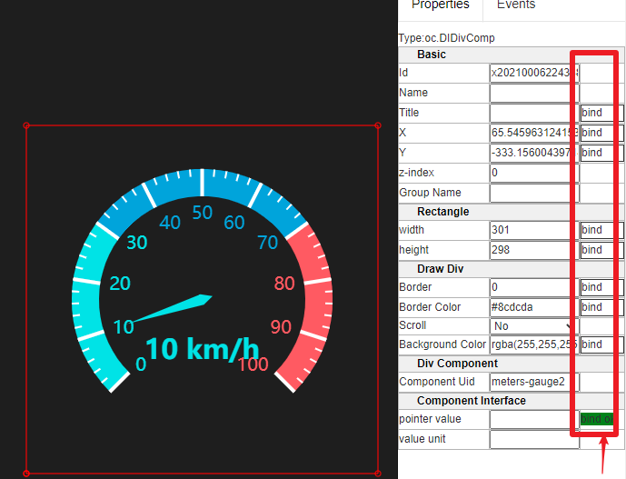

# 组件属性和事件机制

## 组件的属性（properties）及绑定

组件的属性基于前端js控件的属性定义而存在。服务端也可以通过前端定义的数据格式获取属性的定义列表等。

但在运行时，属性都是在浏览器一端进行展示和控制的。如果要获得服务端上下文数据，同时使得这些数据能够影响前端DrawItem的展示变化，则必须使用绑定（bind）。

在交互界面编辑过程中，选中元素之后，属性窗口会展示出所有的属性，如果某个属性允许绑定，则会有对于的bind按钮。如下图：

**记住：bind里面的内容，才是服务端产生的**

### 2种属性的绑定方式

1 直接选择上下文中的标签tag

2 使用运行在上下文中的js表达式

## 组件的事件（Event）及绑定

选中元素时，点击Events选项，可以看到元素基本的事件支持。

点击某个事件对应的编辑框，弹出事件编辑界面。可以看到每个事件可以有两个js脚本：Client JS和Server JS。
从名称我们就可以知道，Client JS是在客户端（浏览器）提供元素之间的互相交互功能。内部脚本基本就是根据事件触发，然后根据前端展示控件的属性进行相关判断，最终为自己或其他控件的一些属性进行设定即可。相关机制由基础前端展示框架提供。

而在Server JS填写的js会提交到服务器端运行，那也很容易理解，脚本主要针对展示画面所属的节点上下文中的数据进行操作，修改等。这个就可以影响到服务端，进而影响到服务端连接的设备等实际操作。

所以，系统事件机制提供了很灵活的前端展示和后端触发响应机制，您可以根据需要，可以只针对前端事件，做出一些只有前端变化的行为支持；或只针对服务端做响应的动作；或者两者兼顾。

