中心-子站远程监控
==

当前很多物联网系统中，经常有如下需求：

1）一些工业现场需要监控的对象很多，单个软件实例部署不可能满足现场使用需要。为了能够简化和理清整体监控架构，一般分为子站和总监控中心形成的上下级关系。每个子站可以看成是独立运行的系统，可以有自己的主监控设备，这个主监控设备可以运行IOT-Tree的实例做局部监控，而总监控中心可以汇总所有下面的子站。子站可以共享自己的所有数据，并且还可以接受总站的部分指令。

2）一些工业现场一些子站可能距离总监控中心很远，必须通过特定的通信方式接入总站系统。而我们当前很多系统都运行在单位/组织内部，如何安全可靠有效的分享数据和接入控制是一个挑战。

IOT-Tree专门针对这样的应用需求，实现了项目分享和接入支持——可以使你轻松解决这样的大型/分布式系统。

## 1 IOT-Tree项目共享和接入机制

IOT-Tree当前基于MQTT通信实现了项目数据共享和接入支持。

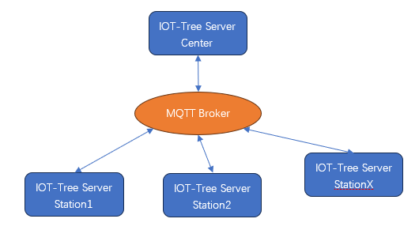

在一个分布式项目中，子站可以根据自己的需要对接局部现场的设备，配置相关的接入和使用设备驱动，然后使用一个IOT-Tree Server进行局部统一管理——整个过程就像一个独立的系统。

然后，我们可以在总站或云端部署一个MQTT Broker（事实上这个MQTT Borker也可以使用一个IOT-Tree Server，只需要启动里面的MQTT Service就行），每个子站就可以通过此MQTT Broker分享数据。

接着，在总监控中心部署一个IOT-Tree Server，这个实例配置对应的IOT-Tree Node接入就行。

### 1.1 MQTT简单介绍

MQTT是物联网系统当前使用比较多的一种通信协议，它主要提供基于发布/订阅模式的通信支持。

相关内容可以参考：<a href="doc/conn/msg_mqtt.md" target="main">&nbsp;&nbsp;&nbsp;消息 - MQTT</a>

### 1.2 使用MQTT通信实现项目数据共享的好处

基于主题消息发布和订阅机制实现多个IOT-Tree Server部署实例可以带来如下好处。

1. 可以屏蔽各种复杂的网络拓扑：不同的实例节点之间，只需要都指向同一个MQTT Broker就行。通过灵活的订阅方式，可以实现多子站和多中心结构；

2. 可以充分利用相关MQTT Broker的通信可靠性；

3. 项目的分享和接入接口实现也简单；

### 1.3 接入之后子站成为上位的一颗子树

子站本地IOT-Tree运行的是一颗项目树。通过分享接入到中心站之后，在中心站形成的是一个项目下对应通道的子树，子站的树形结构可以整体被复制到接入中心站中（其中的容器节点会被标签组代替）。

接下来，我们以一个演示列子来说明整个配置过程。

## 2 IOT-Tree项目共享配置过程

在详细说明之前，我们准备如下环境支持：

1） 一个云端环境，有公网IP地址，我们在上面运行一个IOT-Tree Server，启动里面的Apache Active MQ服务，使之提供MQTT Broker运行节点支持。

2）在一个局域网内部一台机器部署一个IOT-Tree Server，并启动里面自带的演示项目"Water tank and Medicament dosing"，该演示项目是使用内部自带的一个模拟器实例。这个IOT-Tree Server用来模拟一个远程子站。

3）在局域网另一台机器部署一个IOT-Tree Server，作为监控中心，新建一个中心项目，然后通过运动MQTT Broker接入远程的子站。

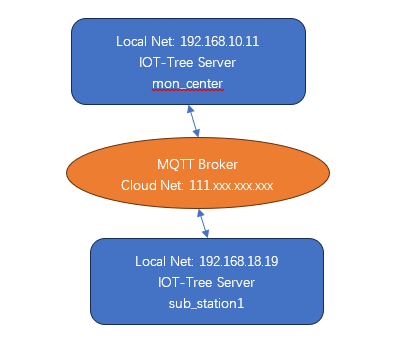

这个环境可以说是一种典型的物联网应用网络。远端子站由于距离总站远，平时是无人管理，里面的运行控制可以通过4G/5G路由器接入到云端，而我们的总站系统，也基本上为了安全都在企业/组织局域网内部。通过中间的MQTT Broker就可以很容易的接入远程子站形成上下级关系。通过MQTT，则可以屏蔽复杂的网络关系，哪天子站网络环境调整，几乎不会影响到现有系统的运行。

### 2.1 云端MQTT Broker运行配置

准备一个云端虚拟机，有个公网ip：111.xxx.xxx.xxx，在里面安装配置一个IOT-Tree Server。安装配置过程请参考相关文档。

启动之后进入管理界面，点击Services下面的"Setup"按钮，在"Apache Active MQ"这一项点击"编辑按钮"。填写如下内容的信息：

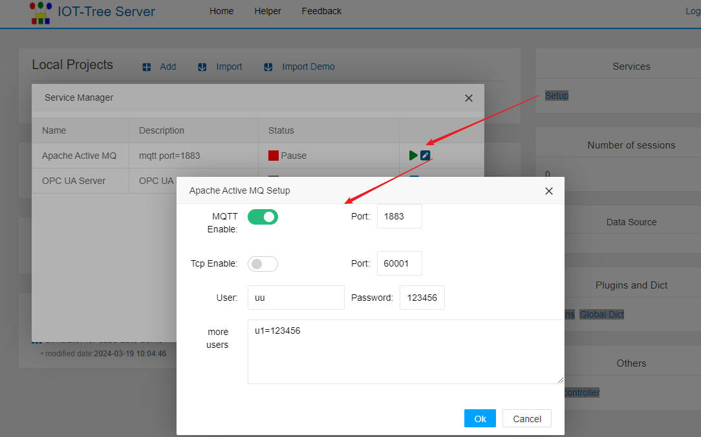

其中，我们使能MQTT，并且设定运行端口 1883,同时，设定可以连接此MQTT的一个或多个验证用户的名称密码。
确定之后，就可以点击"Apache Active MQ"的启动按钮，确保此项进入正常的Running状态。此时，我们已经配置好云端MQTT Borker节点了。你可以在远程使用命令"telnet 111.xxx.xxx.xxx 1883"进行测试，请注意查看防火墙是否有限制，确保远程能连上这个MQTT服务端Broker。

### 2.2 局域网子站IOT-Tree Server节点配置

#### 2.2.1 配置子站项目

本文档使用的局域网子站主机地址是 192.168.18.19。安装配置一个IOT-Tree Server。安装配置过程请参考相关文档。我们在里面导入演示项目"Water tank and Medicament dosing"，导入时，把项目名称改为"sub_station1"，如下图：


项目导入之后，为了演示方便，也导入此演示项目需要的设备模拟器，并启动：


#### 2.2.2 分享子站项目到云端MQTT Server(Broker)

进入子站项目管理界面，点击“share project”图标，填写项目共享参数信息如下：

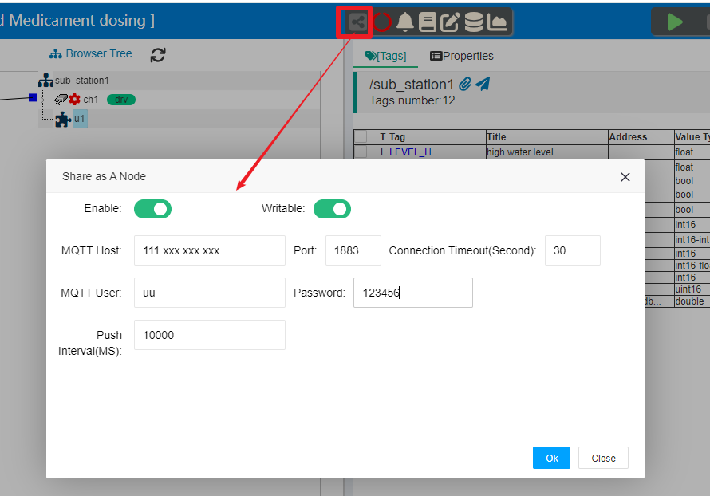

其中，MQTT Host 和 Port指向我们云端配置好的MQTT Broker相关地址和端口。MQTT User和Password也是我们云端MQTT Broker定义的链接验证用户密码。本文档写的内容非常简单，你实际项目请写一个复杂的密码确保安全。

另外，Push Interval参数是定时推送的时间间隔毫秒数，也即是在子站项目运行过程中，主动向MQTT Broker端推送更新数据的时间间隔。时间间隔越小，数据推送更新速度越快，但占用的网络带宽就越大，请根据你现场实际情况仔细定义这个时间。

点击"Ok"按钮，我们就配置好了项目分享参数。此时，你可以启动项目，并查看此分享图标的变化。如图：

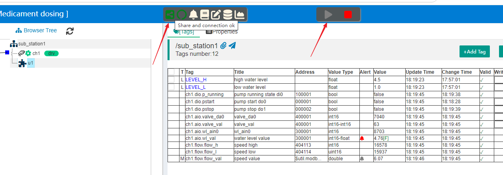

注：请别忘了同时启动此项目需要的设备模拟器，这样能确保项目启动运行正常，以方便我们后续的演示说明。

#### 2.2.3 获取子站项目id

当前已经完成了子站项目的全部工作。但我们需要拿到这个子站项目的id号，并作为参数提供给使用这个子站的接入端。在管理主界面中，点击项目根节点，并选择右边主内容区的“Properties”选项卡，复制里面的Id（本项目为e3O8mE92ME6vJuTtytU）。如下：

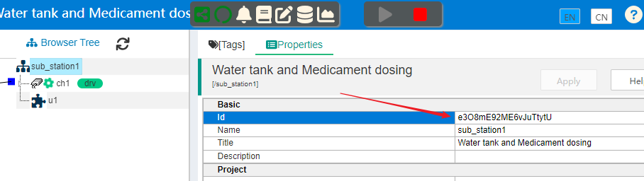

### 2.3 配置总站项目，并从云端MQTT Broker中接入子站

本文档在监控中心局域网内主机(192.168.10.11)上。安装配置一个IOT-Tree Server。安装配置过程请参考相关文档。我们在里面随便导入一个演示项目，导入时，把项目名称改为"mon_center"。如下图：

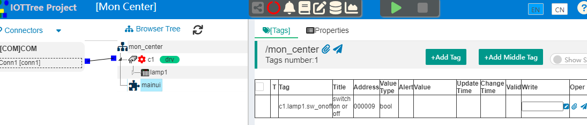

我们就以这个项目作为监控中心的IOT-Tree实例。接下来我们就要配置从云端MQTT Broker接入子站"sub_station1"。

#### 2.3.1 配置IOTTree Node接入

点击总站项目左上角"Connectors"，选择"IOTTree Node",在弹出的对话框中，填写接入到MQTT Broker和准备接入项目的参数：

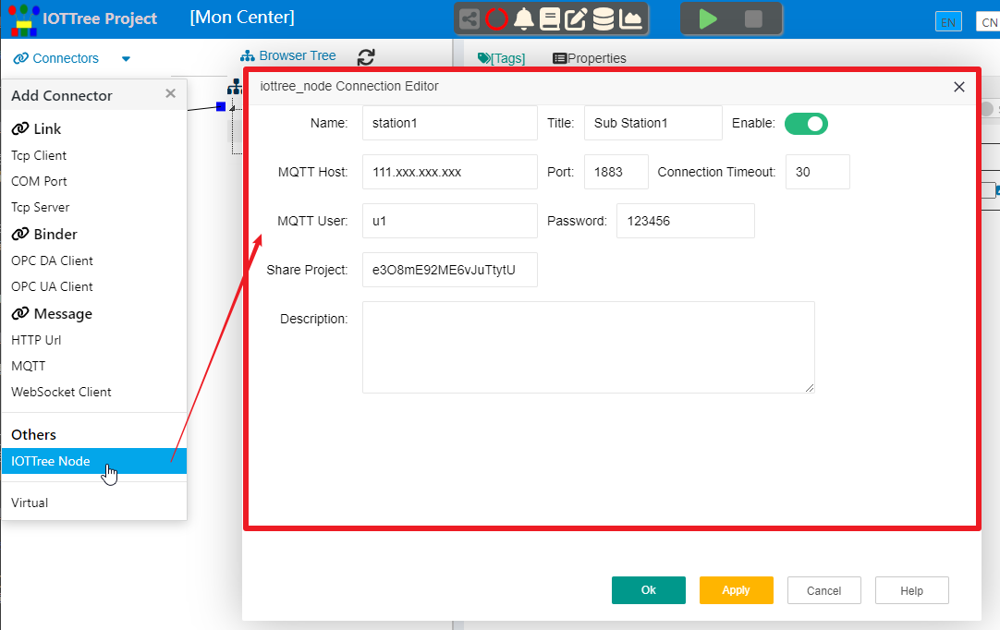

内部填写信息如下

```
Name=station1
Title=Sub Station1
MQTT Host=111.xxx.xxx.xxx  Port=1883
MQTT User=u1
MQTT User=123456
Share Project=e3O8mE92ME6vJuTtytU
```

其中，除了MQTT连接必须的地址、端口、用户和密码之外。最关键的是"Share Project"参数，我们需要填写子站配置对应的项目Id。这个参数我们在前面已经准备好，填写准确就行。

点击"Ok"，我们就完成了对应子站接入的参数配置。你可以看到在左边这个接入已经出现在列表中。

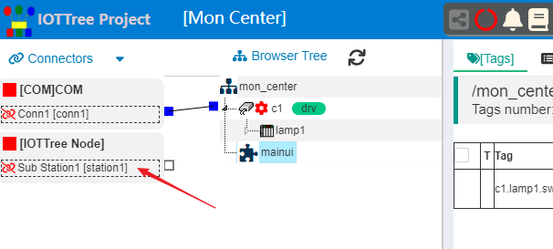

#### 2.3.2 配置通道，并关联此接入

IOT-Tree中，子站项目接入最终会体现在一个通道上——也即是在中心总站的项目中，每个接入的子站都会对应一个通道。

建立通道非常简单，在项目根节点鼠标右键，选择"New Channel",填写通道名称即可,如下我们新通道的名称为：sub_station1

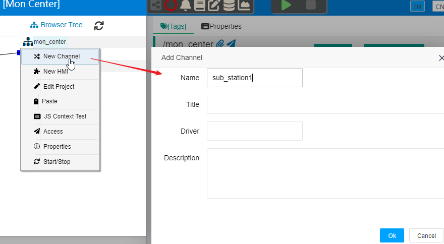

确定之后，在接入"station1"节点右边小方块点击不松开，移动到通道"sub_station1"对应的小方块释放，就可以建立接入到通道之间的关联。最终效果如下：

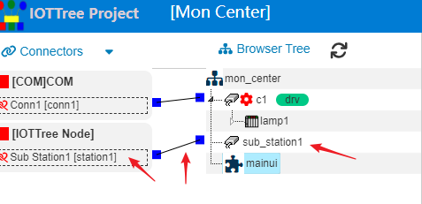

#### 2.3.3 同步子站的树形结构和数据

接下来，我们需要一步最重要的工作：把接入的子站配置好的整个树形结构复制到这个中心总站的"sub_station1"通道下面。

鼠标右键点击左边的接入节点"station1"，选择"Sync Tree"，你会看到一个同步对话框出现。

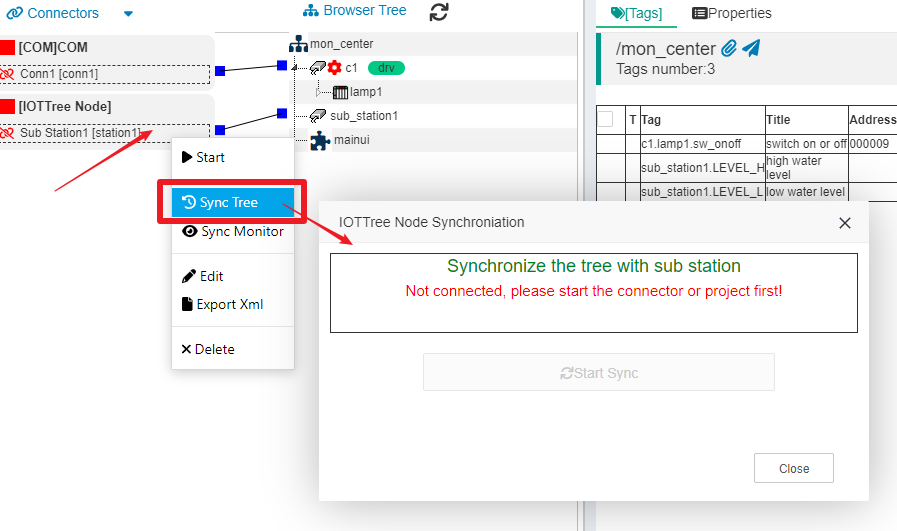

此时，里面提示我们先得有连接才行。很明显，如果要复制子站的树形结构，必须确保通信正常。此时，我们可以启动项目，再确定接入正常之后(确保station1这个接入节点的左边图标变绿)。然后再次打开这个对话框。

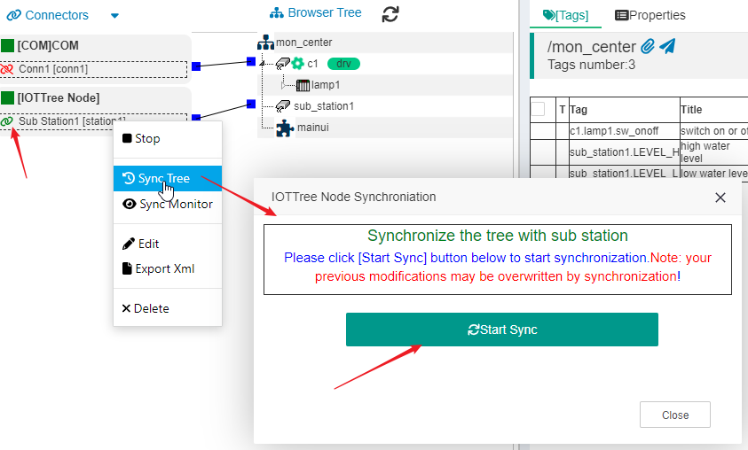

此时，你只需要点击"开始同步"按钮，过一些时间之后，就会提示同步成功。如果同步失败提示，则查看子站是否正常启动，查看中心总站是否和云端MQTT Broker通信正常。

点击"Close"按钮关闭对话框，你会看到子站定义的项目树都被复制过来了。如下图：

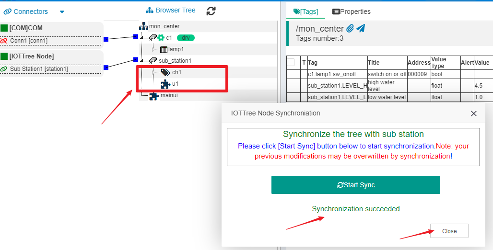

你可以看到，处理容器节点、标签节点都被复制之外，HMI(UI)节点也被复制过来。

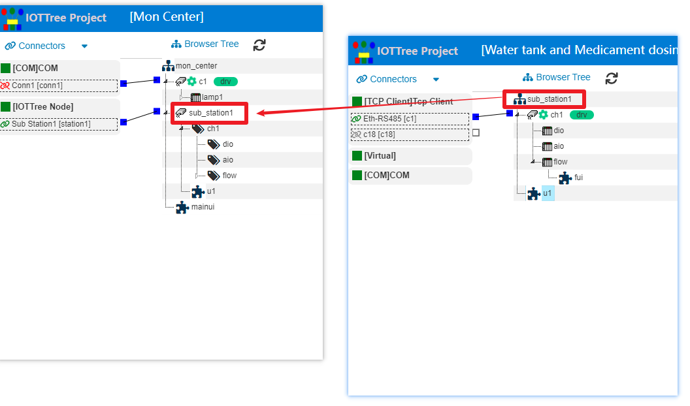

请仔细比对子站树结构和总站的树结构，你会发现，整个子站的树成为了总站的一个通道分支。并且子站通道、设备等容器节点，在总站都被标签组替换。

到此为止，我们就完成了子站接入到总站的全部过程。

#### 2.3.4 子站运行和总站运行时的差异

##### 2.3.4.1 更新时间间隔差异

我们确保总站和子站都进入正常运行状态。通过以上配置信息我们可以知道，子站分享自己的时候，会定时10000毫秒推送一次数据，也即是平均10秒中，总站会接收到子站的一次数据更新。因此，我们在总站标签列表中可以看到，和子站相关的标签平均10秒才会刷新一次。打开ui运行监控画面，你也会看到里面动态变化也会变成10秒钟一次。

很明显，你可以根据刷新的需要，把子站推送时间间隔减少，那么总站这边的数据刷新也会加快。

##### 2.3.4.2 写指令运行差异(很重要)

在我们在中心总站打开子站的u1监控画面(鼠标右键u1节点，选择"Access"即可)。点击鼠标启动或停止控制按钮。你会发现在总站也可以控制子站的水泵运行，也即是总站可以对子站进行写指令。

总站用户在监控画面中，点击按钮下达指令时，最终也会运行对应的脚本，如下图，我们在总站鼠标右键u1，然后选择"Edit UI",你会看到我们也可以打开这个HMI节点，进入监控画面编辑状态。

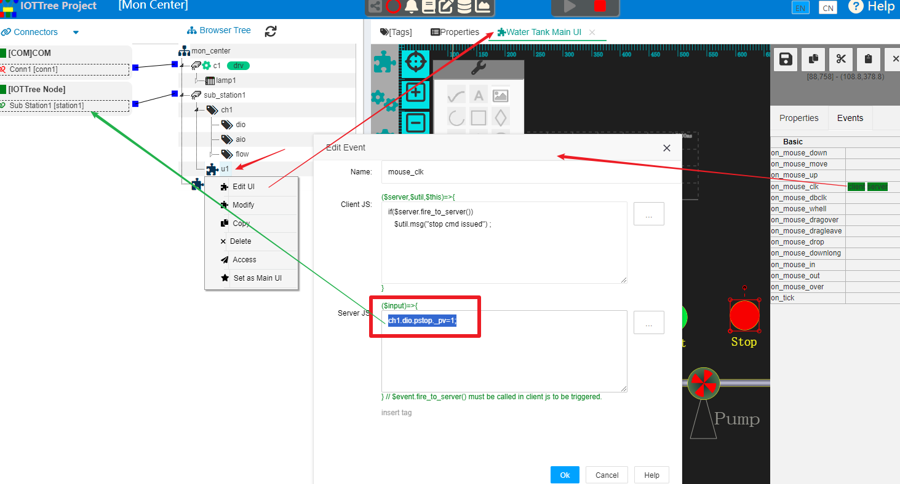

选中画面中的"停止"按钮,打开此按钮点击事件处理js脚本，你会看到最终会在中心总站运行脚本
```
ch1.dio.pstop._pv=1;
```
这句标签赋值代码，最终会由接入station1处理。它会被推送到子站，子站也会触发对这个标签的写入——进而触发对应的设备驱动写入动作。

从中我们可以看出，总站要给子站下达指令，最终也就体现在标签的写入。如果监控画面中JS脚本使用的一些特殊参数，那么总站操作产生的写入标签与子站操作产生的写入标签可能会有差异。另外，如果子站分享时限制某些标签的写入，那么总站对这些标签产生写入推送也会被忽略。

因此，在使用IOT-Tree这种分布式机制时，如果需要总站对子站的写入控制，请尽可能保持简单明确。如果有必要子站可以专门为总站设定监控画面，这些监控画面可以为总站提供限定的控制指令。


## 3 总结

可以看出，在IOT-Tree中实现多个部署实例的整合工作是非常简单和统一的。如果你的项目碰到类似需要，使用IOT-Tree可以对你产生很大的价值。

本文档的子站独立运行一个IOT-Tree Server。事实上，如果你的某个现场只有简单的若干总线和少量设备，通过4G/5G DTU可以直接连到云端，那么这个IOT-Tree Server也可以部署到云端(与MQTT Broker整合在一起)，现场的设备会更简单。云端的这个部署实例也可以分享，成为中心监控的一个子站。


