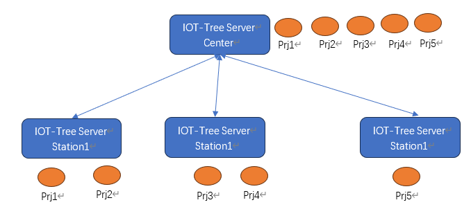
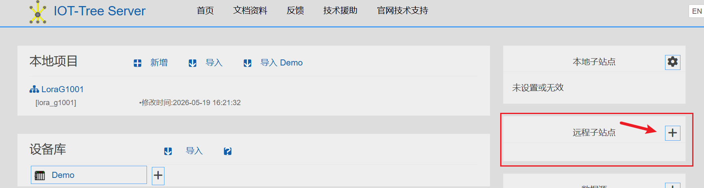
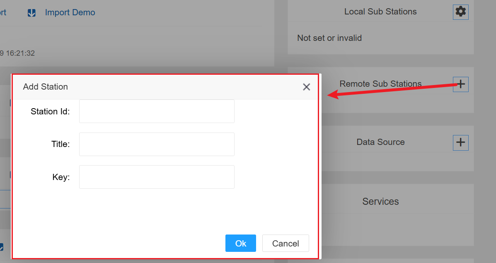
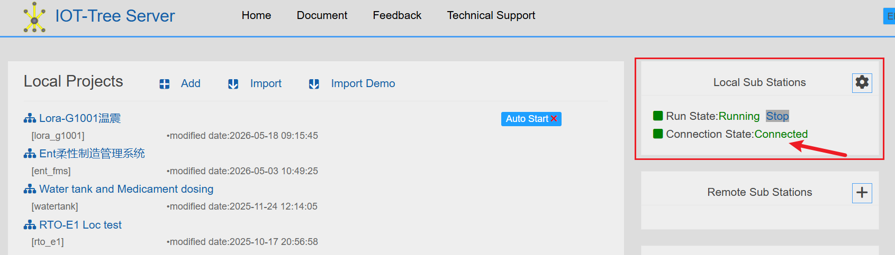
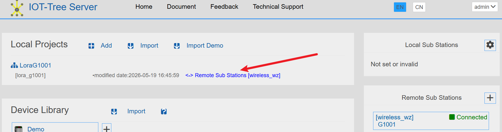
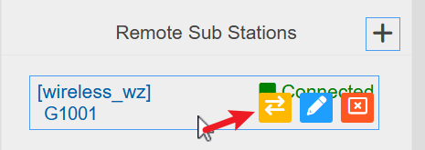
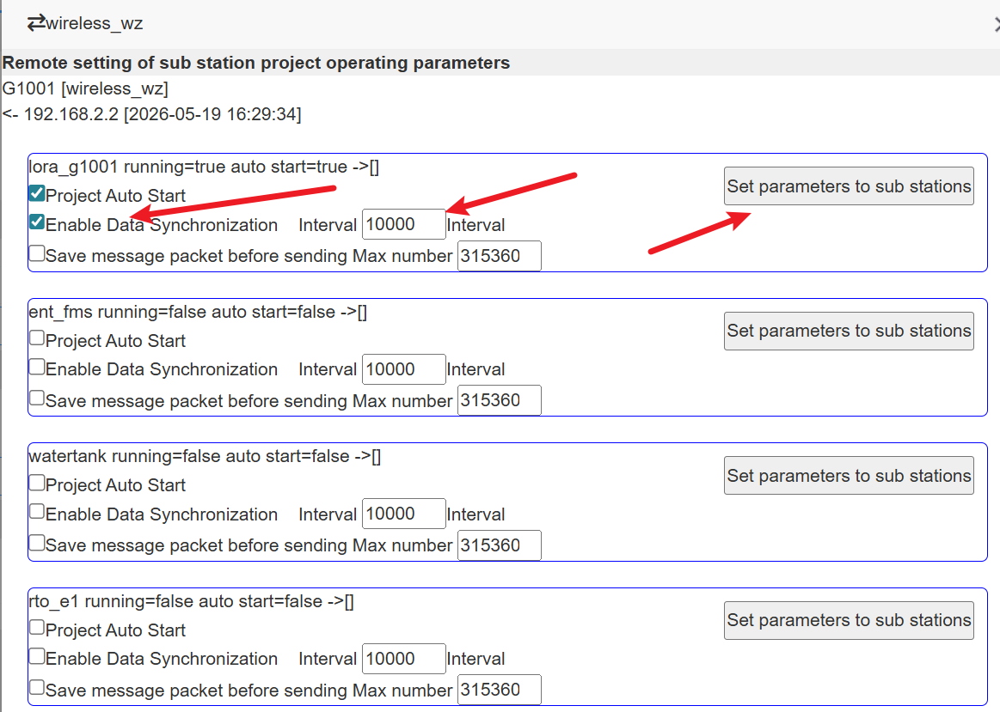

中心-子站数据同步(内置)
==

在版本1.9.0开始，IOT-Tree内部移植并开源了中心-子站点的数据同步功能，这个功能已经在我们开发团队的企业用户系统中使用了很长一段时间，足够稳定和可靠。之前基于MQTT协议实现的中心-子站功能后续不再维护。

当前很多物联网系统中，经常有如下需求：

1）一些工业现场需要监控的对象很多，单个软件实例部署不可能满足现场使用需要。为了能够简化和理清整体监控架构，一般分为子站和总监控中心形成的上下级关系。每个子站可以看成是独立运行的系统，可以有自己的主监控设备，这个主监控设备可以运行IOT-Tree的实例做局部监控，而总监控中心可以汇总所有下面的子站。子站可以共享自己的所有数据，并且还可以接受总站的部分指令。

2）一些工业现场一些子站可能距离总监控中心很远，必须通过特定的通信方式接入总站系统。而我们当前很多系统都运行在单位/组织内部，如何安全可靠有效的分享数据和接入控制是一个挑战。

IOT-Tree专门针对这样的应用需求，实现了中心-子站点的数据同步功能——可以使你轻松解决这样的大型/分布式系统。

## 1 IOT-Tree中心-子站点的数据同步运行机制

数据方向：日常运行中，数据以IOT-Tree中的项目为基本单位，定时从子站向中心站推送。推送时间间隔等参数也是基于项目配置。

因此，子站每次推送的数据包都是一个项目中全部或变化的标签（Tags）数据。也即是，子站和中心站都应该有相同数据结构的项目存在。



大部分情况下，每个子站运行在现场——可以是现场的工控机也可以是嵌入式边缘设备。

而中心IOT-Server则一般运行在现场中控室、机房或云端。并且对外能够为每个子站提供Web服务即可（如IOT-Tree缺省对外提供的9090 Web访问端口）。

假设现场子站和中心站的项目都配置完毕，如上图所示。现场站点项目直接连接现场的设备（PLC、传感器、控制器等），而中心的项目在标签定义结构上是和现场对应项目是完全相同的。

以上条件都满足之后，接下来需要对子站和中心都做相关的设置，才能使得子站和中心自动进行数据同步。

## 2 现场站点（子站）配置

访问子站管理界面（如访问 http://sub_station_ip:9090/admin/）。右上角“本地子站点”区块就是用来设置现场子站的配置区间。


点击设置图标，即可打开配置窗口。如下：


其中，站点id要求在整个分布式所有项目中唯一，代表了当前子站的唯一标识，此标识只允许ascii支付和数值组合。远程主机和端口则是中心系统对外发布的地址和端口。Key是本地子站的连接密钥，此密钥在后续连接中心配置时，需要配对。

```
Station Id=wireless_wz
Remote Host=center_host_addr
Port=9090
Key=you_key_xxx
```

配置成功之后，配置区块会显示当前子站运行状态信息，点击“Start”按钮，可以启动子站内部同步任务：


可以看出，就算后台任务已经启动，连接状态还是没法连接中心成功，因为中心还没有对应的配置。

## 3 中心配置

### 3.1 远程子站点配对配置

访问中心管理界面（如访问 http://center_ip:9090/admin/）。右上角第二个区块“远程子站点”就是用来设置中心接入远程现场子站的配置区间。



点击右上角+按钮，弹出窗口如下：



其中，站点id要求是远端子站对应配置，代表了当前子站的唯一标识，此标识只允许ascii支付和数值组合。Key是远端子站的连接密钥，密钥必须相同。

```
Station Id=wireless_wz
Key=you_key_xxx
Title=G1001
```
完成之后，如子站正常运行，网络也通畅，可以看到如下：


可以看到连接已经正常。此时，再回到子站管理界面，可以看到，连接也成功了：



### 3.2 配置接收数据的项目

上面已经完成了子站到中心的配对通信。那么接下来要把这个子站中需要同步的项目进行配置。本例中子站和中心站都有相同的项目名称为"lora_g1001"。我们此时需要在项目中配置此项目对应的远程子站和子站项目名称，这样才可以确定中心对应的同步数据项目。

点击项目进入项目管理界面主界面，点击项目根，并且在主内容去点击"Properties",然后在右边属性区块"Remote station instance",如下：


设定属性如下：


点击"Apply"按钮完成保存之后回到中心IOT-Tree系统管理主界面（刷新界面）。可以看到这个项目会显示关联的远程子站信息：



### 3.3 从中心配置子站同步参数

只要子站和中心连接成功，IOT-Tree就支持从中心对子站的一些同步参数进行配置，如同步时间间隔等。毕竟子站一般在现场（很可能距离较远），而同步参数如同步间隔很可能涉及流量限制，在总站能够对子站进行相关参数设置，这可以极大的方便了后续运行维护。

在中心主关联界面，鼠标移动到上面配置的远程子站项，可以看到有个同步参数设置按钮，如下：



点击之后，弹出子站参数设置对话框，可以看到子站的所有项目列表。可以在里面针对需要同步的项目启用数据同步和时间间隔等参数。然后点击“设置参数到子站”按钮对子站下达设置指令：



## 4 最终效果

此时，在中心IOT-Tree中，打开对应的项目，并且打开某个节点下的标签列表，可以看到远程子站的数据已经同步过来了。同时左边接入和驱动都没有运行（因为都是现场子站需要的）。如下图：


至此，这个子站已经接入到中心成功。

显然，其他子站和内部项目也可以用项目方式接入同一个中心。

可以看出，在IOT-Tree中子站-中心基于项目的实现多个部署实例的整合工作是非常简单和统一的。如果你的项目碰到类似需要，使用IOT-Tree可以对你产生很大的价值。

## 5 更多

由于子站-中心的同步基于项目，且与内部标签数据结构相关。某个项目同步之后，你还可以在中心站做更多的事情：

1. 可以添加监控画面

中心站中的监控画面和子站一样能正常运行，你还可以添加更多子站没有的监控画面

2. 对应的项目中添加消息流做进一步处理

中心站可以根据需要添加更多的消息流对同步的数据进行处理和使用

3. 中心站可以为物联网平台提供统一的数据api或共享数据


