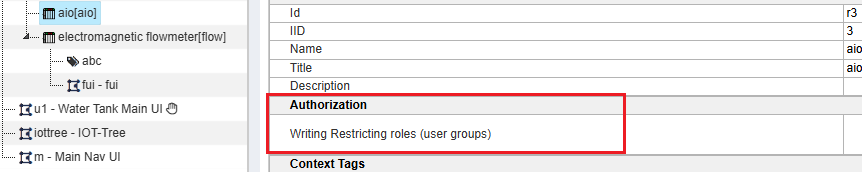
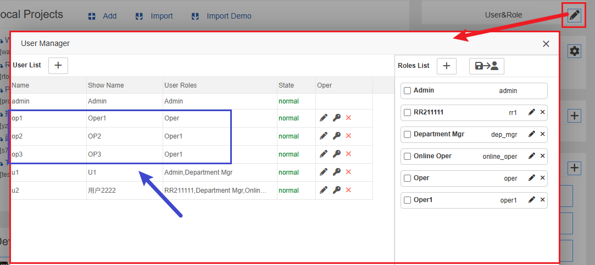
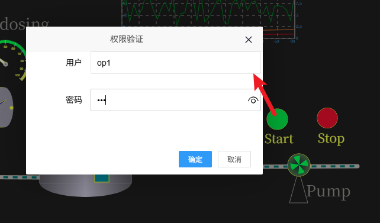
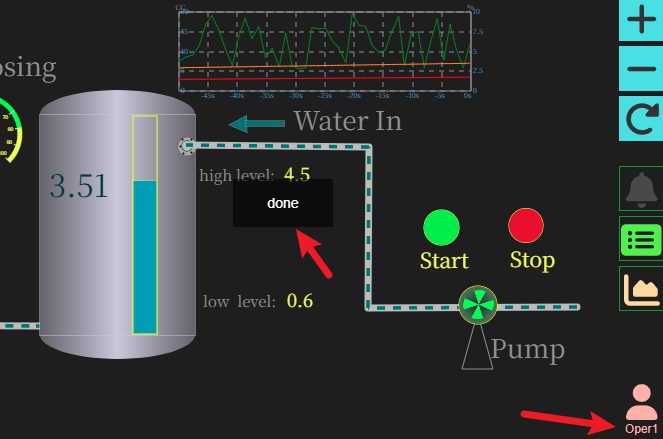

HMI写操作(下达指令)授权
==

## 1 基于角色的HMI写操作(下达指令)授权机制


在IOT-Tree项目组织树节点中，新增了属性“授权”-“写入限制角色（用户组）”。点击之后，可以在弹出对话框中选择设置需要的角色。





当一个节点设置了此限制角色之后，其子孙节点会自动继承此内容，除非子孙节点自己设置了限制角色——此时，继承的祖先配置内容被屏蔽。

因此，你可以在靠近根部的节点设置角色之后，下面的所有HMI节点都会使用此权限验证要求。

注：如果没有设置任何角色，说明相关节点不需要验证。


## 2 具体HMI写操作例子

我们还是以系统自带的demo项目进行相关权限设置说明，此项目导入运行请参考下面的文章:

<a href="../quick_start.md">快速开始</a>

### 2.1 准备用户和角色


先管理员登录，在管理主界面 http://localhost:9090/admin/ 的右上角点击打开用户角色管理对话框。我们在里面添加如下用户和角色。用户op1，op2，op3；并且op1分配角色oper，op2和op3分配角色oper1。如下：


```
op1|oper
op2|oper1
op3|oper1
```


### 2.2 设置节点角色

我们进入demo项目，点击hmi节点"u1"。然后在主内容区选项“属性”。点击“写入限制角色（用户组）”对应的编辑框，在弹出的角色选择对话框中，选择角色"oper":


完成之后不要忘记点击属性上方“应用”按钮进行保存设置。这样我们就完成了hmi u1节点的写操作限制。

### 2.3 在HMI画面中设置指令下达事件绑定


我们鼠标右键"u1"节点，选择“编辑UI"，在主内容区，选择启动图元，点击右边Events列表，如下图：


在事件"on_mouse_clk"对应的内容区，点击打开对话框，进行客户端事件触发和服务端事件处理JS脚本，如下：


Client JS运行在UI画面端，只需要如下一行代码，此代码是的前端向IOT-Tree Server端触发一个鼠标click事件。


```
$server.fire_to_server("")
```

Server JS运行在IOT-Tree Server内部，在接收到客户端触发的事件之后，这个JS代码会被运行。此代码对应水泵启动的标签点写入值1，这最终会通过设备驱动向控制器发出写指令。


```
ch1.dio.pstart._pv=1;
```

但Server JS在运行前会进行上面配置的用户权限验证，如果验证失败，则Server JS不会被运行并且返回错误提示。

对于"Run Name",如果你希望IOT-Tree能够自动对操作员的操作做记录,请填写能够区分此操作的运行名称，这样在操作日志中，就可以直观的区分是何种操作了。


### 2.4 HMI画面操作效果


确保demo项目启动，且正常运行。建议打开一个新的浏览器（无用户登录信息）。访问下面的url，你可以发现画面右下角有个人员图标——这说明当前画面有指令下达时有用户验证要求：


```
http://localhost:9090/watertank/u1
```


此时，我们直接点击“Start”对应的图元，会自动弹出操作员用户名和密码验证对话框。如图：





我们填写op1这个用户密码，这个用户对于oper角色——于此UI设定匹配。点击确定。可以看到指令下达成功提示，并且当前用户也有了显示：





此时，在一定的时间之内，ui画面不需要你重新进行用户密码验证。但超过一定时间长度之后（此时间可以在项目根节点设置），如果要做写操作，系统还会提示需要用户密码验证——这样做的好处是既可以防止误操作，又可以保证操作方便流畅。


#### 切换用户


点击右下角的用户图标，则可以强制弹出用户验证对话框。你可以在此输入其他用户的验证信息。我们此时可以填写op2这个用户，此用户就算登录能成功，但与此UI的限制角色不匹配，下达指令时会提示无权限。


