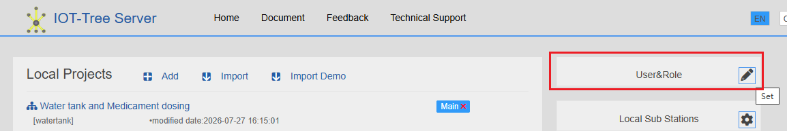
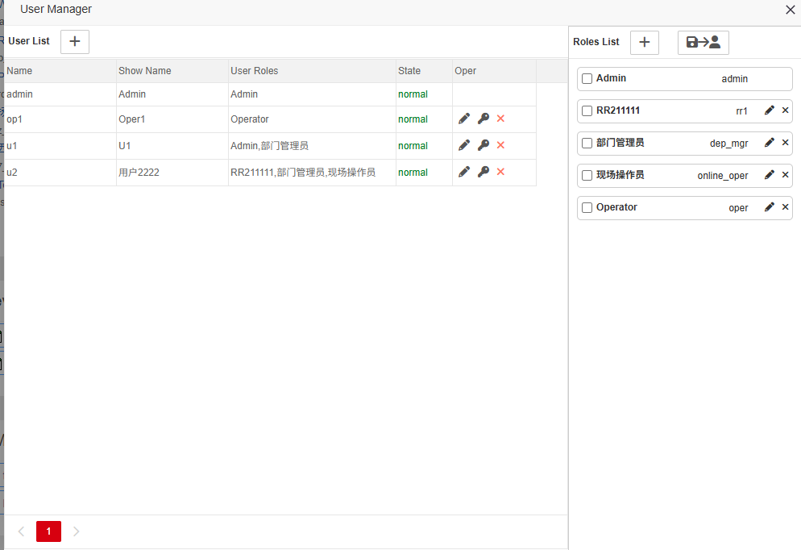
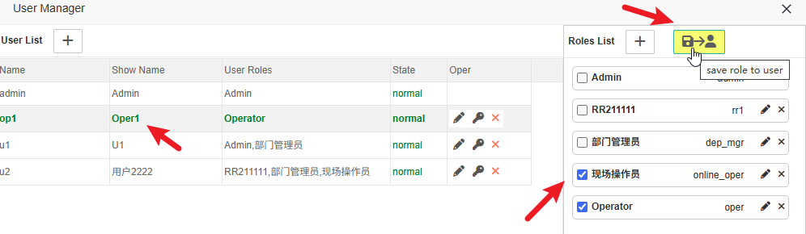

用户和角色
==

从版本2.0开始，IOT-Tree完善了用户和角色管理。

管理员可以在用户和角色管理界面中维护用户的添加、删除、修改（含登录密码）。

对角色进行添加，修改和删除等操作。对选中用户进行角色分配

### 1 管理入口

管理员登录管理主界面右上角，点击图标即可进入：

### 2 使用说明

左边是用户列表，右边是角色列表。可以对用户/角色分别进行添加、修改或删除。

#### 2.1 分配用户角色

点击某个用户，在右边角色选择框进行勾选，然后点击上方的“保存角色到用户”按钮即可：

#### 2.2 特殊用户和角色

用户admin和角色admin是系统自带的，并且是超级管理员，不允许被删除。当然，你也可以设置其他用户为admin角色

