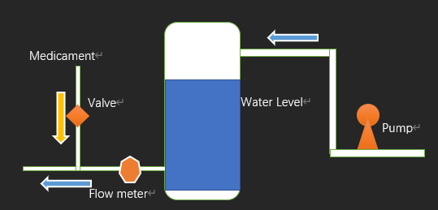
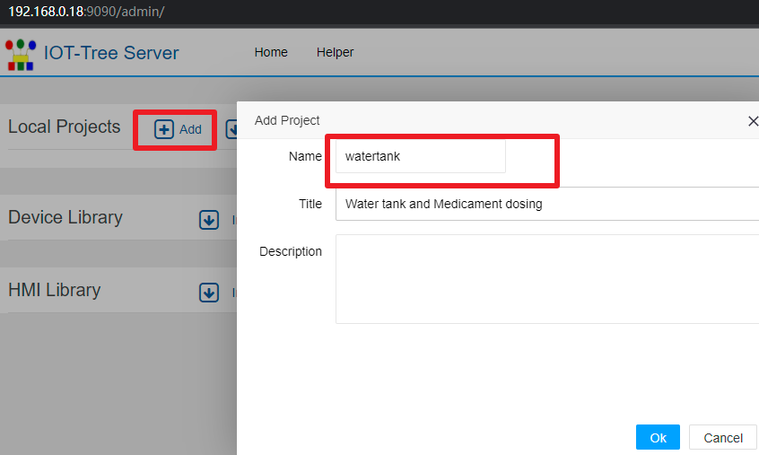

工业现场自动化系统使用案例
==


Case of industrial automation system
==


# 1 现场和控制要求

## 1.1 现场设施和控制要求

工业现场某个子系统有一个储水罐，进水口后面有个水泵，通过控制水泵的启停对储水罐进行入水控制。储水罐高5米，需要对水位进行监测和控制，确保控制水位保持在一定的区间内。

出水口对接工业流程的下一个子系统。并且，在出水口水流速度加入一种药剂，此药剂通过另外一个独立的自动化设备提供，控制药剂投加通过电动阀门的开度进行控制。

控制要求如下：

（1）当水位低于低位值1.1米时，水泵必须启动输入水，而水位高于4.5米时水泵必须停止，以防止水溢出。通过控制水位在一定的范围内，保证输出用水不间断。

（2）利用水流速度和开度的参考比例表，根据出水口流速，控制药剂投加管道上的阀门开度。（注：出水口流速由下一个子系统控制，对于本系统而言是不确定的）



## 1.2 自动化相关设备

### 1.2.1 水泵控制相关设备

现场水泵只需要通过接触器进行供电通断即可达到启停控制，配合中间继电器和反馈触点，最终通过两个24VDC继电器线圈进行启动和停止控制。一个线圈通电触发启动水泵，一个线圈通电触发停止水泵。同时，通过一个无源触点反馈水泵运行状态。

控制箱中，配置一个24VDC开关量输入输出模块，提供RS485 Modbus RTU接口，设备地址11，do0接启动线圈，do1接停止线圈。di0接无源反馈触点。do0，do1，di0对应的寄存器地址分别为 000001,000002,100001。

另外，现场的控制箱也有两个触发按钮（启动按钮和停止按钮）和一个水泵运行状态指示灯。用来支持现场人员进行手动介入进行紧急情况下的控制。

### 1.2.2 阀门开度控制和水位监测设备

在水罐内部投入一个0-5米量程的水位计，24VDC供电，4-20mA电流信号输出。在加药投加管道上安装一个电动阀门，其中开度控制通过4-20mA输入控制。

在现场控制箱，配置一个多路模拟量输入输出模块，提供RS485 Modbus RTU接口，设备地址12，AIN0（寄存器地址300001，对应4-20mA数值为2000-10000）接水位计电流信号，DA0（寄存器地址400001，对应4-20mA数值为2000-10000）接药剂投加电动阀门控制信号。

### 1.2.3 出水口电磁流量计

在水罐出水口安装配置电磁流量计，其变送器也提供RS485 Modbus RTU接口，能够读取瞬时流速和累计流量。设备地址13，流速通过寄存器404113作为高位、404114作为低位组成的4bytes浮点数，单位是立方米/秒。

### 1.2.3 上位控制计算机或嵌入式控制器

以上设备通过一根双绞屏蔽电缆作为RS485总线接入上位系统。上位系统可以是一台工控机，也可以是嵌入式ARM控制器，内部都安装配置了IOT-Tree Server。

RS485总线接入上位控制器，在软件内部对应串口COM5。当然，你也可以配置一个RS485转以太网的串口服务器模块。使得IOT-Tree Server可以通过Tcp方式透明访问RS485总线。现场使用企业内网，IOT-Tree Server对于的设备地址为192.168.0.18。串口服务器地址192.168.0.10

# 2 上位系统IOT-Tree Server作为子系统控制器配置

在前面的相关设备安装、接线成功之后，接下来主要工作就集中在控制器的IOT-Tree的配置上了。在工控机或嵌入控制器安装IOT-Tree Server请参考相关文档。本次案例IOT-Tree Server对外提供9090 http协议端口。

如果你在IOT-Tree Server本地工控机上，只需要打开浏览器，访问http://localhost:9090/admin 地址就可以登录进入IOT-Tree Server的管理、配置和控制界面。如果你在远程计算机上，则可以访问http://192.168.0.18:9090/admin 进行访问。

## 2.1 新建项目

登录IOT-Tree Server管理界面之后，在Local Projects中点击Add按钮，新增项目，如下图：



项目名称和标题如下：
```
watertank
Water tank and Medicament dosing
```
成功之后，在Local Projects列表中，就会出现新增加的项目。点击此项目，即可进入项目详细配置界面。
