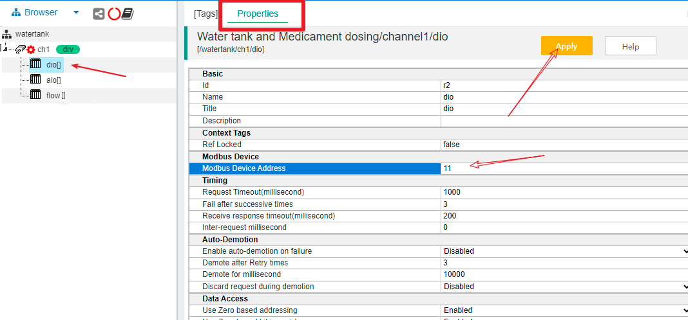
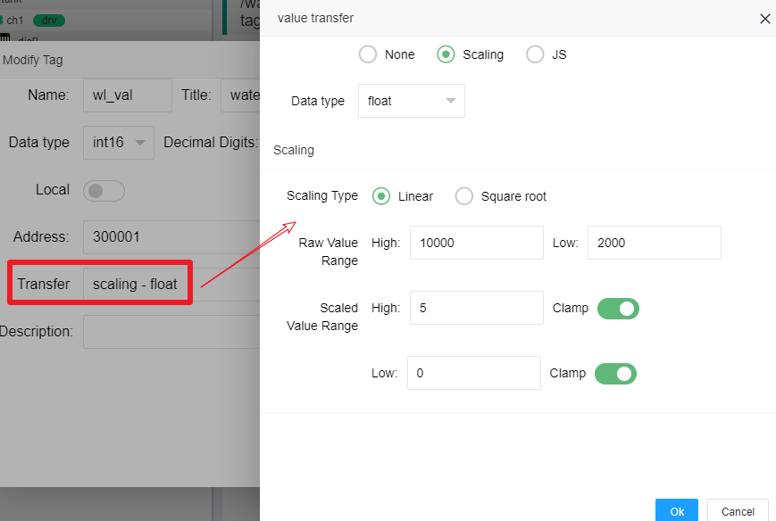
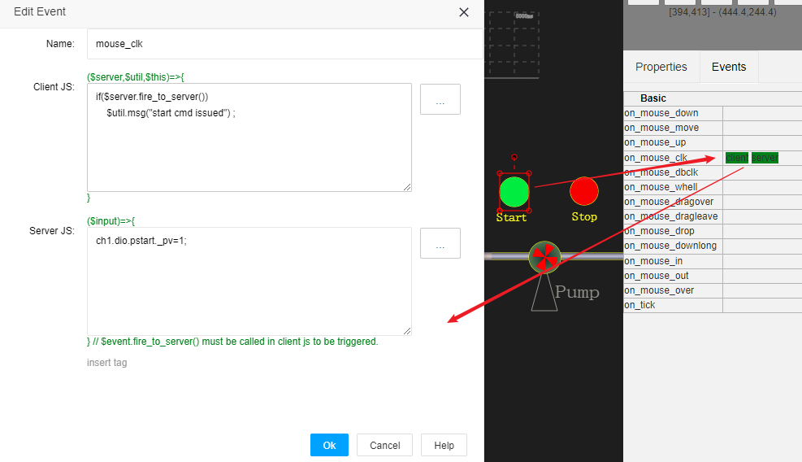
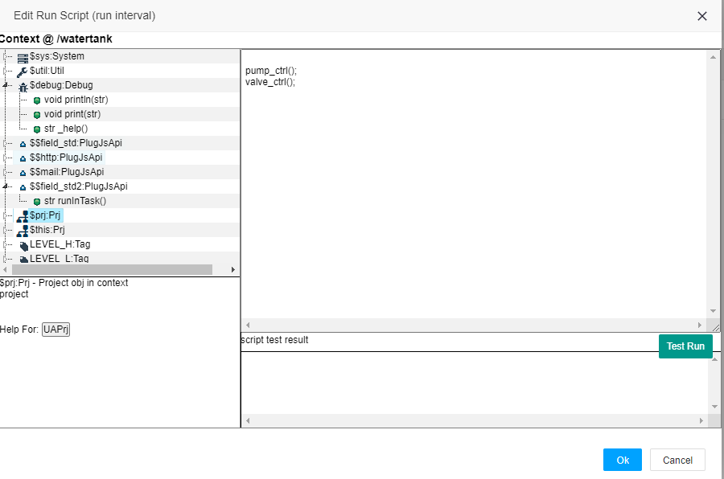

工业现场自动化系统使用案例
==


本案例是个工业现场完整的应用过程，你如果有相关的工作经验，通过此应用，你可以快速掌握IOT-Tree Server作为你的工业现场工作利器。


# 1 现场和控制要求

## 1.1 现场设施和控制要求


工业现场某个子系统有一个储水罐，进水口后面有个水泵，通过控制水泵的启停对储水罐进行入水控制。储水罐高5米，需要对水位进行监测和控制，确保控制水位保持在一定的区间内。


出水口对接工业流程的下一个子系统。并且，在出水口水流速度加入一种药剂，此药剂通过另外一个独立的自动化设备提供，控制药剂投加通过电动阀门的开度进行控制。

控制要求如下：

（1）当水位低于低位值1.1米时，水泵必须启动输入水，而水位高于4.5米时水泵必须停止，以防止水溢出。通过控制水位在一定的范围内，保证输出用水不间断。

（2）利用水流速度和开度的参考比例表，根据出水口流速，控制药剂投加管道上的阀门开度。（注：出水口流速由下一个子系统控制，对于本系统而言是不确定的）


## 1.2 自动化相关设备

### 1.2.1 水泵控制相关设备


现场水泵只需要通过接触器进行供电通断即可达到启停控制，配合中间继电器和反馈触点，最终通过两个24VDC继电器线圈进行启动和停止控制。一个线圈通电触发启动水泵，一个线圈通电触发停止水泵。同时，通过一个无源触点反馈水泵运行状态。

控制箱中，配置一个24VDC开关量输入输出模块，提供RS485 Modbus RTU接口，设备地址11，do0接启动线圈，do1接停止线圈。di0接无源反馈触点。do0，do1，di0对应的寄存器地址分别为 000001,000002,100001。

另外，现场的控制箱也有两个触发按钮（启动按钮和停止按钮）和一个水泵运行状态指示灯。用来支持现场人员进行手动介入进行紧急情况下的控制。


### 1.2.2 阀门开度控制和水位监测设备

在水罐内部投入一个0-5米量程的水位计，24VDC供电，4-20mA电流信号输出。在加药投加管道上安装一个电动阀门，其中开度控制通过4-20mA输入控制。

在现场控制箱，配置一个多路模拟量输入输出模块，提供RS485 Modbus RTU接口，设备地址12，AIN0（寄存器地址300001，对应4-20mA数值为2000-10000）接水位计电流信号，DA0（寄存器地址400001，对应4-20mA数值为2000-10000）接药剂投加电动阀门控制信号。


### 1.2.3 出水口电磁流量计

在水罐出水口安装配置电磁流量计，其变送器也提供RS485 Modbus RTU接口，能够读取瞬时流速和累计流量。设备地址13，流速通过寄存器404113作为高位、404114作为低位组成的4bytes浮点数，单位是立方米/秒。


### 1.2.3 上位控制计算机或嵌入式控制器

以上设备通过一根双绞屏蔽电缆作为RS485总线接入上位系统，所有的设备串口参数为[9600 N 8 1]。上位系统可以是一台工控机，也可以是嵌入式ARM控制器，内部都安装配置了IOT-Tree Server。

RS485总线接入上位控制器，在软件内部对应串口COM5。当然，你也可以配置一个RS485转以太网的串口服务器模块。使得IOT-Tree Server可以通过Tcp方式透明访问RS485总线。现场使用企业内网，IOT-Tree Server对于的设备地址为192.168.0.18。串口服务器地址192.168.0.10，端口12345。


### 1.2.4 使用模拟设备

如果你测试环境没有这些设备，你可以使用IOT-Tree Server内部自带的设备模拟功能，并且针对此案例，系统内部自带了上述设备的模拟实例Simulator Instance。

在主管理界面http://localhost:9090/admin/下面，有模拟器Simulator管理列表块。点击Import Demo,选择"Simulator for case auto demo"导入实例。

点击此实例，在弹出窗口中，点击启动按钮。只要运行正常，此时你可以通过tcp方式访问上述的RTU设备了。如下图：


# 2 IOT-Tree Server作为子系统控制器

在前面的相关设备安装、接线成功之后，接下来主要工作就集中在控制器的IOT-Tree的配置上了。在工控机或嵌入控制器安装IOT-Tree Server请参考相关文档。本次案例IOT-Tree Server对外提供9090 http协议端口。

如果你在IOT-Tree Server本地工控机上，只需要打开浏览器，访问http://localhost:9090/admin 地址就可以登录进入IOT-Tree Server的管理、配置和控制界面。如果你在远程计算机上，则可以访问http://192.168.0.18:9090/admin 进行访问。


## 2.1 新建项目

登录IOT-Tree Server管理界面之后，在Local Projects中点击Add按钮，新增项目，如下图：


项目名称和标题如下：


```
watertank
Water tank and Medicament dosing
```


成功之后，在Local Projects列表中，就会出现新增加的项目。点击此项目，即可进入项目详细配置界面。


## 2.2 新增Connector

如果你运行IOT-Tree Server的设备直接通过串口连接现场RS485总线，则应该选择Connector - COM。如果通过以太网Tcp转RS485的串口服务器连接，那么应该选择Connector - Tcp Client方式。

他们分别对应的输入如下图：


以下内容，都以Tcp Client方式进行进行推进。接下来我们就要在树形Browser里面新增Channel-Device两个层次的内容了。

注意：如果你使用系统自带的模拟设备，则必须使用Tcp Client方式，并且Host=localhost，Port=12345


## 2.3 新增通道和设备

Browser下面已经有个项目根节点"watertank"，鼠标右键在弹出的菜单中选择"New Channel"，在弹出的对话框中，输入或选择如下内容。确定之后，"watertank"下面新增了这个通道。


```
Name = ch1
Title = channel1
Driver = Modbus RTU
```


在通道下面，我们就可以添加设备了。在RS485总线上的设备有3个：开关量模块、模拟量模块和流量计。我们分别取名为dio、aio、flow。

在新增的通道节点鼠标右键选择"New Device"，在弹出对话框中，只需要填写如下内容，其中里面的Device选项保留空（原因是当前的设备并没有存入设备库）：


```
Name = dio
```


通过相同方式我们只需要填写一个设备Name，新增另外两个设备aio、flow。

设备添加完成之后，通道下面就有了这3个设备节点，此时在主内容区域，点击"Properties"标签页，并且选择点击设备节点dio。您可以看到Modbus RTU设备详细的设置参数列表显示其中。由于dio设备的地址是11，我们只需要修改"Modbus Device Address"这一项的内容改为11，并且点击右上角的"Apply"按钮即可。如下图：





您接着点击另外两个设备aio、flowm节点，并且修改"Modbus Device Address"对应的参数分别为12、13。注意：不要忘记点击"Apply"按钮生效！


### 2.3.1 关联Connector和通道

在Tcp Client下发的c1链接或COM的c2链接右边，有个小正方形框，鼠标移到上方会改变颜色，按下左键并移动，会出现连接线。把连接线拉伸到通道ch1左边的小正方形框，松开左键，即可完成链接到通道的关联，如下图：


## 2.4 配置设备Tags

### 2.4.1 水泵控制开关量模块对应Tags

现在，我们应设置设备内部关联的数据了。在主内容区域点击"[Tags]"标签，然后点击设备节点"dio"，在标签下面的内容区域显示路径"/watertank/ch1/dio",此时列表区域没有任何Tag数据。

鼠标点击"+Add Tag"按钮，在弹出的对话框输入如下内容：


```
Name = pstart
Title = pump start do0
Data type = bool
R/W = Read/Write
Address = 000001
```

此Tag对应水泵启动线圈输出do0，如下图：


我们用同样的操作新增另外两个Tag，分别对应水泵停止线圈，水泵运行状态反馈无源触点。


```
Name = pstop
Title = pump stop do1
Data type = bool
R/W = Read/Write
Address = 000002
```
```
Name = p_running
Title = pump running state di0
Data type = bool
R/W = Read Only
Address = 100001
```

最终，在设备节点"dio"下面，有3个Tags，如下图：


### 2.4.2 水位和阀门控制模拟量Tags

和水泵控制类似，我们针对设备aio，配置阀门输入输出模拟量tag，和水位只读模拟量tag


```
Name = valve_da0
Title = valve_da0
Data type = int16
R/W = Read/Write
Address = 400001
```
```
Name = wl_ain0
Title = wl_ain0
Data type = int16
R/W = Read Only
Address = 300001
```

上面两个点是模拟量模块输入输出的原始值，取值范围为2000-10000。我们需要把水位值转换为0-5.0范围内的浮点数，阀门开度转换为0-100的整数。为此，我们新增了wl_val和valve_val两个tag，并且设置里面的transfer参数。

对于wl_val标签，tag主界面和之前原始值对应的Tag类似，点击Transfer输入框，在弹出的界面中选择Scaling选项，然后再Data type选择float。Scaling Type选择Linear。Raw Value Range中，High=10000、Low=2000。Scaled Value Range中，High=5、Low=0。如下图：





对于valve_val标签，tag主界面和之前原始值对应的Tag类似，点击Transfer输入框，在弹出的界面中选择Scaling选项，然后再Data type选择int16。Scaling Type选择Linear。Raw Value Range中，High=10000、Low=2000。Scaled Value Range中，High=100、Low=0。如下图：


最终设备aio下面的标签列表如下图：


### 2.4.3 电磁流量计流速Tag

在设备flow节点下面，新增两个Tag如下，分别对应流量值的高位和低位


```
Name = flow_h
Title = speed high
Data type = int16
R/W = Read
Address = 404113
```
```
Name = flow_l
Title = speed low
Data type = int16
R/W = Read Only
Address = 404113
```

接下来，点击“+Add Middle Tag”按钮，新增中间Tag，填写内容如下：


请注意，中间Tag的Express输入的是js脚本。此节点脚本是一个函数调用，输入flow_h和flow_l两个标签值，通过组合计算得到流量的浮点数值（单位是立方米/秒）。确定之后，我们得到如下标签列表：


### 2.4.4 参数标签

我们还需要两个项目参数标签，用来支持高低水位的设定，这两个参数标签不和任何设备关联，并且能够自动保持设定的值。这就需要使用本地标签(Local Tag)。

点击项目根节点，在主内容[Tags]区点击"+Add Tag"按钮，在弹出的界面中选择或填写如下内容：


```
Name = LEVEL_H
Title = hight water level
Data type = float
R/W = Read/Write
Local=true
DefaultVal=4.5
Auto Save=True
```

如下图所示：


接着用同样方式增加另一个本地标签：


```
Name = LEVEL_L
Title = low water level
Data type = float
R/W = Read/Write
Local=true
DefaultVal=1.0
Auto Save=True
```

这两个标签作为项目参数存在，并且值被修改之后，IOT-Tree Server能够自动对此进行保存。系统在重新启动之后，还可以保持之前设定的值。（注：这样支持自动保存的标签不建议高频度修改）


### 2.4.4 启动测试Tags

配置好这些设备Tags之后，我们接下来应该先结合连接的设备，测试这些Tags的有效性。

点击项目管理界面的启动按钮，启动项目。注意观察Connectors的连接状态，观察Browser下面的树形结构的通道状态。你会发现通道左边的小齿轮进入了转动状态，并且如果和现场设备连接成功的化，对应的Connector右边图标也会变成连接状态。如图所示：


在右边主内容区域点击[Tags]标签,并在Browser下面的树型内容中点击项目根节点，此时[Tags]下面会列举出所有设备的Tag，并且如果现场设备都运行正常的情况下面，所有的Tag都应该有对应的数值,并且Quality都显示✓，如下图所示：


此时，说明我们配置的设备和Tags都运行正常，现场设备的数据都读取正常。查看水位计读数和现场水位是否一致，流量计的读数是否和现场仪器表头的读数一致。

接下来我们可以针对不同的设备进行局部调试：

在"ch1.dio.pstart"、"ch1.dio.pstop"对应的Tag中，Write列的输入框，分别写入1，并点击右边的写入小按钮，下达水泵启动或停止指令。并在现场观察水泵运行状态，同时，也查看"ch1.dio.p_running"对应的值的变化。

在"ch1.aio.valve_val"对应的Tag中，，Write列的输入框，写入0-100范围内的值（0阀门关闭、100阀门全开），点击写入小按钮。并在现场观察阀门开度变化情况。如下图所示：


以上一切都正常之后，说明我们配置的设备和Tags都没有问题，并且和现场设备都进行了有效的关联。


## 2.5 设计监控画面

通过以上步骤，我们准备好了所有的设备和对应的数据Tag，接下来我们基于这些内容，设计监控画面。

鼠标右键点击项目根节点，在弹出的菜单中选择"New HMI"。在弹出的"Add HMI"对话框中，填写如下内容，完成之后，在下面根节点下面会出现u1节点：


鼠标右键点击u1节点，在弹出菜单中选择"Edit UI",在主内容区域，会出现一个型的Tab标签页面，内部就是此监控画面的编辑区域。


### 2.5.1 设计主画面

在界面编辑区域，左上角有个基础工具栏，我们就从这里开始绘制监控画面。我们首先增加一个储水罐。
点击正方形(Square)图标，鼠标移动到绘画区域会变成十字，按下左键同时进行拉伸，并松开鼠标，就完成了矩形的绘制。选中此新增的矩形图元，在右边的"Properties"区域，点击"Fill Style"输入框中右边的"..."按钮。如下图所示：


我们需要对此矩形框进行金属色的线性渐变填充。在弹出的填充窗口中，点击左上角颜色选择按钮，并且选择颜色值为"#c8c8db"。并且选择"Linear Tab"内容，在内部"Color Number=1 Rotation=0"。在边线"Line Color"属性框内，也输入颜色值"#c8c8db"。如下图所示，您可以看到罐子的主体已经呈现。


接着我们，选择椭圆(Ellipse)图标，用相同方式绘制一个椭圆，填充和边线方式和上面的矩形完全一样。接着，鼠标选中椭圆，移动到矩形区域上方进行重叠，微调椭圆的位置和尺寸，使之与矩形的上方契合。

接着我们选中椭圆，在堆叠高度(z-index)属性输入中，把缺省的值减小，使之在矩形区域的下方。整个过程如下图：


然后，我们选中椭圆，按键盘组合键"Ctrl-C"进行复制，然后按键盘组合键"Ctrl-V"进行粘贴。此时绘图区域鼠标位置会出现一个新的椭圆，我们把这个椭圆移动到矩形区域下方，进行契合。这样一个储水罐我们就完成了。

在储水罐的外围区域，我们点击鼠标左键，并拉伸出一个虚线多选框，选中整个罐子所包含的3个图元。然后用鼠标左键进行整体的移动，使罐子处在绘图区的中心位置。然后，分别单独选中每个图元，设置"Locked"属性为true,对罐子的图元进行锁定。你会发现罐子就不能被拖拉移动了。如下图：


我们以这个罐子为基准，绘制其他设备。我们可以点击主内容区域右上角的放大/缩小图标，使我们的绘图区域能够撑满整个窗口。接着我们用类似的方式，绘制管道、水泵标示等内容。如图所示：


注：不要忘记随时点击保存按钮，保存按钮如下图：


### 2.5.2 新增动态显示图元

#### 2.5.2.1 新增水位动态显示

点击绘图区域左边Components选项图标，会显示组件分类和列表，选择"lique level"分类，右边列表会出现系统自带的水位显示组件。鼠标左键点击第一个组件，并拖拽到绘图区并释放，绘图区鼠标释放的位置会出现一个水位显示图元，调整尺寸并移动此图元到储水罐的位置。

然后，选中此图元，在属性区域，设置相关属性:


```
Level Total Height=5
Liquid Color=#219fb8
```

如图所示：


接下来我们要把水位显示绑定水位标签Tag："ch1.aio.wl_val"。

选中水位图元，点击属性"Level Value"右边的"bind"按钮，弹出窗口中，选择"context tag"。并点击下面的Tag输入框，在弹出的标签选择列表窗口选择对应的Tag。确定之后，我们就完成了图元和动态数据的绑定。如下图：


有了水位标尺显示，我们还希望在此标尺图元的边上，还能够显示具体的水位数据。

点击工具栏中的Txt图标，并在绘图区点击左键，新增一个文本图元。调整位置、颜色和尺寸，之后如下图所示：


同样的，选中此文本图元，点击在"text"属性右边"bind"按钮，和刚刚水位图元"Level Value"属性绑定同一个标签（Tag）:"ch1.aio.wl_val"。 


#### 2.5.2.2 新增水泵运行动态显示

与上面同样的方法，我们从"Components-rotation"选择一个旋转组件，拖拽到绘图区，调整尺寸和位置到水泵上面。

设置属性"On or Off=False"。点击此属性右边得"bind"按钮，同样方法绑定标签"ch1.dio.p_running"。这样水泵反馈得运行状态就可以在此图元上动态反映出来。如下图：


#### 2.5.2.3 新增阀门状态显示

同样，从"Components-valve"下面选择支持0-100开度显示的阀门，拖拽到绘图区。鼠标点击图元边上的小圆点进行90度旋转，并移动调整位置到管道上面。

然后在属性"opening value"输入框右边，点击"bind"按钮，从弹出的对话框选择标签Tag:"ch1.aio.value_val"。如下图所示：


#### 2.5.2.4 新增流速显示

与水位数值显示类似，我们也使用文本图元进行流速的显示，只需要新增一个文本图元到流量计的位置，并对"text"属性绑定标签Tag:ch1.flow.flow_val。

注：不要忘记随时点击保存按钮


#### 2.5.2.5 启动项目并查看画面动态显示效果

我们完成以上内容之后，可以先启动项目，对当前完成的画面查看运行效果。

点击项目管理界面上方启动图标，并在树上的u1节点鼠标右键，在弹出的菜单中选择"Access"项。系统会弹出一个新的运行画面窗口。操作示意如下图：


弹出的监控画面如下图：


你可以发现，画面中的动态内容会跟着标签实时数据的变化而变化。


### 2.5.3 新增手动控制操作图元

现场设备通过总线返回的数据已经能够显示。接下来，我们还需要在监控画面中增加一些控制输入功能。这些功能可以让我们能够给设备下达指令，如水泵启动或停止，电动阀门的开度调整。

当然，我们还需要给储水罐高低水位做相关的参数设置。这个参数有可能在运行过程中，需要做更优化的调整。


#### 2.5.3.1 新增水泵控制

我们在水泵上方放置两个圆，分别代表启动按钮和停止按钮。并且在两个圆下方，放置两个Txt图元，分别为Start和Stop。启动按钮用绿色填充、停止用红色填充。如下图：


选中绿色启动按钮，在右边Events栏目中、"on_mouse_clk"对应的右边空白填充区进行点击。在弹出的对话框填写如下js运行脚本：


Client JS
```
if($server.fire_to_server())
    $util.msg("start cmd issued") ;
```

Server JS
```
ch1.dio.pstart._pv=1;
```




其中，"Client JS"运行在客户端，直接通过"$event"向服务端的IOT-Tree Server发送事件。而"Server JS"则是服务端收到事件之后，会被运行的JS脚本。很明显，服务端直接对开关量模块的启动线圈进行赋值通电。

同样的，选中红色Stop按钮，在"Events-on_mouse_clk"栏目中，填写如下脚本：


Client JS
```
if($server.fire_to_server())
   $util.msg("stop cmd issued") ;
```

Server JS
```
ch1.dio.pstop._pv=1; 
```

我们点击保存按钮之后，然后通过"Access"再次访问运行界面，点击启动按钮或停止按钮，现场查看水泵是否跟着启动或停止。


#### 2.5.3.2 新增阀门开度控制

我们希望点击阀门图元，能够手动输入阀门开度值，并提交指令。那么和水泵控制的圆形按钮类似，我只需要对阀门图元的"Events-on_mouse_clk"栏目进行类似的脚本设置即可。

不过，在这个之前，我们需要在"Client JS"脚本中,获取当前阀门的开度值，而Client JS运行在客户端，无法直接获取服务端定义的标签(Tag)。由于客户端的图元已经绑定了这个标签，我们就可以从图元中获取这个值。

为了获取图元的某个属性值，我们必须对这个图元设定一个"Name"，这个"Name"必须符合Java语言变量名称的要求。选择阀门图元，并且在属性栏，"Name"属性输入"valve1"。如下图：


保存之后，我们就可以在Client JS代码中，通过valve1这变量来获取对应的属性值。那么，我们绑定服务端标签的属性"opening value"很明显是个标题，不符合js语言变量要求。此时，你只需要把鼠标移动到此属性栏目标题上中，系统自动会显示出它对应的属性变量名称。你可以看到，这个名称为"open_v"。如下图：


选中阀门图元，"Events-on_mouse_clk"栏目打开脚本编辑界面，输入如下脚本内容：


Client JS
```
 var v = valve1.open_v; //$this.open_v;
 $util.dlg_input_num({tp:'slide',min:0,max:100,val:v},(val)=>{
      if($server.fire_to_server(val))
        $util.msg("valve cmd issued") ;
 }) ;
```

Server JS
```
var val = parseInt($input);
if(val<0||val>100)
   return "invalid input value";
ch1.aio.valve_val._pv=val;
```

编辑界面如下：


注意：不要忘记保存之后才会起作用。


#### 2.5.3.3 新增参数设定支持

我们在水位标尺边上增加四个Txt图元，两个是标识，两个用来显示和设置高低位参数值，并且分别绑定标签，LEVEL_H和LEVEL_L。如下图：


接着我们对两个绑定标签的Txt图元，分别设置"on_mouse_clk"事件，内容如下：

1)高水位Txt图元


Client JS
```
 var v = $this.txt;
 $util.dlg_input_num({is_float:true,val:v},(val)=>{
      $server.fire_to_server(val);
      $util.msg("chang high level issued") ;
 }) ;
```

Server JS
```
var v = parseFloat($input);
if(isNaN(v))
  return ;
LEVEL_H._pv=v;
```

2)低水位Txt图元


2) Low water level Txt item 


Client JS
```
 var v = $this.txt;
 $util.dlg_input_num({is_float:true,val:v},(val)=>{
      $server.fire_to_server(val);
      $util.msg("chang low level issued") ;
 }) ;
```

Server JS
```
var v = parseFloat($input);
if(isNaN(v))
  return ;
LEVEL_L._pv=v;
```


#### 2.5.3.4 查看运行效果

以上，我们设置了手动控制相关图元、事件和对应的处理脚本，我们可以运行看看效果。

鼠标右键节点u1,点击Access菜单项，我们可以看到配置好的界面运行如下图：


1）点击水泵控制两个圆形按钮，注意查看指令下达提示，水泵运行状态的变化

2）点击阀门，你可以看到弹出一个阀门开度输入界面，确定之后查看阀门开度变化，如下图：


3）点击高低水位两个对应的Txt图元，在弹出窗口输入调整值，提交之后查看变化。

至此，你完成的项目已经可以远程手工控制的方式，对现场设备进行指令下达和状态监控。

接下来，我们需要完成最后一步，编写控制脚本，使系统能够符合最初的自动控制要求。


<font color="green">

从1.7.0版本开始，IOT-Tree新增了消息流支持，以下的自动控制可以使用可视化流程的方式实现。文档也以这个演示项目控制为目标，轻松实现了自动控制。具体请参考：


</font>

<a href="../msgnet/mf_for_ctrl.md" >&nbsp;&nbsp;&nbsp;使用消息流程实现控制逻辑</a>


## 2.6 编写自动控制脚本

在IOT-Tree Server项目中，自动运行控制实现通过任务(Task)来完成。每个任务对应一个运行线程，并且每个任务下面可以有多个动作(TaskAction)。这些动作共享任务线程。

在项目树Browser右边，有个任务管理图标，点击之后，主内容区可以出现任务管理界面。如下图：


我们点击"+Add Task"按钮，弹出窗口填写如下内容，新增任务。填写"Name=t1,Enable=true"。运行时间间隔100ms，如下图。


然后在任务行中，点击"+" （add action）按钮，新增Action，名称为act1，并且"Enable=true"
此时，你看到新增的TaskAction行中，有三个脚本编辑按钮:"init script"、"run script"、"end script"。其中，"init script"在启动任务时会运行一次，你可以在这里初始化你需要的js脚本函数，或者其他初始化操作。"run script"中的脚本会被间隔100ms重复运行，在此你可以实现你需要的控制逻辑。"end script"则是任务正常触发停止时，会被调用一次。

如下图示：


很明显，任务脚本可以实现更多的事，如数据转换转发等。但此处我们主要实现高低水位和水泵启动的自动控制，阀门开度和出水口流速的联动控制。

1）我们在"init script"中定义js相关变量和函数


```
//def support func or var
var ob_pump_running = ch1.dio.p_running ;
var ob_water_level = ch1.aio.wl_val;
var ob_flow_speed = ch1.flow.flow_val;
var ob_valve_open = ch1.aio.valve_val;

function pump_start()
{
    ch1.dio.pstart._pv=1;
}
function pump_stop()
{
    ch1.dio.pstop._pv=1;
}
function cal_speed2valve(spd)
{
    if(spd<=0)
      return 0 ;
    var r = spd*5 ;
    if(r>=100)
       return 100 ;
    return r;
}

//pump ctrl by water level
function pump_ctrl()
{
   var wl = ob_water_level._pv;
   if(ob_pump_running._pv)
   {//pump is running
        if(wl>=LEVEL_H._pv)
           pump_stop();
   }
   else
   {
        if(wl<=LEVEL_L._pv)
           pump_start();
   }
}

//valve ctrl by flow speed
function valve_ctrl()
{
    var spd = ob_flow_speed._pv;
    var v_open = cal_speed2valve(spd);
    ob_valve_open._pv=v_open;
}
```


2）在"run script"实现控制脚本


```
pump_ctrl();
valve_ctrl();
```


脚本编写界面如下图：





启动任务之后，我们再次"u1-Access"查看监控画面。你可以看到水泵的启动和停止已经根据水位的高低位自动控制。阀门开度也随着流量的大小而变化。当然，你也可以同时手动下达指令。

注意：你有可能重启的IOT-Tree Server，如果你使用自带的模拟设备，请不要忘记启动这个模拟设备实例，否则本项目运行找不到设备。


