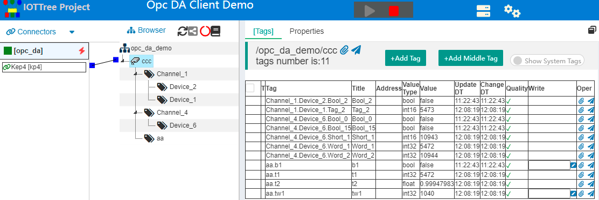
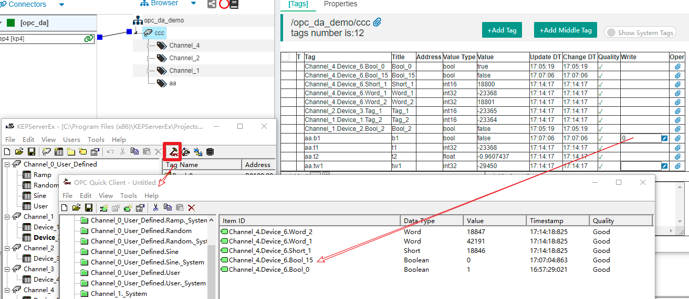

通过OPC DA Client接入数据
==


在很多现场，可能已经有个自动化监控系统，在现有的中控室PC机上已经有个运行多年的组态软件。

你很可能会碰到这样的需求——你需要把这个系统一些设备运行状态接入到你的新系统中，这个系统可能在上级部门或云端的某个服务器中。

前提是，你不能对现有的系统运行造成影响，所以你难以通过现场的设备接口进行对接，那么我们只剩下中控室的组态软件了。

幸好，当前大部分组态软件都能够提供OPC Server接口，但在一些比较老式x86 32位计算机的上，只能提供OPC DA接口。并且，这个接口由于受到Windows系统的安全限制，无法通过本地局部网络进行访问。最理想的情况是在组态软件的计算机上安装配置相关软件，读取本地的OPC Server接口获取数据，并发送到云端。

这个过程如果你从头实现，那需要解决很多问题。但现在有了IOT-Tree Server，这件事就变得很简单了。

IOT-Tree Server专门针对x86 32位windows提供了一个支持OPC DA接入的版本，你可以通过这个版本快速的解决以上需求。

本例子使用KEPServerEx V4作为OPC Server，用来模拟组态软件提供的OPC Server。然后，通过IOT-Tree Server进行数据接入、组织、绑定和映射。


# 1 环境准备

## 1.1 安装配置KEPServerEx V4

请到KEPServerEx官网获取此软件，并根据提示安装启动。

在主管理界面中，打开KEPServerEx安装目录下面的 "\KEPServerEx\Projects\simdemo.opf"，这是一个软件自带的演示OPC配置文件，相关的通道、设备和数据组织如下图所示：


如果你已经有组态软件或其他OPC Server软件，那么此步骤可以省略。但如果你希望详细掌握IOT-Tree Server对OPC DA的支持，请照着这个案例来吧。


## 1.2 安装配置IOT-Tree Server

请获取"iot-tree-x.xx.x-winjre8x86.zip"对应的IOT-Tree Server包，这个安装包整合了OpenJDK x86 32位版本的jre，这样可以在一些windows32位的系统上运行。

安装过程请参考[快速开始][quick_start]


# 2 配置和测试

启动IOT-Tree Server并进入管理界面之后，我们开始相关的项目配置。


## 2.1 新建项目

我们新建项目,如下图：


```
Name=opc_da_demo
Title=OPC DA Client Demo
```


## 2.2 新增OPC DA Client链接器

点击项目标题，进入项目配置管理主界面，在"Connectors"菜单，点击"OPC DA Client"，然后在弹出的窗口填写相关参数。其中，"OpcHost=localhost"代表本机；"Program ID"会列举出本机所有的"OPC Server Id",你选中KEPware V4这个内容即可。如下图：


点击确定之后，你可以看到在Connectors下方，出现了这个连接项。


## 2.3 新增通道(Channel)并关联Connector

在Browser下方的项目根节点，鼠标右键，选择"New Channel"，在弹出的窗口，填写"Name=ccc",其他都不需要填写内容，如下图：


你会发现，在新增的通道左边会有个小正方形，而左边的"Connector kp4"右边也有个小正方形，鼠标点击其中一个，拖拉线条到另一个，就可以建立这两个内容的关联。如下图：


## 2.4 直接绑定复制OPC Server中的部分定义

通过以上简单的步骤，你已经为接入和通道做好了准备，接下来就可以考虑利用OPC Server中的哪些数据了。

IOT-Tree Server可以直接复制OPC Server中的数据层次，并在关联的通道下面建立对应的层次和Tag定义。

鼠标右键Connectors下面的kp4，点击"Bind"。在弹出的窗口中，我们可以看到，左边部分列举了所有的OPC Server能够提供的数据节点。你可以点击上方的树形转换按钮，使得左边以层次方式展示。如下图：


在窗口右上方有个"Bind Copy"选择框，您可以选择左边的组织节点，并点击对应的向右按钮进行选择。

按着"Ctrl"键，鼠标点击"Channel_4.Device_6，Channel_1.Device_1.Tag_2,Channel_1.Device_2.Bool_2,Channel_2.Bool_2"进行多选；然后点击"Bind Copy"左边的向右按钮进行复制，如下图：


此时，你已经选择了一部分节点。其中，如果是叶子节点，则直接对应Tag标签，后面会带数值类型。如果是分组节点，则代表此节点下面的所有内容都会被复制。点击此列表框上面"create tag groups and tags"按钮，系统会根据你的当前选择，对关联的通道下面自动复制建立相同的层次结构。

如下图：


点击确定保存信息，然后刷新此项目管理主界面，你会发现在通道"ccc"下面已经复制了相关层次内容，并且Tag列表也同样建立。此时，你启动项目就会发现，这些自动创建的内容已经能够获取数据

如下图:


非常简单，对吧。不过问题来了，这个结构可能是你对接的老系统定义的，你希望在你的IOT-Tree Server中定义你自己的层次结构和Tag名称，然后把老系统中的数据映射到你自己创建的Tag中。


## 2.5 映射绑定获取OPC Server中的数据

停止运行项目，然后在ccc通道下面新增如下自定义Tag Group以及下面的Tag内容。

鼠标右键ccc，选择"New Tag Group"，新增此节点名称为"aa"。点击此节点"aa",在主内容区，选择"[Tags]",并通过"+Add Tag"按钮新增如下Tag。我们对Tag填写名称和值类型，并且对"b1"、"tw1"选择"Read/Write"。如下图：


以上我们准备好了自己的层次和Tag。接下来，我们把OPC Server中的一些内容映射过来。

鼠标右键Connectors下面的kp4，选择Bind重新打开刚才的设置窗口。你会发现，在窗口右下角"Bind Map"区域已经有了一半的内容。这些内容处在"Tags in Channel"下面，左边"Map Binded"是空的，等待我们来绑定。

我们，选择第一行"aa.b1"，然后在左边选择叶子节点"Channel_4.Device_6.Bool_15",然后点击对应的右箭头按钮，进行绑定，如下图所示：


同样的，我们对"aa.t1","aa.t2","aa.tw1"分别进行了映射绑定。如下图：


保存之后，我们再次启动项目，此时点击通道"ccc"，你可以看到在右边两种数据获取方式都起作用了。如下图：





## 2.6 反向写入数据

请注意，我们自定义的标签"aa.b1"是可写的。或者，你可以对已经映射或配置好的Tag进行修改，使之从只读"Read Only"改为读写"Read / Write"。然后，你可以在Tag类别中，对应行，"Write"列填写并写入。

本例中，"aa.b1"绑定的标签是bool类型，并且在OPC Server变化很慢，我们可以通过绑定IOT-Tree Server中写入新值。然后，在"OPC Quick Client"进行数值变化的观察。

我们打开KEPServerEx管理界面上方的"OPC Quick Client"窗口，并切换到"Channel_4.Device_6"列表，你可以看到"Channel_4_Device_6.Bool_15"对应的值。我们在"IOT-Tree Server"标签列表中，在"aa.b1"写入0，或1值，并观察"OPC Quick Client"窗口中对应值的变化。如下图：





至此，我们已经完成了全部的功能的演示。


# 3 总结建议

很明显，我们可以非常容易地从OPC Server中获取数据，并形成自己一套组织方式。此时，IOT-Tree Server其他数据分享功能就可以发挥作用了。

如，你可以鼠标右键通道"ccc"节点，在弹出菜单中选择"Access"项，你可以发现弹出的URL窗口"http://localhost:9090/opc_da_demo/ccc" 直接输出了非常友好的实时数据json格式。如果的其他系统能够直接访问此url，则可以直接通过这个获取数据。

你也可以定义自己的js插件api，然后在IOT-Tree Server中设置任务，定时向你的云端服务器发送数据。

当然，你可以通过IOT-Tree Server做更多其他事，如新建HMI交互功能，支持手机访问控制等等。所有这些都不需要对你的原有系统做任何修改。


[quick_start]: ../quick_start.md
