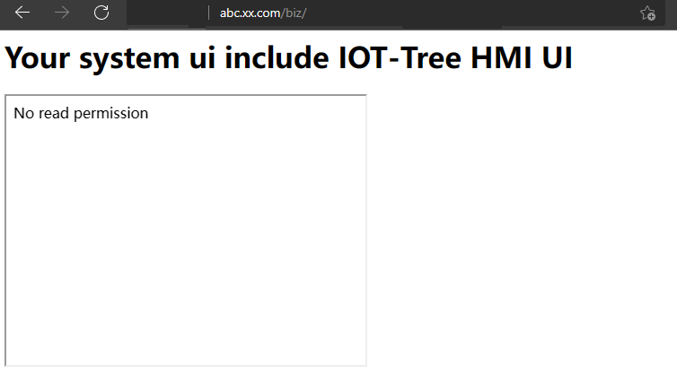
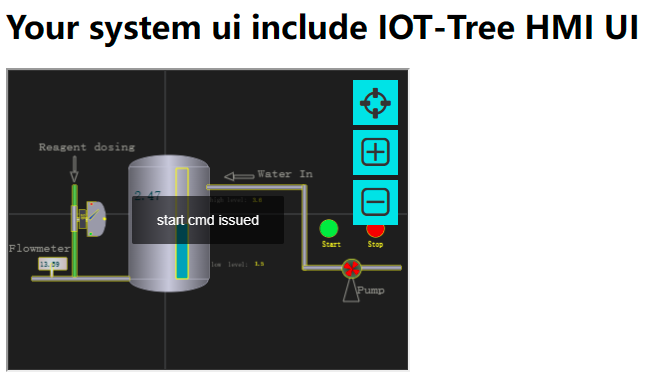

整合HMI画面到你的系统中（含权限插件开发）
==


IOT-Tree Server作为独立运行的Server程序，可以成为你业务系统的后台支持。IOT-Tree Server提供了多种HTTP Restful接口、以及在系统内部在线定制的UI（hmi）监控画面，都可以整合到你的业务系统中。

业务系统可以通过后台开发的一些对接程序，直接调用IOT-Tree Server提供的接口获取数据，但UI界面却不能这么做。最好（也是最简单）的情况是你的业务系统网页通过iframe对"IOT-Tree Server"的"HMI UI"进行直接引用。

那么问题来了，如何限制用户对IOT-Tree Server提供的HMI URL访问，你的业务系统使用你自身的权限机制，如何应用到IOT-Tree Server中。

本例子就是一个解决如上问题全过程说明。
1）本例子实现了一个简单的权限插件，你可以参考改成你的业务系统权限对接即可
2）本例子通过nginx作为http代理整合两个不同端口的http服务（一个是"IOT-Tree Server" 9090端口，一个是基于tomcat的另一个http服务8080端口），通过子域名的方式共享cookie。进行权限验证。


# 1 权限插件的实现

权限插件需要使用java语言进行开发，你必须实现两个类：一个是用户类，另一个主插件类。这两个类的名称你可以自己定义。本例子分别对应为 User，AuthDemo


## 1.1 用户类实现

请看如下代码


```
package com.xxx.plug;

public class User
{
	String id,regName,fullName ;
	
	public User(String id,String regname,String fulln)
	{
		this.id = id ;
		this.regName = regname ;
		this.fullName = fulln ;
	}
	
	/**
	 * unique id  (option method)
	 * 
	 *  
	 * @return
	 */
	public String getId()
	{
		return this.id ;
	}
	
	/**
	 * get registion name (unique name for login)  (must have method)
	 * @return
	 */
	public String getRegName()
	{
		return this.regName ;
	}
	
	/**
	 * get display name (option method)
	 * @return
	 */
	public String getFullName()
	{
		return this.fullName ;
	}
}
```

用户对象用来存放用户验证通过之后对应的用户信息，这个类主要有三个方法："getId"、"getRegName"和"getFullName"。其中，"getRegName"必须存在，这个方法返回当前用户的注册名。

你可以注意到，这个类没有实现任何Java接口，IOT-Tree Server插件机制通过反射实现，会自动寻找对应的方法。这样，你实现插件时，不需要专门引用接口定义。但里面的实现函数（如上面的三个）必须严格按照上面例子代码里面的定义实现。


## 1.2 AutoDemo插件主类实现

请看如下代码：


```
package com.xxx.plug;

import java.io.*;
import java.util.*;

/**
 * auth demo plugin for
 * IOT-Tree Server
 * 
 * You can implement the methods in this plug-in by sharing data.
 *  For example, through relational database, redis, WebService or other
 *  
 *  
 *  
 *  The key point is that you need to bind the node tree in the IOT-Tree Server 
 *  as a resource with your user system.
 * 
 * @author demo
 *
 */
public class AuthDemo
{
	/**
	 * this method will be called when plug is inited.
	 * you can do some initial work here
	 * 
	 * @param plugdir
	 * @param params
	 * @throws Exception
	 */
	void init_plug(File plugdir, HashMap<String, String> params) throws Exception
	{
		
	}
	
	/**
	 * option method
	 * 
	 * when you access http://iot_tree_server_host:port/admin,you must login by register name and password
	 * 
	 *  if this method is here,the default user authentication provided by the system will be ignored.
	 *  
	 *  
	 * @param reg_name
	 * @param password
	 * @return
	 */
	public User checkAdminUser(String reg_name,String password)
	{
		if("admin".equals(reg_name) && "123456".equals(password))
			return new User("","admin","Adminstrator") ;
		
		return null ;
	}

	/**
	 * Obtain user information according to the token
	 * 
	 * @param token provided by page cookie or other ways
	 * @return
	 */
	public User checkUserByToken(String token)
	{
		if(token==null||"".equals(token))
			return null ;
		
		if(token.startsWith("user1"))
			return new User("","user1","User1") ;
		else if(token.startsWith("admin"))
			return new User("","admin","Adminstrator") ;
		return null ;
	}
	
	/**
	 * this method will be called when outer will access node path in iottree like /prjname/n1/u1
	 * 
	 * The node related to this path may be a context node that returns JSON data. 
	 * Or the HMI UI node outputs the UI picture
	 * 
	 * @param node_path  like /prjname/n1   /prjname/n1/u1
	 * @param reg_name login user name or null or empty
	 * @return
	 */
	public boolean checkReadRight(String node_path,String reg_name)
	{
		if("admin".equals(reg_name)||"user1".equals(reg_name))
			return true ;
		return false;
	}
	
	/**
	 * this method will be called when outer will write some data to node path in iottree like /prjname/n1/u1
	 * 
	 * this may be update some tag value in node or send cmd in hmi
	 * 
	 * @param node_path
	 * @param reg_name
	 * @return
	 */
	public boolean checkWriteRight(String node_path,String reg_name)
	{
		if("admin".equals(reg_name))
			return true ;
		return false;
	}
}

```

和User类似，主插件类也不需要实现任何Java接口，只需要严格实现对应的函数即可。下面根据函数分别说明


### 1.2.1 init_plug


init_plug方法在插件装载初始化的时候会被调用，系统会把插件部署的目录和参数作为此函数的输入。你可以在此做一些初始化准备工作。如你的权限验证如果需要访问数据库，则可以在此初始化数据库访问准备工作。


### 1.2.2 checkAdminUser


此函数如果实现，则代表"IOT-Tree Server"自身的管理权限验证会被替代（这个管理入口是"http://iot_tree_server_host:port/admin"）。这个函数要求输入用户注册名和密码，如果验证通过，则返回User对象，如果验证失败，返回null即可。

本例子实现非常简单，只做了字符串匹配判断。你可以根据自己的业务系统权限机制进行实现。


### 1.2.3 checkUserByToken


此函数必须实现，根据输入的token字符串参数获取用户信息，这个token可以通过共享cookie或其他方式进行传递。你的业务系统用户登录之后，就会生成一个临时的token，当前用户信息就应该和这个token进行关联，并存放在特定的地方（如业务系统内存、关系数据库或redis）。

如果token有效能够定位到对应的用户信息，则返回User对象，否则返回null即可。

本例子的实现只是为了说明插件机制，实现仅仅通过token的前缀进行判断，你实际系统可不能这么做。


### 1.2.4 checkReadRight


此函数实现用来判断某个用户是否对某个IOT-Tree 节点有读取权限。第一个参数是节点路径，对于一个部署的IOT-Tree Server来说，这个路径形如：/prjname/n1   /prjname/n1/u1。第二个参数就是用户注册名。

如对于hmi节点对应的路径/prjname/n1/u1可以直接支持HMI UI的显示，这个链接可以被iframe包含到你的业务系统中。如果此权限判断失败，则就会输出没有权限进行展示的提示。

又如:/prjname/n1节点内部包含很多上下文数据（Tag数据），外界通过此路径访问，可以获得节点下面的所有Tag数据的json格式。同样的，此输出也会受到此函数判定结果的影响。


### 1.2.5 checkWriteRight


此函数实现用来判断某个用户是否对某个IOT-Tree 节点有写权限。第一个参数是节点路径，对于一个部署的IOT-Tree Server来说，这个路径形如：/prjname/n1   /prjname/n1/u1。第二个参数就是用户注册名。

如对于hmi节点，写权限对应与在界面上对服务端提交数据（包含指令等）。如果此权限判断失败，则就会提示没有写权限。


## 1.3 部署权限插件

### 1.3.1 部署插件文件

在"IOT-Tree Server"安装目录下面，对应目录"$IOT_TREE/data/plugins" 下面建立一个新目录"auth_demo",并在此目录下面建立如下目录和文件，如图所示：


其中，"classes"目录是插件可能用到的java类，而lib是插件运行可能需要的jar依赖文件。

你可以把以上"User"类和"AuthDemo"编译之后的类放入classes目录下面（注意类对应的包名和相关的子目录com/xxx/plug/*.class）。或者你可以把这些编译之后的文件打包成一个jar，放入lib中。

接着，你编辑"config.json"文件如下：


```
{
"name":"auth_demo","title":"Auth Plug,a demo for auth",
"js_api":[
	],

"auth":[
	{name:"auth_demo",class:"com.xxx.plug.AuthDemo"}
	]
}
```

文件json最外层"name title"是插件名称和标题。而"auth"插件里面的name,class分别对应插件名称和对应的插件类。

此时，你的插件文件部署已经完成。你启动"IOT-Tree Server"，会发现插件还是不起作用，因为插件目录下面可能会部署了很多种插件，如果全部启动那就乱套了。


### 1.3.2 修改配置文件

在插件目录下面放置了文件还不够，我们还需要修改IOT-Tree Server安装目录下面的"config.xml"文件,增加plug_auth配置


```
<?xml version="1.0" encoding="utf-8"?>
<iottree ... >

	<plug_auth name="auth_demo">
	</plug_auth>

</iottree>
```

其中，"plug_auth"的name属性为"auth_demo",这个是我们在部署文件目录下面"config.json"中定义好的插件名称。有了这个，IOT-Tree Server就会启用这个插件了。


### 1.3.3 启动测试

我们的"IOT-Tree Server"部署监听9090端口。重新启动"IOT-Tree Server"之后，你再次登录管理界面，你会发现登录受到"checkAdminUser"实现的限制，只能"admin"使用密码"123456"才能登录。

接下来，我们开始尝试把"HMI UI"整合到你的业务系统中。


# 2 共享Cookie整合"HMI UI"

IOT-Tree Server在9090端口上已经存在，我们在上面导入运行自动化演示项目，此项目请参考[case_auto]。

使用另外一个Tomcat运行在8080端口作为你的业务系统，

使用ngnix作为统一http代理入口，使用80端口。并且使用子域名机制共享cookie。


## 2.1 准备环境

### 2.1.1 域名和ngnix配置

（1）域名设置

我们准备两个域名"abc.xx.com" 和 "iot.xx.com"他们最终会通过ngnix分别指向我们内部的两个系统。"abc.xx.com"指向"localhost:8080"的tomcat实现的业务系统，"iot.xx.com"指向localhost:9090的"IOT-Tree Server"。

为了模拟这两个域名都解析成127.0.0.1这个本地ip地址，我们需要修改 windows安装目录/system32/drivers/etc/hosts文件。

请用超级管理员打开记事本，然后在打开这个hosts文件，在最下面增加两行：


```
127.0.0.1 iot.xx.com
127.0.0.1 abc.xx.com
```

保存之后，打开cmd窗口，使用ping iot.xx.com查看域名解析效果。你会发现这两个域名都指向了127.0.0.1。

（2）nginx安装配置

请到http://nginx.org/ 下载安装nginx，在conf目录下面修改nginx.conf文件。在里面server配置下面新增如下配置：


```
    server {
        listen       80;
        server_name  iot.xx.com;
		charset utf-8;
        location / {
			proxy_pass http://localhost:9090;
            root   html;
            index  index.html index.htm index.jsp;
			
			proxy_http_version  1.1;
			proxy_set_header Upgrade $http_upgrade;
			proxy_set_header Connection "upgrade";
        }
	}
	
	server {
        listen       80;
        server_name  abc.xx.com;
        location / {
		proxy_pass http://localhost:8080;
            root   html;
            index  index.html index.htm index.jsp;
        }
	}
```

这两部分的配置使得"iot.xx.com" 和 "abc.xx.com"两个域名在访问时，分别会被nginx指向不同的内部服务。

启动nginx之后，通过浏览器访问"abc.xx.com"时就会指向"localhost:8080"的业务系统，通过"iot.xx.com"访问时，就会指向"localhost:9090"的"IOT-Tree Server"。


### 2.1.1 Tomcat业务系统准备

下载安装apache-tomcat。并在webapps目录下面新建biz目录，然后在目录下面新增index.jsp文件。编辑文件如下内容：


```
<%@ page contentType="text/html;charset=UTF-8"%>
<%@ page import="java.util.*,java.io.*,java.net.*"%>
<%
	Cookie ck = new Cookie("token","user1_sdfasdfsafdsad2312323___23");
	ck.setPath("/");
	ck.setDomain("xx.com");
	response.addCookie(ck);
%><html>
<body>
<h1>Your system ui include IOT-Tree HMI UI</h1>
<iframe id="f1" src="http://iot.xx.com/watertank/u1" style="width:400px;height:300px"></iframe>
</body>
</html>
```

此文件运行非常简单，在访问输出时，针对域名"xx.com"和路径"/"设置一个名称为"token"的cookie字符串。同时输出一个简单的页面，内部有个iframe包含"http://iot.xx.com/watertank/u1"。

很明显，内部的"iot.xx.com"相关url也就可以获取此页面写入浏览器的"cookie token"信息。

本例子每次刷新时都会向浏览器写cookie内容，你可以随时修改

运行 "tomcat/bin/"下面的"startup.bat"启动tomcat,然后在浏览器中访问


```
http://abc.xx.com/biz/index.jsp
```

你可以看到页面已经有输出。但我们的IOT-Tree Server还需要再加一点配置。

### 2.1.3 修改IOT-Tree Server的config.xml
修改config.xml中的"plug_auth"元素，如下内容，然后重新启动Server


```
<?xml version="1.0" encoding="utf-8"?>
<iottree ... >
	<plug_auth name="auth_demo" 
			login_url="http://abc.xx.com/login/login.jsp"
			token_cookie_name="token"
			no_read_right_prompt="No read permission"
			no_write_right_prompt="No write permission"
			>
	</plug_auth>
</iottree>
```

其中，token_cookie_name="token"配置信息告诉共享cookie名称为token。这样，在HMI UI显示时会通过此cookie名称获取token。
这样后续就可以通过插件提供的方法，配合此cookie内容进行用户验证。

"no_read_right_prompt"和"no_write_right_prompt"两个属性分别对应读取和写入权限判定失败时的提示，
你可以根据你的需要进行调整。

重新启动之后我们就可以开始测试了。


## 2.2 测试不同的cookie值对应的权限差别

nginx、"IOT-Tree Server"和业务Tomcat都启动之后。我们修改业务tomcat下面文件"biz/index.jsp"。

(1)
对其中的Cookie对象创建代码修改如下：


```
Cookie ck = new Cookie("token","xxx_sdfasdfsafdsad2312323___23");
```

你可以查看1.2节中的实现方法"checkUserByToken"。通过当前这个token值，会无法找到对应的用户，
那么说明任何IOT-Tree中的页面都无法展示。

通过http://abc.xx.com/biz/index.jsp 刷新访问。我们看到如下界面：





你可以看到iframe引用的页面，直接显示"No read permission"。

（2）我们修改代码如下


```
Cookie ck = new Cookie("token","user1_sdfasdfsafdsad2312323___23");
```

此token值，通过"checkUserByToken"会返回user1这个对象，然后我们查看"checkReadRight"这个方法会返回true，
而"checkWriteRight"会返回false。也即是被引用的UI只有只读权限。

保存刷新刚才的界面。我们看到如下：


这个画面显示各个设备运行状态都正常，但你点击启动停止按钮，却可以看到"No write permission"提示。

（3）我们修改代码如下


```
Cookie ck = new Cookie("token","admin_sdfasdfsafdsad2312323___23");
```

此token值，通过"checkUserByToken"会返回admin这个对象，然后我们查看"checkReadRight"这个方法会返回true，
而"checkWriteRight"也会返回true。也即是被引用的UI读写权限都有。

保存刷新刚才的界面。我们看到如下：





这个画面显示各个设备运行状态都正常，并且点击启动停止按钮，可以看到指令下达提示，水泵状态也会跟着变化。


# 3 总结与建议

你可以通过共享数据的方式来实现此插件里面的方法。如通过关系数据库、redis、webservice或其他

关键一点是你需要把"IOT-Tree Server"中的节点树（调用时使用对应的路径字符串）当作资源与你的用户系统权限绑定。

如果你的IOTTree项目很多，手工绑定树节点到对应的用户权限实现有点麻烦。你可以利用"IOT-Tree Server"
支持的扩展属性字典功能，对节点进行属性关联。然后通过上下文接口之间获取全部的节点树（含扩展属性内容）。
这样后续你就可以通过节点和扩展属性的关联进行权限判定。这样，不论你新增加了多数项目，只有扩展属性字典
内容有限，你的权限就能自动支持。


[case_auto]: ./case_auto.md 
