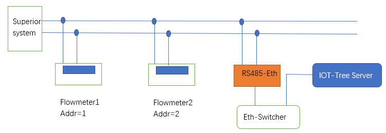
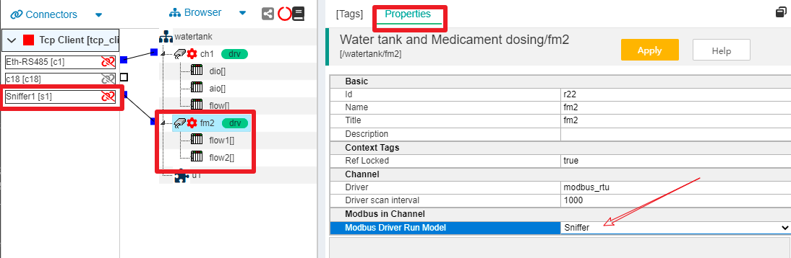

监听RS485总线获取数据
==

# 1 使用情景

在一些工业现场，需要对已经存在一些设备运行数据进行获取，并集成进入新的系统中，这些设备使用RS485 Modbus RTU总线进行通信,并且总线上已经有上位系统占用。

此时，我们可以利用IOT-Tree Server的Modbus RTU驱动对这些设备的数据进行“嗅探”方式进行获取。

# 2 嗅探方式配置

## 2.1 现场设备情况和嗅探接入

如上图，现场总线已经有两个流量计"Flowmeter1"和"Flowmeter2"，并且已经被上位系统"Superior system"轮询调用。

我们通过一个以太网转RS485模块"Eth-RS485"进行接入。为了能够不干扰现有系统运行，我们的设备不允许发送任何数据，所以对接通道单独占用不做任何其他用途。RS485最终透明映射成一个Tcp链接，这个链接单独作为一个通道。以太网转RS485模块运行在Tcp Server（192.168.0.5），并且对接此RS485接口对于的端口为8001。

通过上图的对接，可以看到，只要现有系统的上位系统"Superior system"正常运行，总线上的请求应答数据都可以被"Eth-RS485"接收到。

## 2.2 IOT-Tree Server中的配置

### 2.2.1 接入、通道及设备设置

具体的Tcp Client接入、基于Modbus RTU的通道建立，以及通道下面的设备和数据标签（Tag)设置与正常的配置方法完全一致。

本部分内容你可以参考其他相关文档或例子,如[工业现场自动化系统使用案例][case_auto]。

### 2.2.2 修改通道使驱动运行在Sniffer模式

我们配置了"Tcp Client - Sniffer1"作为TCP连接"Eth-RS485"模块。在项目中单独建立一个通道fm2，以及在通道下面的两个流量计设备，并且配置好流量计流速和累计流量的相关标签(Tags)。

接下来我们点击选中通道fm2节点，在主内容区点击Properties栏目，你可以看到通道下面的"Modbus in Channel"属性项，修改"Modbus Driver Run Model",选择Sniffer模式。

如下图：

保存之后，我们就设置好了全部的内容。启动项目之后，fm2通道的Modbus驱动就运行在Sniffer模式。在此模式下，驱动不会发起任何请求。当总线上的上位系统发起请求，就会被监听，通道下面的驱动会解析监听到的数据，并更新到配置好的Tag中。

[case_auto]: ./case_auto.md
