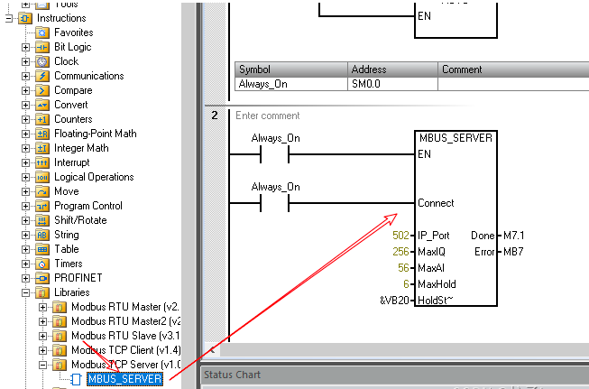
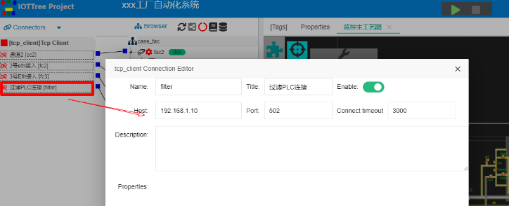
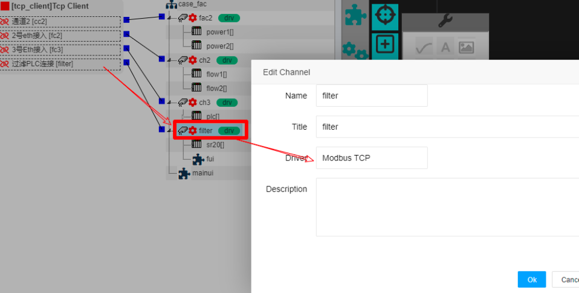
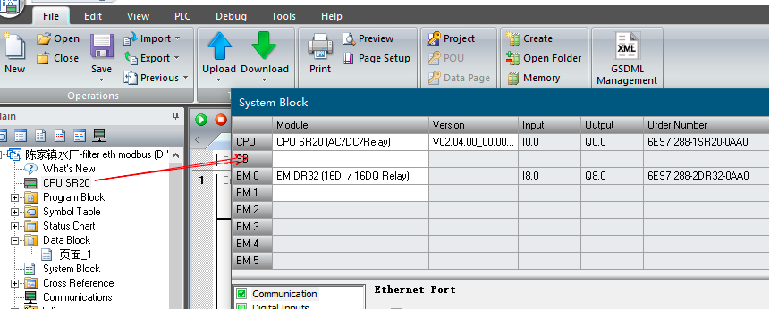
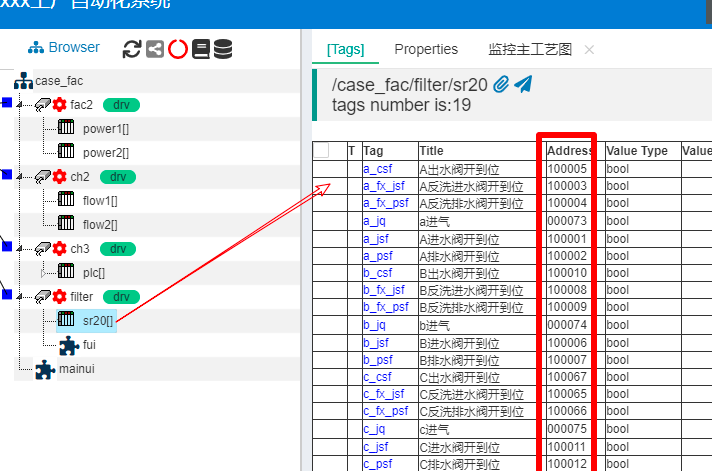
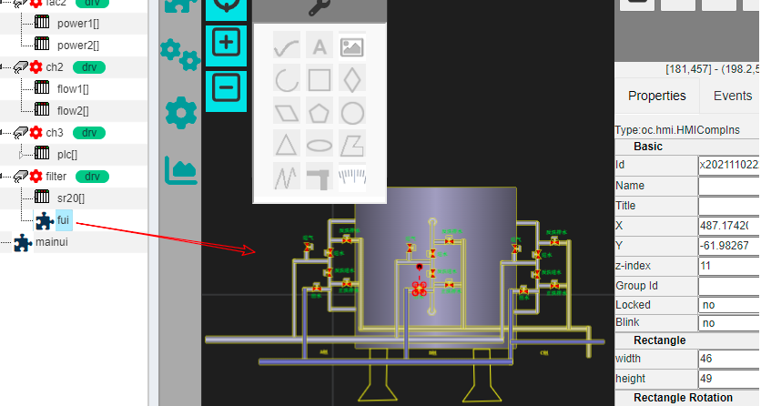
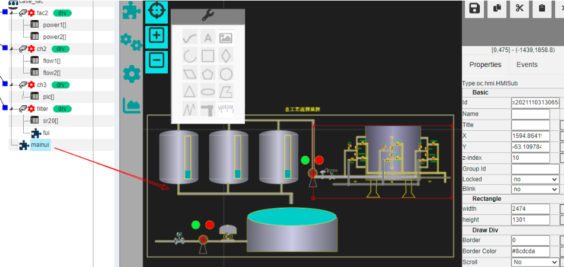

 连接西门子PLC S7-200 Smart
 ==

IOT-Tree内部支持Modbus TCP协议，可以直接通过以太网络和相关设备进行通信。本案例使用这个驱动访问西门子PLC s7-200 Smart。

## 1 案例背景

在现场工业控制中，其中一个环节做过滤处理，现场有个PLC控制柜，使用西门子S7-200 Smart做本地过滤控制，型号为SR20。

整合控制项目除了要接入新安装的一些传感器数据，也需要此PLC接入，最终统一到中控计算机中。

## 2 PLC端接入调整

我们使用的方案是利用SR20的以太网接口，接入中控计算机网络。然后，修改里面的控制程序，增加Modbus Tcp Server的支持。然后，中控计算机使用Modbus Tcp Client进行连接。如下图，我们通过Step7-MicroWIN SMART软件导出SR20的原始程序，然后加入Modbus Tcp Server支持。下载程序之后，就支持对接了。

请注意：S7-200 Smart  Modbus Tcp Server只允许一个Client和它建立连接，超过就会出问题。

本案例中，PLC SR20的ip地址为192.168.1.10，端口502。

## 3 使用IOT-Tree Server连接SR20

在我的IOT-Tree Server项目中，为连接SR20，建立一个Tcp Client连接。如下图所示:

接着，在项目主目录树中，新建了一个通道，并且设定此通道使用Modbus Tcp驱动，然后关联此通道到上面建立的Tcp Client 链接。如下图：

在通道下面建立了一个sr20设备。设置设备地址1。接下来，我们需要在此设备下面添加数据Tag，每个tag都需要设定值类型和对应的地址。这些地址对应SR20的开关量或模拟量值。

先在Step7-MicroWIN SMART查看现场S7-200 Smart CPU和扩展模块对应的点位地址，如下图：

可以看出，现场控制柜中有一个CPU SR20和一个EM DR32扩展模块，以及对应的输入输出起始地址。然后我们查看西门子官方提供的“Modbus地址与CPU中数据区域地址对应关系”，如下表

<table border="1" style="width: 700px;">
	<tbody>
		<tr>
			<th>功能码</th>
			<th>功能描述</th>
			<th>RW</th>
			<th>Addr</th>
			<th>Count</th>
			<th>CPU地址</th>
		</tr>
		<tr>
			<th>01</th>
			<td>读数字量输出 位</td>
			<td>0</td>
			<td>00001-09999</td>
			<td>1-1920 位</td>
			<td>Q0.0-1151.7</td>
		</tr>
		<tr>
			<th>02</th>
			<td>读数字量输入 位</td>
			<td>0</td>
			<td>10001-19999</td>
			<td>1-1920 位</td>
			<td>I0.0-1151.7</td>
		</tr>
		<tr>
			<th>03</th>
			<td>读寄存器 字</td>
			<td>0</td>
			<td>40001-49999
400001-465535</td>
			<td>1-120 字</td>
			<td>V区</td>
		</tr>
		<tr>
			<th>04</th>
			<td>读模拟量输入 字</td>
			<td>0</td>
			<td>30001-39999</td>
			<td>1-120 字</td>
			<td>AIW0-AIW110</td>
		</tr>
		<tr>
			<th>05</th>
			<td>写数字量输出 单个位</td>
			<td>1</td>
			<td>00001-09999</td>
			<td>1位</td>
			<td>Q0.0-Q1151.7</td>
		</tr>
		<tr>
			<th>06</th>
			<td>写寄存器 单个字</td>
			<td>1</td>
			<td>40001-49999
400001-465535</td>
			<td>1个字</td>
			<td>V区</td>
		</tr>
		<tr>
			<th>15</th>
			<td>写数字量输出 多个位</td>
			<td>1</td>
			<td>00001-09999</td>
			<td>1-1920 位</td>
			<td>Q0.0-1151.7</td>
		</tr>
		<tr>
			<th>16</th>
			<td>写寄存器 多个字</td>
			<td>1</td>
			<td>40001-49999
400001-465535</td>
			<td>1-120 字</td>
			<td>V区</td>
		</tr>
	</tbody>
</table>

参考这个表的地址，我们添加了需要读取的对应点位数据：

为了方便使用，在通道filter下面针对此过滤环节，专门建立了一个监控画面——fui,这个画面可以被外面的UI使用。

最后，我们在项目根下面，建立了一个总工艺监控画面——mainui，这个画面引用了过滤系统的fui：

以上就是本案例对接S7-200 smart SR20的过程，并且使之成为项目的一部分。

