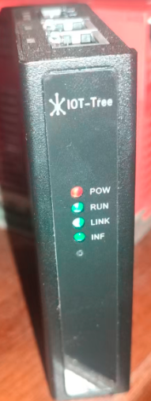

使用IOT-Tree Server制作一个边缘计算设备(Arm Linux)
==


最近实现了一个小项目，现场有多个不同厂家的设备，用户需要对此进行简单的整合，并实现一些联动控制。

我使用了IOT-Tree Server这个软件轻松实现了，不外乎有如下过程：

1）使用Modbus协议对接现有设备，一些设备由于是模拟量信号，通过AD模块做转换，然后也输出Modbus RTU的协议数据。所有设备通过串口服务器模块转换成了以太网接口。最终整合到一个总的控制设备——这个设备就是IOT-Tree Server运行的边缘设备。

2）本项目使用了一个巴掌大小的嵌入式Arm Linux模块，这个模块使用RK3568主控芯片，主频达2GHz，内存容量有2G/4G大小，Linux是Debian版本。可以轻松跑起IOT-Tree Server使用的Java运行环境。

上面对接设备过程本文就不细讲了，你如果不了解可以参考IOT-Tree其他文档。

本文想给你分享的是，我如何安装配置这个Linux设备的，并且是如何实现现场多个设备联动的。


​

​


# 1 Arm Linux设备及安装配置

我使用的Arm Linux设备是正点原子AtomPi-CA1卡片电脑，主要这个带有一个小外壳，很方便现场安装。这板子长成这样，竟然有两个网口，特别方便现场使用——两个网口一个可以对接现场设备，另一个可以接入用户办公环境，不仅可以实现现场控制，也方便办公人员查看设备监控画面，还保证了设备网络和办公网络的隔离。


## 1.1 IOT-Tree的安装配置

由于GitHub上面提供下载release版本，自带的java环境版本都是windows，因此我下载的是iot-tree-xxx.zip文件。文件内部没有对应的java环境，需要自己下载安装。

我使用的是oracle官方网站提供的Linux Arm64对应的压缩包。你可以根据你自己的ARM Linux版本特点，自己安装java运行环境。

我的Linux安装目录如下：


进入iot-tree目录，修改文件iot-tree.sh。只需要修改一行，设置JAVA_HOME为你解压之后的对应jdk目录。


然后运行命令，使这个文件可运行

```
chmod +x iot-tree.sh
```


然后，你就可以直接通过 ./iot-tree.sh命令启动IOT-Tree Server了。但是，我的应用要求设备通电启动之后，IOT-Tree能够自动运行。因此，使用su账号，新增了如下文件：


```
/usr/lib/systemd/system/iot-tree.service
```

```
[Unit]
Description=IOT-Tree Server
After=network.target

[Service]
ExecStart=/home/atom/iot-tree/iot-tree.sh linux_nohup
WorkingDirectory=/home/atom/iot-tree
Restart=always
StandardOutput=append:/home/atom/iot-tree/log/syslog.log
StandardError=append:/home/atom/iot-tree/log/syslog.log
SyslogIdentifier=iot-tree

[Install]
WantedBy=multi-user.target
```


这样，IOT-Tree Server就被配置成了Linux后台运行的服务 。你可以使用如下命令进行服务的管理：
```
重载系统服务：systemctl daemon-reload

设置开机启动：systemctl enable iot-tree

启动服务：systemctl start iot-tree

停止服务：systemctl stop iot-tree

重启服务：systemctl restart iot-tree
```


​[cn]
# 2 嵌入式ARM Linux设备

只要成功运行，这个嵌入式设备就继承了IOT-Tree的全部功能。不仅可以成为功能强大的物联网边缘设备，也可以作为协议网关而存在。

这是我的一个最小体积设备：



