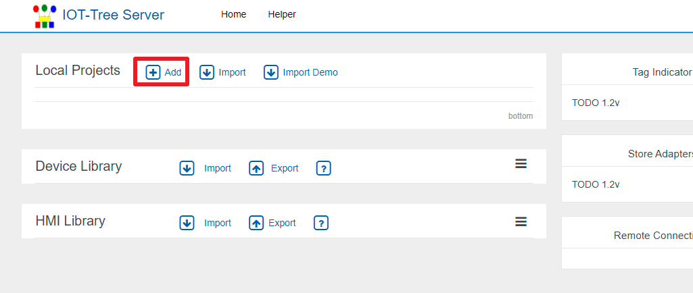
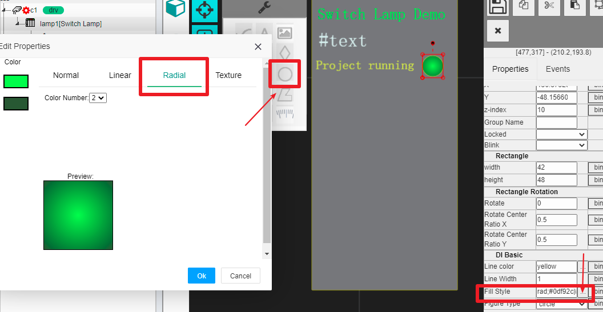
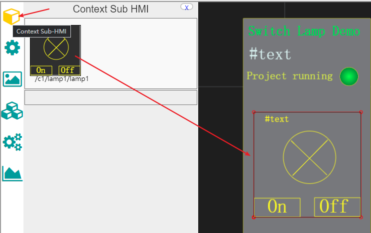
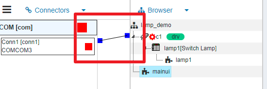

快速了解 - 灯光控制演示
==

# 1 最简单得例子（控制一个灯光）

本文的通过最简单得演示，可以让你在5分钟之内直观了解IOTTree能给你带来的价值。

演示中只有一个灯光，灯光设备通过RS485 Modbus RTU接口提供对接。灯光设备已经在IOTTree中的设备管理中定义，如果你想深入了解设备是如何定义的，那么你需要了解Modbus RTU协议，和[快速理解-设备定义(Device Definition)][qn_devdef]。

如上图,灯光设备接入RS485总线,在我们的演示软件运行在PC端，通过USB-RS485转接也接入RS485总线.这样构成了运行在PC端IOT-Tree Server的主(Master)设备和灯光从设备(Slave)

其中,USB-RS485转接器如下图:

电路非常简单,接下来我们看看IOT-Tree能给我们带来了哪些方便。如果你还没有安装IOT-Tree Server,可以参考[快速入门][qn_start]下载和安装IOT-Tree Server。

# 2 配置项目

## 2.1 登陆管理界面

当你按照配置完成IOT-Tree Server之后，访问 `http://youip:port/admin/ 进入管理界面，如果你是第一次访问管理界面，那么需要设置输入管理员密码。如果已经设置了密码，那么只需要输入密码登陆即可。

点击Local Projects Add按钮，在弹出窗口填写项目名称和标题,如下图：

确定完成之后，我们看到Local Projects下面新增了这个项目条目，如下图：

。

点击此项目，会打开一个新的项目管理浏览器窗口。在此，我们可以开始对项目进行相关的配置。如建立通道、增加接入和添加设备。

## 2.2 建立通道和添加设备

在项目管理窗口中，鼠标右键点击Browser下面的lamp_demo根节点，选择"New Channel"菜单项，在弹出的通道编辑窗口中，填写通道名称、标题和驱动。如下图：

其中，驱动选择Modbus RTU。完成之后，在lamp_demo根节点下面，就会出现这个新增的通道节点。接着，我们鼠标右键此通道节点，选择菜单项"New Device",就可以添加设备了。如下图：

在弹出的设备编辑窗口中，填写设备名称和标题。并且点击设备选择按钮，在弹出的设备选择列表中，选择 "驱动Modbus RTU" - "设备分类Demo" - "设备Switch Lamp"。完成之后，通道c1下面就有了这个设备节点。如下图：

其中，这个设备已经在系统内部定义完成。新增设备之后，设备的数据定义和自带的一个控制开关面板UI都自动进入到项目中。

此时，点击项目根节点lamp_demo，并在主内容区点击[Tags]标签。你会发现项目下面的所有上下文内容，打开Show System Tags开关，你可以看到所有的上下文定义（含系统内部自定义）。如下图：

其中，在项目上下文表格中，你会发现不同层次节点对应的上下文标签以及设备自定义的标签。这些标签在运行时，会有自身的值。这些上下文也即是项目的数据基础，你可以在此基础之上定义更高层的应用节点，如UI、存储策略等。

接下来，我们就在项目下面建立一个监控画面UI。

## 2.3 添加监控UI

鼠标右键项目根节点，选择"New HMI"菜单项，在弹出的编辑窗口中，填写名称和标题。如下图：

确定完成之后，我们会在项目根节点下面看到新增的hmi节点mainui。鼠标右键此节点，选择"Edit UI"菜单，你可以看到在主内容区出现一个新的Main UI编辑标签页。在这里面，我们就可以开始编辑这个ui界面了。如下图：

### 2.3.1 添加背景框

在UI编辑区左上角工具栏中，选择矩形绘画工具，然后在绘图区点击左键，并拉开一个区域，松开左键就在绘图区新建了一个矩形图元。

在绘图区右边属性栏，对width和height两个属性分别填入300和600设定矩形图元的宽度和高度。

对Locked属性选择yes，对图元进行锁定，这样此背景图元就无法进行拖拉移位。

对Fill Style属性编辑框中，输入#77787c。如下图所示：

### 2.3.2 添加显示文字

在工具栏中选择文本图元，并在绘图区点击添加文本图元。通过鼠标拖拉调整尺寸和位置，做相关的排版。

通过属性栏对文本内容、文本颜色和字体进行调修改，最终效果如下：

### 2.3.3 添加项目驱动运行状态

在文本Project running右边，添加一个圆形图元。在选中此图元情况下，点击Fill Style属性值编辑按钮，在弹出的填充风格选择Radial标签，同时选择两种颜色。如下图：

记录下两种填充风格（后续会用到脚本中）：  
1 运行填充风格 圆形梯度 rad;#0df92c|#355730  
2 非运行填充风格 单色 #355730

### 2.3.4 添加设备面板

点击绘图区左边资源栏上下文子HMI图标。显示Context Sub HMI窗口。由于在上下文已经存在了定制设备，并且设备存在一个控制面板子图。这个子图也就同时在项目的上下文中。

鼠标点击拖拽/c1/lamp/lamp1这个子图，并释放到绘图区域。然后基于在背景框调整这个面板子图的排版位置。如下图：

### 2.3.5 绑定上下文数据

我们已经基本准备好了监控画面，接下来可以设置第二个文本框显示系统时间，同时对圆形图元绑定驱动运行状态对应填充颜色变化。

#### 2.3.5.1 在第二个文本框绑定显示时间

如图所示，选中第二个文本框，点击属性text边上的bind按钮，弹出绑定编辑窗口。

在Bind Properties窗口中，选择context tag并点击Tag输入框。在打开的上下文标签选择框中，选择"_date"。确定之后使得第二个文本框绑定了时间字符串标签。如下图：

#### 2.3.5.2 在圆形图元绑定驱动运行状态

与上面类似，选中圆形图元，在Fill Style属性边上点击Bind按钮。

在弹出的窗口中选择js express选项。因为Fill Style要求输入字符串，而上下文中的Tag是个bool值。所以需要根据Tag的bool值输出对应的填充字符串。如下图：

在js express选项中，填写了js脚本。逻辑非常简单，如果驱动标签c1._driver_run._pv的值为true，则输出亮色填充，否则输出暗色填充。

## 2.4 添加串口接入

我们的项目配置接近完成，现在就剩下和外部设备通信了。

我们usb转串口在系统生成了串口COM3。所以，我们只需要建立IOT-Tree Server到COM3的链接。

在项目中左边接入设置Connectors，下拉菜单选择新增串口Connection Provider。在弹出的窗口填写名称和标题。如下图：

添加成功之后，接入列表中出现了串口接入分类，鼠标右键此分类，选择菜单项"Add Connection"，在弹出的串口链接编辑串口填写串口参数。包括名称标题、端口号COM3、波特率等。如下图：

添加成功之后，左边链接新增了一个接入项。此时在Connectors和Browser之间有个关联区域。接着我们需要对接入和通道之间建立关联。点击新增的conn1右边的关联点，拖拽拉出连接线，然后在通道左边的关联点释放，这样就把连接和通道建立了关联。如下图：

# 3 运行项目

在项目配置界面上方点击启动按钮。然后在UI节点mainui鼠标右键，选择菜单项"Access"。系统打开新的浏览器访问窗口。这个窗口链接就是IOT-Tree Server对此UI的对外应用访问窗口。
http://host:port/lamp_demo/mainui。如下图：

外部访问界面如下，这个访问界面也支持移动端。

你可以发现项目启动之后，系统时间会一直变动。点击灯光开关，可以对总线上的灯光进行控制。

[qn_start]: ../quick_start.md
[qn_devdef]: ../quick/quick_know_devdef.md
