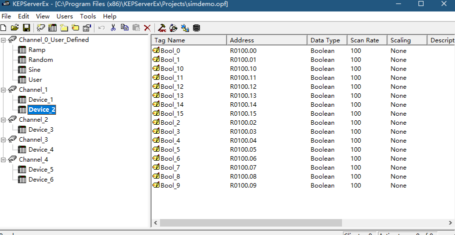
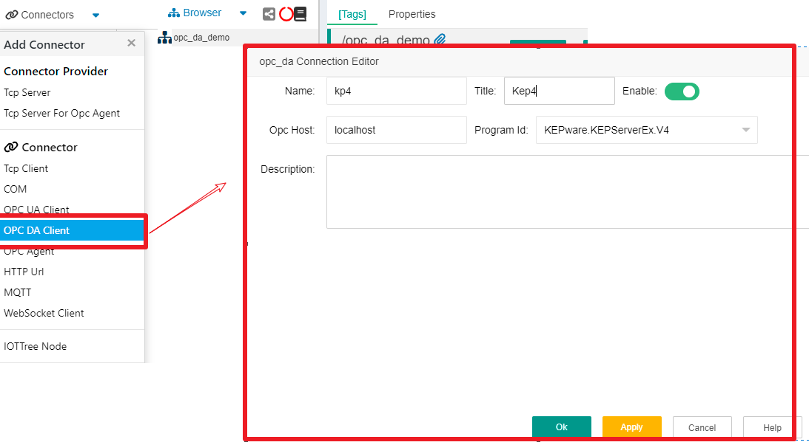
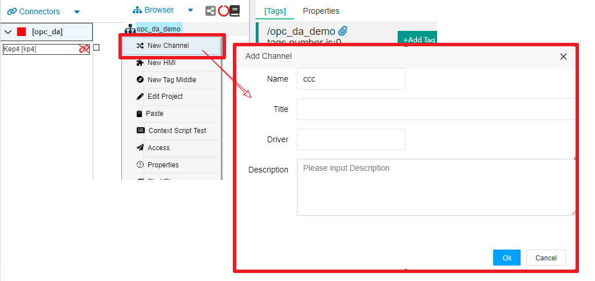
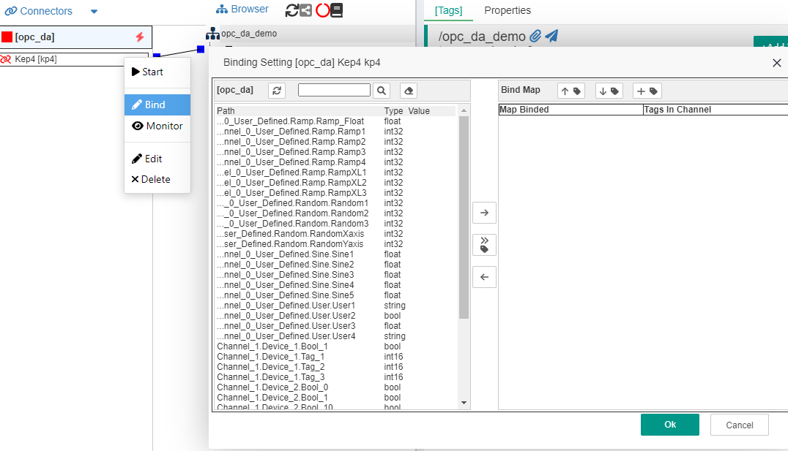
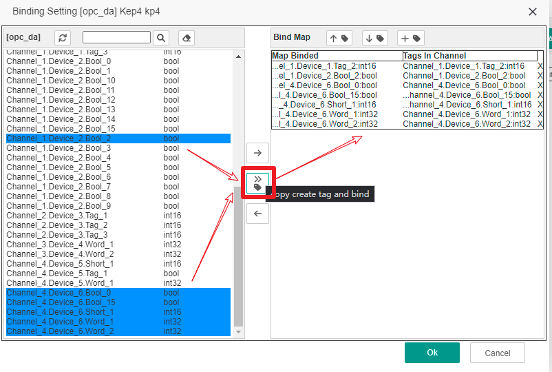
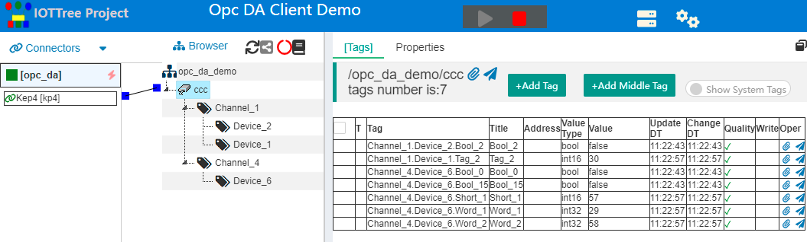
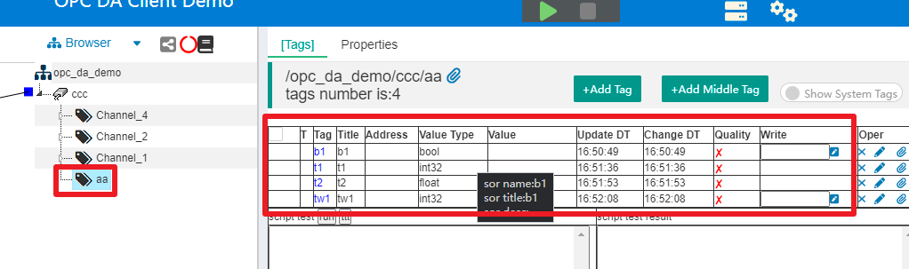
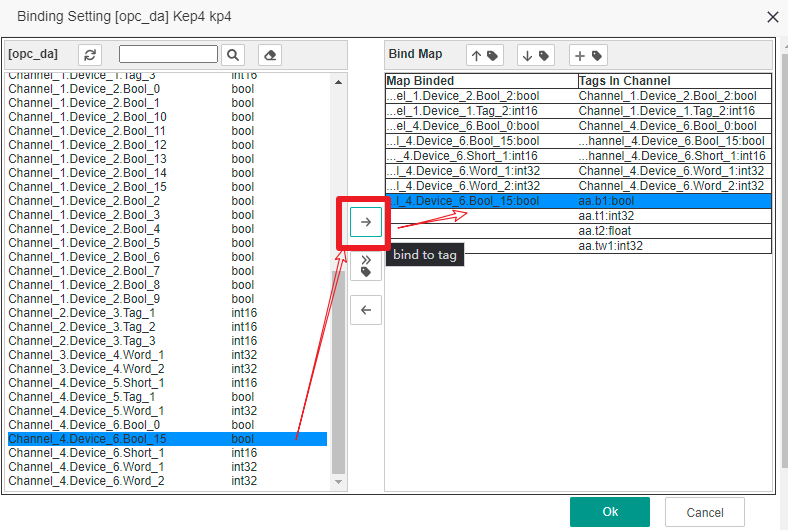

IOTTree的绑定接入（Bind）- OPC DA Client
==


在很多现场，可能已经有个自动化监控系统，在现有的中控室PC机上已经有个运行多年的组态软件。

你很可能会碰到这样的需求——你需要把这个系统一些设备运行状态接入到你的新系统中，这个系统可能在上级部门或云端的某个服务器中。

前提是，你不能对现有的系统运行造成影响，所以你难以通过现场的设备接口进行对接，那么我们只剩下中控室的组态软件了。

幸好，当前大部分组态软件都能够提供OPC Server接口，但在一些比较老式x86 32位计算机的上，只能提供OPC DA接口。并且，这个接口由于受到Windows系统的安全限制，无法通过本地局部网络进行访问。最理想的情况是在组态软件的计算机上安装配置相关软件，读取本地的OPC Server接口获取数据，并发送到云端。

这个过程如果你从头实现，那需要解决很多问题。但现在有了IOT-Tree Server，这件事就变得很简单了。

IOT-Tree Server专门针对x86 32位windows提供了一个支持OPC DA接入的版本，你可以通过这个版本快速的解决以上需求。

本例子使用KEPServerEx V4作为OPC Server，用来模拟组态软件提供的OPC Server。然后，通过IOT-Tree Server进行数据接入、组织、绑定和映射。


# 1 环境准备

## 1.1 安装配置KEPServerEx V4

请到KEPServerEx官网获取此软件，并根据提示安装启动。

在主管理界面中，打开KEPServerEx安装目录下面的 "\KEPServerEx\Projects\simdemo.opf"，这是一个软件自带的演示OPC配置文件，相关的通道、设备和数据组织如下图所示：





如果你已经有组态软件或其他OPC Server软件，那么此步骤可以省略。但如果你希望详细掌握IOT-Tree Server对OPC DA的支持，请照着这个案例来吧。


## 1.2 安装配置IOT-Tree Server

请获取"iot-tree-x.xx.x-winjre8x86.zip"对应的IOT-Tree Server包，这个安装包整合了OpenJDK x86 32位版本的jre，这样可以在一些windows32位的系统上运行。

安装过程请参考[快速开始][quick_start]

特别注意，如果您没有使用本例子中的OPC服务，其他OPC服务程序很可能需要使用超级管理员的权限来访问。此时，确保您启动IOT-Tree Server的当前用户为超级管理员，主要有两种方式：
1）如果你使用命令方式启动IOT-Tree Server，鼠标右键iot-tree.bat，选择"以管理员身份运行"。或者你以管理员身份打开一个命令窗口，然后运行iot-tree.bat。
2）如果您已经把IOT-Tree Server注册成windows服务，那么请打开服务管理（命令services.msc），找到IOT-Tree Server服务项，双击打开参数配置，在"登录"内容中，选择超级管理员账号和密码,确保服务以管理员的身份启动。


# 2 配置和测试

启动IOT-Tree Server并进入管理界面之后，我们开始相关的项目配置。


## 2.1 新建项目

我们新建项目,如下图：


```
Name=opc_da_demo
Title=OPC DA Client Demo
```


## 2.2 新增OPC DA Client链接器

点击项目标题，进入项目配置管理主界面，在"Connectors"菜单，点击"OPC DA Client"，然后在弹出的窗口填写相关参数。其中，"OpcHost=localhost"代表本机；"Program ID"会列举出本机所有的"OPC Server Id",你选中KEPware V4这个内容即可。如下图：





点击确定之后，你可以看到在Connectors下方，出现了这个连接项。


## 2.3 新增通道(Channel)并关联Connector

在Browser下方的项目根节点，鼠标右键，选择"New Channel"，在弹出的窗口，填写"Name=ccc",其他都不需要填写内容，如下图：





你会发现，在新增的通道左边会有个小正方形，而左边的"Connector kp4"右边也有个小正方形，鼠标点击其中一个，拖拉线条到另一个，就可以建立这两个内容的关联。如下图：


## 2.4 绑定或复制OPC Server中的内容到通道下面

通过以上简单的步骤，你已经为接入和通道做好了准备，接下来就可以考虑利用OPC Server中的哪些数据了。

IOT-Tree Server通过映射（Map）方式使得Opc Server中的内容和通道下面的Tag节点建立关联关系。首先我们看看添加的OPC DA Client链接能给我们带来什么内容。

鼠标右键Connectors下面的kp4，点击"Bind"。在弹出的窗口中，我们可以看到，左边部分列举了所有的OPC Server能够提供的数据节点。如下图：





你可以在弹出窗口的左边，看到OPC Server相关的所有数据列表和类型信息。右边就是绑定内容区域。此时，因为在关联的通道ccc下面并没有任何标签Tag，所以显示空白。

此时，你可能希望直接复制左边的数据（含层次信息）到通道ccc下面，那么你可以选中左边需要被复制的数据项，点击中间"copy create tag and bind"按钮。此时，你可以在右边出现一个绑定数据项，被绑定数据项和通道下面的Tag内容相同。

请按着"Ctrl"键，在左边以此多选如下节点"Channel_4.Device_6.*, Channel_1.Device_1.Tag_2, Channel_1.Device_2.Bool_2"；然后点击点击中间"copy create tag and bind"按钮，结果如下图：





点击弹出窗口"Ok"按钮，IOT-Tree Server会根据上面的映射关系，自动在通道ccc下面建立相关的标签组和对应的标签。请刷新Browser的树型结构，你可以看到如下结果：


此时，你启动项目就会发现，这些自动创建的内容已经能够获取数据

如下图:





非常简单，对吧。不过问题来了，这个结构可能是你对接的老系统定义的，你希望在你的IOT-Tree Server中定义你自己的层次结构和Tag名称，然后把老系统中的数据映射到你自己创建的Tag中。

另外，您可能会发现，IOT-Tree Server中的所有节点名称都必须符合编程变量规范，只能是A-Z a-z 和数字等组合。如果被绑定的路径包含非法字符，那么直接复制层次结构，并且自动建立相关节点变得不可能。此时，你也只能自己创建Tag，并且通过映射方式获取数据值。


## 2.5 映射绑定获取OPC Server中的数据

停止运行项目，然后在ccc通道下面新增如下自定义Tag Group以及下面的Tag内容。

鼠标右键ccc，选择"New Tag Group"，新增此节点名称为"aa"。点击此节点"aa",在主内容区，选择"[Tags]",并通过"+Add Tag"按钮新增如下Tag。我们对Tag填写名称和值类型，并且对"b1"、"tw1"选择"Read/Write"。如下图：





以上我们准备好了自己的层次和Tag。接下来，我们把OPC Server中的一些内容映射过来。

鼠标右键Connectors下面的kp4，选择Bind重新打开刚才的设置窗口。你会发现，在窗口右边多了一些数据项，这些内容处在"Tags in Channel"下面，左边"Map Binded"是空的，等待我们来绑定。

我们，选择第一行"aa.b1"，然后在左边选择"Channel_4.Device_6.Bool_15",然后点击对应的右箭头按钮，进行绑定，如下图所示：





同样的，我们对"aa.t1","aa.t2","aa.tw1"分别进行了映射绑定。如下图：


保存之后，我们再次启动项目，此时点击通道"ccc"，你可以看到在右边两种数据获取方式都起作用了。如下图：


## 2.6 反向写入数据

请注意，我们自定义的标签"aa.b1"是可写的。或者，你可以对已经映射或配置好的Tag进行修改，使之从只读"Read Only"改为读写"Read / Write"。然后，你可以在Tag类别中，对应行，"Write"列填写并写入。

本例中，"aa.b1"绑定的标签是bool类型，并且在OPC Server变化很慢，我们可以通过绑定IOT-Tree Server中写入新值。然后，在"OPC Quick Client"进行数值变化的观察。

我们打开KEPServerEx管理界面上方的"OPC Quick Client"窗口，并切换到"Channel_4.Device_6"列表，你可以看到"Channel_4_Device_6.Bool_15"对应的值。我们在"IOT-Tree Server"标签列表中，在"aa.b1"写入0，或1值，并观察"OPC Quick Client"窗口中对应值的变化。如下图：


至此，我们已经完成了全部的功能的演示。


# 3 总结建议

很明显，我们可以非常容易地从OPC Server中获取数据，并形成自己一套组织方式。此时，IOT-Tree Server其他数据分享功能就可以发挥作用了。

如，你可以鼠标右键通道"ccc"节点，在弹出菜单中选择"Access"项，你可以发现弹出的URL窗口"http://localhost:9090/opc_da_demo/ccc" 直接输出了非常友好的实时数据json格式。如果的其他系统能够直接访问此url，则可以直接通过这个获取数据。

你也可以定义自己的js插件api，然后在IOT-Tree Server中设置任务，定时向你的云端服务器发送数据。

当然，你可以通过IOT-Tree Server做更多其他事，如新建HMI交互功能，支持手机访问控制等等。所有这些都不需要对你的原有系统做任何修改。


[quick_start]: ../quick_start.md
