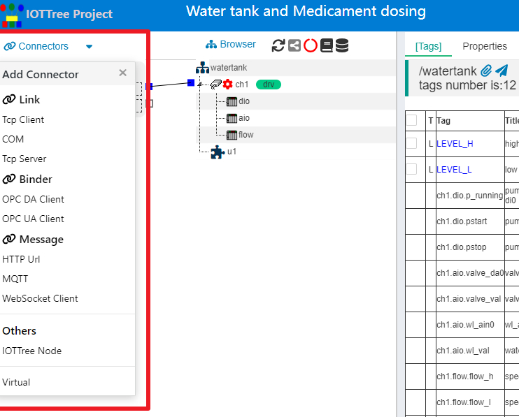
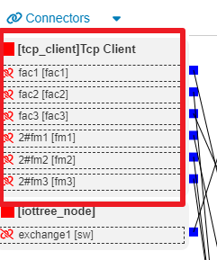
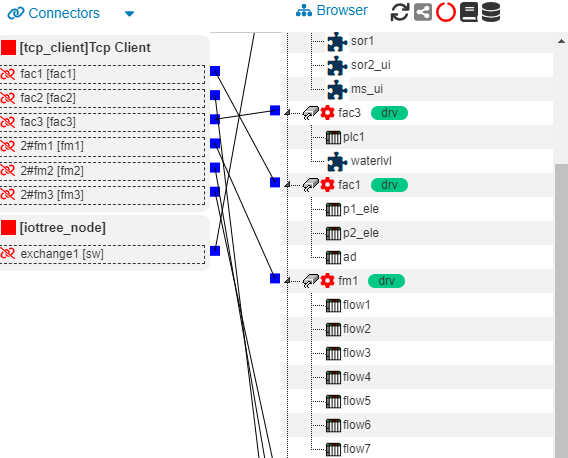
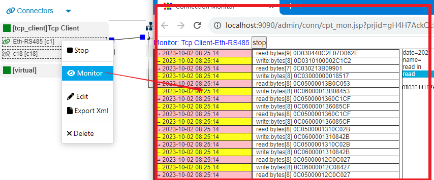
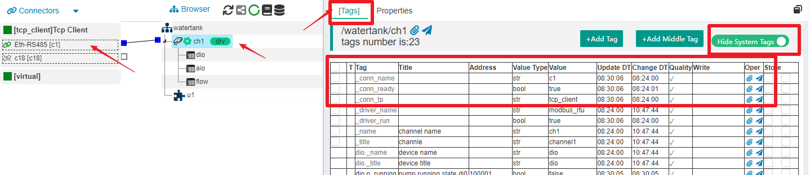

IOT-Tree的接入（Connector）
==

IOT-Tree的接入作为一个重要的组成部分而存在，如果你总体上已经比较了解，可以快速通过如下内容，查看不同接入的详细说明。

<a href="./link_tcpclient.md" target="main">&nbsp;&nbsp;&nbsp;链路-Tcp Client</a>

<a href="./link_tcpserver.md" target="main">&nbsp;&nbsp;&nbsp;链路-Tcp Server</a>

<a href="./link_com.md" target="main">&nbsp;&nbsp;&nbsp;链路-串口(COM)</a>

<a href="./bind_opcda.md" target="main">&nbsp;&nbsp;&nbsp;绑定 - OPC DA</a>

<a href="./bind_opcua.md" target="main">&nbsp;&nbsp;&nbsp;绑定 - OPC UA</a>

<a href="./msg_mqtt.md" target="main">&nbsp;&nbsp;&nbsp;消息 - MQTT</a>

<a href="./msg_http_url.md" target="main">&nbsp;&nbsp;&nbsp;消息 - HTTP URL</a>

<a href="./msg_http_url_html.md" target="main">&nbsp;&nbsp;&nbsp;消息 - HTTP URL HTML</a>

<a href="./msg_websocket.md" target="main">&nbsp;&nbsp;&nbsp;消息 - WebSocket Client</a>

<a href="./other_iottree_node.md" target="main">&nbsp;&nbsp;&nbsp;其他 - IOTTree Node</a>

<a href="./other_virtual.md" target="main">&nbsp;&nbsp;&nbsp;其他 - Virtual</a>

## 0 IOTTree的数据接入和整合能力

在大多数现有的OPC软件，对于各种设备的接入以驱动为基础，不同驱动内部提供各自的配置支持。其中，设备通信所需要的相关参数和其他参数一样，也由各自的驱动决定。

我们研究了大量设备和物联网应用，发现设备通信如果能够从驱动独立出来，则不仅可以简化驱动的实现，同时还可以带来更灵活的组合配置支持。

也即是，在IOT-Tree架构中，接入（Connector）也由专门的驱动提供，这样可以根据需要独断扩展。当然，当今的系统最多的接入是基于TCP/IP协议，以及在此之上的http等内容。我们已经能够支持Tcp Client、Tcp Server、HTTP Url接入。

又如：mqtt协议虽然也可以基于tcp，但此协议比较特殊，我们也专门做了接入驱动支持。

在一些本地系统中，系统可能通过RS232或RS485接口和现场设备通信，在计算机内容则体现为COM接口，IOT-Tree也为此专门做一些支持。

## 1 接入管理

在IOTTree的每个project中，如果进入管理界面，则可以直接看到最左边的内容就是接入区块。点击左上角Connectors菜单，可以看到系统能够支持的所有接入内容，如下图：

可以看到当前支持的接入已经比较丰富，并且可以随着后续不断添加更多驱动支持。

## 2 单个接入驱动的层次关系

在项目中，接入从组织上分为两个层次：ConnProvider（接入提供者）和ConnPt（接入点Connection Point）。 ConnProvider代表了某个驱动下面的具体接入提供者，可以有多个或单个。ConnProvider下面则可以有多个ConnPt，代表了多个具体接入。

例如1，如下图：

Tcp Client是个ConnProvider，下面可以有多个ConnPt，每个ConnPt对应具体的Tcp Connection。
同理可以想象：如果某个ConnProvider是一个Tcp Server（内部监听某个端口），那么下面也可能会有多个ConnPt代表着每个远端Client和我们本机建立的Tcp连接。

每个ConnProvider内部都会有个独立的管理线程，对此下面的所有ConnPt进行统一管理。这样，IOTTree的接入管理和内部运行机制就会变的很清晰，此部分内容我们会在后续进行详细说明。

## 3 从ConnPt到通道Channel建立关联

IOT-Tree规定，接入到项目具体组织的关联只能通过ConnPt和Channel之间进行，这样的限制不仅能够满足实际项目需要，同时也保证了每个项目数据流的简洁。如下图：

你可以看着上面的图想象一下，如果没有这个限制，左边接入两个层次树和右边项目组织更复杂的树形直接任意建立关联（建立数据流），那会是一个什么样的情景——这肯定会乱成一锅粥。不仅实现复杂，而且会让使用者摸不着头脑。

很明显，适当合理的限制，会给一个复杂系统带来很大的益处。

事实上，IOT-Tree也规定了设备驱动也必须和Channel关联，而设备驱动和通信（接入的ConnPt）息息相关。因此，此限定还是很有依据的。

## 4 根据接入特点进行分类：链路(link),绑定(bind)和消息(Message)

既然我们已经把接入进行单独管理。那么我们有必要对具体的数据来源方式和特征（模式）进行抽象，并针对不同的情况做不同的接入配置和处理支持。很明显，目前我们发现接入的数据至少有三种模式：链路(link),绑定(bind)和消息(Message)。下面我们分别进行简单说明。

### 4.1 链路(link)

接入设备或程序到IOTTree直接会建立一个链路通道进行数据交互。如Tcp链路、RS485串行链路等。一般情况下，设备和IOTTree建立此链路之后会被一直保持，双方通过双向或半双工方式进行数据收发。目前此方式下面的驱动有：Tcp Client、Tcp Server和COM。

对于此类接入来说，链路之上的数据传输还有着更多的协议限定，这些协议限定和具体设备支持有关。如基于RS485的Modbus协议、基于Tcp链接的Modbus TCP协议。此时，一般情况下都需要在关联通道中设定对应的设备驱动，这些设备驱动会共用这些接入链路资源，进行更高级的协议数据传输。

接入设备或程序到IOTTree直接会建立一个链路通道进行数据交互。如Tcp链路、RS485串行链路等。一般情况下，设备和IOTTree建立此链路之后会被一直保持，双方通过双向或半双工方式进行数据收发。目前此方式下面的驱动有：Tcp Client、Tcp Server和COM。

在工业现场，有很大一部分设备支持现场总线，如基于简单的RS485总线（只需要两芯电缆就可以支持）和以此基础的Modbus RTU协议，总线上面有多个设备。其中一个是主设备，其他设备是从设备。主设备对每个从设备定时发起轮询请求，从设备根据收到的请求进行判断和应答。同一时刻，总线上只有一个设备发送数据。对于主设备来说，这个总线就是一个链路。

还有很多物联网应用场合，有很多个监测采集点分散在一个区域内，每个监测采集点都会有若干传感器从设备和一个主设备，他们之间通过RS485总线Modbus RTU协议进行通信；主设备内部有个RS485-GPRS/4G透明传输模块与云端进行通信，从云端看来，每个现场监测点会与此建立一个Tcp链路，通过现场主模块的透明传输，可以直接和现场RS485总线进行数据交互。

以上仅仅举例了链路方式接入的最常用的手段，事实上基于链路方式的接入还有很多，并且相对通用。基于此通信方式的顶层协议也很多（包含大量的设备使用的是厂家私有协议）。因此，一般情况下都需要在关联通道中设定对应的设备驱动，这些设备驱动会利用这些链路资源，进行更高级的协议数据解析和传输。这些设备驱动如Modbus RTU、西门子PLC的s7-200 ppi、西门子Tcp/IP Ethernet等协议。

目前，IOTTree链路接入支持Tcp Client、Tcp Server、COM三种方式，下面对此分别进行详细说明。

如果要看详细内容，请访问<a doc_path="links.md" target="main">&nbsp;&nbsp;&nbsp;链路(link)详细说明</a>

### 4.2 绑定(bind)

接入设备或程序如果能够提供OPC接口，则IOTTree接入驱动会根据OPC的数据特点直接提供树形组织的节点数据。很明显这些数据从组织上是固定的，如果我们要简单直观明了的使用这些数据，最简单的方式就是通过绑定（bind）方式进行——把接入数据映射到我们项目某个通道下面定义的Tag中。目前此方式下面的驱动有：OPC DA Client、OPC UA Client。

如果你对OPC不了解，可以到网络上搜索相关资料进行学习研究。

如果要看详细内容，请访问<a doc_path="binds.md" target="main">&nbsp;&nbsp;&nbsp;绑定(bind)详细说明</a>

### 4.3 消息(Message)

有一些接入设备或程序可能以数据包的方式进行传输，如mqtt通过发布订阅模式对数据包进行发送和接收、WebSocket的数据监听回调获取。这些接入的数据都是以被动方式获取，并且每次获取的是一个完整的数据内容。

还有一些特殊情况，如http的接入，通过给定一个具体的url地址，内部程序可以定时访问读取数据内容，每次读取的内容也是个完成的数据内容，这些内容可以是html、xml格式的字符串，也可能是一个完整的json数据字符串。因此，从数据模式也可以认为是个消息报，差别是主动获取的。

由于消息数据很大一部分都是特定格式的数据，可以根据具体格式做相关的数据提取，那么此时关联的通道也就不需要使用专门的设备驱动对消息数据做专门处理。当然，对于一些支持Message的特殊设备，也可以实现专门的驱动程序进行有针对性地支持。

如果要看详细内容，请访问<a doc_path="msgs.md" target="main">&nbsp;&nbsp;&nbsp;消息(Message)详细说明</a>

## 5 接入的其他支持

IOTTree把设备接入和通信相关功能独立出来之后，不仅可以简化整体架构和每个设备协议的驱动复杂度。同时，还可以专门针对通信做更多支持。如通信监视(Monitor)功能，通信状态支持等。

### 5.1 通信监视(Monitor)

IOTTree在接入通信实现时，专门对通信数据做了一定长度的缓存支持，并且可以在项目管理界面中对缓存的数据进行查看。很大的方便了跟踪设备通信异常情况。

你只需要在对应的链接Connection节点上鼠标右键，选择菜单项Monitor，在弹出新的监视窗口中查看即可。

### 5.2 通信状态

当一个接入内部的链接和项目中的某个通道关联之后，对应通道自带的系统标签Tags也就包含了链接状态信息。

如图所示，在项目中选中通道ch1，并且在右边主内容区选择\[Tags\]标签,同时在右上角打开Show System Tags开关，你就可以在标签列表中看到隐藏的系统级标签，这些系统级标签都已'\_'开头。你可以看到_conn开头的和通信链接有关的内容。这些系统标签和你自定义的设备标签一样，可以在其他地方使用。

