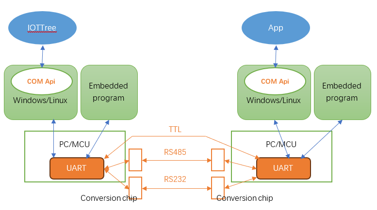
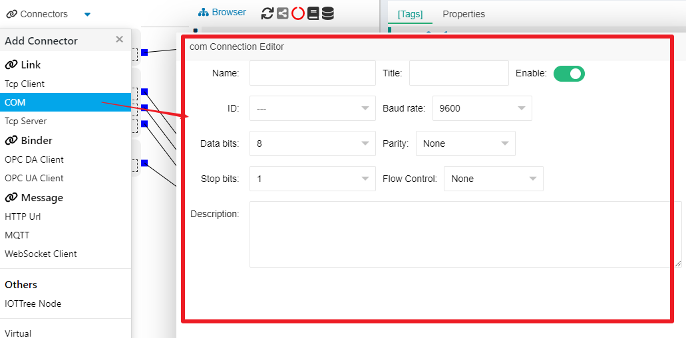
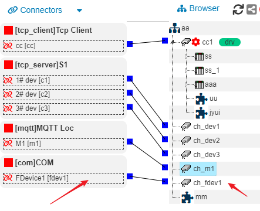
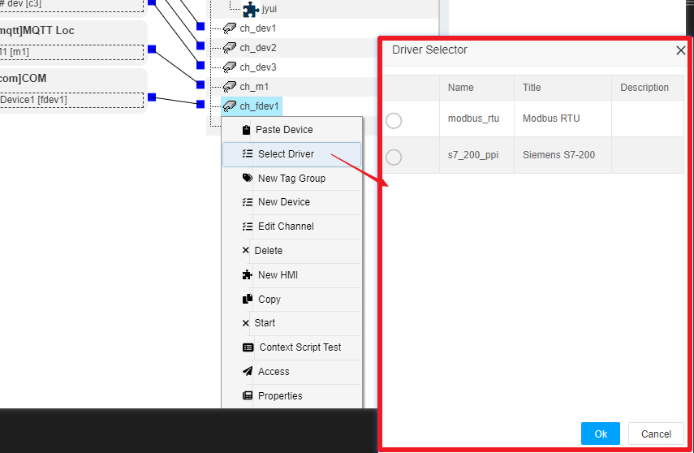

IOTTree的链路接入（Link）- 串行通信(串口COM)
==

## 1 理解串行通信 - COM、UART、TTL、RS232、RS485

在介绍IOTTree接入对串口（COM）支持前，我们先捋捋你可以在网络上看到的很多相关的术语COM、UART、TTL、RS232和RS485等等。

>UART:指的是通用异步收发器(Universal Asynchronous Receiver/Transmitter)，是一种逻辑电路，可以独立成芯片，也可以成为其他芯片内部的某种模块。我们的计算机主板、各种嵌入式单片机（MCU）内部都会有这个芯片或模块。有了这个芯片或模块，对上可以支持软件的调用，对下可以提供具体的物理通信接口。

>串口(COM):在Windows和Linux等操作系统中，基于UART提供的串行通信支持，从软件层面提供了COM Api，所以这是个操作系统对上面的应用程序提供的软件接口。

>TTL：是两个UART之间（使用的信号电压相同情况下），通过3根线路（TX、RX和GND）直连通信，由于电压很低，抗干扰能力差，距离很近，适用于板级芯片之间通信。

>RS232：对TTL信号使用转换芯片，使得线路电压高很多（达15V），提升了抗干扰能力，能够使通信距离加长，适用于短距离的设备间通信。

>RS485：对TTL信号使用转换芯片，使得信号以两根电缆差分的方式进行，进一步提升抗干扰能力，通信距离可以达到1200米，能够适用于工业通信场合。

### 1.1 串行通信

由于通信线路很少，数据只能一个字符一个字符的传输，每一个字符一位一位的传输，并且传输一个字符时，总是以“起始位”开始，以“终止位结束”，字符之间没有固定的时间间隔要求。

在通信方式上有三种：
>单工模式：数据传输是单向的，发送端和接收端是固定的。信息只是一个单向传输;

>半双工：设备间可以接收数据也可以发送数据，但是不能同时进行，每一方都在一个时间点只接收或者只发送，RS485就是这种情况；

>全双工：通信允许数据同时在两个方向上传输。这要求发送端和接收端都有独立的接收和发送能力。

在数据校验上也有三种情况：
1) 无校验；
2) 奇校验：正确的代码中一个字节中1的个数必须是奇数, 如果不是奇数，则在最高位b7添1；
3) 偶校验：正确的代码中一个字节中1的个数为偶数，非偶数则在最高位b7添1。

### 1.2 波特率

指的是每秒传输的数据位数。串行通信要求互相通信的设备波特率必须相同，这样只需要通过简单的时钟同步支持就可以达到数据正常收发而不会错乱。常用的波特率：600/1200/4800/9600/19200/38400等等。

## 2 IOT-Tree对COM口的支持

IOTTree使用Java环境开发，运行在Java虚拟机上，所以针对操作系统的COM口，也需要配置底层支持。IOTTree内部使用RXTXcomm作为串口支持。

在我们的发布版本中，内部jre环境我们已经放置好了windows环境下的对应dll文件，你直接启动IOTTree就能正常使用了。如果你要部署Linux环境或嵌入Linux环境，请在你的java环境里面复制拷贝对应的so文件即可。

后续我们可能会根据windows和Linux环境，根据不同的位数做自动动态库的装载支持，以方便大家使用，敬请期待。

当前、很大一部分工业设备都支持RS485接口。因此，如果我们在现场需要使用IOT-Tree对接这些设备，则就得利用这个COM口的支持了。

## 3 COM接入创建

如上图：通过左上角Connectors菜单，选择COM，就会弹出对应的编辑窗口。其中，ID选择项会枚举本地设备操作系统支持的所有COM口，请注意现场设备和IOTTree对接时占用的是哪一个。本文档填写的内容如下

`
Name=fdev1 Title=FDevice1 ID=COM2 Baud rate=9600
Data bits=8 Parity=None Stop bits=1 Flow Control=None
`

点击"OK"之后，你会看到系统会自动建立一个"COM Provider"，我们刚才编辑新建的ConnPt在此下面。每个COM接入基本都是独立的。

为了查看我们建立的COM接入后续会被如何使用，我们在中间项目组织树上新建一个通道"ch_fdev1",并且把之前新建立"fdev1"与之关联（具体建立通道请参考其他文档内容）。如下图：

此时，通道"ch_fdev1"能够使用的设备驱动就会被COM限定。鼠标右键"ch_fdev1",选择"Select Driver"项，在弹出的设备驱动选择窗口中，你就可以看到限定驱动列表。如下图：

后续设备数据组织配置具体内容，和选择的设备驱动有关，此文档不做展开讨论，此部分内容请参考其他文档。

我们可以明确的是，这种通信接入和设备驱动的分离，可以使得IOTTree在处理通信和具体设备协议时，可以有着更灵活的支持。

