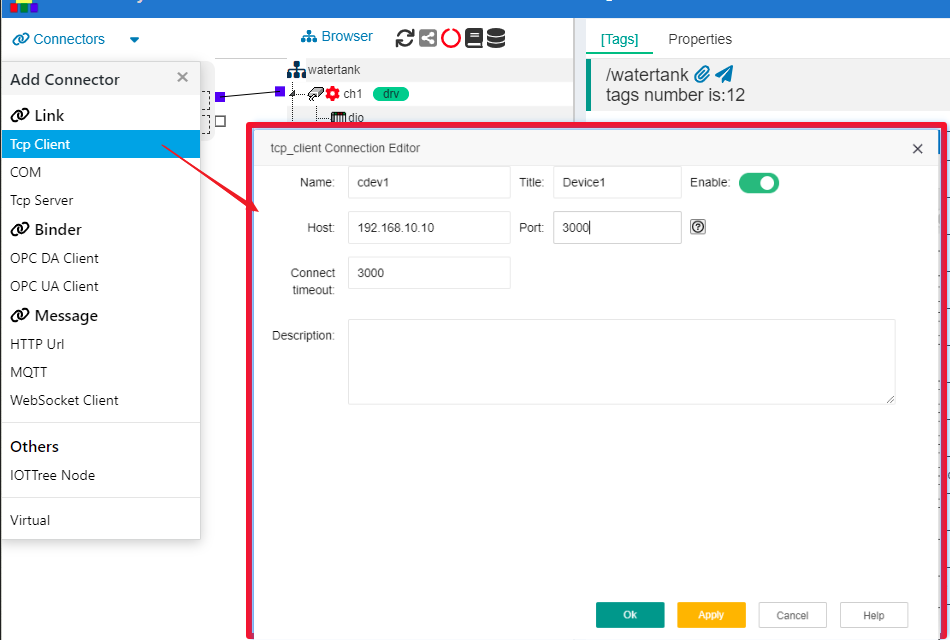
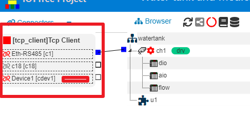
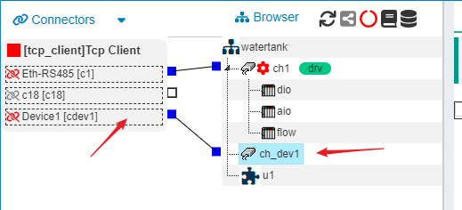
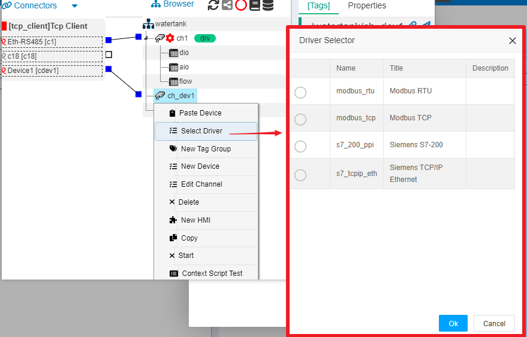

IOTTree的链路接入（Link）- Tcp Client
==

前提：被接入设备或程序提供了Tcp Server方式的对外接口，这些设备一般会有一个IP地址和监听端口。

在一个IOTTree的项目中，可能会有多个这样的设备，因此必须支持任意多个Tcp Client链路的建立。由于每个链路在数据处理上相对独立（具体由通道下面的驱动提供）。因此，Tcp Client的ConnProvider总体只有一个，而且也仅仅是起来一个组织作用。每个链路后续的数据交互一般都由驱动的线程进行单独处理。

此时，如果我们要使用IOTTree对接此设备，就必须建立一个Tcp Client，通过设备提供的IP地址和端口建立通信链路。此部分内容基于Tcp/IP协议，也即是我们当前互联网通信的基石，如果你对此不了解，请查找相关资料。

假设我们的设备和IOTTree都处在一个工厂内部网络，并且都在同一个网段之内（也即是通过IP地址可以进行无障碍通信）。设备的地址为：192.168.10.10，监听端口为3000。

如上图：通过左上角Connectors菜单，选择Tcp Client，就会弹出对应的编辑窗口。我们填写的Name=cdev1和Title=Device1之外，我们还必须填写对于设备的Host=192.168.10.10和Port=3000两个参数，分别对应设备的IP地址和端口。确定保存之后，我们就建立了一个Tcp Client的接入。你可以在项目中看到，新建的Tcp Client和之前建立的链路都在一个组内。

为了查看我们建立的Tcp Client后续会被如何使用，我们在中间项目组织树上新建一个通道ch_dev1,并且把之前新建立cdev1与之关联（具体建立通道请参考其他文档内容）。如下图：

此时，通道ch_dev1能够使用的设备驱动就会被Tcp Client限定。鼠标右键ch_dev1,选择 Select Driver项，在弹出的设备驱动选择窗口中，你就可以看到限定驱动列表。如下图：

后续设备数据组织配置具体内容，和选择的设备驱动有关，此文档不做展开讨论，此部分内容请参考其他文档。

我们可以明确的是，这种通信接入和设备驱动的分离，可以使得IOTTree在处理通信和具体设备协议时，可以有着更灵活的支持。

