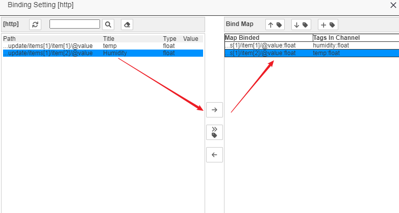

IOTTree的消息接入(Message) - HTTP URL
==


当前很多Web服务都对外提供http访问方式的应用接口。不管系统是大规模互联网网站、物联网系统、分布式系统，甚至是某个边缘计算设备，都能够提供http方式的Api，这极大方便了异构系统之间的数据交互。

大部分http接口调用，都是提供一定的url和验证机制，由数据读取方定时访问读取内容。因此，IOTTree的http接入，使用定时运行方式，每次访问对应的URL，读取返回的内容。这个返回内容可以是json、xml、string和html字符串，并且每次返回都可以看出一个完整的数据。因此，从返回数据使用方式来源上看，可以认为是个消息。显然，获取的消息在接入后续处理上，也就可以统一到数据提取和绑定两步了。

在大多数情况下，http方式的访问频度不可能也没必要很高，这和工业现场总线通常的毫秒级数据读取频度有很大区别。大多数是秒级和分钟级，一些低频访问甚至可以是小时级别。因此，我们没有必要对每个url具体的接入单独分配独立处理线程，这样太浪费系统资源了。

由此，IOTTree把http接入的处理线程分配到ConnProvider，然后此下面可以配置多个具体HTTP ConnPt（含url），其访问频度由ConnProvider统一调度。当然，如果我们接入的url很多，你可以根据需要（不同优先级）多建立几个ConnProvider，然后在下面分配不同的Http ConnPt。

## 1 HTTP接入ConnProvider创建

点击Connectors菜单，选择HTTP Url，在弹出的编辑窗口中，编辑对应HTTP Connections Provider，填写内容：
`
Name=u1 Title=U1
`

可以看出，HTTP Connection Provider只需要个名称标题，它为包含的HTTP ConnPt提供了一个线程和组织。如下图：


点击"Ok"确定之后，接下来，我们就可以在此U1 Provider下面，建立一个或多个HTTP ConnPt。

## 2 HTTP接入点（ConnPt）的建立

在U1节点上鼠标右键，选择"Add Connection"，弹出http Connection编辑器，在里面填写
`
Name=api1 Title=Api1 Url=https://api.you_host.com  Method=GET Update Interval=5000
`
等内容。如图所示：


其中，很多远程提供api的web服务器要求http请求头部有特殊的验证信息，你只需要在Request Heads区域编辑即可，内部格式每一行代表一个http头的扩展属性，属性名称和值用'='分割。另外，“Update Interval”表示更新时间间隔（毫秒ms），其含义是上一次运行结束到下一次运行开始的中间时间间隔。

如果你是要的http请求方法（Method）是POST，则还可以在Post Txt:区域输入需要提交的内容。

在Response Probe Bind区域，则是每次调用相应返回的数据作为个格式化消息（Message）做后续处理：数据提取和数据绑定（此部分内容对于消息方式的数据都类似）。

如果条件允许，我们建议使用结构化的消息格式如json、xml等格式。因为IOTTree针对此格式专门做了数据提取特殊支持，你可以不要编写任何脚本就可以完成数据提取工作。在[MQTT][mqtt]的接入，我们以json格式作为例子，本http接入，我们使用xml作为例子。

我们的消息是个xml格式字符串：

```
<update time="2023-09-12 12:32:11">
    <items>
        <item id="temp" value="5.03" />
        <item id="humidity" value="0.37" />
    </items>
    <msgs>
        <msg type="alert" item_id="temp" txt="temp is lower than 8.0" />
    </msgs>
</update>
```

点击Ok,就完成了HTTP ConnPt的添加，你可以查看左边接入内容，可以看到一个新的Api1已经存在。当然我们还可以在U1下面新增更多的URL Http ConnPt接入，这些接入会共享Conn Provider U1的内部线程。这时候会产生一个时间间隔互相影响的问题。因为，多个ConnPt共享它们所属的ConnProvder线程，如果某个ConnPt Url访问时间过长，则会对后续的所有Url都产生影响。也即是我们这个机制不能保证Url时间间隔很准确，但对于大多数http接入来说，时间间隔都比较长（对时间要求并不高），而一次url访问读取大多数都在秒级，并不影响整体。如果你的一个url数据获取时间要求较高，那么建议单独建立一个新的HTTP Conn Provider，然后下面就只添加一个HTTP ConnPt，则可以保证这个ConnPt内部的url独享一个线程。

你可能就开始纳闷了，这就完成了么？后续的数据操作是不是只剩下关联通道(Channel)，然后找个设备驱动来处理这个消息。这个当然可以，其前提是你已经有这个设备驱动，并且这个设备驱动能够识别这个消息格式，并且可以很方便的吧数据更新到通道设备下面的标签（Tag）中。

但是，对于这种消息来说，我们如果针对每一种结构化json、xml格式都要实现一个驱动，不仅非常不方便，而且也没必要。事实上，对于这种结构化数据，提取数据并且映射到我们在通道下面建立的设备标签（Tag）应该是比较容易了，大部分情况是没有必要专门实现驱动的。

IOTTree充分考虑了这种情况，在消息方式接入部分实现了对数据的提取和对设备标签的绑定。这样，我们关联的通道（Channel）就不需要使用设备驱动了，在项目中，这样的通道（Channel）和下面的设备、标签组和标签仅仅是个组织关系了。

[mqtt]: ./msg_mqtt.md

## 3 结构化消息的数据提取（Data Probe）

上面我们已经建立了\[http\]U1和在下面的Api1接入点（有特定的URL），并且也确定了消息格式。那么接下来我们就要对此消息格式做分析，并且配置需要提取的数据项。

鼠标右Api节点，选择“Edit”菜单项，在弹出窗口中你会发现有个“Data Probe”按钮，并且在这个按钮上面你可以看到"no read buffer"提示,右边还有一个Read按钮。如下图：


很明显，我们需要让此接入点（ConnPt）知道这个消息格式，这其中有两个方法。

---

#### 方法1：触发Read按钮读取数据

你只需点击"Read"按钮，如果url服务端已经准备好，我们就可以发起一次请求，并获取响应数据返回。如果成功，会显示读取数据成功时间。此时，你只需要点击"Data Probe"按钮，就可以在弹出窗口看到数据了。

#### 方法2：手工输入

如果发布此消息格式的URL没有准备好，那么就只有手工输入了。

直接点击“Data Probe”按钮，在弹出的窗口左上位置，有个 “提取xml”按钮，点击此按钮，在弹出的"Input Source Text\[xml\]窗口中，输入xml文本，如图所示：


确定之后，你可以看到在Probe Setting窗口左边Source Input区域显示出了此xml数据，最终效果和方法1手工输入之后相同。


---

不管使用方法1还是方法2，我们接下来可以开始提取数据了。

仔细观察Source Input下面的结构化xml数据，你会发现，每个属性成员对于的值区块都是可选择的，请用鼠标点击我们需要的数据，并且点击中间“右箭头（extract data）”按钮，右边的Probed List列表会出现我们提取的内容，每个提取项包含Path、Title、和Type。Path代表在xml格式中的数据项定位路径，Title是标题和Type代表数据类型。你可以根据需要修改，你只需要点击对应的那个修改图标，按照提示操作即可。如下图：


点击“Ok”按钮，我们就完成了数据的提取，整体还是非常简单的。 <b>注意：在回Api1编辑窗口的时候，别忘了点击Apply，进行保存</b>

接下来，我们可以对Api1接入点进行通道关联，并配置绑定了。

## 4 关联到通道(Channel)并配置数据绑定

IOTTree项目中的具体数据都必须体现在标签(Tag)中，那么很明显，我们针对HTTP接入提取的数据也需要绑定到具体的Tag中。那么在绑定之前，我们需要建立关联通道，并且在通道下面设置好相关的Tag。

我们建立一个通道ch_u1,并且在此通道下面直接建立2个Tag，temp和humidity，只需要填写Name 和Data type即可（因为没有驱动，一些地址之类的参数不需要提供，具体请参考其他文档）。请注意，本文档中我们在通道下面连设备都没有添加，你的项目如果需要区分，请随意。我们把接入点Api1和通道ch_u1建立关联，这就准备好绑定了。如下图：


鼠标右键Api1节点，选择“Edit”菜单项，在弹出窗口中你会发现有个“Bind Channel”按钮，点击弹出绑定窗口(Binding Setting \[http\])。此窗口还是左中右结构，左边是我们的提取数据列表，中间是绑定按钮，右边是绑定结果。

其中，右边绑定列表已经把通道下面的所有Tag都列举出来，我们需要先左右各选一项，然后点击中间的“右箭头（bind to tag）”按钮才能完成绑定。右边Bind Map列表的第一列，就是绑定之后的内容。如下图：



完成之后，我们点击“Ok”回到Api1的编辑窗口，此时一定要点“Apply”或“Ok”按钮进行最终保存。

至此，我们就完成了从HTTP Conn Provider的建立，配置具体url的接入点ConnPt的配置，通过数据提取和绑定使得数据最终进入了具体的标签（Tag）整个流程。从中我们发现，消息的接入是个主角，项目中的通道和标签仅仅是个组织而已。

如果现场接入web服务器已经准备好，我们可以启动此项目，在Api1接入点上鼠标右键打开监视，同时查看通道ch_u1下面的标签列表实时数据。你会发现标签对应的Value跟着新接收到的数据而变化，这也说明一切正常。

## 5 写在最后

1 你可能会疑惑为什么要分两步：先对结构化数据提取，再对通道下的Tag进行绑定；仔细想，这个确实可以一步到位的。

分开确实有点繁琐，但带来的好处很多，比如数据提取我们可以独立出来支持更多的方法（后面会增加js脚本的支持），并且还可以做到更灵活的绑定支持。

2 上面我们用xml数据结构做了数据提取和绑定。事实上，如果你的数据格式是json，那么除了在对应接入点编辑的时候，选择json格式区别之外，其他都是类似的。

3 如果返回的是html网页内容，则我们有专门针对html数据提取的强大支持。我们不仅可以获取html网页，同时还可以支持对网页内部的js脚本进行运行（可以确保网页正确展示内容），然后才进入我们的数据提取和绑定工作。此部分内容请参考[HTTP Url HTML格式接入][http_url_html]。


[http_url_html]:./msg_http_url_html.md
