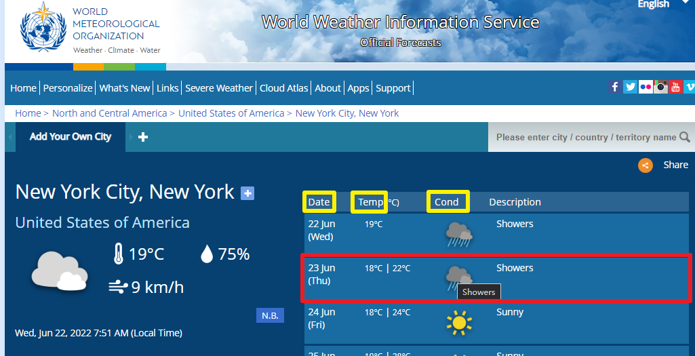
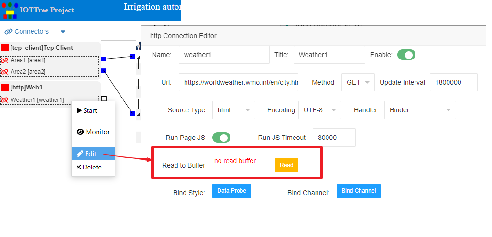
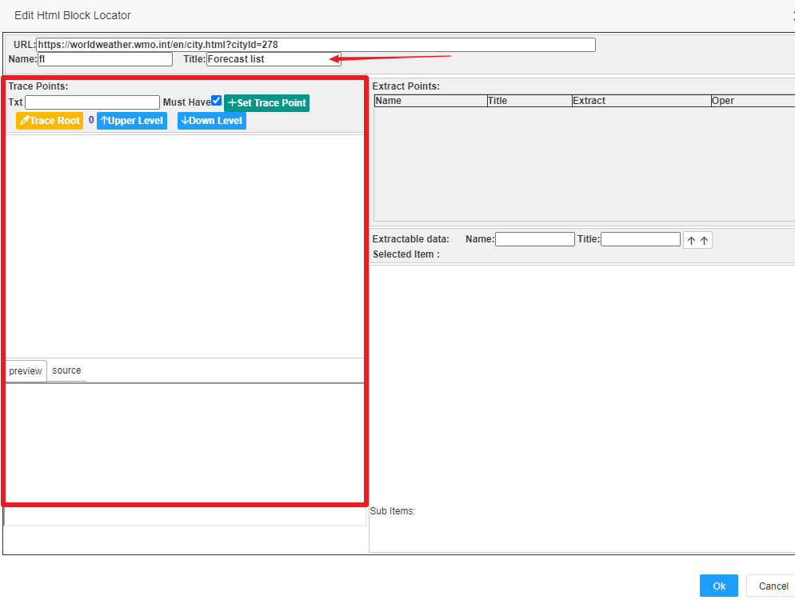
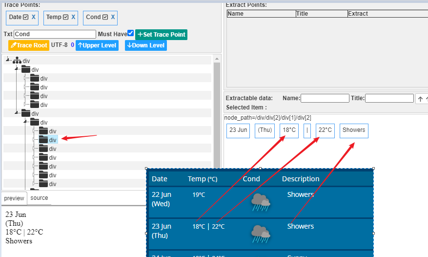
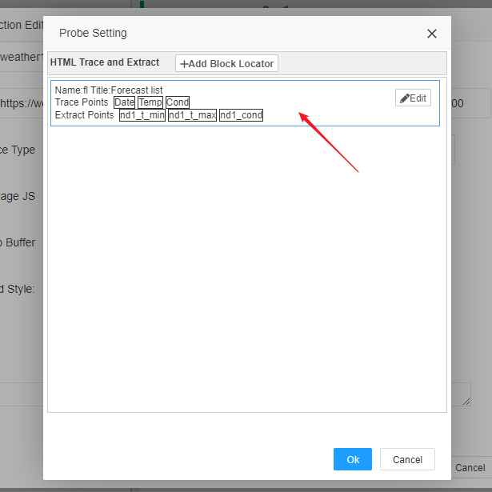
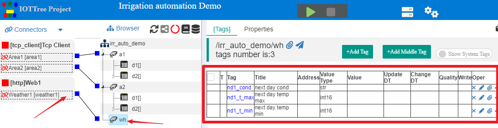
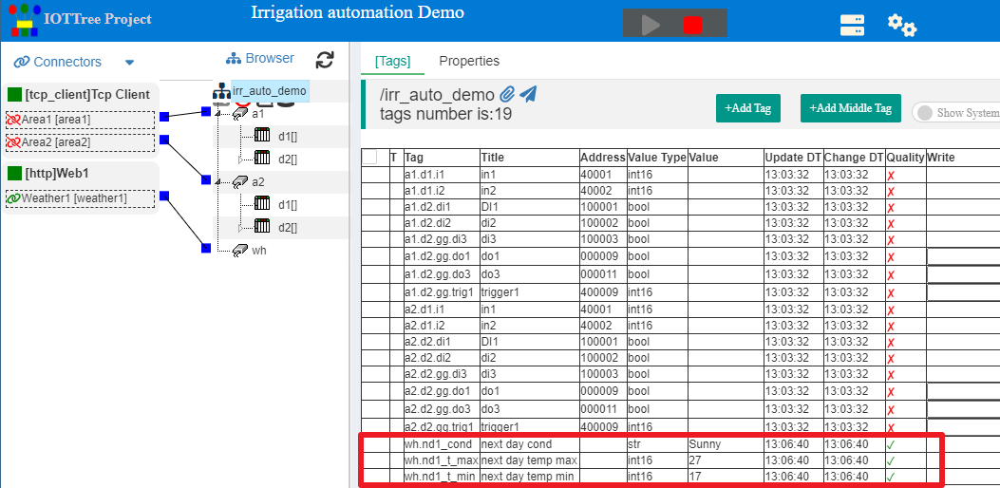

HTTP Client HTML格式接入
==


对于Http Client方式的接入，IOT-Tree Server可以支持xml、json、txt和html等多种数据格式。其中，对于html格式来说，内部实现本质就是一个网页数据聚合功能。

对于物联网系统来说，除了现场设备接入数据支持以外，整个互联网中的数据也应该成为可能的输入参考。比如，气象数据、股票数据等内容。例如，您可能有个自动化灌溉系统，需要根据天气预报尽可能地减少灌溉水量或次数，在土壤含水量接近警戒线时，自动结合天气预报数据，决定是否要马上浇水灌溉或再等几天，很明显如果未来几天可能下雨，你就可以减少不必要的灌溉水量。又如，你如果使用IOT-Tree Server作为智能家居控制或个人工作助手，您也可以从互联网上提取你经常关注的数据信息，并集成到您的日常监控画面中，或者根据这些数据自动为你实现一些辅助功能。

当前，已经存在很多基于http协议的数据调用接口，大部分基于数据提供方提供的web api方式支持。这些服务一般情况都需要专门定制开发才行。所以，对于一些数据来说，如果某个网页中已经存在，则可以直接从网页中进行定位和提取，这种方式比专门的定制开发会直接很多。但是，对于网页中内容的定位和提取，也需要一定的技术手段。并且，由于网页会经常变化，如何有效且稳定的进行定位，并准确提取里面需要的数据，这本身就是一个挑战。

IOT-Tree Server对于html格式的数据提取，使用了一种非常简单、健壮且灵活的方式，同时还提供了简单的配置分析界面用来支持。最终，提取的数据项可以直接绑定(bind)到内部定义的Tag中。


# 1 HTML页面数据提取机制

IOT-Tree Server提供的html页面数据提取分两部分进行。一是数据块跟踪和定位、二是块内数据提取。

第一步数据块跟踪和定位，是为了能够适应页面的变化而使用的定位方法。通过分析大部分网页会发现，我们关心的数据一般都在特定的页面区块里面，并且由于页面每天都可能在变化，区块的位置整体也不是很稳定，但对应的区块内部内容相对稳定。所以，如果我们能够排除页面变化的干扰，第一步先定位对应的内容区块，则可以大大提升成功的概率，并且排除很大一部分干扰。

在区块内部，如果网页提供方不做相关内容版本升级的话，内部数据结构就比较稳定。所以，在定位到区块之后，内部的具体数据，可以基于此区块进行精确定位获取。

当然，考虑到被提取页面区块发生变化时（如有大的版本升级），以上的两步都会失效，那么如何快速有效的进行发现，并迅速调整定位参数就显得很重要。因此，我们提供了简单方便的页面分析和可视化定位配置工具，能够在极短的时间进行重新设定。

当前，有很多网站提供的页面内容都通过ajax动态获取，并通过js脚本进行渲染输出，此时我们无法通过URL直接获取页面的原始内容进行提取，需要对页面进行装载计算之后输出相关的html内容，此过程需要的计算时间比较长，我们通过读取并本地文件缓存的方式进行后续的数据分析。


## 1.1 页面内容区块跟踪定位

IOT-Tree Server使用非常简单的文本关键字,来进行页面内部跟踪定位，一般一个内容区块也就1到2个关键字即可。解析引擎根据输入的几个关键字，自动扫描定位html的树状内容结构，找到距离最近的包含这几个关键字的共同父节点。以此父节点为基础，可视化配置工具可以预览展示出内部内容。如果发现区块太小没有覆盖我们关注的数据，则还可以根据需要寻找上一级或多级父节点作为定位节点。直到节点包含了我们关注区块的所有内容即可。

所以，第一步的区块跟踪定位只需要几个参数 (区块名称,关键字1,关键字x,父节点层级n)


## 1.2 区块内部数据定位和提取

当第一步定位好区块父节点之后，我们排除了页面中的大部分内容，只需要关心此定位节点下面的内容即可。此时，IOT-Tree提供的配置管理界面会扫描列举出此节点下的所有可以被提取的文本内容。并且每个文本都对应一个xpath参数,你只需要选择并设定提取的名称即可。

## 1.3 字符串内部内容切分

如果我们关心的数据在某个字符串内部，则IOT-Tree还会对此字符串自动做切分，你还可以选择切分之后的相关内容即可。


# 2 举例说明整个过程

以上是IOT-Tree通过URL对HTML页面进行数据提取的运行机制，下面我们直接通过一个例子来进行说明。通过例子，你会发现，IOT-Tree提供的配置功能极大的方便了页面分析和数据提取过程。

我们的例子基于一个灌溉自动化系统的演示项目。通过在项目中增加HTTP Url接入，访问气象网站获取天气预报的数据。这样，在项目中，后续就可以把气象数据和控制逻辑进行组合，使得自动灌溉系统运行的更经济和有效。

我们准备提取纽约市第二天的天气预报信息，URL链接如下：


https://worldweather.wmo.int/en/city.html?cityId=278


我们需要提取的数据内容区域和定位关键字如下图：





图中右边很明显是个天气预报表格，而表格头部文字一般比较稳定，所以我们选了3个关键字作为表格区域的定位锚点。它们分别为Date、Temp和Cond，如上图的黄色标记内容。

本例子我们提取表格第二行，也即是明天的天气预报内容。（在你实际的项目中，你可能需要提取更多天的数据进行综合利用）

我们需要提取明天的最低温度、最高温度和天气状况。


## 2.1 预先准备

我们首先使用Chrome浏览器访问此链接。并且在页面上鼠标右键，选择查看源代码(View page source)。然后在页面的源码中搜索Date Temp和Cond这几个关键字。你会发现，里面除了一堆的js脚本代码，根本不存在基于html内容的这几个关键字的存在。

但是，当你在Temp上面鼠标右键并选择检查(Inspect)时，您可以发现在右边的页面元素(Elements)中，则存在这些内容。进一步，您可以发现虽然表格头部“Temp (°C)”看似在一起的一个字符串，在Elements中却并不在一起，所以我们不能使用“Temp (°C)”作为定位关键字，而只能使用"Temp"。

很明显，这个页面是通过js脚本代码动态生成的，直接提取URL的源码那是很难定位并获取这些数据的。所以，我们需要在获取页面内容时，运行js脚本，然后获取js运行之后的页面内容——这个会需要很长的时间。幸好，我们一般在提取URL对应的页面信息时，时间间隔往往也很长，可以以小时为基本间隔。

通过在浏览器中的基本页面分析，我们接下来就可以做具体的数据获取配置了。


## 2.2 项目中新增HTTP Url接入

具体的新建项目您可以参考其他相关文档内容。我们现在已经有了灌溉自动化演示项目，并且已经在此项目的管理界面中，现在我们需要增加HTTP Url接入。

在项目Connectors菜单中，选择HTTP Url，在弹出窗口中，输入Connections Provider的名称为web1,如下图：


你会发现，在左边列表中，新增了[http]Web1这个条目，鼠标右键此条目，选择"Add Connection"，在弹出窗口中输入如下内容：


```
Name: weather1
Title: Weather1
Url: https://worldweather.wmo.int/en/city.html?cityId=278
Method: Get
Update interval: 1800000
Source Type: html
Handler: Binder
Run Page JS: Enabled
Run JS Timeout: 30000
```

其中，更新间隔1800000毫秒对应半小时；并且使能页面运行脚本"Run Page JS",这样页面被下载之后会进行内部的js运行和html结构的自动创建，此过程需要长时间的计算，由此我们设置了运行js脚本过期时间"Run JS Timeout"为30000毫秒。

点击"Ok"按钮进行保存，然后在新增的条目右键,选择"Edit"，再次进入此Connection的编辑界面。我们发现界面多了一个"Read to Buffer"选项。如下图：





我们点击Read按钮，并进行足够长时间的等待，IOT-Tree会访问URL，并且根据页面内容进行JS脚本的运行和最终页面的构建，并写入到缓存中。成功之后，会显示保存时间。此时，我们已经准备好了基本的页面数据，接下来就可以开始设置页面内部数据提取了。


## 2.3 配置区块——跟踪定位和提取数据

我们点击按钮“Date Probe”，在弹出的窗口中我们可以看到HTML Trace and Extract的提示，并且有个“+Add Block Locator”按钮，此按钮添加页面区块定位项。


点击此按钮，系统又弹出一个窗口，这个窗口看似有点复杂，不过你不用着急，里面不外乎跟踪(Trace)和提取(Extract)罢了。

我们先给此区块填写名称和标题： Name=fl Title=Forecast List。如下图：





我们准备设置Date Temp和Cond作为跟踪关键字。在"Trace Points"下方的Txt输入框，填写Date并点击按钮"+Set Trace Point",你会发现关键字添入列表中。然后，同样的你可以添加Temp和Cond两个关键字。最终效果如图所示：


然后，我们点击按钮"Trace Root"，这个按钮会根据你上面配置的3个关键字对html页面进行定位，找到它们共同的根节点。成功之后，你会发现下方会以这个根节点展示出了区块的html元素的树形结构。

你可以点击选择此区块下树形结构中的节点，下方的就会展示html预览效果，并且右边的Extractable data区域会列举出当前节点下面能够被提取的全部数据。如下图：


我们运气不错，通过这3个关键字定位的页面节点，已经包含了整个天气预报的表格内容了。当然，如果你定位其他页面，很可能出现定位的节点只包含了关键字，但区块周边的内容并不全，此时你只需要加大区块面积即可——也即是以当前定位的节点为基础，向上查找父节点作为新的根节点即可，这个过程你只需要简单的点击按钮"Upper Level"即可。此按钮每点击一次，根节点就会向上升一级，您只需要点击新的根节点，查看是否包含了你关心的数据。如果出现了你需要的数据，那就马上停止，尽可能地控制根节点在小范围内。

在上面点击根节点之后，我们发现Extractable data区域内容比较多，不容易分辨那个数据是预报明天相关的内容。此时，我们可以展开树型内容，点击下面的子节点进行查找（当然，你需要比对浏览器中展示的内容）。我们发现了第二行对应的数据节点，如下图：





很明显，里面的18 22 和Showers是我们需求提取的内容。

点击"18°C"这个数据块，你会发现下方自动会出现对此数据进行切分的子数据块，我们选中"18"这个我们最终关心的数据块。然后在"Extractable data"右边填写如下内容


```
Name=nd1_t_min
title=next day1 min temp
```

然后点击右边的向上按钮，你会发现一个数据提取项已经出现，如下图：


我们用相同的方法，提取了另外两个数据，最终设置如下：


```
Name=nd1_t_max
title=next day1 max temp

Name=nd1_cond
title=next day1 cond
```


此时，我们已经完成了一个区块定位和内部数据提取配置，整体还是非常方便快捷的。点击"Ok"进行保存，你会发现上一级弹出窗口出现了一个区块列表内容。





再次点击"Ok",直到所有弹出窗口都关闭，系统才会真正保存你设置的所有内容。


## 2.4 建立对应的通道、数据标签并进行绑定

我们需要在项目中建立通道和标签Tag，然后把上面配置好的提取数据绑定过来，这样我们后续的就可以利用这些数据了。

具体建立通道和标签，请参考相关文档。本例子中，我们建立了通道wh，并且在下面建立了三个标签Tag。同时，我们也对通道wh和weather1进行关联。如下图所示：





请再次鼠标右键connector - weather1，选择Edit，然后点击弹出窗口中的"Bind Channel"按钮。


在弹出的绑定窗口中，你可以看到左边是我们配置页面提取的内容，右边是关联通道下的标签Tags列表。通过绑定操作，进行关联，如下图：


点击"Ok"关闭全部弹出窗口进行保存，此时我们已经完成了相关数据配置操作。


## 2.5 运行查看效果

我们启动项目，通过一定的时间，我们可以看到通道下面关联的标签显示出从页面提取的数据。如下图：





# 3 总结

如果你对IOT-Tree Server相关项目不熟悉，可以查看这个工业现场完整的例子。本例子是灌溉自动化相关项目演示，现在项目中增加了未来的天气信息，由此可以对现场的灌溉控制做更优化的调整：

<a href="../case/case_auto.md" >工业现场自动化系统使用案例</a>

你可以通过访问,直接通过json格式获得wh通道下的数据，这样可以为其他系统直接提供url json方式的数据：


```
http://your_ip:yourport/irr_auto_demo/wh
```


通过此例子您可以发现，IOT-Tree Server不仅能够接入现场传感器、控制器等设备，还可以通过网页方式获取互联网上的巨大资源。

事实上，你可能已经发现，通过IOT-Tree提供的HTML页面数据提取功能，由于足够简单便捷，其方便程度已经超过一般专业WebApi提供的接口。因为，一般情况下，专业WebApi不仅需要你根据他们提供的文档进行适配编程和联调测试，而且大部分情况下还需要申请、验证等一系列步骤。


