IOTTree的链路接入消息(Message) - MQTT
==

MQTT是一个基于客户端-服务器的消息发布/订阅传输协议。她是个轻量、简单、开放和易于实现的，这些特点使它适用范围非常广泛。MQTT 与 HTTP 一样，运行在传输控制协议/互联网协议 (TCP/IP) 堆栈之上。

它提供了基于主题(topic)一对多的消息分发机制，可以实现各种设备和应用程序的通信解耦。这使得MQTT协议能够广泛应用于机器与机器和物联网系统中。

MQTT消息不是直接从发送端点对点的发送到接收端，而是由MQTT server（或称为 MQTT Broker）分发的。如图所示：

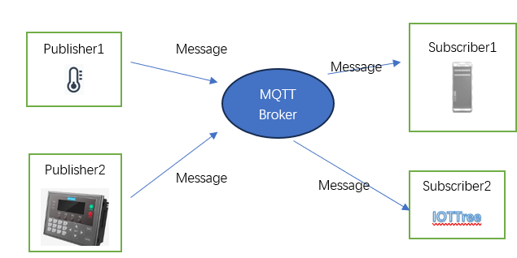

支持MQTT Broker的软件有很多，有开源的也有商业。如ActiveMQ、Mosquitto、HiveMQ等等。你也可以从上图看出，我们的IOTTree也可以作为一个MQTT Client和某个MQTT Broker进行通信。

你可以根据你的应用环境获取MQTT Server（Broker）地址端口和连接要求（如安全验证参数等），然后在IOTTree项目中进行接入配置。

如果你目前没有MQTT Server环境，并且接入的设备安全要求也不高，也可以使用IOTTree内部自带的一个MQTT Server。

注意：这个内部自带的MQTT Server基于ActiveMQ实现，并且实现了一个简单安全验证机制。这个MQTT Server作为一个Service在IOTTree内部独立运行，不属于内部某个配置的项目。

## 0 启用IOTTree内部自带的MQTT Broker(如果你已经有MQTT Server，请忽略)

如果你想直接使用IOTTree内部的MQTT Server(Broker)，那就需要启动对应的Service，只需要如下简单的操作即可。

访问并登录IOTTree管理界面，如http://localhost:port/admin/。在管理主界面的右上角Services方块中，点击里面的Setup按钮，弹出Services管理窗口。如下图：

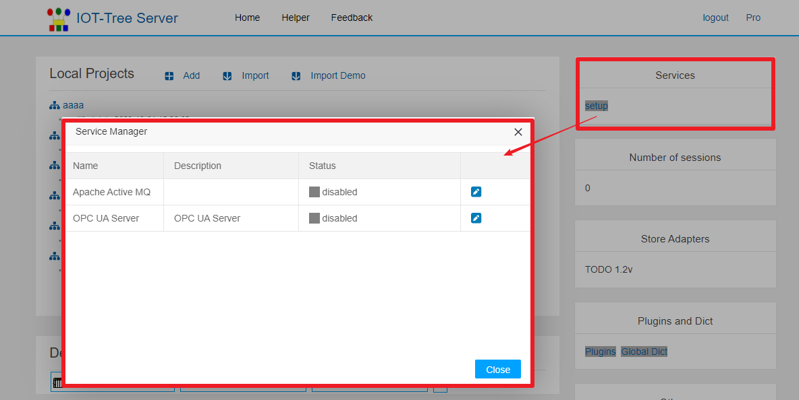

你可以看到里面有个Apache Active MQ，并且状态是disabled。点击对应编辑按钮，在弹出窗口中设置MQTT Server相关参数。如下图：

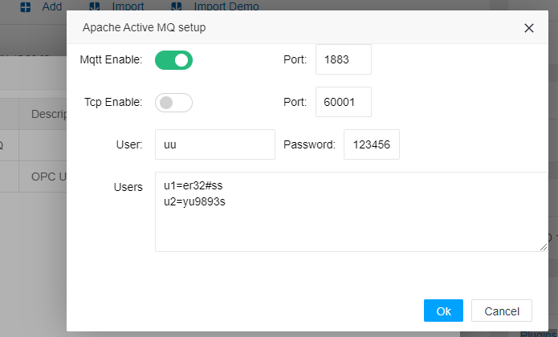

非常简单，你只需要打开Mqtt Enable开关，并且指定对应的端口（缺省端口1883），然后填写支持的Client用户密码即可。建议对不同Client使用不同的用户密码验证。你可以在Users编辑框输入多行用户=密码，这样支持多个用户密码验证了。点击ok之后，我们的MQTT Server(broker)配置就完成了。

回到前面的管理窗口，你会发现Apache Active MQ已经做好准备，等待你启动了。你只需要点击对应的start service按钮就行。如图：

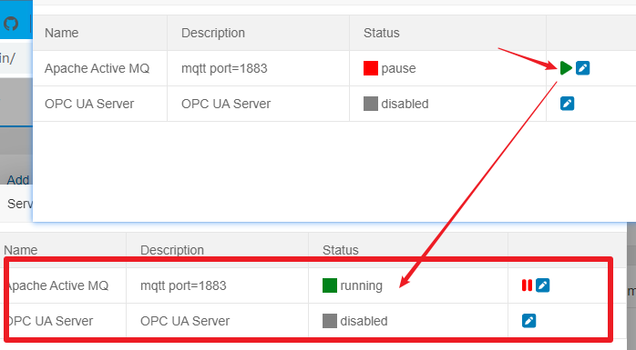

启动之后，如果你重启IOTTree Server，这个Apache Active MQ也会在内部自动启动。

此时，你只需要把我们这台设备的IP地址和1883端口，以及MQTT Client需要的验证用户密码发布给接入设备，这些设备就可以发布他们的消息数据了。

## 1 MQTT接入ConnProvider创建

前提：我们已经有了MQTT Server和用户验证信息（本例子使用上面配置内部自带的ActiveMQ），在项目中就可以使用MQTT Client方式进行接入了。

点击Connectors菜单，选择MQTT，在弹出的编辑窗口中，编辑对应MQTT Connections Provider，填写内容：Name=mqtt_loc Title=MQTT Loc  MQTT Host=localhost Port=1883 MQTT User=uu Password=123456。如下图：

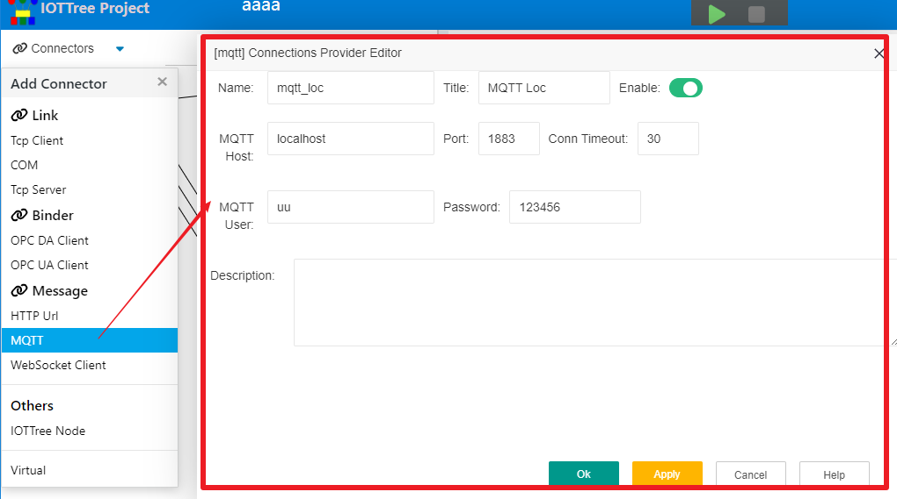

接下来，我们就可以在此MQTT Provider下面，建立一个或多个ConnPt。

## 2 接入点（ConnPt）的建立

在IOTTree这个MQTT接入中，对ConnPt做了规定：每个ConnPt定义自己需要订阅的消息主题。

而MQTT Provider内部只有一个MQTT Client实例，这个Provider会汇总自己下面的所有ConnPt定义的消息主题，统一注册到MQTT Server(Broker)中。

当MQTT Provider接收到一个消息之后，会根据此消息主题，自动对下面的ConnPt进行消息分发。

事实上，MQTT消息订阅并没有做太多限制，一个MQTT Client可以订阅多种主题的消息。但从我们IOTTree接入固定设备这种应用场景来说，**我们建议：每个MQTT ConnPt最好接收相同格式的消息，这是因为每个ConnPt会关联一个具体的通道，而通道下面的设备基本是固定的。**

如何条件允许，我们建议使用结构化的消息格式如json、xml等格式。因为IOTTree针对此格式专门做了数据提取特殊支持，你可以不要编写任何脚本就可以完成数据提取工作。

假定我们这个接入点（ConnPt）要对接的现场采集设备（MQTT Client）发布的主题为 air/dev1，并且发布的消息格式是json，内部包含一个温度和湿度数据。

`
{
"temp":25.23,
"humidity":0.37
}
`

鼠标右键点击MQTT Loc，选择Add Connection，在弹出窗口中填写如下内容：

`
Name=m1 Title=M1 Subscribe Topics=air/dev1 Source Type=json Encoding=UTF-8
`

点击Ok,就完成了ConnPt的添加。

你可能就开始纳闷了，这就完成了么？后续的数据操作是不是只剩下关联通道(Channel)，然后找个设备驱动来处理这个消息。这个当然可以，其前提是你已经有这个设备驱动，并且这个设备驱动能够识别这个消息格式，并且可以很方便的吧数据更新到通道设备下面的标签（Tag）中。

但是，对于这种消息来说，我们如果针对每一种结构化json、xml格式都要实现一个驱动，不仅非常不方便，而且也没必要。事实上，对于这种结构化数据，提取数据并且映射到我们在通道下面建立的设备标签（Tag）应该是比较容易了，大部分情况是没有必要专门实现驱动的。

IOTTree充分考虑了这种情况，在消息方式接入部分实现了对数据的提取和对设备标签的绑定。这样，我们关联的通道（Channel）就不需要使用设备驱动了，在项目中，这样的通道（Channel）和下面的设备、标签组和标签仅仅是个组织关系了。

## 3 结构化消息的数据提取（Data Probe）

上面我们已经建立了MQTT Loc和在下面的M1接入点（监听了特定主题），并且也确定了消息格式。那么接下来我们就要对此消息格式做分析，并且配置需要提取的数据项。

鼠标右键M1节点，选择“Edit”菜单项，在弹出窗口中你会发现有个“Data Probe”按钮，并且在这个按钮上面你可以看到"no received data"提示。如下图：

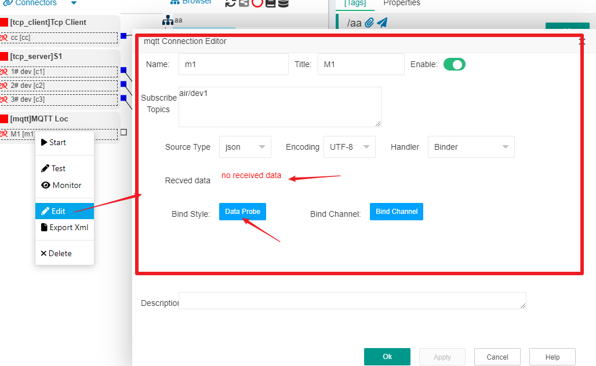

很明显，我们需要让此接入点（ConnPt）知道这个消息格式，这其中有两个方法。

---

#### 方法1：手工输入

如果发布此消息格式的设备没有准备好，那么就只有手工输入了。

鼠标右键M1节点，再次选择“Edit”菜单项，在弹出窗口点击“Data Probe”按钮，在弹出的窗口左上位置，有个 “提取json”按钮，点击此按钮，在弹出的"Input Source Text\[json\]窗口中，输入json文本，如图所示：

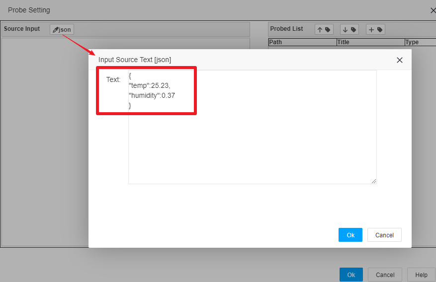

确定之后，你可以看到在Probe Setting窗口左边Source Input区域显示出了此json数据

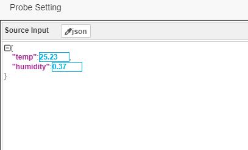

此时，我们可以开始提取数据了。

#### 方法2：临时启动接入获取发布的数据

如果发布此消息格式的设备已经具备，同时连接MQTT Server成功，并且按照一定的时间间隔发布json消息，那么我们可以在MQTT Loc这个节点鼠标右键，选择“Start”菜单项，临时启动这个接入，只要接收到一个消息，那就够用了。

问题又来了，你怎么才能知道启动接入之后接收数据成功了呢？——当然是打开监视器了。鼠标右键M1节点，选择“Monitor”菜单项，此时会打开一个新的监视浏览器窗口。如果接收数据成功，你就可以在里面看到内容。

为了方便理解，本说明使用软件MQTT.fx - 1.7.1这个版本替代现场设备连接我们的MQTT Server（Broker），模拟发送json数据。
首先启动软件MQTT.fx - 1.7.1，点击“Connect”按钮左边的设置齿轮，弹出的窗口中，设置连接参数如下图：

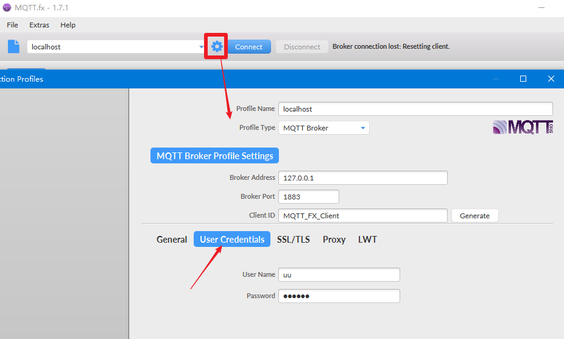

其中，注意选择“User Credentials”这个选项，并且正确的输入User Name和Password——这些内容在上面配置Apache ActiveMQ这个Service的时候，我们设定的验证用户名和密码。如果这个不正确，那么就无法连接成功。确定关闭窗口之后，点击按钮“Connect”，如果连接成功，你会发现右上角那个红色的圆球变绿，同时下面的Publish按钮也从灰色变亮了。

我们在“publish”按钮左边输入主题 air/dev1。并在下面文本框输入要发布的json数据。点击“Publish”按钮发布此主题的数据。如果成功，你会发现我们在M1通道上打开的监视窗口会出现这个数据，这说明我们的MQTT接入和对应的ConnPt获取数据成功。如下图：

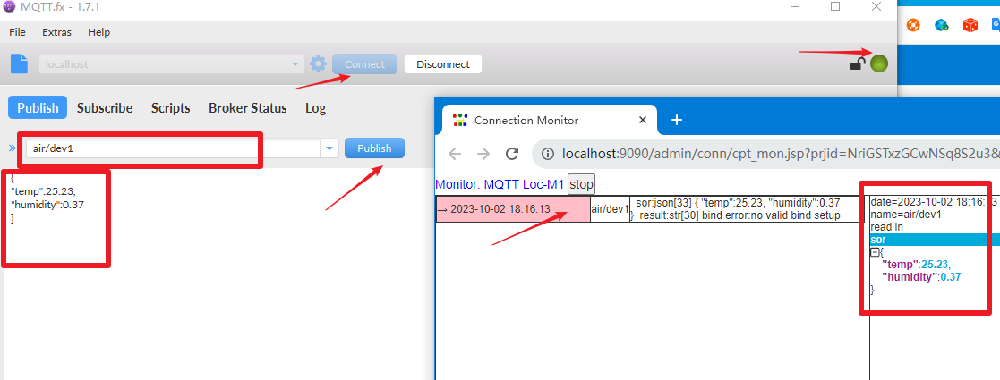

在继续打开M1编辑窗口之前，先鼠标右键，选择“Stop”关闭这个接入（在接入启动状态内部配置会被锁定，编辑的更改无法写入）。

在重新打开的M1的编辑窗口中，你可以看到接收到数据的最后时间。

接着，我们再次点击"Data Probe"这个按钮，你可以直接看到在Probe Setting窗口左边Source Input区域显示出了此json数据。最终效果和方法1手工输入之后相同。

---

不管使用方法1还是方法2，我们接下来可以开始提取数据了。

仔细观察Source Input下面的结构化json数据，你会发现，每个属性成员对于的值区块都是可选择的，请用鼠标点击我们需要的数据，并且点击中间“右箭头（extract data）”按钮，右边的Probed List列表会出现我们提取的内容，每个提取项包含Path、Title、和Type。Path代表在json格式中的数据项定位路径，Title是标题和Type代表数据类型。你可以根据需要修改，你只需要点击对应的那个修改图标，按照提示操作即可。如果数据类型没问题，你也可以不用修改。如下图：

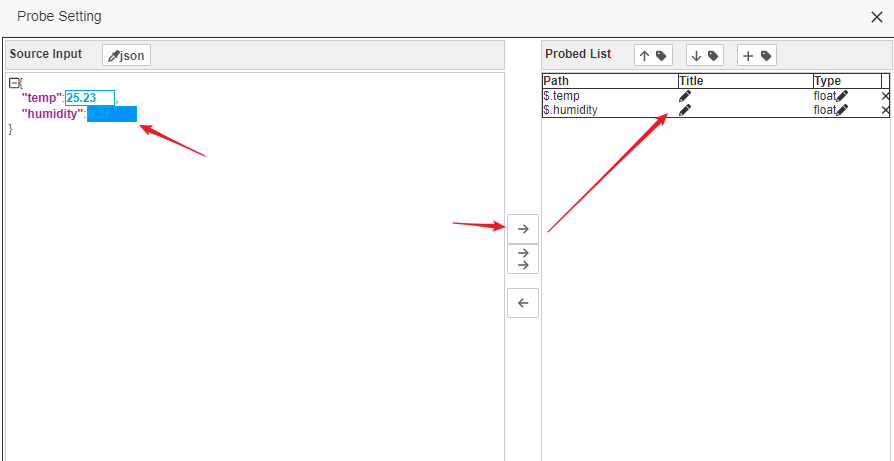

点击“Ok”按钮，我们就完成了数据的提取，整体还是非常简单的。 <b>注意：在回到M1编辑窗口的时候，别忘了点击Apply，进行保存</b>

接下来，我们可以对M1接入点进行通道关联，并配置绑定了。

## 4 关联到通道(Channel)并配置数据绑定

IOTTree项目中的具体数据都必须体现在标签(Tag)中，那么很明显，我们针对MQTT接入提取的数据也需要绑定到具体的Tag中。那么在绑定之前，我们需要建立关联通道，并且在通道下面设置好相关的Tag。

我们建立一个通道ch_m1,并且在此通道下面直接建立2个Tag，temp和humidity，只需要填写Name 和Data type即可（因为没有驱动，一些地址之类的参数不需要提供，具体请参考其他文档）。请注意，本文档中我们在通道下面连设备都没有添加，你的项目如果需要区分，请随意。我们把接入点M1和通道ch_m1建立关联，这就准备好绑定了。如下图：

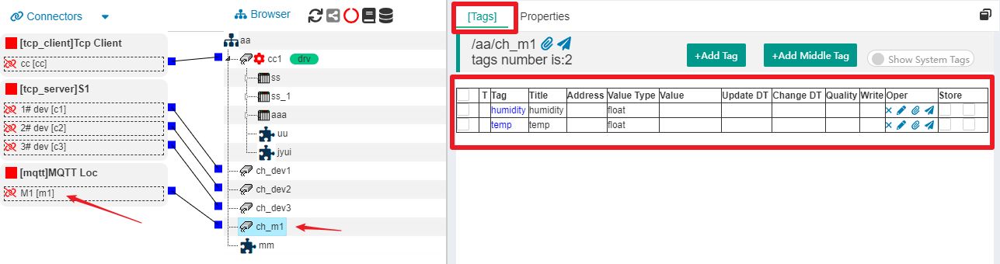

鼠标右键M1节点，选择“Edit”菜单项，在弹出窗口中你会发现有个“Bind Channel”按钮，点击弹出绑定窗口(Binding Setting \[mqtt\])。此窗口还是左中右结构，左边是我们的提取数据列表，中间是绑定按钮，右边是绑定结果。

其中，右边绑定列表已经把通道下面的所有Tag都列举出来，我们需要先左右各选一项，然后点击中间的“右箭头（bind to tag）”按钮才能完成绑定。右边Bind Map列表的第一列，就是绑定之后的内容。如下图：

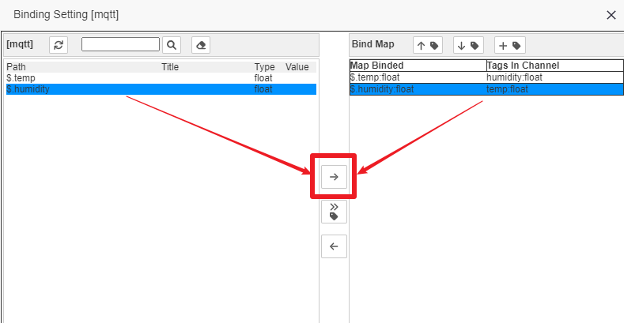

完成之后，我们点击“Ok”回到M1的编辑窗口，此时一定要点“Apply”或“Ok”按钮进行最终保存。

至此，我们就完成了从MQTT Conn Provider的建立，监听某个主题的接入点ConnPt的配置，通过数据提取和绑定使得数据最终进入了具体的标签（Tag）整个流程。从中我们发现，消息的接入是个主角，项目中的通道和标签仅仅是个组织而已。

如果现场设备已经准备好，并且能够正常发布数据（或者你也可以使用MQTT.fx软件模拟发布数据）。我们可以启动此项目，在M1接入点上鼠标右键打开监视，同时查看通道ch_m1下面的标签列表实时数据。你会发现标签对应的Value跟着新接收到的数据而变化，这也说明一切正常。

## 5 写在最后

1 你可能会疑惑为什么要分两步：先对结构化数据提取，再对通道下的Tag进行绑定；仔细想，这个确实可以一步到位的。

分开确实有点繁琐，但带来的好处很多，比如数据提取我们可以独立出来支持更多的方法（后面会增加js脚本的支持），并且还可以做到更灵活的绑定支持。

2 上面我们用json数据结构做了数据提取和绑定。事实上，如果你的数据格式是xml，那么除了在对应接入点编辑的时候，选择xml格式区别之外，其他都是类似的。你可以在你碰到订阅的数据是xml格式时做尝试，本文就不重复了。

