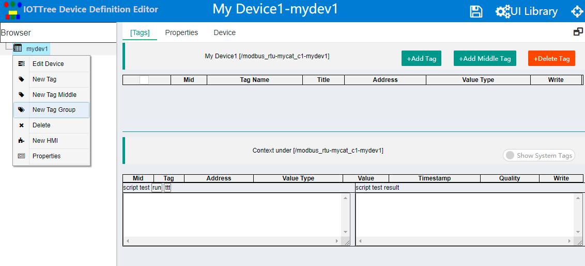
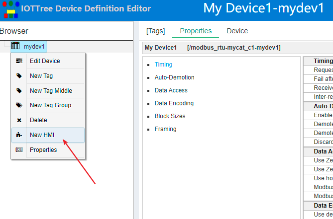
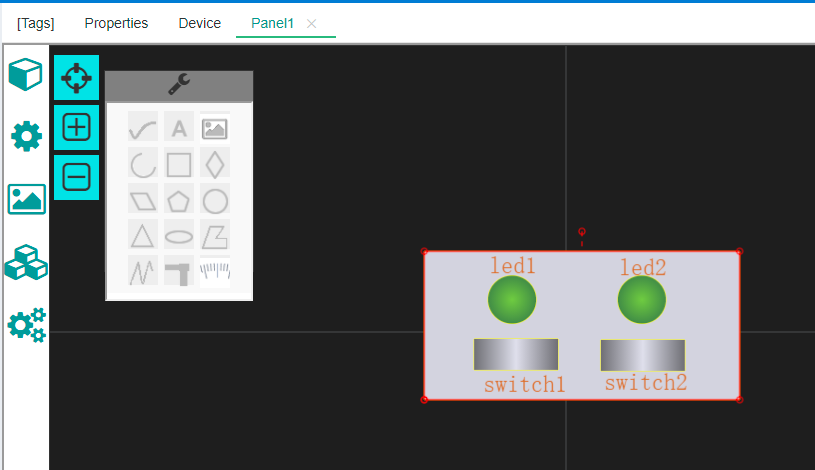
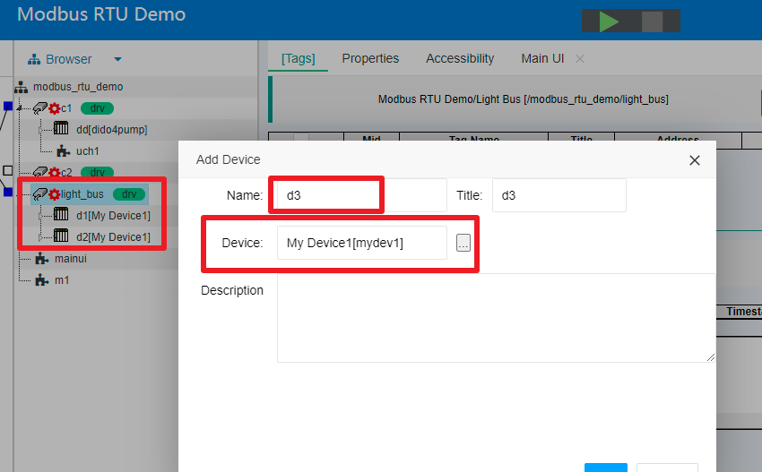
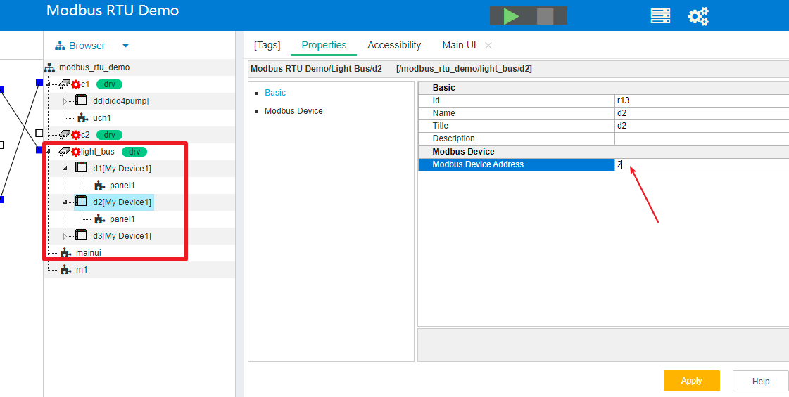
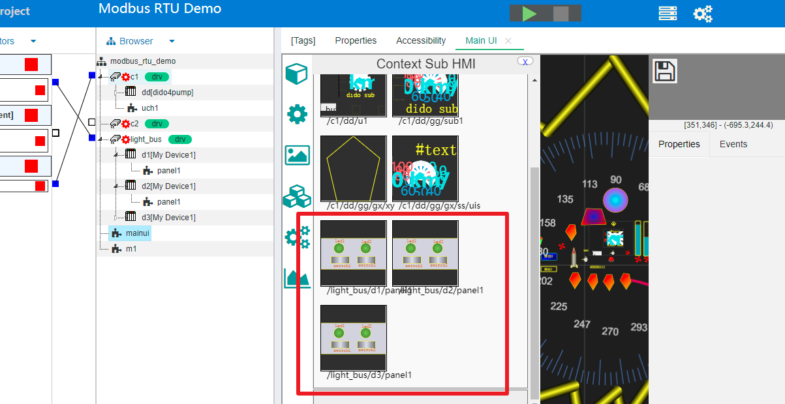

设备定义(Device Definition)
==

本部分内容主要描述设备定义在IOT-Tree Server中的位置和整体概念。

如果要具体定义某个设备，不仅需要了解设备对应的驱动，而且还需要了解在这个驱动下面设备详细特性，如设备提供的数据点位地址等等内容。这些都需要一定的专业知识和自动化领域的工作经验。如果你想深入了解，请参考 [深入理解设备定义Device Definition][adv_devdef]

当你成功登陆IOT-Tree Server的管理界面之后，你会发现在项目列表的下面，有个Device Library。点击右边展开，你就可以进行设备库的查看和管理。

## 1 驱动下面的设备分类和定义

IOT-Tree Server规定设备必须在通道下面建立，并且由通道分配的设备驱动所控制，所以设备定义首先以驱动作为划分，中间在进行一次设备分类。从组织上形成了  设备驱动(Driver-Category-Device Definition)三个层次。

很明显，如果你想让你的设备能够在IOT-Tree Server中支持多种协议（你的设备支持多种通信接口和协议，不同协议对应于IOT-Tree Server的多个驱动），那么你就必须在不同的驱动下面，为你的设备做不同的定义。

### 1.1 设备分类及建议

你可以定义自己的设备分类，并在分类下面定义你的设备。IOT-Tree Server的设备定义导入导出功能，基于分类进行。所以，合理的定义设备分类，能方便你的使用。

建议分类名称和设备名称使用形如 xxx_yyy格式，xxx是你的专属前缀，减少和系统内部自带或其他设备提供则的分类名称冲突。

## 2 设备定义

### 2.1 添加设备分类和设备

在Device Library管理窗口中，选择驱动，然后在Category中点击添加按钮。如下图

点击新增的分类，在Devices列表中添加设备。如下图：

设备添加成功之后，出现在列表中，点击对应的Edit按钮，我们就可以开始对此设备进行详细的编辑定义了。

### 2.2 编辑设备

在设备列表点击编辑按钮之后，会弹出专门的设备编辑界面。此界面与项目树编辑类似。其根部是设备节点，设备如果比较复杂，需要定义的内部数据（以标签Tag的形式）比较多，那么还可也在设备下面增加标签组（TagGroup）节点，对Tag进行分组分级管理。

#### 2.2.1 新增标签Tag
如果设备比较简单，那么你是不需要增加标签组(TagGroup)的。你可以直接在设备根节点下添加标签。如下图：

如图所示的标签添加，和主流的OPC配置设备软件类似。其关键是根据不同的驱动，填写不同的地址（Address）。本部分内容在高级内容中会根据不同的驱动有详细说明，或者在后续的版本中，我们会直接提供在线帮助。
如果你熟悉主流的工业自动化opc软件，那么本部分内容对你来说就比较容易了。但如果你不熟悉opc软件，那么建议你也可以学习一下这些专业内容。

本例子中，我们添加了4个标签，两个只读的led1 led2，两个可以读写的开关 sw1 sw2,它们遵循modbus RTU协议的地址。如下图：

#### 2.2.2 设定设备在驱动下的属性参数
此部分内容需要深入理解设备对应的驱动，以及对应的参数含义。因此，本内容不深入说明，具体请参考设备驱动相关文档或后续可能的在线文档。

点击主内容区Properties标签。如下图：

此属性列表和Modbus RTU驱动相关。在此你可以详细定义你的设备在总线上，具体运行需要的参数，如时间、数据帧等。通过在此详细及专业的定义，设备在具体项目中使用时，就不需要考虑这些复杂设置了。如Modbus RTU设备在项目中只需要设置一个地址即可。

我们对设备数据（Tag）及属性参数设置完成之后，接下来我们还可也为此设备定义交互UI组件，这样可以让设备为项目带来了更多的可重用支持。

#### 定义设备UI
在设备节点鼠标右键，选择添加HMI,取名为panel1

然后再panel1的节点上鼠标右键，选择Edit UI,在主内容区，出现新的标签页，在此我们可以以设备为上下文的根部，编辑UI组件。此部分内容，和项目中的HMI UI组件基本类似。具体请参考相关文档。

我们编辑了一个灯光控制面板，有两个指示灯和两个开关按钮。如下图：

保存之后，我们这个设备定义基本完成了。接下来，这个设备就可以在项目中进行引用。

## 3 与项目的关系

在驱动下面的设备定义(Device Definition)以设备库的形式存在，也说明了在后续的项目中，可以得到重复使用。

以这个文档中的定义好的设备为例，如果一个项目有个RS485总线，总线上面挂接了3个My Device1设备，每个设备的唯一区别就是Modbus地址。那么在IOT-Tree Server中，你可以在项目中定义一个通道和接入对应于现场的这个RS485总线。并且这个通道选用Modbus RTU驱动。如下图：

在项目中，使用了COM3作为现场三个设备的总线接入，同时建立了通道light_bus,内部选择Modbus RTU驱动。

接下来，你可以鼠标右键light_bus这个节点，选择添加设备。重复三次都选择相同的设备，名称分别取名为d1 d2 d3

展开任何一个设备节点，你会发现，在设备定义好的内容都自动复制到项目中了。当然，由于三个设备必须不同的地址，假设为1 2 3。那么，你需要点击d2 d3两个设备节点，并在Properties区，修改对应的地址参数。如下图

保存之后，这三个设备的数据或UI组件，就可以在项目中被使用了。

如下图，项目主界面可以直接引用这三个设备的面板组件

在项目的上下文中，你也可以看到三个设备定义的标签也都到了项目中,你可以在项目中直接使用，如绑定到项目的定制UI中等等。如下图：

[adv_devdef]: ../advanced/adv_devdef.md
