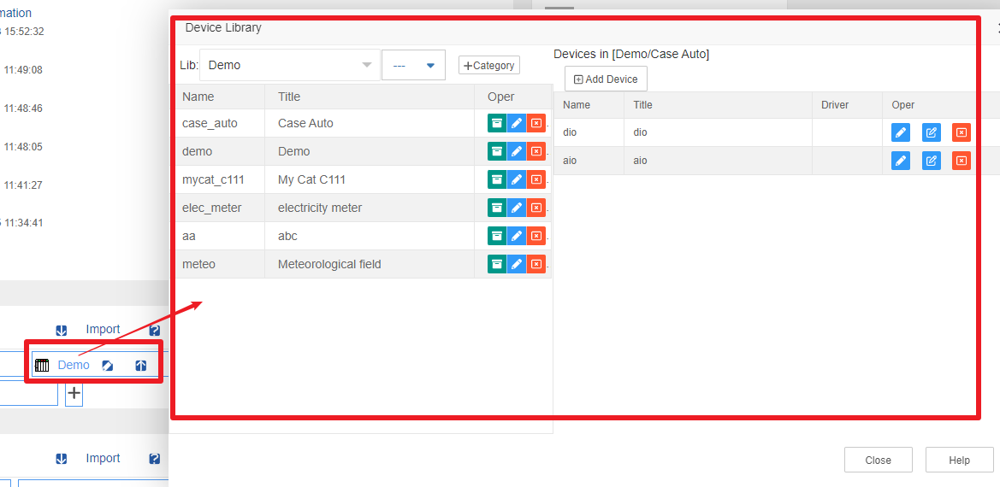
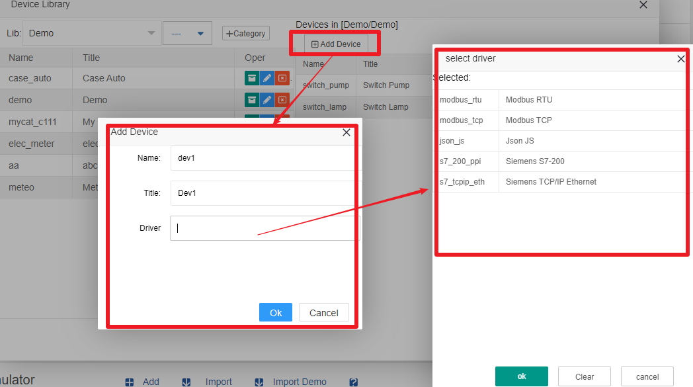
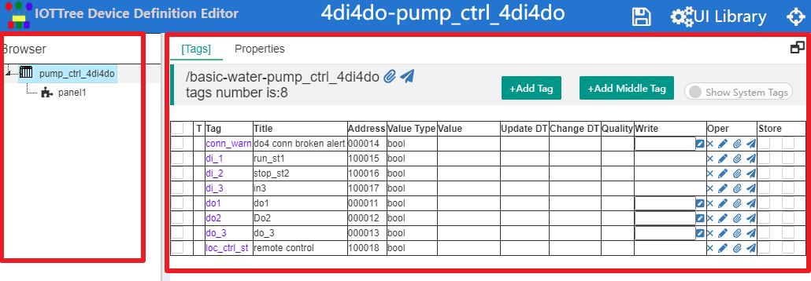
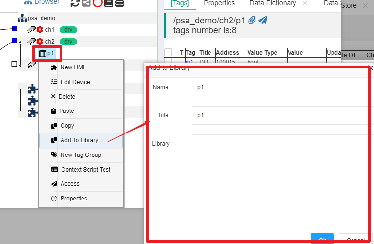

设备库
==

在IOT-Tree登录之后管理主界面中，设备库"Device Library"可以管理本部署实例的所有设备库及内部的设备定义。

设备库以"库-分类-设备定义"三级管理，能够满足丰富多彩的设备定义需要。

## 1 设备库管理

在管理主界面的设备库"Device Library"列表中，点击列表最后的"+"按钮，弹出新增设备库窗口，你只需要输入一个标题即可。新增之后就可以在列表中看到你新增的库。

在库列表中，鼠标移到某个库上方，就会出现操作小按钮图标，有个导出按钮"↑",点击即可下载这个库的所有内容。你也可以在另一个IOT-Tree Server部署实例中，点击设备库"Device Library"的"Import"按钮，选择对应的导出文件，就可以添加导入一个库。

点击某个设备库，就可以弹出这个库的管理界面：

此界面的左边是库的分类列表，你可以点击"+Category"添加分类，在弹出的窗口中填写名称和标题即可。每个分类右边有修改和删除操作，在此可以对此分类进行基本信息的修改。

选中左边的一个分类，右边就会列举出此分类下的所有设备定义。点击"+Add Device",就可以弹出新增设备定义窗口。此时，处理需要的设备名称和标题之外，如果这个设备依赖某种设备驱动，则还需要点击Driver输入框，在弹出的设备驱动列表中选择对应的驱动。如下图：

我们添加了一个设备定义，只有最基本的信息，接下来我们就可以编辑这个设备的详细内容了。

## 2 设备定义编辑

点击设备定义列表右边详细编辑（Edit Detail）按钮，就会弹出一个新的浏览器窗口，进入了这个设备定义的编辑界面。

为了介绍总体内容，我们打开一个现有设备，如下图：

可以看到设备定义总体分为左边"Browser"树状结构和右边的主选项卡界面，和项目类似，已经有了标签（Tags）选项卡和Properties选项卡。

树的操作和项目类似，鼠标右键相关节点，可以看到弹出的操作菜单。根部为设备，下面可以添加标签组（Tag Group）和HMI(UI)节点。并且，在选中某个节点时，右边Tags和Properties选项卡都会跟着变化。从上图我们可以看到，选中根节点，可以看到对应的标签列表。

### 2.1 设备标签编辑

设备编辑中的容器标签有根设备节点和标签组两种，点击并修改里面的标签和项目中的容器节点内标签编辑完全一样。请参考相关文档[标签列表][tag_list]

### 2.2 设备属性编辑

设备属性编辑和项目中的设备编辑也相同，请参考相关文档[属性][prop]的设备设备(Device)节点属性和标签组节点属性。

### 2.3 设备下面的标签组分类

与项目下面的设备管理功能相同，鼠标右键选择添加标签组，就可以在下面建立新的标签组节点，同时还可以在节点下添加管理标签列表。这样也形成了树形层次上下文的关系。

### 2.4 设备UI编辑

鼠标右键设备根节点或标签组节点，添加HMI(UI)节点，可以为设备或设备下面的上下文添加UI界面。这些UI界面上下文也受此节点层次限制。并且在项目中引用此设备时，此UI可以被更高层次的UI节点引用。

相关HMI(UI)编辑详细说明，请参考：[界面HMI（UI）][hmi]。

## 3 设备定义在项目中的使用和提取

设备库是为所有项目服务的。当一个项目用到某个设备时，如果设备库已经存在对应的内容，则可以新增设备时，在Device输入项中，选择打开设备库进行直接添加。添加完成之后，整个设备的定义（子节点、所有的标签、属性和HMI节点）都会被复制到项目中对应的节点。这样很大的方便了项目配置过程。

同时，你肯定也发现了，由于设备定义可以看成是项目中的设备节点，剪下来的树枝，那么在实际项目中定义的新的设备，在测试通过之后，也应该可以新加入到设备库中。IOT-Tree充分支持了这种情况，项目中的设备节点，鼠标右键，选择"Add To Library"。在弹出的窗口中填写新的名称和标题，同时选择某个库及下面的分类，就可以完成新的设备入库操作。如下图：

[tag_list]:../main/tags.md
[prop]:../main/properties.md
[hmi]:../hmi/index.md
