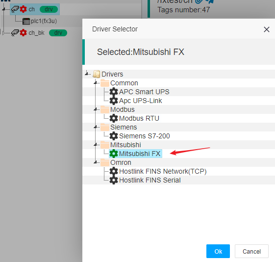
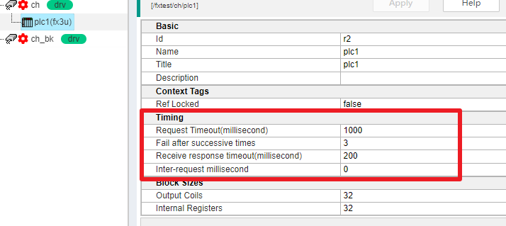

IOT-Tree设备驱动 - 三菱FX
==

当我们运行IOT-Tree Server通过串口直接连接三菱相关系列的PLC(包含通过透明传输的串口-Eth转换网关)时，我们就可以使用驱动 “Mitsubishi FX”。

本驱动支持FX3U、FX2N、FX0N、FX0等系列PLC

## 1 支持的PLC地址

以FX3U这个型号为例，此驱动支持如下地址。其他型号可以在配置标签时查看帮助文档

<table class="layui-table">
  <colgroup>
    <col width="150">
    <col width="150">
    <col>
  </colgroup>
  <thead>
    <tr>
      <th width="30%">设备类型</th>
      <th width="25%">范围</th>
      <th width="15%">数据类型</th>
      <th width="10%">访问</th>
      <th width="20%">例子</th>
    </tr> 
  </thead>
  <tbody>
    <tr>
      <td rowspan="1">输入Inputs</td>
      <td>X000 - X377(Octal)</td>
      <td>bool</td>
      <td>读</td>
      <td></td>
    </tr>
    <tr>
      <td rowspan="1">输出Outputs</td>
      <td>Y000 - Y377(Octal)</td>
      <td>bool</td>
      <td>读/写</td>
      <td></td>
    </tr>
    <tr>
      <td rowspan="2">辅助继电器Auxiliary Relays</td>
      <td>M0000 - M7679</td>
      <td>bool</td>
      <td>读/写</td>
      <td></td>
    </tr>
    <tr>
      <td>M8000 - M8511</td>
      <td>bool</td>
      <td>读/写</td>
      <td></td>
    </tr>
    <tr>
      <td rowspan="1">状态States</td>
      <td>S0000 - S4095</td>
      <td>bool</td>
      <td>读/写</td>
      <td></td>
    </tr>
    <tr>
      <td rowspan="1">计时器触点Timer Contacts</td>
      <td>TS000 - TS511</td>
      <td>bool</td>
      <td>读</td>
      <td></td>
    </tr>
    <tr>
      <td rowspan="1">计数器触点Counter Contacts</td>
      <td>CS000 - CS255</td>
      <td>bool</td>
      <td>读</td>
      <td></td>
    </tr>
    <tr>
      <td rowspan="1">计时器重置Timer Reset</td>
      <td>TR000 - TR511</td>
      <td>bool</td>
      <td>读/写</td>
      <td></td>
    </tr>
    <tr>
      <td rowspan="1">计数器重置Counter Reset</td>
      <td>CR000 - CR255</td>
      <td>bool</td>
      <td>读/写</td>
      <td></td>
    </tr>
    <tr>
      <td rowspan="1">计时器值Timer Value</td>
      <td>T000 - T511</td>
      <td>int16,uint16</td>
      <td>读/写</td>
      <td></td>
    </tr>
    <tr>
      <td rowspan="2">计数器值Counter Value</td>
      <td>C000 - C199</td>
      <td>int16,uint16</td>
      <td>读/写</td>
      <td></td>
    </tr>
    <tr>
      <td>C200 - C255</td>
      <td>int32,uint32</td>
      <td>读/写</td>
      <td></td>
    </tr>
    <tr>
      <td rowspan="4">数据寄存器Data Register</td>
      <td>D0000 - D7999</td>
      <td>int16,uint16</td>
      <td>读/写</td>
      <td></td>
    </tr>
    <tr>
      <td>D0000 - D7998</td>
      <td>int32,uint32,float</td>
      <td>读/写</td>
      <td></td>
    </tr>
    <tr>
      <td>D8000 - D8511</td>
      <td>int16,uint16</td>
      <td>读/写</td>
      <td></td>
    </tr>
    <tr>
      <td>D8000 - D8510</td>
      <td>int32,uint32,float</td>
      <td>读/写</td>
      <td></td>
    </tr>
  </tbody>
</table>

## 2 设置通道驱动

在项目中，新增或修改通道驱动时，选择如下：

## 3 设备相关参数

### 3.1 时间参数

在此驱动对应的通道下面，设备的时间参数比较重要，一些参数如果设置过小，则容易出现丢包现象：

1) Request Timeout (millisecond)

此参数在IOT-Tree端向目标PLC发送请求指令之后，等待返回的过期时间。如果PLC端没有及时返回数据，则可能出现过期错误。

2) Receive response timeout (millisecond)

在接收应答数据过程中，如果在数据包未结束之前，接收下一个数据超过此时间，则认为应答失败

3) Inter-reqeust millisecond

由于我们配置的标签可能涉及PLC的多个内存区域，基本上一次数据更新在驱动层会出现多个请求应答指令。每个指令之间，设置合适的时间间隔，可以保证通信更稳定。

### 3.2 数据块大小

由于三菱PLC的FX通信协议，底层基本以线圈和寄存器两种方式读取数据，并且每个请求指令都是有限定大小的。为了能够更可靠的通信，我们可以设置此参数，使得每个请求限定一次读取多少个线圈或寄存器，这样可以使得数据包在合适的大小下，不仅能够满足效率，同时提升可靠性。

