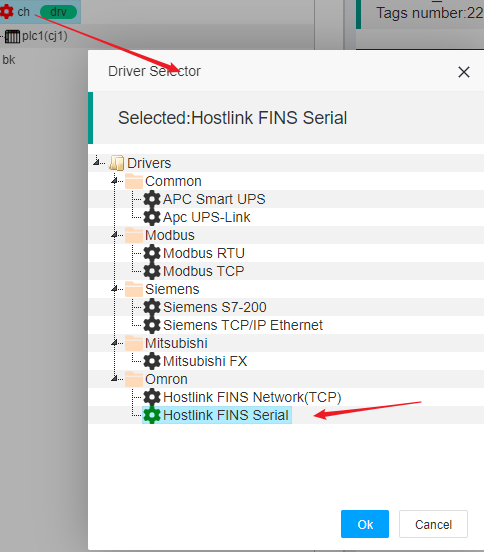
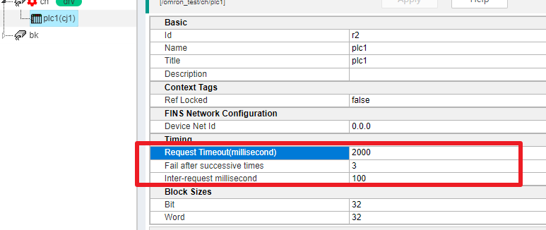
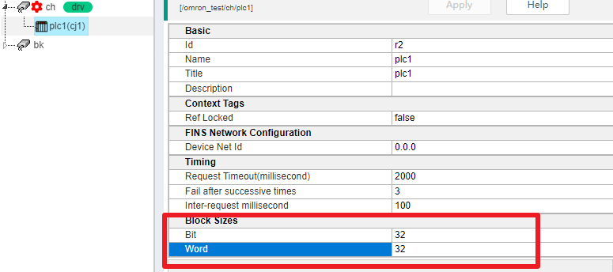

IOT-Tree设备驱动 - 欧姆龙 HostLink FINS Serial</a>
==

当我们运行IOT-Tree Server通过串口直接连接欧姆龙相关系列的PLC(包含通过透明传输的串口-Eth转换网关)时，我们就可以使用欧姆龙Hostlink协议进行通信，当然内部运行的是FINS相关命令。所有本驱动命名为“HostLink FINS Serial”。

本驱动支持CP1 CJ1 CJ2 CS等系列PLC

## 1 支持的PLC地址

以CP1/CJ1这个型号为例，此驱动支持如下地址。其他型号可以在配置标签时查看帮助文档

<table class="layui-table">
  <tr>
      <th width="30%">设备类型</th>
      <th width="25%">范围</th>
      <th width="15%">数据类型</th>
      <th width="10%">访问</th>
      <th width="20%">例子</th>
    </tr>
    <tr>
      <td rowspan="6">辅助继电器Auxiliary Relay</td>
      <td>A000 - A447</td>
      <td>int16,uint16</td>
      <td>读</td>
      <td></td>
    </tr>
    <tr>
      <td>A000 - A446</td>
      <td>int32,uint32,float</td>
      <td>读</td>
      <td></td>
    </tr>
    <tr>
      <td>A448 - A959</td>
      <td>int16,uint16</td>
      <td>读/写</td>
      <td></td>
    </tr>
    <tr>
      <td>A448 - A958</td>
      <td>int32,uint32,float</td>
      <td>读/写</td>
      <td></td>
    </tr>
    <tr>
      <td>A000.xx - A447.xx [00-xx-15]</td>
      <td>bool</td>
      <td>读/写</td>
      <td></td>
    </tr>
    <tr>
      <td>A448.xx - A959.xx [00-xx-15]</td>
      <td>bool</td>
      <td>读/写</td>
      <td></td>
    </tr>
    <tr>
      <td rowspan="3">CIO区</td>
      <td>CIO0000 - CIO6143</td>
      <td>int16,uint16</td>
      <td>读/写</td>
      <td></td>
    </tr>
    <tr>
      <td>CIO0000 - CIO6142</td>
      <td>int32,uint32,float</td>
      <td>读/写</td>
      <td></td>
    </tr>
    <tr>
      <td>CIO0000.xx - CIO6143.xx [00-xx-15]</td>
      <td>bool</td>
      <td>读/写</td>
      <td></td>
    </tr>
    <tr>
      <td rowspan="1">计数器Counter</td>
      <td>C0000 - C4095</td>
      <td>int16,uint16</td>
      <td>读/写</td>
      <td></td>
    </tr>
    <tr>
      <td rowspan="1">计数器状态Counter Status</td>
      <td>CS0000 - CS4095</td>
      <td>bool</td>
      <td>读/写</td>
      <td></td>
    </tr>
    <tr>
      <td rowspan="3">数据区Data Memory</td>
      <td>D00000 - D32767</td>
      <td>int16,uint16</td>
      <td>读/写</td>
      <td></td>
    </tr>
    <tr>
      <td>D00000 - D32766</td>
      <td>int32,uint32,float</td>
      <td>读/写</td>
      <td></td>
    </tr>
    <tr>
      <td>D00000.xx - D32767.xx [00-xx-15]</td>
      <td>bool</td>
      <td>读/写</td>
      <td></td>
    </tr>
    <tr>
      <td rowspan="2">数据寄存器Data Register</td>
      <td>DR00 - DR15</td>
      <td>int16,uint16</td>
      <td>读/写</td>
      <td></td>
    </tr>
    <tr>
      <td>DR00 - DR14</td>
      <td>int32,uint32,float</td>
      <td>读/写</td>
      <td></td>
    </tr>
    <tr>
      <td rowspan="3">保持继电器Holding Relay</td>
      <td>H0000 - H1535</td>
      <td>int16,uint16</td>
      <td>读/写</td>
      <td></td>
    </tr>
    <tr>
      <td>H0000 - H1534</td>
      <td>int32,uint32,float</td>
      <td>读/写</td>
      <td></td>
    </tr>
    <tr>
      <td>H0000.xx - H1535.xx [00-xx-15]</td>
      <td>bool</td>
      <td>读/写</td>
      <td></td>
    </tr>
    <tr>
      <td rowspan="1">索引寄存器Index Register</td>
      <td>IR00 - IR15</td>
      <td>int16,uint16</td>
      <td>读/写</td>
      <td></td>
    </tr>
    <tr>
      <td rowspan="1">任务标记Task Flag</td>
      <td>TK00 - TK31</td>
      <td>bool</td>
      <td>读</td>
      <td></td>
    </tr>
    <tr>
      <td rowspan="1">定时器Timer</td>
      <td>T0000 - T4095</td>
      <td>int16,uint16</td>
      <td>读/写</td>
      <td></td>
    </tr>
    <tr>
      <td rowspan="1">定时器状态Timer Status</td>
      <td>TS0000 - TS4095</td>
      <td>bool</td>
      <td>读/写</td>
      <td></td>
    </tr>
    <tr>
      <td rowspan="3">工作继电器Working Relay</td>
      <td>W000 - W511</td>
      <td>int16,uint16</td>
      <td>读/写</td>
      <td></td>
    </tr>
    <tr>
      <td>W000 - W510</td>
      <td>int32,uint32,float</td>
      <td>读/写</td>
      <td></td>
    </tr>
    <tr>
      <td>W000.xx - W511.xx [00-xx-15]</td>
      <td>bool</td>
      <td>读/写</td>
      <td></td>
    </tr>
</table>

## 2 设置通道驱动

在项目中，新增或修改通道驱动时，选择如下：

## 3 设备相关参数

### 3.1 时间参数

在此驱动对应的通道下面，设备的时间参数比较重要，一些参数如果设置过小，则容易出现丢包现象：

1) Request Timeout (millisecond)

此参数在IOT-Tree端向目标PLC发送请求指令之后，等待返回的过期时间。如果PLC端没有及时返回数据，则可能出现过期错误。

2) Inter-reqeust millisecond

由于我们配置的标签可能涉及PLC的多个内存区域，基本上一次数据更新在驱动层会出现多个请求应答指令。每个指令之间，设置合适的时间间隔，可以保证通信更稳定。

### 3.2 数据块大小

由于欧姆龙PLC的FINS通信协议，底层基本以Word和Bit两种方式读取数据，并且每个请求指令都是有限定大小的。为了能够更可靠的通信，我们可以设置此参数，使得每个请求限定一次读取多少个Work或Bit，这样可以使得数据包在合适的大小下，不仅能够满足效率，同时提升可靠性。

