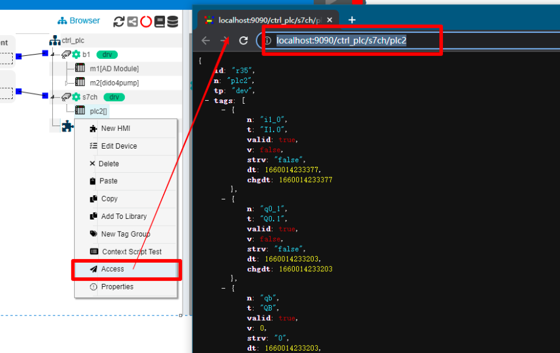

IOT-Tree设备驱动 -PPI
==


PPI通信协议是西门子"PLC S7-200 CPU"内置协议。物理上基于RS-485通信联络，通过屏蔽双绞线就可以实现PPI通讯。PPI协议是一种主-从协议。主站设备发送要求到从站设备，从站设备响应，从站不能主动发出信息。主站靠PPI协议管理的共享连接来与从站通讯。PPI协议并不限制与任意一个从站的通讯的主站的数量，但在一个网络中，主站不能超过32个。

IOT-Tree内置了PPI协议的支持，可以直接通过RS-485对应的COM口，直接和PLC进行通信。本部分内容以网上的一个使用例子来说明。


## 1 设备和环境准备

### 1.1 对接PLC方法


现场使用的PLC型号为"S7-200 CPU 224XP CN"，这个PLC有两个RS485接口（对应两个9针接口的3、8）。


S7-200的9针接口定义如下图：


只需要使用两芯屏蔽电缆，对接8脚A、3脚B，屏蔽层接9针接头的屏蔽外壳即可。有了RS485接口，你可以有如下方式与PLC进行通信物理连接

1）如果你运行IOT-Tree Server的设备自身有RS485接口，那么连上即可。

2）如果你运行IOT-Tree Server是PC，则可以使用PC的串口RS232转RS485或USB-RS485进行连接。

注：以上两种，在系统中都会使用串口对接。

3）你可以使用一个支持RS485接口的串口服务器模块进行对接，然后转换成以太网，使用TCP方式进行对接。

本例使用第二种方式，使用系统中的COM3与PLC进行连接


### 1.2 PLC端准备


使用"STEP 7 MicroWIN"对PLC进行本地控制编程，如果程序使用自己的协议占用了其中一个接口，那么就不要用这个接口对接了，这部分就看你自己怎么玩了。

"S7-200 RS485"口如果不被占用，就直接支持PPI协议了。其中，PLC地址为2

给PLC通电，通过编程电缆下载程序并启动。


## 2 IOT-Tree端配置过程


IOT-Tree已经在PC上部署，并且准备使用COM3接口与上面准备好的PLC进行RS485通信。

点击进入项目配置界面，如下图：


### 2.1 新增COM Connector和通道

点击左上角Connectors，在菜单中选择COM，然后在弹出的窗口中，填写如下内容：


点击Ok按钮，就可以看到左边接入区域新增了一个COM接入。

接着我们在项目根节点鼠标右键，选择New Channel，在弹出窗口中，填写如下内容：


其中，Driver点击选择"Siemens S7-200"。这个驱动对应与PPI协议。点击OK完成通道的添加。

接着，鼠标点击接入"s7_2"的右边的小正方形不松开，拖拉线段到通道"s7ch"左边的小正方形上方松开，系统就会建立接入到通道之间的关联，如下图：


从中我们可以看出，如果左边接入使用串口转以太网方式，那么只需要使用不同的关联即可，并不影响通道相关配置（接入和数据组织的分离，使得IOT-Tree能够更加优雅的应对各种设备和数据的接入）。


### 2.2 新增PLC设备

在通道s7ch节点上鼠标右键，选择New Device，在弹出窗口中填写设备信息：


```
Name=plc2
```

其他都不需要填写了，点击OK之后，通道下面就会出现对应设备节点。点击此节点，在右边主内容区域点击Properties标签，在属性"Device Address"行修改值为2(这个就是我们前面配置PLC的地址).然后点击右上角的Apply按钮保存。如下图：


### 2.3 新增设备数据标签(Tag)


S7-200内部数据通过不同的存储区方式进行，如输出映像寄存器区Q、输入映像寄存器I、变量存储区V等等。IOT-Tree Server对应的PPI驱动也兼容此PLC数据寻址方式。

在主内容区域点击[Tags]标签,下面的内容就是plc2设备对应的数据项列表界面。我们可以点击上方的+Add Tag按钮进行添加。

在弹出窗口中，我们填写如下内容：


```
Name=q0_1
Title=Q0.1
Date type=bool
R/W=Read/Write
Address=Q0.1
```


点击OK之后，就可以看到列表中新增了这一项。

用同样方法，我们新增如下内容：


```
Name=qb
Title=QB
Date type=uint8
R/W=Read/Write
Address=QB0

Name=t40
Title=T40
Date type=uint32
R/W=Read Only
Address=T40

Name=i1_0
Title=I1.0
Date type=bool
R/W=Read Only
Address=I1.0

Name=vb100
Title=VB100
Date type=uint8
R/W=Read/Write
Address=vb100
```

最终，我们在设备plc2下面，完成了如下数据项列表：


其中，关键内容是每个Tag的Address内容，这个写法兼容西门子的PLC编程软件。另外一个对应的是值类型（Value type），可以看出输入的Address可能会限定"Value type"。在编写时，可以点击Address右边的“Check Address"按钮，就会自动帮你修改。

我们配置的这些Tag会在IOT-Tree Server的这个项目中被使用，很明显，如果你想让IOT-Tree和PLC内部的程序协调配合做控制，那么通过一些公共的变量定义成Tag进行互相写入读取即可。

接下来，我们就可以运行查看效果了。


## 3 运行效果


在确保PLC已经通电运行，并且COM3不被占用的情况下，点击项目配置上方的绿色启动项目按钮。


可以看到，所有的数据点都正常运行了，并且可以看到一些值的变化，如我的PLC程序使用了定时器T40，一直在改变值。

对于"q0_1"这个点，你可以在Write列输入1，点击右边写入按钮，可以发现PLC的"Q0.1"端口有输出（指示灯也同时变亮，前提是此输出没有受到你的PLC程序控制）。


## 4 更进一步


你可以在此项目中，新增人机交互节点（HMI），并且通过在线编辑功能进行操作界面的设计。这部分内容请参考HMI相关内容。在本项目中，实现了如下监控画面：


或者，你也可以把项目中的组织节点直接输出"http json"格式的数据，方便其他系统调用实时数据。如你在plc2节点上鼠标右键，点击Access，在弹出窗口中可以查看输出的json格式数据，非常方便其他系统获取：



