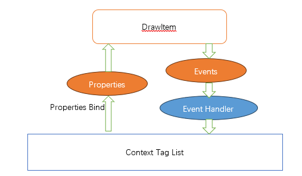
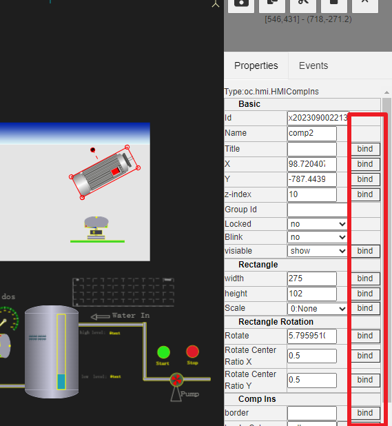
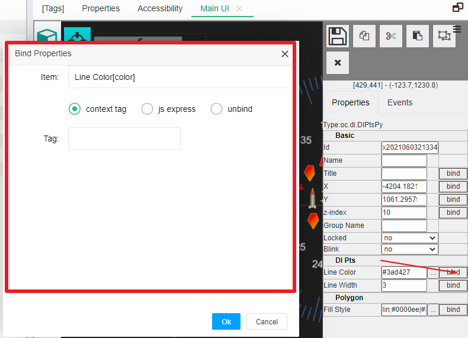
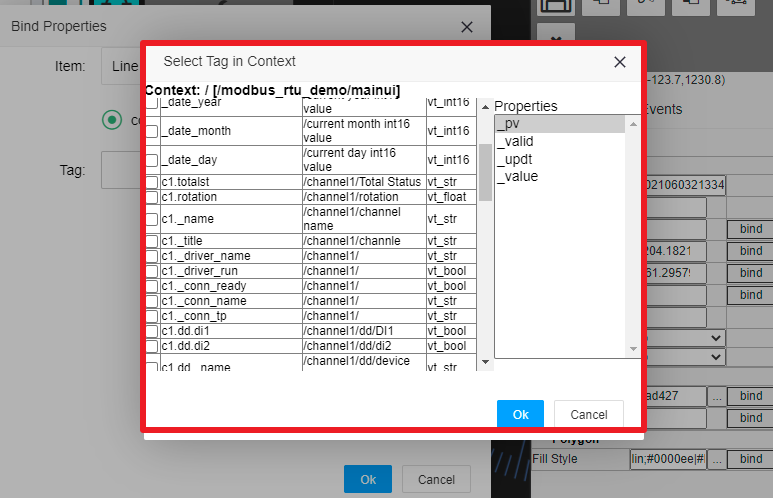
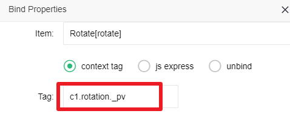
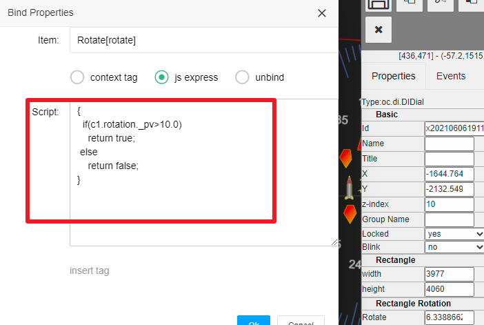
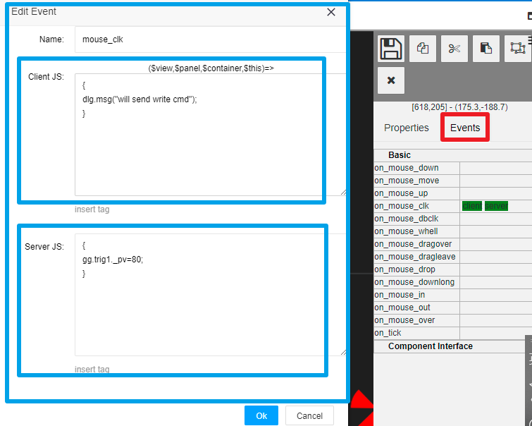

HMI属性绑定和事件处理
==

IOT-Tree Server提供了强大的在线人机交互UI编辑功能。你如果对此还不了解，请参考[人机交互UI(HMI UI)编辑操作说明][qn_hmi_edit]。

交互UI编辑能够让你根据你的需要建立你的监控画面或场景。接下来，你要如何才能够让这些监控画面，根据你的实时数据做动态变化呢？反过来，你也需要要对被监控设备下达控制指令，这个又如何实现的呢？

IOT-Tree Server通过图元属性绑定机制来建立UI组件与数据上下文之间的关联。同时，图元提供了事件响应机制为用户的动作做相关的响应。

## 1 图元属性绑定（Bind）

在UI编辑区域右边的属性栏中，如果某个属性支持绑定（bind），则会在属性右边出现一个bind按钮。

点击此按钮，就可以打开属性绑定窗口。绑定属性有两种：上下文标签(Tag)绑定和js表达式绑定。

其中，上下文标签Tag基于hmi ui节点所属的容器节点对应的数据上下文。而基于js的表达式可以提供更加灵活的属性数据生成方式，如：你可以根据多个上下文标签(Tag)满足特定的逻辑并输出满足属性展示的数据类型和值。

HMI UI中的图元在绑定(bind)之后，启动项目，并且访问运行界面(鼠标右键，选择"Access"即可打开)。你会看到图元属性值会随着标签数据变化而变化，也即产生动态变化的画面效果。

### 1.1 基于上下文标签(Tag)绑定

点击Tag输入框，可以弹出此hmi ui可以使用的上下文标签，以及对应的属性值。你可以直接进行选择即可。如下图：

选择完成之后，Tag输入框就会出现上下文标签对应的唯一标识串：

### 1.2 js表达式绑定

基于hmi ui上下文所在的运行环境，可以使用JS语法格式的表达式对绑定数据进行定义。如下图：

对于js表达式更多了解请参考 [JS脚本支持][qn_js_exp]。

## 2 图元事件处理

在选中图元之后，点击右边的事件栏（Events）。可以看到此图元能够提供的所有事件。如on_mouse_down为用户鼠标在图元上按下的事件。如果你想在用户点击此图元时，产生相关的UI变化或服务端做相应的动作（如对设备下达某个指令），那么此时你就需要添加此事件的处理JS脚本。

在对应的事件点击输入框，弹出事件处理JS脚本编辑界面。如下图：

如图所示，事件处理JS脚本分为客户端JS（Client JS）和服务端JS（Server JS）。

在客户端运行主要基于浏览器HMI UI框架运行，不允许和服务端有任何交互，主要通过UI框架对图元属性进行动态的调整，形成图元展示的动态变化。详细内容请参考[JS支持][qn_js_exp]。

在服务端运行的脚本，响应浏览器端事件，但全部脚本都在服务端运行。其运行环境主要基于UI所属节点对应的标签数据上下文。在服务端，脚本可以直接读取或写标签值（最终可能会通过标签对应的设备驱动，对设备下达指令）。详细内容请参考[JS支持][qn_js_exp]。

综上所述，我们要为用户提供自动化监控动态画面，只需要绑定由上下文中标签列表提供的数据即可。反过来，如果要为用户提供操作输入或指令下达，只需要在对应的操作图元事件上处理上，对上下文中的标签写入数据即可。从中可以看出，这个过程非常简单，你只需要稍微了解一些JS脚本知识，就可以轻松掌握。

[qn_js_exp]: ../js/index.md
[adv_js_exp]: ../advanced/adv_js_exp.md
[qn_hmi_edit]: ./hmi_edit.md
