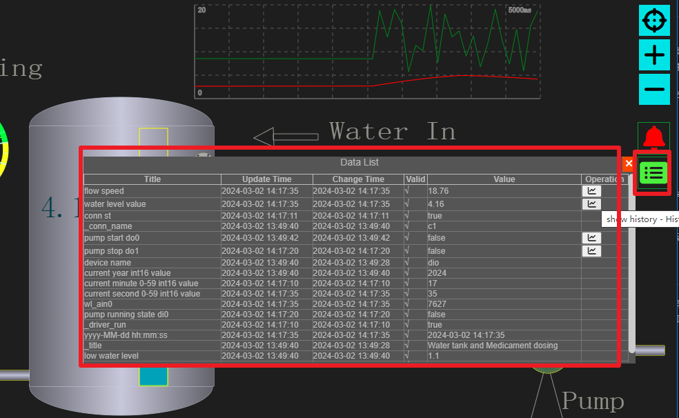
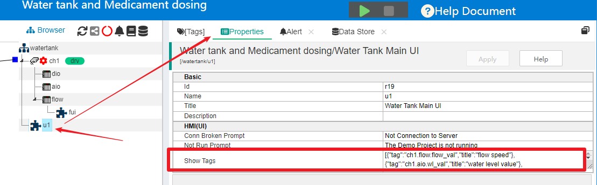
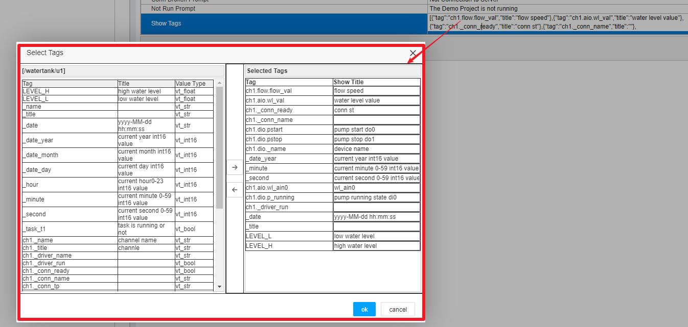
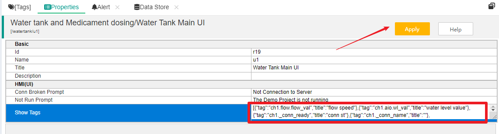
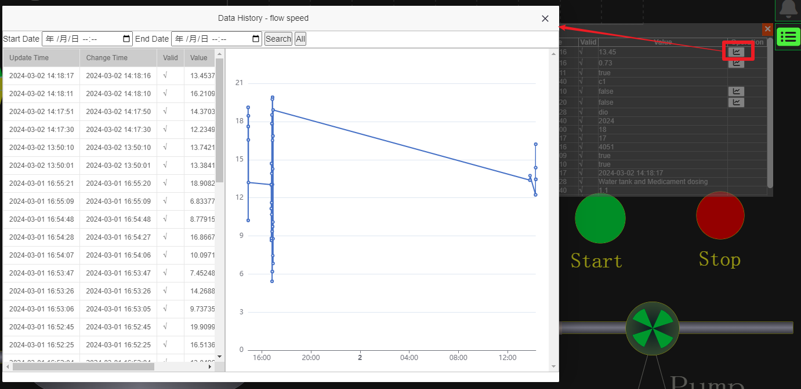

HMI客户端数据列表展示
==

如果你使用IOT-Tree Server完成了一个项目，准备交付给最终用户使用。那么最终用户使用最多的是你给他们配置的监控画面。你如果把IOT-Tree Server的项目管理端直接提供给最终用户并不是好的选择——毕竟太专业，并且也不安全。

监控画面除了你在线编辑的图元和绑定数据之外，最终用户还需要如下内容：

1) 用户要求能够直观在现场监控画面中，查看特定的一些数据，这些数据可能数量很多，不可能全部做到监控画面中。

2) 用户需要对某些数据指标做记录存储，并且可以在前端的监控画面中查看历史记录。

从版本1.0.4开始，IOT-Tree Server支持数据存储和历史数据记录功能。相关内容请参考：<a href="doc/main/store.md" target="main">&nbsp;&nbsp;&nbsp; 数据储存</a>

为此，IOT-Tree对监控画面运行前端也做了标签数据列表和历史数据展示支持。

## 1 前端标签数据展示

为了能够使HMI(UI)在运行时支持标签数据列表，我们在前端监控画面，增加了列表窗口图标，点击之后可以展示数据列表子窗口。如下图：

其中，如果某个展示数据有历史存储数据，则右边就会有对应的展示按钮。

很明显，我们没必要也不允许把项目中的所有标签数据都展示到这个子窗口中。这就带来一个问题，我们如何方便快速的设定某个监控画面需要展示的标签数据么？

通过综合考虑，我们在项目HMI节点属性中进行提供设定支持。

## 2 项目管理端HMI节点配置

在项目管理页面中，我们点击选中某个HMI(UI)节点，然后在右边主内容区选择"Properties"，你可以看到，在这个节点属性编辑列表中，有个"Show Tags"内容。如下图：

点击此列表项右边编辑区域，就会弹出一个选择窗口：

你可以看到，弹出窗口中，左边是此UI节点上下文中所有的标签数据，右边是选中的标签。并且你可以对选定的标签重新设置展示标题。中间是选择和取消选择按钮。

你只需要选择，修改标题，然后点击“Ok”就可以完成了这个UI画面在运行时数据展示子窗口中的数据项内容。请注意，点击属性列表上方“Apply”按钮进行保存。

## 3 最终效果

通过以上简单的设置过程，你的对应监控画面在运行时，就可以直接展示实时数据了。如果某个标签被存储管理配置了历史存储。那么还可以点击打开查看历史数据。

