人机交互UI(HMI UI)编辑操作说明
==

当我们在某个HMI节点鼠标右键，选择"Edit",就可以在主内容区新增一个界面编辑选项卡。如下图：

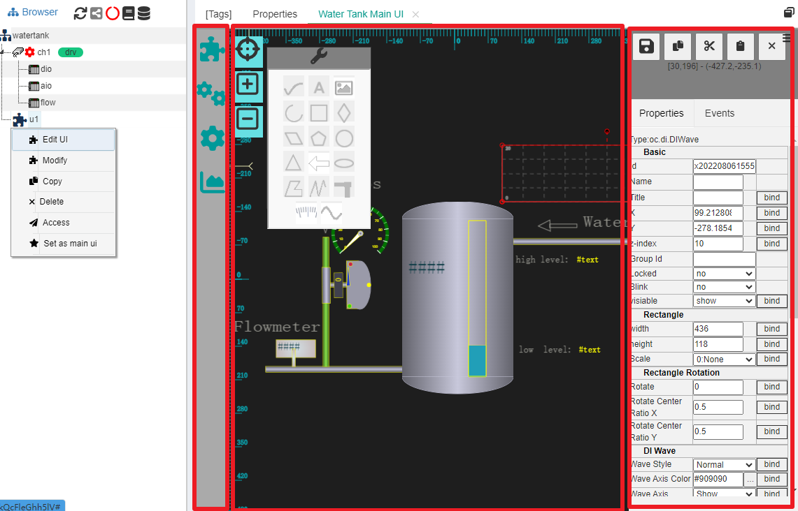

编辑界面看似比较复杂，其主要部分也就左中右三部分，左边竖条是图元库（含树中之节点、图元库、背景元素等）中间带标尺的是编辑区域(含基本图元飘窗)，右边是操作属性/事件区域。其中，右边操作属性区可以隐藏，尽可能给编辑区域使用。如果感觉整个编辑区域不够，还可以点击选项卡右上角最大化图标，可以使得选项卡充满整个窗口。

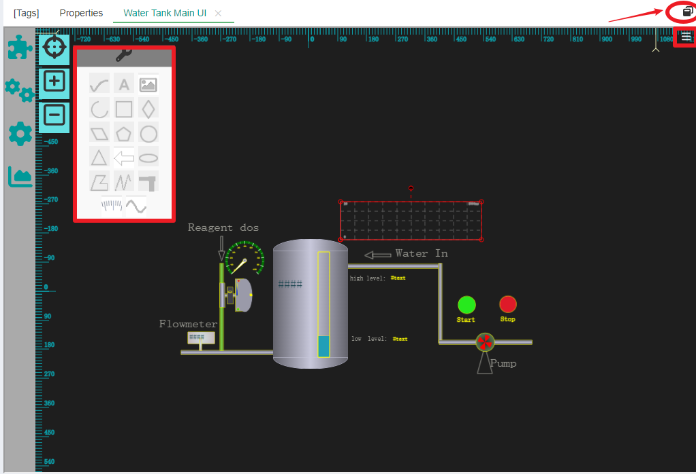

## 1 编辑界面基本操作

### 1.1 无极缩放

编辑区域使用无极缩放方式，并且配合鼠标可以快速查看整体和局部。在编辑区域左上方有竖排列三个按钮，它们分别为"自适应展示"、"放大"和"缩小"。

点击"自适应展示"按钮，编辑区内的所有内容以充满整个区域，这个中心点和放大倍数是整体展示最理想的状态。而点击"放大"和"缩小",则图像以编辑区中心点为中心进行放大缩小。

移动鼠标到编辑区的某个位置，然后转动滚轮，你会发现图像会根据你的滚轮不同方向进行放大缩小，并且放大缩小动作以当前鼠标的位置为中心点。

### 1.2 鼠标右键(整体移动画面)

鼠标右键点击画面不松开，移动时可以整体对画面进行漫游。

### 1.3 鼠标左键(选择和移动)

鼠标左键功能主要是选择图元和移动图元，IOT-Tree规定，图元的移动必须是选择之后的图元——也即是，如果要移动一个或多个图元，必须先选中，然后在选中的图元之上再次移动操作才会起作用。

#### 1.3.1 选择图元

_单选图元_

鼠标移动到某个图元上方，在没有任何移动的情况下点击左键并释放左键，释放之后就会发现图元被选中。

如果某个位置有多个图元叠加，则不要移动鼠标，再次鼠标左键并释放，你会发现被选择的图元会在重叠的图元中切换。

_多选图元_

如果你要在一个区域内选择多个图元，那么只需要按下鼠标左键不松开，然后移动鼠标。此时你会发现有个虚线构成的矩形选择区域出现，并随着你的鼠标位置不断变化尺寸。你只需要使这个虚线选择框覆盖到对应的多个图元，然后松开左键，就可以把多个图元同时选中了。

>注：被选中的图元都会有个红色的矩形边框出现

如果你要取消选中的图元，只需要鼠标在没有图元的区域左键点击一下即可。

#### 1.3.2 移动选中图元

未选中的图元是不可移动的，所以在通过单选或多选之后，你就可以移动选中的这些图元了。此时，鼠标一定要在被选中的图元上方，按下左键不要松开，然后移动鼠标，你会发现图元会跟随鼠标移动。当图元到达你需要的位置之后，松开鼠标左键就完成了移动操作。

#### 1.3.3 修改选中图元尺寸

一些图元是支持尺寸大小通过鼠标调整的，前提是单独选中此图元——选中的图元会显示出矩形边界框。此时，如果此图元可以被改变大小尺寸，把鼠标移到边界线上，你就会发现鼠标标记会变成可调整的上下或左右的箭头。如果鼠标移到编辑框的角上，就会变成移动此点（含两个方向）的箭头。

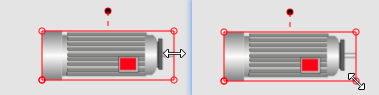

此时，你按下鼠标左键不松开，移动就可以改变图元的尺寸。

#### 1.3.4 旋转选中图元

一些图元支持旋转，前提是单独选中此图元——选中的图元会显示出矩形边界框，并且在边框上方会出现一个支持旋转的锚点。鼠标移动到这个位置，会变成十字形状。此时，你按下鼠标左键不松开，移动就可以调整图元的旋转角度。

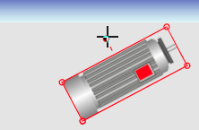

### 1.4 键盘操作说明

#### 1.4.1 复制粘贴

在选中图元时，使用键盘组合键Ctrl+C，可以对当前选中的图元进行复制。

然后，再使用键盘组合键Ctrl+V，可以绘图区鼠标位置粘贴被复制的图元。此时移动鼠标时，被复制图元会跟着鼠标移动。你可以移动鼠标在合适的位置，点击鼠标左键进行放置。

如果要放弃粘贴，则点击鼠标右键即可。

IOT-Tree Server支持跨绘图区复制粘贴。

#### 1.4.2 删除操作

选中图元，按键del就可以删除对于的图元。

#### 1.4.3 回退

TODO

## 2 编辑属性栏说明

在绘图区右边，是属性编辑区域。当鼠标选中某个图元时，属性区会显示此图元对于的所有属性。如下图：

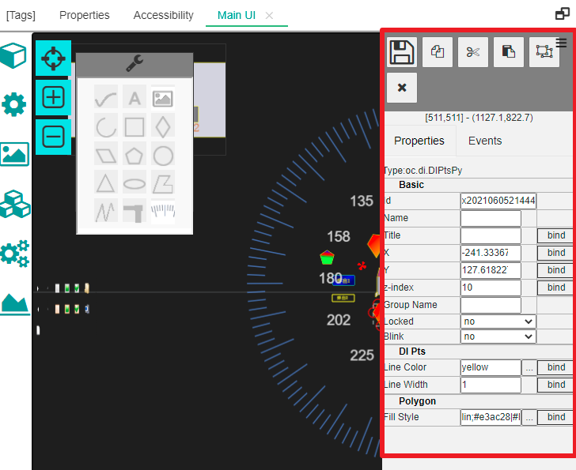

### 2.1 基本属性

所有的图元都有基本属性，如上图所示。基本属性包含Id,Name,Title,坐标位置x,y，堆叠高度z-index。是否锁定等Locked。

其中，Id由系统自动生成，名称在此UI编辑区域必须唯一，并且符合名称命名限定。坐标位置是此图元左上角在绘图区域中的坐标（笛卡尔坐标系）。

z-index作为图元的堆叠高度，和css中的z-index类似，值越大，绘画顺序越靠后。当一个图元和其他图元有重叠时，其显示效果z-index越大，越显示在下面的图元之上。

Locked属性如果设定为yes,则图元将在绘图区域被锁定。鼠标无法对此进行拖动。并且鼠标在一个矩形区域多选图元时，被锁定的图元将不会被选中。不过，单击鼠标选择还是可以对被锁定图元进行单个选择的，此时，你还可以对此进行属性修改或解锁操作。

这些基本属性属于通用属性的一部分，详细内容请参考[图元通用属性说明][hmi_props]

[hmi_props]:./hmi_props.md

### 2.2 基础图元和属性

基础图元有折线、多边形、圆形、椭圆、圆弧、文字、图片、管道（未实现）、贝塞尔曲线等。他们都有各自的属性和特点。

在绘图区左上角，有个基本图元工具栏。点击其中的某个图元进行选择，鼠标光标移动到回去区域之后会变成十字，点击鼠标左键并移动，就可以开始绘制对应的基础图元。释放左键之后，当前新建的图元缺省被选中。你可以接着进行调整和属性修改。

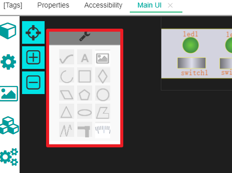

#### 2.2.1 折线编辑及属性

点击工具栏,然后在绘图区点击左键并移动绘画折线。当折线绘图完成，点击鼠标右键进行绘图结束操作。

当折线被选中时，每个线段上的交点都可以用鼠标进行拖动，以此支持对折线进行调整修改。

在属性区可以对线的颜色Line Color和线宽Line Width进行修改。如下图：

#### 2.2.2 多边形编辑及属性

点击工具栏,然后在绘图区点击左键并移动绘画多边形。当多边形绘图完成，点击鼠标右键进行绘图结束操作。

当多边形被选中时，每个线段上的交点都可以用鼠标进行拖动，以此支持对多边形进行调整修改。

在属性区可以对线的颜色Line Color和线宽Line Width进行修改。

同时，多边形属于面图，还有填充属性（Fill Style）可以进行设置，如下图：

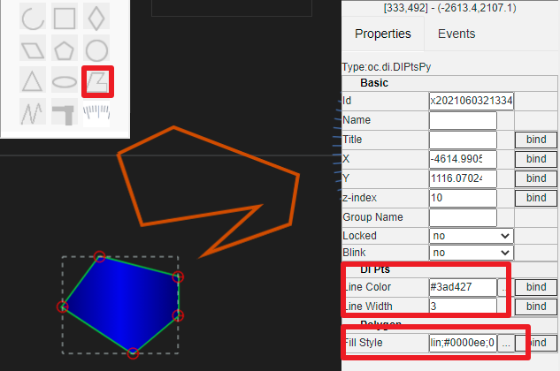

#### 2.2.3 文字编辑及属性

点击工具栏,然后在绘图区点击放置文本框。

文本框本身是个矩形框，被选中时，可以用鼠标进行尺寸调整等基本操作。

文字属性有矩形框尺寸，旋转尺寸，以及文字属性Text、字体及字体颜色等属性。如下图：

#### 2.2.4 图片显示、资源及属性

点击工具栏,然后在绘图区点击绘制一个矩形区域，此区域也即是图片显示区域。

图片区域本身是个矩形框，被选中时，可以用鼠标进行尺寸调整等基本操作。

文字属性有矩形框尺寸，旋转尺寸，以及图片路径或图片资源。如下图：

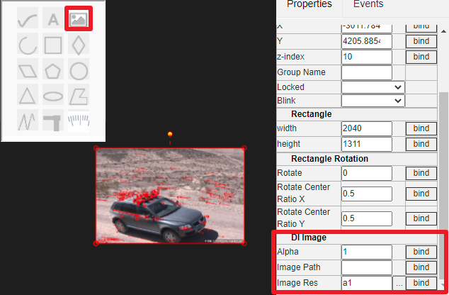

有关项目资源请参考[快速理解IOT-Tree中的关联资源][qn_res]

## 3 子图图元、控件图元

IOT-Tree项目树中，顶层的UI可以引用底层的子图UI(子图图元)，也可以引用图元库中的控件。

对于图元库中的控件管理相关内容，请参考[HMI(UI)图元组件][hmi_comp]

### 3.1 子图图元

为了能够直观说明子图图元在高层UI节点的引用，我们打开IOT-Tree内部自带的演示项目[Water tank and Medicament dosing][case_auto]，在 ch1/flow这个设备节点上，鼠标右键新增一个UI节点(鼠标右键选择"New HMI"，填写名称"fui")。然后，鼠标右键此节点，选择"Edit UI",并简单编辑内部内容，如下图：

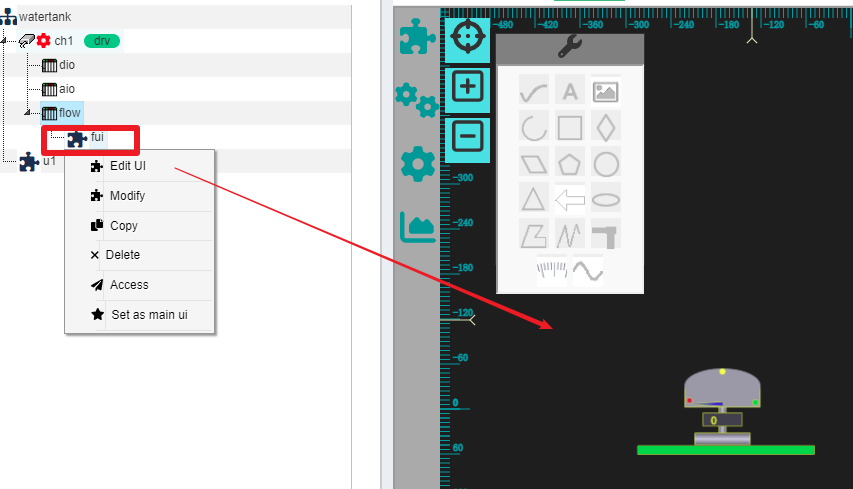

此时，在根节点下面的u1节点，就可以引用此子图图元了。鼠标右键u1节点，选择"Edit UI"打开UI编辑选项卡。在左上角点击按钮"Context Sub-HMI"时，会发现滑出一个选择窗口，可以看到里面包含了"/ch1/flow/fui"这个子画面。

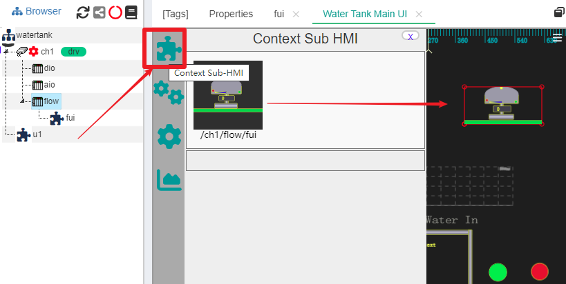

鼠标点中此项，拖拽到中间的编辑区域，松开鼠标之后，你就可以看到子图元被添加到画面中。

可以看出，如果设备定义以及包含了设备自身的一些UI，在项目中被引用时，能够很大的方便项目顶层界面的编辑配置。

### 3.2 控件库引用

同理，我们接着前面这个演示项目u1编辑，点击左边"Components"按钮，就会滑出一个选择窗口，里面包含了本系统实例图元库"HMI(UI) Components"的内容：

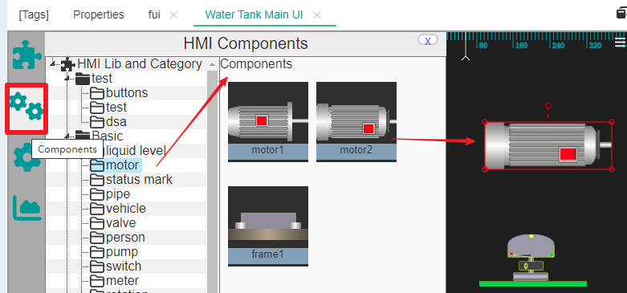

此窗口左边是一颗二级树——库/分类，点击选择某个库下面的分类，右边就会列出所有的组件（控件）。鼠标选中需要的控件，拖拽到编辑区并释放，你就会看到控件图元出现在编辑区。

### 3.3 背景引用

接着前面这个演示项目u1编辑，点击左边"Background"按钮，就会滑出一个选择窗口，里面包含了一些画面背景图片：

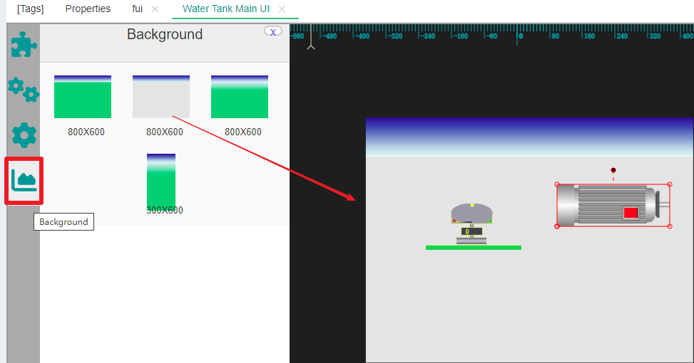

点击选择某个背景，拖拽到编辑区并释放，你就会看到背景出现在编辑区。这种背景图片一般用来设置一定比例尺寸的画面场景，以满足不同分辨率的显示设备。

>注意：请及时保存你在画面编辑的工作，保存的时候点击右边属性区域上方的保存按钮
>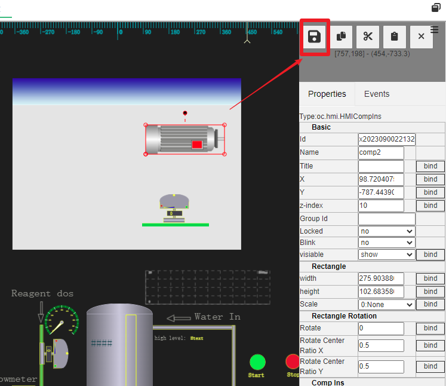

以上就是基本的UI节点编辑操作功能。

如果你想继续了解UI画面如何使用上下文中的数据进行动态展示，请继续查看[HMI属性绑定和事件处理][bind_evt]

[bind_evt]:./hmi_bind_evt.md
[case_auto]:../case/case_auto.md
[hmi_comp]: ./hmi_comp.md
[qn_res]: ./quick_know_res.md
