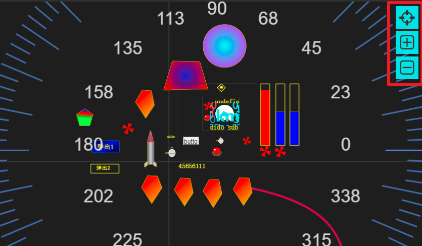

界面HMI（UI）节点
==

前面讲述的IOT-Tree Server的接入、通道、设备、标签分组和标签列表，本质上都是IOT-Tree对底层的传感器、其他系统的数据汇总并统一组织。好比一个树根，汇总可以汇总多个数据来源，并做好了上面的开花结果的准备。对于我们人类来说，通过直观的UI展示现实物理世界的运行状态是最重要的一个数据利用方式。

IOT-Tree Server在项目管理主界面和设备定义Browser树的容器节点上，都可以添加人机交互UI节点，这也是IOT-Tree Server的一个重大功能。

## 1 人机交互节点

IOT-Tree Server一个很激动人心的功能是能够在你的项目中，直接提供在线的交互UI界面定义、设计和发布。

在项目(Prjoect)-通道(Channel)-设备(Device)-标签组(Tag Group)的这些容器节点，每个层级都可以定义对应的UI界面。并且遵循节点包含相关资源访问。比如，设备(Device)下面的UI界面，可以引用设备和设备下面所有节点的标签数据或其他资源。而项目(Project)根目录下的UI界面，可以使用整个项目的所有资源——这个资源包含子节点下的UI子界面。

下面还是以具体的例子来说明：

## 2 在项目中定义UI组件

如下图所示，UI节点mainui和m1是属于项目根节点下面，而uch1属于通道c1，它们都属于项目下面定义的UI。

其中，uch1可以使用通道c1下面的所有资源。而mainui和m1可以使用整个项目的全部资源。

## 3 在设备定义（Device Definition）中的UI节点

如果你对设备定义不了解，请参考[设备定义(Device Definition)][qn_devdef]。

通过设备驱动、设备分类和设备定义。你可以在设备对应的Tag、TagGroup定义完成之后，接着针对设备做设备自身能够提供的UI组件。特别是针对特殊、专业的复杂设备，由于项目使用人员在大部分情况下是无法深入理解设备内部运行机制的。

此时，项目实施人员对于设备控制画面、监控逻辑以及如何有效的展示UI会面临巨大的挑战。最合理的做法就是设备厂家提供设备定义，并且在定义好驱动参数和Tag数据之后，定义设备专有的多方面的监控画面。这样可以大大简化项目人员对设备的使用。

## 4 编辑和访问UI

在IOT-Tree Server定义好UI之后，由于UI也属于“树”型层次的一个节点。其中，节点定义的名称(Name)符合“树”型管理的约束。

要编辑UI内部的具体内容，只需要鼠标右键对应节点，选择Edit UI即可。

同理，外部要访问此UI的路径也非常简单——只需要访问由项目到HMI UI节点的名称组成的路径。在项目管理树中，鼠标右键，选择Access即可打开新窗口，进行hmi ui应用访问。如下图：

打开的UI展示和url路径如下图：

## 5 编辑和外部访问UI操作说明

HMI UI在项目中编辑操作请参考 [人机交互UI(HMI UI)编辑操作说明][qn_hmi_edit]

对于外部访问操作非常简单，除了UI内部自身定义的交互之外，外部访问UI基本操作只支持放大缩小、内容自适应显示窗口和鼠标漫游操作。

如下图：

。

[qn_hmi_edit]: ./hmi_edit.md
[qn_devdef]: ../device/dev_def.md
