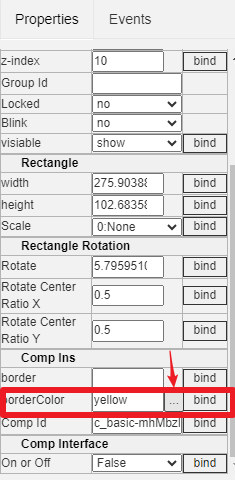
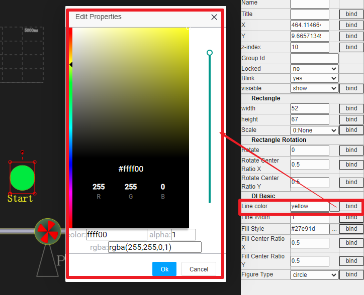
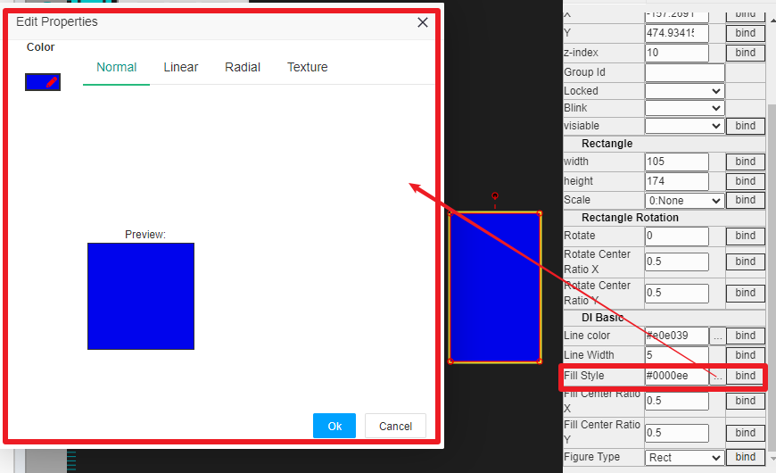
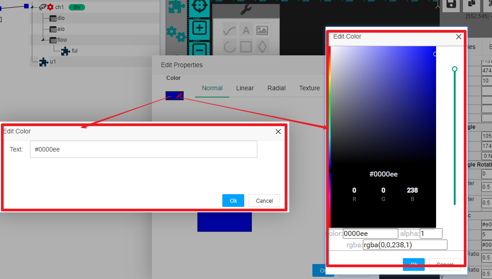
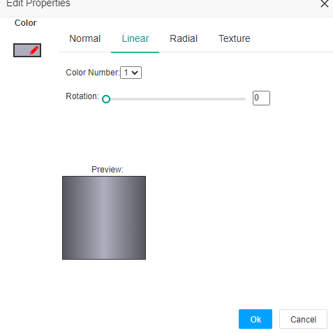
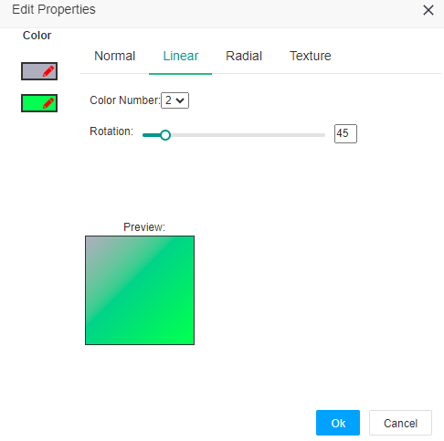
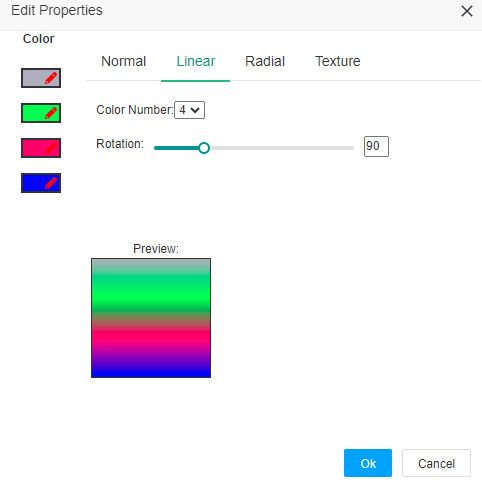
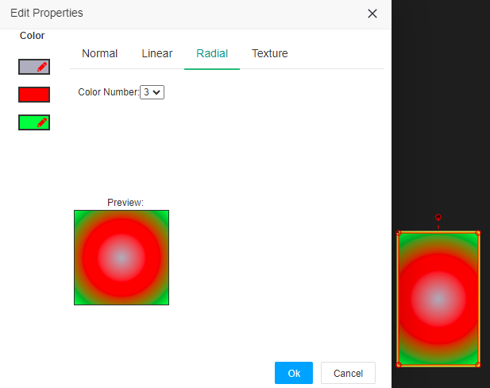

图元通用属性说明
==

IOT-Tree HMI(UI)中的图元会有很多通用属性，如颜色、填充等。这些属性都会有相同的配置含义。本文就对这些通用的属性统一进行详细说明。

### 1 属性框总体说明

在UI编辑区，单选某个图元时，右边的属性框内容会跟着当前选择的图元进行变化，你可以在此对图元的属性进行修改和调整。

如上图，属性框Properties内部属性列表会有一级分组，每一类分别代表某个方面的属性。如"Basic"代表了所有图元都有的基本属性，"Rectangle"代表图元有矩形边界框，可以有尺寸，"Rectangle Rotation"代表图元不仅有边界框，同时还有旋转参数属性等等。

每个具体的属性有属性名称，值(如果此值可以选择输入，则边上还有个选择正方形按钮)。

**如果某个属性的值支持运行中动态修改，那么它最右边会有一个"bind"按钮，通过此按钮，你可以打开此UI对应的上下文数据项（标签列表），选择里面的具体标签(Tag)绑定到此属性中。由此，图元和上下文数据之间就可以通过属性的绑定建立了关联，并且我们可以看到图元的属性大多数是可以绑定的，我们配置的界面在运行时丰富多彩的变化就是这么支持的。此部分内容请参考[HMI属性绑定和事件处理][hmi_bind_evt]**

[hmi_bind_evt]:./hmi_bind_evt.md

### 2 基本属性Basic

#### 2.1 Id,Name,Title

Id属性是图元内部唯一值，由系统自动生成，这是只读属性不允许修改。

Name属性必须符合IOT-Tree规定的命名限制——A-Z，a-z起始，后续字符只能A-Z，a-z , _ 。此属性一般情况下不需要，如果用前端脚本支持对此图元的修改，那么你可以设定一个唯一Name，后续脚本就可以直接使用此Name变量对应图元对象进行操作。

Title是图元标题，可以不填写。

#### 2.2 X,Y,z-index

这三个属性分别代表图元在绘图区的x,y坐标和堆叠高度。其中，Y坐标箭头向下，越往下值越大。

"z-index"值越大，堆叠就越高，当多个图元有重叠，优先渲染低的图元，这样越高就越不容易被覆盖。

#### 2.3 Locked

是否锁定图元，如果值=yes，那么此图元被锁定，使用鼠标无法对此进行移动。并且，被锁定图元在多选操作时无法被选中，单选的时候如果鼠标点击上面的某个未锁定重叠图元，那么只有未锁定的图元可以被选择。如果要选中被锁定的图元，必须在没有图元重叠的位置，单选才能成功。

#### 2.4 Blink

是否是图元闪烁

#### 2.5 visiable

当此属性值为hidden时，运行时会隐藏。

### 3 Rectangle相关属性

图元有矩形边界，可以改变尺寸和绘画方向

#### 3.1 width,height

图元宽度和高度属性，如果通过鼠标修改尺寸，你会看到此属性会跟着调整。反过来，如果手工输入尺寸，你也可以看到绘图区对应图元的尺寸变化。

#### 3.2 Scale

你可以选择此图元 左-右翻转或上下翻转。

### 4 Rectangle Rotation 相关属性

Rotation代表旋转角度，以弧度为单位。

缺省情况下，旋转以图元矩形边界的中心点作为旋转中心。如果你想改变旋转中心点，那么就调整下面两个属性："Rotate Center Ratio X,Rotate Center Ratio Y"。这两个属性是中心点相对于X方向和Y方向在矩形内部的位置比率，缺省值(0.5,0.5)代表中心位置。你如果把这个改成(0.5,1.0)则表示中心点是图元边界下方中心位置。例如，如果你要实现一个仪表指针，那么就应该把旋转中心点这么设置。

### 4 颜色属性

一些图元的属性里面包含颜色内容，输入时除了填写输入框之外，还可以打开颜色选择窗口进行设置。如下图：

### 5 填充(Fill)属性

一些图元属性显示区块可以支持填充属性，除了填写输入框之外，还可以打开填充选择窗口进行设置。填充属性可以有多种模式：

#### 5.1 单色填充

单色填充和颜色选择类似，只需要输入一个颜色字符串值就行。在弹出的编辑窗口中，Normal选项卡对应的就是单色填充。
左上角颜色编辑按钮，如点击颜色区域，则会弹出颜色选择对话框，如果点击编辑图标，则会弹出颜色字符串输入框。

#### 5.2 线性颜色梯度填充

线性颜色梯度填充可以用来支持有立体感效果显示内容。如下图所示：

其中，Color Number可以有1-4个，这个代表颜色变化梯度最多可以有4种颜色参与;而Rotation则代表梯度变化方向，0多表示水平方向。上图是一种颜色0度梯度变化。

下图为2种颜色，45度方向梯度填充

下图为4种颜色，90度方向梯度填充

#### 5.3 径向颜色梯度填充

径向填充是以中心点向外扩张填充，最多也支持4种颜色。如下图：

### 其他属性

以上是大部分图元都会支持的公共属性，对于具体图元来说，还会有自己的一些特殊属性。这个在相关图元或组件图元说明中展开说明。

