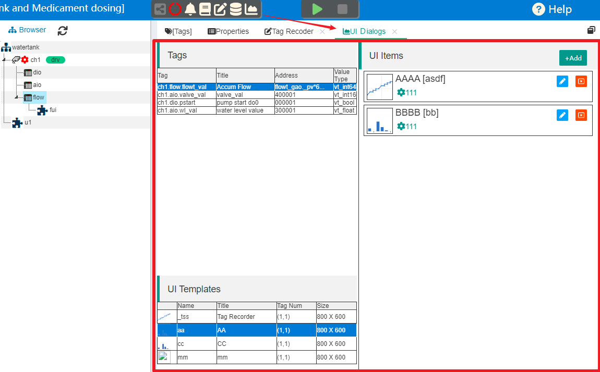
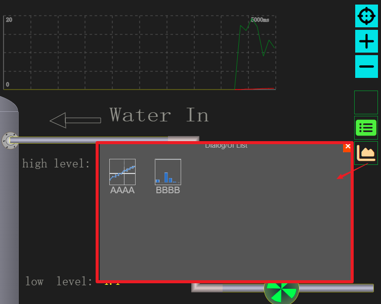
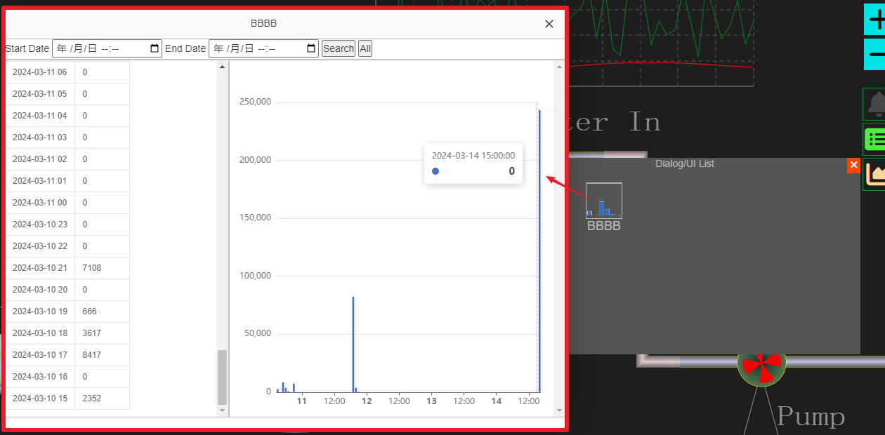

记录数据展示
==

### 1 基于对话框的数据展示功能

IOT-Tree在1.3版本，开始支持内部标签数据记录功能，这也就引发了如何处理和展示这些数据的要求。为此，IOT-Tree为了保证简单清晰的前提下，提供了一个基于对话框简单的UI管理功能。

你只需要在管理端，选择标签和展示模板，就可以定义自己的对话框项(UI Item)，然后你就可以在监控画面中直接给最终用户使用。

由于数据的展示和使用千变万化，我们不可能做出各种用户的所有需求。因此，我们只提供以上简单的功能，估计能满足很大一部分用户的需要。在后续版本中，我们计划实现一个前端UI插件开发和管理功能：你只需要熟悉html js相关技术，就可以开发一些UI插件，部署到特定的目录下面。然后你就可以在对话框管理中，选择相关RESTful资源，配置你的一些具体UI界面。

### 2 定义UI项(UI Item)

在大部分物联网/自动化监控现场，用户对展示记录的历史数据需求一般都比较直接简单：对重要的几个标签数据做历史记录，并且对特定的更少的标签数据做简单的统计和查询。如果可以生成一个能够归档报表就行。

如某种物料投加的数据量需要有个记录，并且能够生存每天、每月、每年投加量即可。又如，一个重要的生产安全指标，需要每天记录几个数值，以方便后续的查看即可。

为了能够让你快速的满足最终用户这些基本要求，以方便你快速的完成现场部署调试任务。IOT-Tree针对这些基础功能界面实现了UI项管理功能。你可以只需要通过简单的勾选配置就可以完成这些展示内容。并且这些功能可以在监控画面中，进行调用打开。

#### 2.1 设置标签(Tag)记录参数

只有设置了内部记录的标签才能支持UI项的展示使用。

具体如何设置标签进入内部记录和二次处理请参考下面的相关内容：

<a href="../store/inner_tssdb.md" target="main">&nbsp;&nbsp;&nbsp;内部时序段记录器 (TSSDB)</a>

#### 2.2 设置标签记录数据处理器

标签设置记录之后，可以支持对记录原始数据的展示。而我们需要展示的数据结果，很可能是需要二次处理的。

IOT-Tree有专门的记录的二次处理，每个处理器都可以有自己的生成数据。这些数据也有着不同的展示支持。

<a href="../store/inner_recpro.md" target="main">&nbsp;&nbsp;&nbsp;记录数据二次处理</a>

#### 2.3 UI Item定制

在项目管理主界面上端，点击"UI Dialog Manager"图标，就可以看到本项目的UI Item定制界面。

可以看到，左上方是标签列表，左下方是对于的UI模板(UI Templates)。右边是我们需要定义的内容。

你只需要选中需要展示的标签，坐下方的对应UI模板列表就会出现，你选择某个UI模板之后，右边的新增"+Add"按钮会被激活，此时你点击就可以添加UI展示项(UI Item)。

每个UI展示项本质很简单：只是展示所需的标签+UI模板+一些命名或其他参数的组合。

由于你在项目数据配置和处理时，一般都会使用比较专业的名称——这些命名最终用户不一定好理解。而我们定义的UI项（UI Item）一般都是给最终用户使用的，所以在此你可以取一个用户熟悉的名称。

#### 2.4 在监控画面中展示

以上定义的UI Item就可以自动在HMI前端监控画面中展示。器要求是你配置的标签必须是HMI节点所处的上下文中。

在监控画面中，点击右边"show UI Dialog list"图标，就可以看到弹出窗口有对应的图标列表。

点击对应图标，就可以弹出相关的展示对话框

