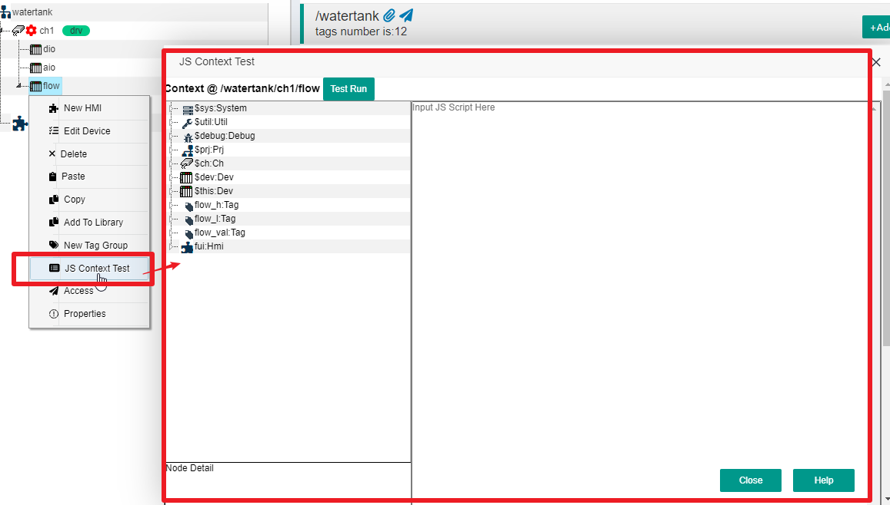
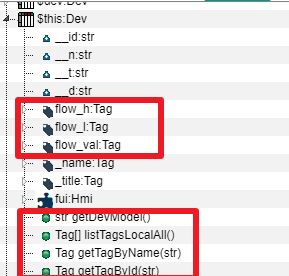
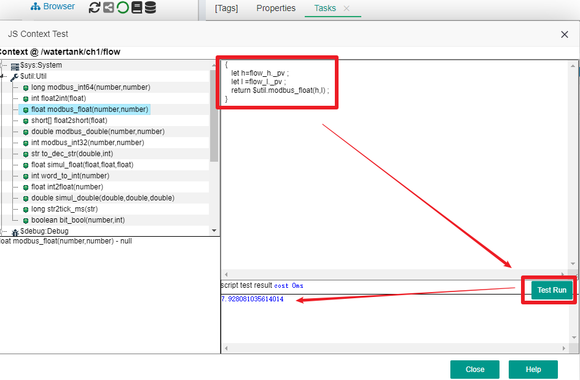

JS脚本支持
==

## 1 IOT-Tree内在JS支持


IOT-Tree在内部支持JS脚本用来对一些数据转换、事件处理、控制任务的工作做支持。JS脚本分两种，一种是运行在Client端（一般是浏览器端）。一种是运行在Server端，由Java提供JS运行环境。Client主要是支持HMI(UI)图元相关的事件处理。而Server端主要以项目的树容器节点形成的上下文中，实现逻辑的功能。

由于IOT-Tree内部的精细划分，我们使用JS一般都限定在局部实现（大多场合仅仅类似实现一个JS函数），这样可以大大简化JS代码减少出错，降低复杂度，同时又能满足业务需要。可以说，IOT-Tree的强大需要JS的支持，但又限定不滥用它。

本文档要求你已经掌握JS的基础语法，如果你对JS语法不了解，网络上的教程很多，估计只需要几天时间你就可以掌握了。


## 2 Server端JS运行上下文


IOT-Tree以项目为基础，内部建立了一颗树,层次为：项目-通道-设备-标签组。这些容器节点可以包含具体的标签列表（数据项）和HMI UI节点。由于IOT-Tree规定高层的容器节点可以访问它所包含的子孙节点所有内容，那么在此节点下面的JS运行上下文(Context)就包含了下面节点的所有内容。在某个容器节点下，每个子孙标签(Tags)都可以通过唯一的路径进行定位，而在JS代码内，这些标签(Tags)数据项则可以使用"xxx.xx.xxx"的方式进行使用。

事实上，在某个容器节点下，JS运行上下文(Context)中，除了子节点还有一些特殊成员。这些成员如果是某个对象，则内部也有自身的内容。由此形成了一个完整的上下文内容。


### 2.1 节点上下文成员总体说明</en>Overall Description of Node JS Context Members</en>


我们在项目中选择某个容器节点，则可以看到\[Tags]选项卡下面所有的标签，这些标签和JS访问方式一致。如图：在根节点"watertank"下面，JS访问ch1节点、设备"ch1.dio"和"ch1.dio.p_running"标签。


虽然标签列表同时也代表了JS代码在上下文中的引用层次关系，但IOT-Tree中节点上下文中的内容远不止这些。下面我们使用JS上下文测试对话框进行讲解。

对于项目根节点、通道节点、设备节点、标签组节点，这些容器节点下都有自己的JS运行上下文。在项目管理界面中，鼠标右键某个节点，就可以看到有个选项"JS Context Test"，点击就可以打开这个节点对应的JS脚本运行上下文的测试对话框。其中包含了此节点下的所有JS对象成员以及某个对象成员下的子成员。

还是在IOT-Tree自带的Demo项目"Water tank and Medicament dosing"中,我们鼠标右键选择通道ch1下的设备flow，然后点击弹出菜单中的"JS Context Test",就可以看到设备节点flow下面的JS支持的所有内容（当然，标准JS支持的公共成员和函数不在此列举）。如下图：





在弹出窗口的左边，有个JS上下文成员列表，每个成员都是一颗树的根部。每个成员的显示名称格式为name:Type，':'的左边是JS成员名称，右边是此成员的数据类型。

>$sys、$util、$debug是系统自带的一些支持，在每个上下文中都会有。

>$prj、$ch、$dev表示此上下文中包含的唯一对应的项目对象、通道对象和设备对象。我们此次的容器节点是flow设备，那么自然也就在项目和通道之下。如果你的当前上下文节点是项目根，那么$ch $dev两个对象就不存在了。

>$this 这个对象代表了当前容器节点，本例子flow节点是个Dev，那么$this 和 $dev是同一个对象，你可以看到他们':'右边的数据类型都是"Dev"。

>其他对象，在例子中 flow_h、flow_l、flow_val、fui这些对象都是flow节点下面定义的普通对象，他们可以表示标签Tag对象或其他对象。

IOT-Tree对上下文根成员做了一些限定，必须是当前容器下的容器成员。这样可以避免一些冲突。如果要访问当前节点下面全部内容。可以使用 $this.xxxx 方式进行。我们展开$this成员，如下图：





可以看到在展开的成员中，内容会多一些，除了"flow_h、flow_l、flow_val、fui"这些已经有的对象，我们可以看到内部还有如下内容:

>__id:str __n:str  __t:str  __d:str 这几个成员是基本类型，每个节点对象都会有，他们分别对应这个节点的唯一id，名称，标题和描述。请注意：这几个成员都是以两个下划线'_'符号开头，你可以直接使用。

>函数，在$this节点下，我们可以看到一些函数定义，这些函数也就可以通过$this.fff()方式进行调用。

我们展开flow_val:Tag这个根成员,可以看到这个Tag类型的对象除了包含__id:str __n:str  __t:str  __d:str这个节点都有的成员之外，还有它自身特殊的成员，如下图：


>_pv:number 这是此标签运行时的值，':'右边的类型会根据不同的标签定义而不同，此标签是个number类型。如果对此进行赋值，则会触发标签对应的设备驱动对设备的写入操作。

>_valid:bool 代表运行时此标签值是否有效；_updt代表运行时标签值的最后读取时间; _chgdt代表运行时标签值的最后变化时间，这些时间都是系统时间的毫秒数.

>_value读取时和_pv相同，但赋值时只是在IOT-Tree内存中进行，不会触发设备驱动的动作。
> RT_setVal这个函数可以对标签进行赋值，但赋值时只是在IOT-Tree内存中进行，不会触发设备驱动的动作。这个函数等效于对_value这个成员的赋值。

<font color="red">可以看出，左边的这颗树本质也是在flow这个节点下我们可以写JS代码的成员参考，也即是最准确的调用文档，下面的这些代码都是有效的。</font>


```
var n1 = $this.__n ;
var s1 = $this.getDevModel() ;

//上下文中可以直接使用根成员
var v1 = flow_val._pv ;
flow_val._pv = 100; //赋值并触发设备驱动写数据指令
flow_val._value = 100 ; //只在内存中设置此Tag的值
flow_val.RT_setVal(100) ; //等效于 flow_val._value = 100 ;

//$this对象代表了当前对象，下面三行代码和上面三行是等效的
$this.flow_val._pv = 100; //赋值并触发设备驱动写数据指令
$this.flow_val._value = 100 ; //只在内存中设置此Tag的值
$this.flow_val.RT_setVal(100) ; //等效于 flow_val._value = 100 ;
```

### 2.2 成员变量名称约定

#### 2.2.1 $xxx

$xxx格式命名的成员都代表着系统提供的环境变量成员，如"$prj $this"等。这些成员直接定义在上下文的根部。


#### 2.2.2 _xxx


_xxx格式命名成员一般是系统提供变量成员。


#### 2.2.3 __xxx


__xxx格式命名成员（以两个下划线开头）代表的是某个对象下系统提供基本类型的成员，如每个节点下都有 __id __n这样的属性成员，这些成员数据是基本类型(str number等)。


### 2.3 JS代码块和测试窗口


在IOT-Tree中，JS代码的使用大部分情况是以代码块的形式出现，这是因为IOT-Tree已经通过精密的架构使得需要使用JS的地方能够灵活强大，又同时尽可能简单。具体可能有如下使用情景：

1）定义某个中间标签(Middle Tag),其值可以通过标签所在的容器节点上下文中的其他标签作为变量，组合而成的js代码;
2）定义某个定时运行的任务；
3）某个虚拟接入，直接驱动通道下面的一些数据；

这些代码块可以抽象为：简单的表达式或一段函数实现。


#### 2.3.1 表达式


表达式一般只有一行，通过简单的一行代码，就可以利用一些输入变量组合计算返回我们需要的结果。下面是几个例子：


```
 flow_val._pv+12
```

```
 $util.modbus_float(flow_h._pv,flow_l._pv)
```

#### 2.3.2 函数


函数情景下，可以把代码看成一个匿名函数，通过上下文输入的变量，实现多行代码逻辑。返回值通过"return"进行。在IOT-Tree代码块中，你只需要把代码放在"{  }"中，那么就认为这是一个函数代码块实现。你内部必须有return语句，否则就会认为此代码块返回null


```
  {
     let h=flow_h._pv ;
     let l =flow_l._pv ;
     return $util.modbus_float(h,l) ;
  }
```

```
  {
     let h=flow_h._pv ;
     let l =flow_l._pv ;
     let v = $util.modbus_float(h,l) ;
     if(v>100)
        return true ;
     else
        return false;
  }
```

#### 2.3.3 测试窗口


在上面的例子中，我们鼠标右键项目中的某个容器节点，就可以看到"JS Context Test"这个选项，点击打开的就是我们提供的测试窗口。除了左边提供的上下文成员树的文档支持外，右边我们可以写入测试代码块。

写入测试代码之后，点击"Test Run"按钮，就可以在结果区域看到运行结果，如下图：





请注意，上面的例子里面用到flow_h和flow_l这些标签(Tag)，他们的属性值_pv必须在项目运行正常，并且此标签值有效的情况下才能正常计算结果。


## 3 Client端JS


IOT-Tree对客户端JS支持，主要应用于HMI(UI)相关的内容。如图元的事件响应，这些脚本都运行在浏览器端。和Server端的上下文没什么直接的关系。本部分内容请参考[HMI相关文档][hmi]。


[hmi]:../hmi/index.md

## 4 开发你自己的Server JS底层支持


在上下文根成员中，你可以看到\$$xxx格式的成员，这些成员都代表着系统提供的自定义变量成员，如\$$mail。你可以通过Java代码的实现并且注册为IOT-Tree的插件。


本部分内容请参考[插件开发-JsApi][plugin_jsapi]

[plugin_jsapi]:../advanced/adv_plugin_jsapi.md
