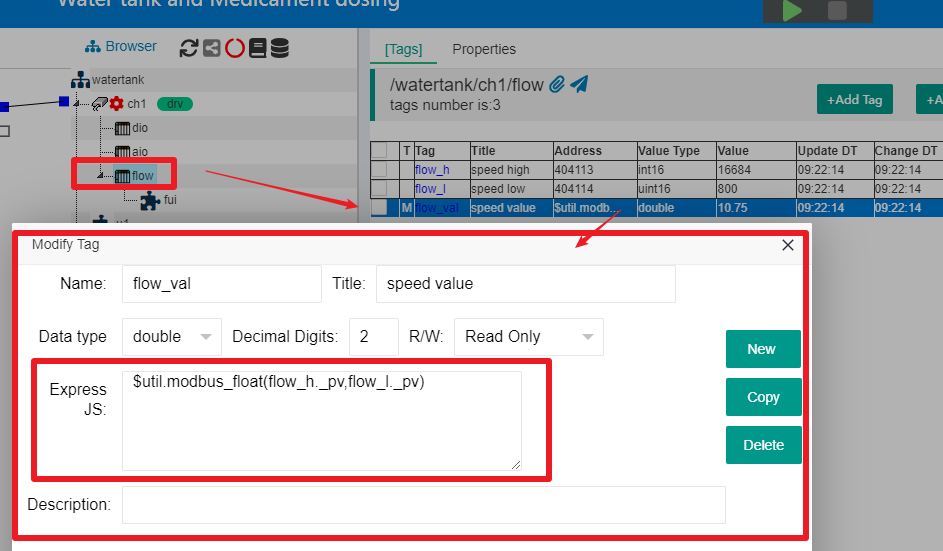

JS在中间标签(Middle Tag)的使用
==

## 1 中间标签JS使用的上下文

某个容器节点下的中间标签(Middle Tag),在定义时需要编辑对应的JS代码块，用来产生需要的标签数值。

例如，在IOT-Tree中的Demo项目"Water tank and Medicament dosing"中。点击项目树中通道"ch1"-设备"flow",可以在右边主内容区看到\[Tags]选项卡中看到此设备下面有个中间标签"flow_val"。双击此标签，就可以打开对应的编辑界面，如下图：

从图中可以看到，"flow_val"这个标签，使用$util提供的函数，输入"flow_h"和"flow_l"两个标签的"_pv"值进行计算，得到浮点数值。

IOT-Tree规定，中间标签使用标签所属的容器节点上下文进行计算，也即是说可以直接使用容器节点和子节点的所有其他标签。

我们鼠标双击JS编辑框，弹出具体的编辑窗口。可以看到左边列举了JS上下文内容。

注意：我们可以看到上下文有"$prj $ch"等顶层节点成员，也就是说JS代码也可以通过这些对象访问高层节点下的内容。我们强烈建议，除非迫不得已，请不要使用不在当前节点($this)下的其他内容，因为这样的定义会使得你的定义失去重用性。比如，你如果把这个设备收入到设备库中，在其他项目中使用就会出问题——因为这样就会造成你这个中间标签找不到输入对象。

## 2 JS使用代码块

中间标签JS可以使用表达式或有返回值的代码块即可，此部分内容请参考[JS脚本支持 - JS代码块和测试窗口][ind]

[ind]:./index.md
