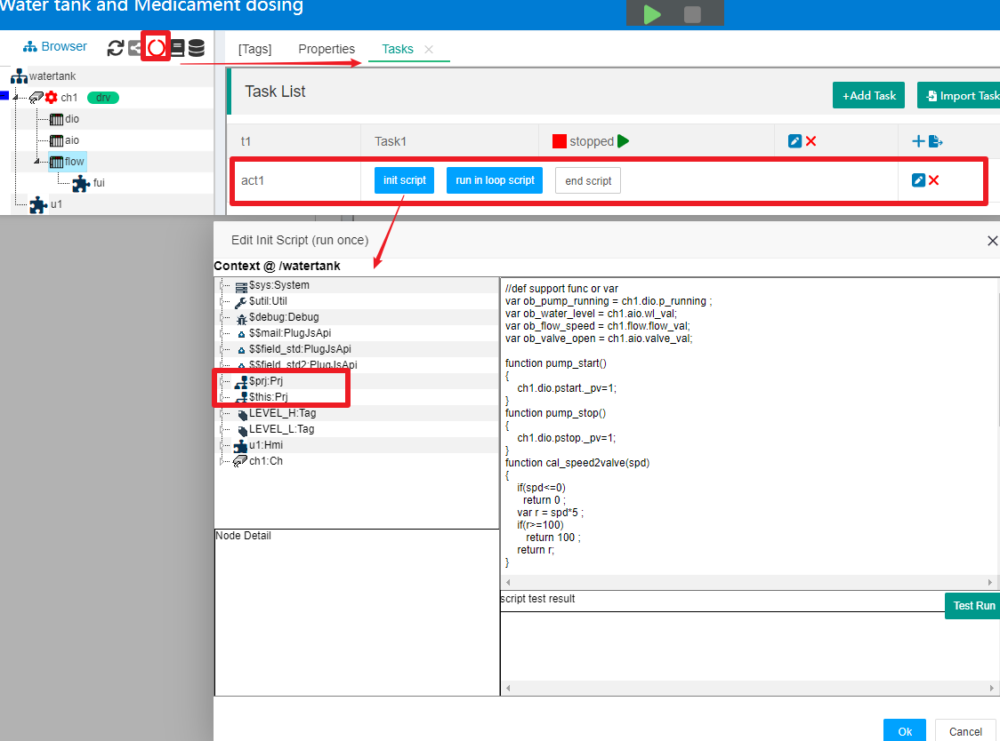

JS在任务(Task)中的使用
==

如果你对IOT-Tree的任务机制还不了解，请参考[项目任务][task]。


IOT-Tree在任务活动Action中，对JS脚本进行了划分，如下图：


可以看到，每个活动内部会有三个脚本划分:"init script","run in loop script","end script"。他们分别对应"初始化脚本","在循环中重复运行脚本","运行结束脚本"。

>初始化脚本init script:在任务启动时，只运行一次，你可以在里面定义初始化变量，一些后续需要的JS函数声明。

>在循环中重复运行脚本run in loop script:这个JS脚本，在任务运行期间，根据任务设定的运行时间间隔，会被重复运行。

>运行结束脚本end script:在任务正常停止时，会被运行一次的脚步，你可以对此进行善后工作。

每个活动的这三个部分JS脚本，你可以根据需要点击编辑即可，当然如果某个部分你没有设定任何脚本，那么等于不起作用。


[task]:../main/task.md

## 1 任务脚本运行上下文 $prj

IOT-Tree当前规定，一个项目中的所有任务JS脚本，运行上下文(Context)都是项目根部。也就是说，JS可以调用整个项目下的所有对JS开放的内容。

_注：不排除以后会在项目树中，增加和任务类似的控制逻辑。如：针对某个设备节点，专门定义内部控制逻辑，这样一些通用控制逻辑也会随着节点的重用而重用_

我们以IOT-Tree内部自带的Demo项目"Water tank and Medicament dosing"作为例子说明。在项目主界面中，点击项目树上方的任务运行状态图标，主内容区会出现"Tasks"选项卡，里面有一个任务t1以及这个任务下面的活动act1。点击这个活动的"init script"按钮，在弹出的脚本编辑界面左边，是以本项目根部为基础的JS运行上下文。我们可以看到里面的$this对象和$prj是等效的。




## 2 init script


初始化脚本代码在任务启动时会被运行一次，你可以在里面定义后续重复运行代码所需要的初始内容。如，在此Demo项目中，代码看似不少，其实就做了两件事:

1) 初始化一些全局变量
2) 定义后续可能使用到的函数


```
//def support func or var
var ob_pump_running = ch1.dio.p_running ;
var ob_water_level = ch1.aio.wl_val;
var ob_flow_speed = ch1.flow.flow_val;
var ob_valve_open = ch1.aio.valve_val;
var ob_pstart = ch1.dio.pstart;
var ob_pstop = ch1.dio.pstop;

function pump_start()
{
    ob_pstart._pv=1;
}
function pump_stop()
{
    ob_pstop._pv=1;
}

...
//pump ctrl by water level
function pump_ctrl()
{
   var wl = ob_water_level._pv;
   if(ob_pump_running._pv)
   {//pump is running
        if(wl>=LEVEL_H._pv)
           pump_stop();
   }
   else
   {
        if(wl<=LEVEL_L._pv)
           pump_start();
   }
}

//valve ctrl by flow speed
function valve_ctrl()
{
    var spd = ob_flow_speed._pv;
    var v_open = cal_speed2valve(spd);
    ob_valve_open._pv=v_open;
}

```

IOT-Tree强烈建议你也使用以下模式编写初始化代码：

> 定义全局变量赋值后续函数可能用到的项目中的标签，因为项目中的标签路径格式 xxx.xx.xx。这个以项目为根部的层次引用可能会随着你项目结构的调整而改变。通过命名相对固定的全局变量进行赋值，可以使得在后续的函数中调用简化，同时更容易维护修改。
```
//后续函数都使用ob_pump_running来代替对应的项目中标签。
var ob_pump_running = ch1.dio.p_running ;
```
> 在初始化代码中，定义后续全部需要的函数。


## 3 run in loop script

重复在循环中调用的代码，以init script编写的变量和函数为基础，直接调用相关函数即可。如本Demo例子中，你点击活动act1中的"run in loop script"按钮，弹出的编辑窗口中，只有两行代码：


```
pump_ctrl();
valve_ctrl();
```

请注意，这两行代码在任务运行中，会被以一定的时间间隔重复调用运行。


## 4 end script

结束脚本指的是任务在正常结束时，会被调用的代码，大部分情况你是不需要对此编写代码的。但在一些特殊场合，你需要在任务停止时释放一些特定资源，那么就需要实现对应代码。


