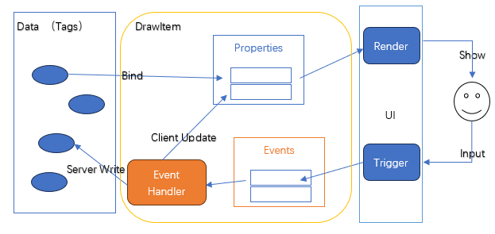
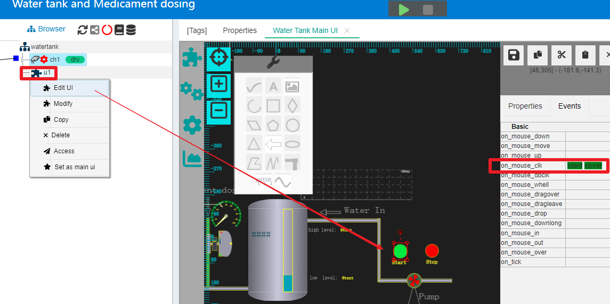
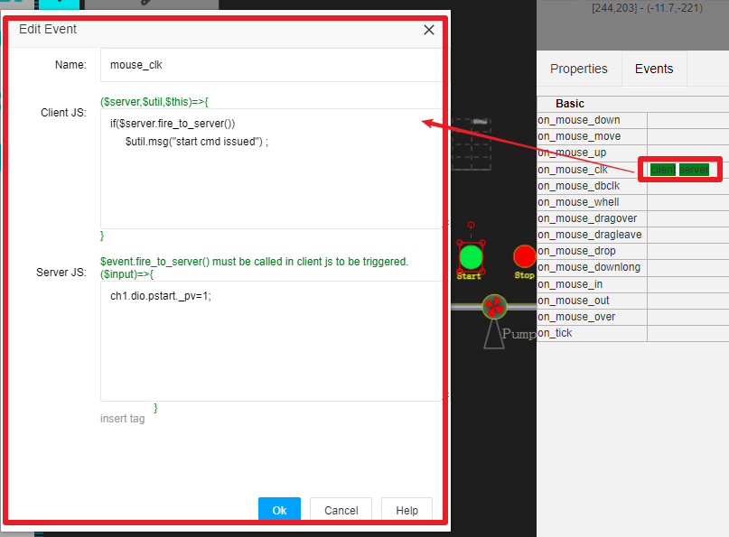
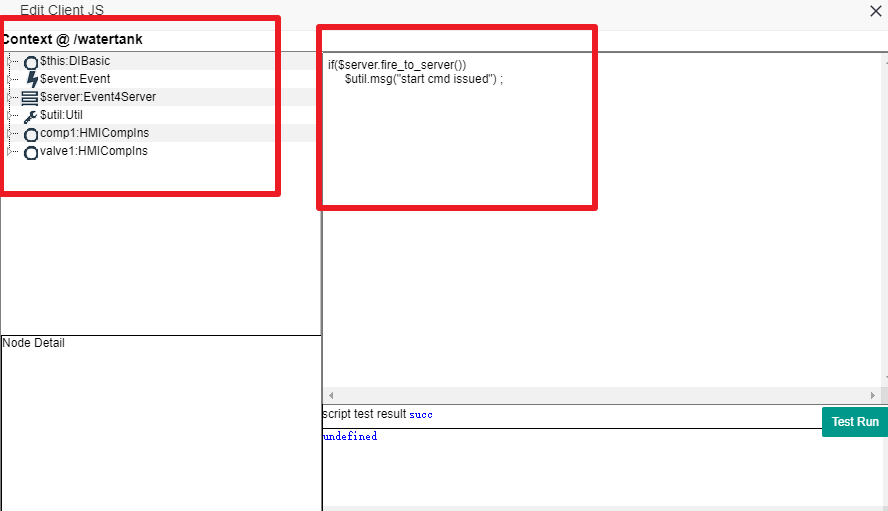
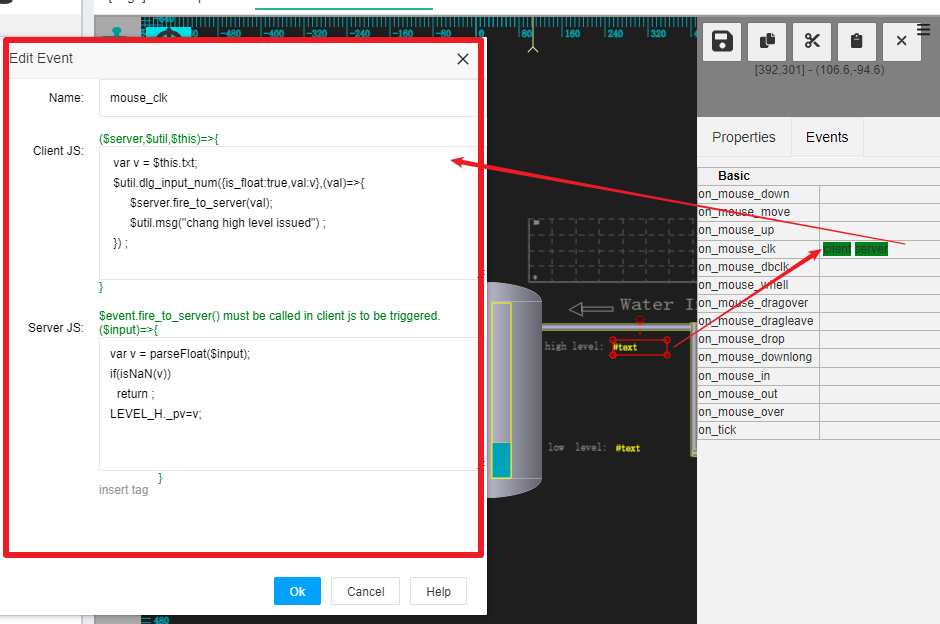
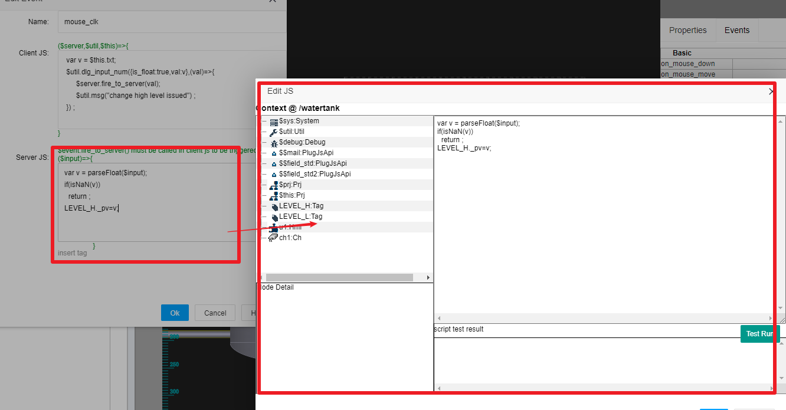

JS在UI事件处理中的使用
==

IOT-Tree中的UI支持在线编辑，并且直接在线发布，所有的UI都以Web方式进行。在项目中的UI编辑过程中，每个图元有很多属性Properties用来定义图元的展示特征，并且通过绑定(Bind)方式提供了标签数据(Tag)来驱动这些属性的变化。那么反过来，如果某个图元要响应用户的动作或输入，则通过事件Events来进行。

某个图元对数据到UI的展示，以及反过来根据用户的输入到事件处理反过来更新数据的整个机制如下图：



如用户对某个图元点击，就会产生鼠标事件，我们如果希望对某个图元在鼠标点击时有对应的变化或触发一些数据的改变，那么就需要用到事件处理(Event Handler)。

IOT-Tree中，这些事件处理处理也通过JS来实现。对于图元的事件处理，其内部不外乎两件事：

1) 在事件发生时改变图元的属性特征，也就改变了图元的显示方式等。如鼠标按下时改变图元的现实背景等；
2) 在事件发生时，触发服务端一些数据的改变。

由于Web UI的特殊性，对于以上两件事，IOT-Tree把事件处理划分成客户端JS(Client JS)和服务端JS(Server JS)。客户端JS只运行在浏览器端，不会对服务端造成任何影响。而服务端JS只运行在服务端，可以产生服务端数据的变化或通过服务端的连接和设备驱动，对实际的设备下达指令。

我们还是以IOT-Tree 内部自带的Demo项目"Water tank and Medicament dosing"为例。鼠标右键中间"Browser"树中的u1节点，在弹出的菜单中选择"Edit UI"。你就可以看到项目主监控画面。找到右边画面编辑区域，点击选中"Start"上方的那个圆形按钮。然后在右边点击Events选项卡。你可以看到这个"Start"按钮的"on_mouse_clk"事件，已经配置了client server两种脚本。如下图：



鼠标点击"on_mouse_clk"右边的内容区域，就会弹出一个事件处理编辑窗口，如下图：



你可以看到Client Js和Server JS编辑区域，他们分别对应鼠标点击这个图元产生的"on_mouse_clk"事件的客户端处理脚本和服务端处理脚本。

下面我们分别对此进行详细说明。

## 1 Client JS

### 1.1 Client JS运行上下文

Client JS完全在展示UI的浏览器中运行，所以运行环境也仅仅是UI画面的环境及相关资源。在[HMI图元组件(控件)][hmi_comp]中提到：如果要对某个图元使用JS脚本进行操作，则必须先对其定义"Name"属性，这个属性名称必须符合IOT-Tree的命名限定（a-z A-Z起始的符合编程语言的变量名）。那么，在同一个UI中的图元事件中，就可以直接通过这些命名访问。也即是，UI中的某个图元被定义了"Name"属性，那么这个图元自然也就成为了上下文中的内容。

在以上的"on_mouse_clk"事件处理编辑界面中，我们点击"Client JS"右边的内容区域，就会弹出专门的Client JS编辑窗口。如下图：



其中，左边显示了运行JS脚本支持的上下文内容，右边是脚本编辑和测试区域。

上下文内容是一颗树，根部节点对应的成员在JS中可以直接引用。对于$xxx格式的成员，代表的是IOT-Tree内在支持的成员。其他成员代表其他有“Name”属性的成员图元。

成员节点如果有子节点（内部属性和函数）内容，可以展开查看。

### 1.2 Client到Server的触发

在Client JS脚本中，可以通过调用特殊的函数来触发Server的端的事件处理。这个通过$server这个成员提供的函数来支持：

```
$server.fire_to_server(any)
```

在Client JS代码中，可以根据需要调用此函数，就可以通过ajax方式触发服务端(也即是运行在IOT-Server Server端)内部的Server JS脚本。通过这种方式，可以使得Client JS和Server JS之间的协调达到很好的灵活性。

### 1.3 Client JS主要实现内容

由于Client JS的上下文出来通过$server触发Server JS运行，其他内容都在浏览器中运行，那么Client JS的主要功能也就是根据事件对UI中的内容进行动态调整。

>通过命名属性成员，直接根据其他图元的Name所代表的图元对象，修改图元相关属性，进而改变图元展示状态。如改变图元背景颜色、旋转角度等。

>通过系统提供的一些全局支持，提供参数输入对话框。这些支持通过$util这个成员提供。

### 1.4 Client JS上下文主要成员

#### 1.4.1 $util

$util成员提供了界面可能使用到的输入参数，操作员下达指令的密码验证等函数支持。这些函数通过IOT-Tree提供的一些通用输入界面，为UI画面提供更丰富的交互功能。

>$util.msg() 用来在界面上弹出一个消息，并且在几秒之后就会自动消失。

>$util.check_cmd_psw({prompt:string,no_confirm:boolean},()=>void) 此函数会弹出一个用户密码输入窗口，用来做权限验证。在很多自动化系统中，为了安全，当用户在监控画面下达某个指令的时候，会提示当前用户输入控制密码，以防止其他人员的不当操作。那么，IOT-Tree对此提供了这个函数支持。此函数会弹出输入或密码盘选择窗口，然后在验证成功的时候会有一个成功回调函数被调用。你可以在回调函数里面实现真正的指令下达JS代码。

>$util.dlg_input_num({tp:string,min:number,max:number,val:number,is_float:boolean},(v:number)=>void)。此函数提供了一个数值输入窗口，并且在输入成功之后，回调函数会被调用，你可以在输入成功之后的回调函数中，获得输入值并且做后续的操作。

#### 1.4.2 $server

$server成员提供了Client JS和Server端产生交互的支持，当前有如下函数：

>bool fire_to_server(any) 。当Client JS调用此函数时，会触发Client UI端向服务端推送一个消息，并且这个消息可以携带一个参数。服务端处理脚本(Server JS)可以获得这个数据，并做相关的处理。

#### 1.4.3 $this

$this代表了当前选中图元，比如我们编辑某个图元的某个事件处理时，$this成员就对应了这个图元对象。你可以在JS编辑界面左边展开对应的目录树，查看这个对象内部的属性和函数支持

#### 1.4.4 $event

$event代表了当前事件对象，你可以在JS编辑界面左边展开对应的目录树，查看这个对象内部的属性和函数支持。其主要内容就是当前被处理事件的一些内容。

#### 1.4.5 例子说明

我们以本文提到的Demo项目例子来说明。点击UI主画面" high level:"右边的文本图元，例子中这个图元txt属性绑定了标签值"LEVEL_H._pv"。这个标签是一个支持参数设置的标签，当写入某个值时，系统会自动永久保存，下次启动此项目，这个值会被自动装置。

在右边Events中可以看到"on_mouse_clk事件已经设置了client server JS脚本。这个脚本的实现效果是，在运行中的监控画面中，鼠标点击此图元，就会弹出参数修改输入窗口，用户输入新值之后，就可以提交到系统内部修改标签值"LEVEL_H._pv"。

点击此内容，可以在弹出窗口中看到对应的Client JS和Server JS，如下图我们可以看到使用以上上下文成员的典型应用：



```
 var v = $this.txt;
 $util.dlg_input_num({is_float:true,val:v},(val)=>{
      $server.fire_to_server(val);
      $util.msg("change high level issued") ;
 }) ;
```
此段代码是个非常典型的使用。当前图元$this是个Txt文本显示图元，可以通过$this.txt获取当前显示的txt内容。由于这个图元的txt属性绑定了标签LEVEL_H._pv。在运行时会获取服务端输出的这个值进行显示。

然后调用 $util.dlg_input_num这个函数，输入当前值{is_float:true,val:v}。并且在用户输入新值之后的回调函数中，获得性输入值val。并且通过$server.fire_to_server(val);把这个值推送到Server端脚本运行。并且提示提交了这个修改。

以下是JS的箭头函数
```
(val)=>{
      $server.fire_to_server(val);
      $util.msg("change high level issued") ;
 }
```

你也可以写成。如果对这个不了解，请到网上查找JS的相关说明
```
function(val){
      $server.fire_to_server(val);
      $util.msg("change high level issued") ;
 }
```

## 2 Server JS

每个图元的在事件处理时，如何要触发服务端对应的处理过程，则需要编辑Server JS脚本内容。这个JS代码和其他Server端的JS代码类似，根据此HMI UI所属的容器节点而限定上下文。此部分内容请参考JS其他章节内容。不过，对于事件处理还是有一些特殊性。

### 2.1 图元事件处理的Server JS由Client JS触发

```
$server.fire_to_server(val);
```

Client JS必须调用这个代码才能触发Server JS。这样做的好处是可以很灵活的触发Server 端代码，并且还可以携带不同的参数。

### 2.2 Server JS端代码本质是一个函数

我们查看上面例子中的Server JS内容去，本质是个箭头函数,此函数有个$input对应Client JS触发时携带的输入参数。

```
($input)=>{
    // Server JS code here
}
```

点击以上例子中的Server JS内容区，可以弹出Server JS的编辑窗口，可以看到左边的上下文树内容和其他Server端JS脚本没什么差别。所以，从本质上来说，图元事件的Server端处理，是个在容器节点上下文中的一个函数。这个函数有个从Client端提交的参数$input。



相关代码如下：

```
var v = parseFloat($input);
if(isNaN(v))
  return ;
LEVEL_H._pv=v;
```
这段代码更加Client提交的$input值，进行float转换，然后设置到标签LEVEL_H的_pv值中。(此标签是一个本地自动保存值的标签，设置之后项目重启值都不会改变)。


[hmi_comp]:../hmi/hmi_comp.md

