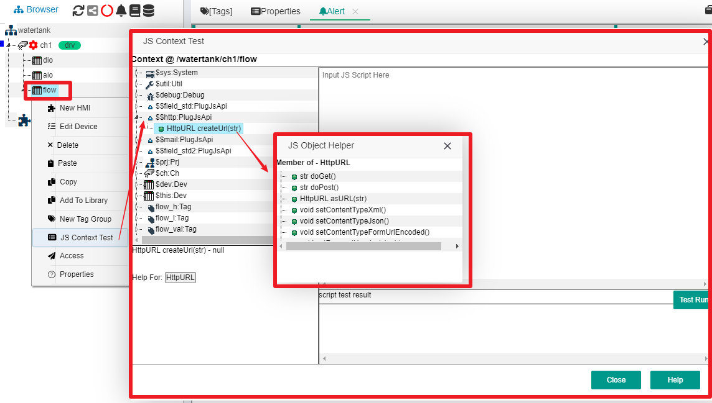

Js Api内部插件 - \$$http
==

你需要对http协议稍微有点了解。

## 1 \$$http 总体说明


\$$http插件针对http/https url提供了GET和POST数据的相关支持。在很多场合，你需要对接其他系统或平台提供的http接口发送/获取数据。在大部分这种应用场合，都会有如下特点：

> 1. 对接的系统提供RESTFul接口，需要你注册帐号，并且申请应用id和数字签名。

> 2. 你在每次发起请求的时候，要设定一些特殊的http头参数

> 3. 你在POST一些数据时，需要提供一些名值对的参数

\$$http插件专门为上面的应用场合提供了一些对象和函数支持。下面以系统自带的JS编辑辅助对话框作为说明。

我们在IOT-Tree项目管理界面的中间树形节点上，鼠标右键，选择"JS Context Test"，在弹出的对话框中，可以看到\$$http这个成员，展开此成员，可以看到子节点"HttpURL createUrl(str)"，点击这个节点，在下方"Help For:"可以看到帮助按钮 "HttpURL",点击此按钮，就可以看到"HttpURL"对象的成员帮助对话框。如下图：





我们可以看到\$$http提供一个函数createUrl,此函数返回HttpURL对象，这个对象提供了对某个URL访问的相关函数。


### 1.1 函数:HttpURL &nbsp;&nbsp;\$$http.createUrl(str)


\$$http提供的这个函数，主要是根据你提供的目标主机http url，创建一个HttpURL对象。那么后续的具体操作，主要由这个返回对象提供。调用方法如下：


```
var u = $$http.createUrl("https://xxx.xxx.com/sms_send");
```

### 1.2 HttpURL 对象


此对象内部已经有了具体的URL参数，那么接下来你就需要根据对接方提供的具体要求做参数设置、数据提交或数据获取。为此，HttpURL对象提供了如下函数支持。


#### 1.2.1 HttpURL 对象函数 - setRequestHeader(str,str)

此函数用来支持设置http请求头参数，如你可以设定Content-Type标准参数，或者设定自定义的一些参数。


#### 1.2.2 HttpURL 对象函数 - str doGet()

如果你准备使用HTTP Get方法获取这个URL的数据，那么此时你调用此函数即可。它会返回URL输出的字符串数据。


#### 1.2.3 HttpURL 对象函数 - setPostParam(str,str)

如果你准备使用POST方法提交数据到对应的URL，并且对方要求你提交的参数使用"form-urlencoded"格式，那么你就可以调用此方法进行参数设置。


#### 1.2.4 HttpURL 对象函数 - str doPost()

通过以上两个函数的设置之后，你可以调用此方法以POST方式向URL提交数据，并且返回服务器端接口输出的字符串数据。


#### 1.2.5 HttpURL 对象函数 - str doPostRaw(str)


如果你想使用POST提交自定义的字符串格式数据，那么你可以直接调用此方法，这时候setPostParam函数设置的内容就没有用了。比如，你可以定义自己的JSON格式数据，然后调用此函数直接提交。


#### 1.2.6 HttpURL 对象函数 - setContentTypeJson()
```
等同于
setRequestHeader("Content-Type", "application/json");
```

#### 1.2.7 HttpURL 对象函数 - setContentTypeXml()
```
等同于
setRequestHeader("Content-Type", "application/xml");
```

#### 1.2.8 HttpURL 对象函数 - setContentTypeFormUrlEncoded()
```
等同于
setRequestHeader("Content-Type", "application/x-www-form-urlencoded");
```

### 1.3 使用案例

#### 1.3.1 短信接口http调用案例


以下是短信平台提供的手机短信发送接口调用例子。其中，"appid、token、sign"是平台为你的帐号分配的验证参数。


```
let msg = "device 1 has alarm with no. 12345" ;
let u = $$http.createUrl("https://xxx.xxx.com/sms_send");

u.setRequestHeader("Content-Type","application/x-www-form-urlencoded");
u.setRequestHeader("token","1122334455")

u.setPostParam("appid","xxxx");
u.setPostParam("sign","aabbccddee12345678");
u.setPostParam("phone_num","13000000000");
u.setPostParam("content",msg);

let retstr = u.doPost();
//check retstr

```

#### 1.3.2 获取URL提供的JSON数据

```
let u = $$http.createUrl("https://xxx.xxx.com/syn_data");

u.setRequestHeader("token","1122334455")

let retstr = u.doGet();
let retob = null;
eval("retob="+retstr) ;

// check retob

```

#### 1.3.3 提交你的自定义JSON数据


```
let msg = {} ;
let u = $$http.createUrl("https://data.xxx_host.com/recv");

u.setRequestHeader("token","1122334455");
u.setRequestHeader("xx_session_id","xxxxxxxx")

msg.appid="xxxx";
msg.signature="23232455456" ;
msg.data_items=[];
msg.data_items.push({a:100,b:12.3,c:"ready"});
msg.data_items.push({a:134,b:1.2,c:"not ready"});
// .. other data
let msgstr = JSON.stringify(msg) ; //transfer to JSON string

let retstr = u.doPost(msgstr);

//check retstr

```
