报警支持
==


IOT-Tree内置了很强大的报警支持，可以让你非常快速的针对一些数据指标产生对应的报警信息，以及产生报警之后的处理过程。

理论上，你可以通过任务(Task)内部的JS脚本，不断的对关注的数据标签(Tags)实时数据进行读取分析和判断，并根据自己的需要产生特定的报警。但这样做肯定会让你厌烦。

事实上，一个自动化监控现场，报警的产生有很大的规律性，并且对于产生的报警后续如何处理也有一定的套路。因此，IOT-Tree也对此作了专门的实现。


## 1 IOT-Tree 报警实现机制

为了极大方便你的使用，IOT-Tree把报警管理分成三部分：

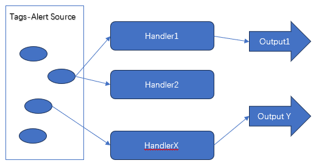


>1. 报警源：此部分直接在Tag定义中实现，你只需要在关注的数据标签Tag中定义可能的报警条件和提示即可。此部分你不需要考虑任何报警的后续处理。

>2. 定义报警处理（Handler）：基于标签数据Tags产生的报警源信息，你可以对这些报警源进行分组、分级。如果某个Tag中的报警源归入某个处理,则此报警源就可以起作用了。

>3. 定义报警输出：定义特定的报警数据输出项，然后关联报警处理(Handler)，则相关的报警源产生的报警数据就会推送到输出项中。

<font color=red>请注意：如果你仅仅在标签中定义了报警源而没有定义报警处理，那么你这个项目将不会产生报警数据。你唯一能看到的报警信息只有在管理界面中的标签列表中。</font>

在定义了报警处理之后，项目内部定义的HMI(UI)画面中，在运行时会有报警数据产生，并且能够显示到通用的报警列表中。如下图：


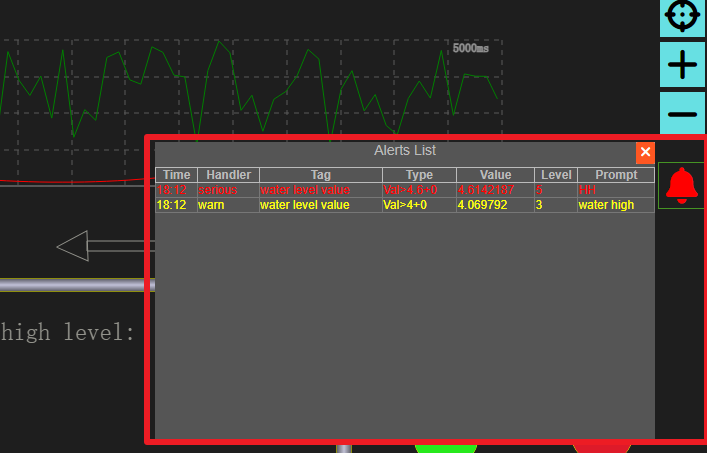


<font color=green>在很多场合，你需要在某个关键的报警信息产生时，通过特殊的方式提醒相关人员，那么你就需要定义报警输出了。比如，你可以定义一个支持手机短信的报警输出，或者你可以定义某个特殊的报警输出，使得IOT-Tree能够输出某个开关信号到现场声光提醒设备中。</font>

接下来，我们会详细说明IOT-Tree的报警管理是如何支持的。为了方便，我们还是以IOT-Tree内部自带的Demo项目"Water tank and Medicament dosing"进行说明。


## 2 在Tag中定义报警源


在IOT-Tree中的标签编辑对话框中，你可以直接添加多个报警数据源。我们双击项目中容器节点"/watertank/ch1/aio"下的标签"wl_val"，在弹出的对话框中可以看到此标签定义了3个报警数据源。 如下图：


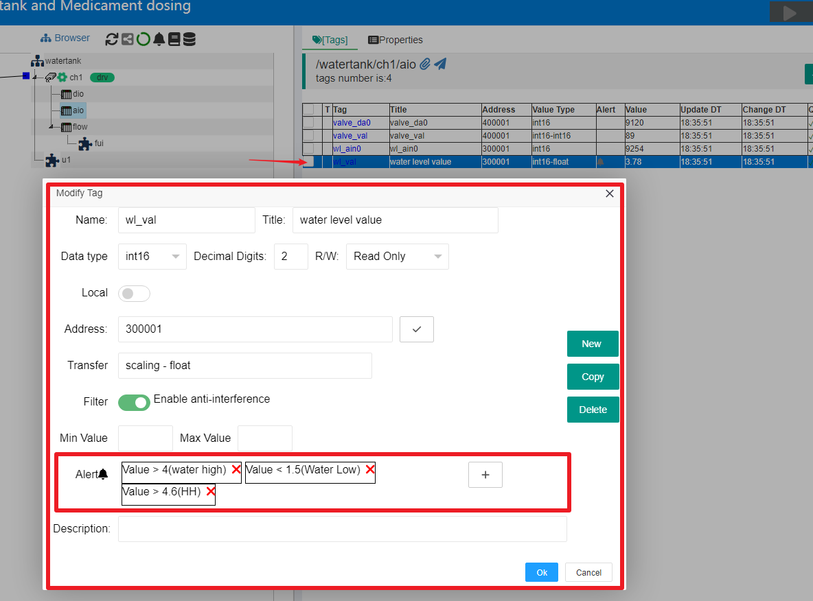


如果你要新增一个报警数据源，则点击Alert项右边的"Add Alert Source"按钮；或者你要编辑现有的某个报警数据源，则鼠标点击对应的报警源即可。弹出的报警源编辑界面如下：


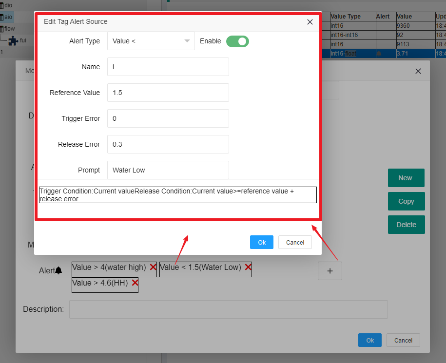


其中，"Alert Type"是报警源类型;"Name"是标签下的报警源唯一名称，可以为空;"Prompt"是此报警源产生的提示信息。

"Reference Value"，"Trigger Error","Release Error"等参数和具体的"Alert Type"相关。具体在报警源类型详细说明。此对话框点击"Ok"关闭之后，Tag编辑界面就会有对应的报警项，此时，你必须再次点击标签Tag的"Ok"按钮，才能真正保存到标签中。


### 2.1 报警源支持的Tag数据类型


目前标签Tag内部定义的报警源只支持数值(Number)和布尔(Bool)数据类型,则也要求标签Tag对应的数据类型必须限定在这个范围内部。


### 2.2 报警源类型

#### 2.2.1 开关量OnOff

触发条件：当前值==报警值(0/1)<br>
解除条件：当前值==报警值(0/1)

编辑参数：Alarm Value = 0/1

#### 2.2.2 负跳变 Negative Transition

触发条件：当前值由非0变化为0<br>
解除条件：当前值由0变化为非0

编辑参数：

#### 2.2.3 正跳变Positive transition

触发条件：当前值由0变化为非0<br>
解除条件：当前值由非0变化为0

编辑参数：

#### 2.2.4 Bit==

触发条件：当前数值指定位==指定值(0/1)<br>
解除条件：当前数值指定位<>指定值(0/1)

编辑参数：Bit Position=0-63;Alarm Value=0/1

#### 2.2.5 Bit Off-&gt;On

触发条件：当前数值指定位由0变1<br>
解除条件：当前数值指定位由1变0

编辑参数：Bit Position=0-63;

#### 2.2.6 Bit On-&gt;Off

触发条件：当前数值指定位由1变0<br>
解除条件：当前数值指定位由0变1

编辑参数：Bit Position=0-63;

#### 2.2.7 Value==

触发条件：当前值>=基准值-触发误差 且 当前值<=基准值+触发误差<br>
解除条件：当前值<基准值-解除误差 或 当前值>基准值+解除误差

编辑参数： 基准值;触发误差Trigger Error;释放误差Trigger Error

#### 2.2.8 Value<>  (值不等于)

触发条件：当前值<基准值-触发误差 或 当前值>基准值+触发误差<br>
解除条件：当前值>=基准值-解除误差 且 当前值<=基准值+解除误差

编辑参数： 基准值;触发误差Trigger Error;释放误差Trigger Error

#### 2.2.9 Value >

触发条件：当前值>基准值+触发误差<br>
解除条件：当前值<=基准值+解除误差

编辑参数： 基准值;触发误差Trigger Error;释放误差Trigger Error

#### 2.2.10 Value >=

触发条件：当前值>=基准值+触发误差<br>
解除条件：当前值&lt;基准值+解除误差

编辑参数： 基准值;触发误差Trigger Error;释放误差Trigger Error

#### 2.2.11 Value <

触发条件：当前值&lt;基准值+触发误差<br>
解除条件：当前值>=基准值+解除误差

编辑参数： 基准值;触发误差Trigger Error;释放误差Trigger Error

#### 2.2.11 Value <=

触发条件：当前值&lt;=基准值+触发误差<br>
解除条件：当前值&gt;基准值+解除误差

编辑参数： 基准值;触发误差Trigger Error;释放误差Trigger Error

### 2.3 组合条件报警源的实现


你一定会想到，在项目中，一定会有这样的报警需求——这个报警源需要多个数据根据一定的条件产生，这时候应该如何支持？

在IOT-Tree中的容器节点中，你可以定义普通标签(Tag)和中间标签（Middle Tag），其中，中间标签通过JS表单式的方式定义，可以很灵活的利用其它标签数据进行组合。那么，以上问题我们只需要定义一个中间标签，然后在这个标签内部定义报警源即可。

这个中间标签可以生产bool数据或数值数据，然后选用合适的报警类型，配置对应参数即可。


如果你对中间标签(Middle Tag)不了解，请参考:[标签列表][tag_list]

[tag_list]: ./tags.md

## 3 报警处理和输出


IOT-Tree的标签Tags定义好了报警源之后，如果没有后续处理，那么IOT-Tree的项目在运行中，这些报警源不会有任何作用，你只能在项目配置管理界面中看到对应的标签Tag有报警源数据产生。你只有针对这些报警源做相关的后续处理才能真正起作用。之所以这么做原因如下：

>1. 对于一个系统来说，报警是一个严肃的问题，我们必须对一个自动化监控项目的异常情况做充分考虑和建立应对措施，这样的系统才能够持久可靠的为我们服务。系统既不能在出现异常时没有任何报警，同时也不能随便报警（一些标签可能来自于设备库、内部自带的报警源不一定是我们需要的）。IOT-Tree这种基于标签内部定义报警源之后，还需要做专门的全局处理，就是强制让你重视项目的异常情况。

>2. 分层管理，使得报警配置思路和结构非常清晰，同时还简化配置工作。

>3. 能够提供更加灵活的报警配置支持。

>4. 能够提供项目运行时更加强大的监视功能。


### 3.1 处理和输出的分离


我们还是以Demo项目为例，在此项目的管理主界面中，点击中间Browser树上端的报警图标，你可以看到在右边主内容其，会出现Alert选项卡，如下图：


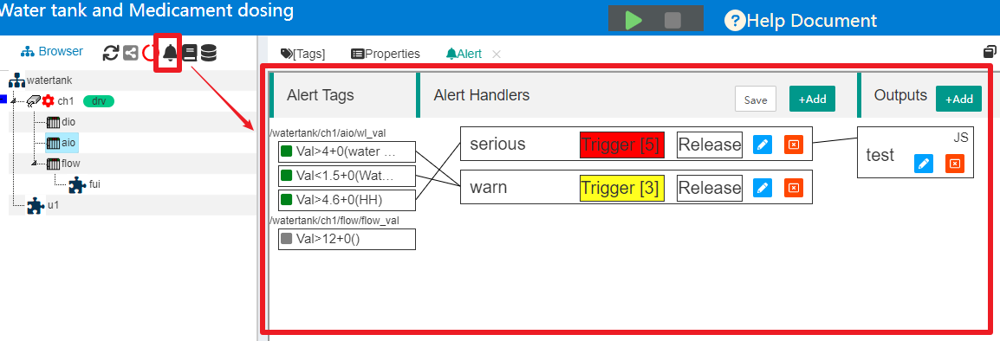


可以看到，项目中的报警管理界面分左中右三部分，左边是标签和对应报警源的列表，中间是报警处理(Handlers),右边是报警输出。

我们可以单独定义报警处理(Handler)和报警输出，然后把"报警数据源-报警处理-输出"进行关联。这种分离关联结构不仅直观明了，而且还灵活强大。


### 3.2 报警处理(Alert Handler)

#### 3.2.1 报警处理项编辑


在中间"Alert Handlers"区域中，点击按钮"+Add"或点击某个已经存在的Handler的编辑图标，就可以打开报警处理编辑对话框，如下图：


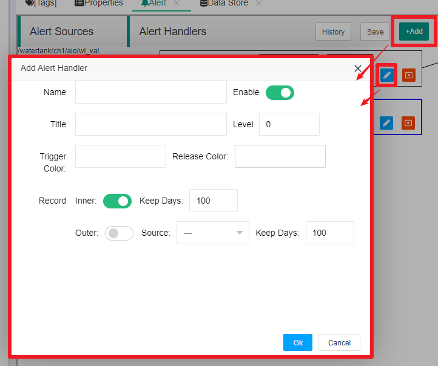


可以看出，报警处理非常简单，只需要定义此报警处理名称、标题、报警级别和是否使能，触发颜色以及报警记录的参数即可。某种意义上来说，报警处理是对报警源数据的分类。

本部分内容后续还可以改进，你如果有好的建议，可以向我们提出。


#### 3.2.2 关联报警源


当你新增了报警处理项之后，你接着可以设置哪些报警源于这个报警处理(Handler)关联。点击选中这个处理项，你会看到左边的报警数据源列表每一项会出现一个复选框，如果你要把某个报警源与当前选中的处理项关联，点击此复选框即可。当然，如果已经有关联，点击之后就取消关联了。

关联成功之后，你会看到这个报警源于对应的处理项会建立一个连接。

注意：对于关联操作之后，必须点击上方的"Save"按钮，才会真正保存起作用。


#### 3.2.3 关联之后的效果


当某个报警源被关联到一个报警处理项之后，IOT-Tree对这个报警源就会产生报警数据了。并且可以在项目运行中的HMI(UI)画面中显示。不过整体显示效果比较简单——报警数据只有在触发时显示，释放之后就不显示。


### 3.3 报警输出


报警输出也有个列表管理，你可以添加不同的报警输出。比如：你可以定义某个报警输出通过JS脚本调用手机短信接口，输出短信。或者也可以通过JS脚本更新某个标签数据。

注意：报警输出的JS脚本运行上下文是整个项目根部，也就是报警输出可以使用项目中的所有资源。

通过灵活的报警输出，你可以把不同报警处理(Alert Handler)进行关联，达到非常灵活的报警输出支持。

比如：对应重要的报警，你可以短信输出，可以远程及时的通知相关人员介入处理。而不重要的报警你可以做简单的日志记录即可。一些报警处理，你甚至没必要关联输出。


#### 3.3.1 报警输出项编辑


我们在右边Outputs区域，点击"+Add"按钮或点击某个已经存在的输出项的编辑图标，就可以打开报警输出编辑对话框，如下图：


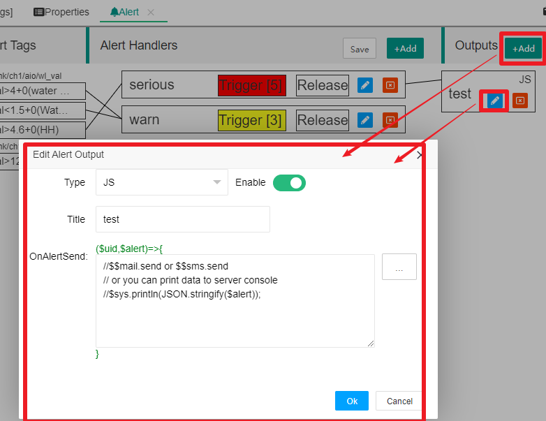

```

Type:表示报警输出类型，当前主要支持JS脚本方式。（后续还可能新增更多的类型支持如"DB Logger"）。事实上，JS脚本可以让你非常灵活的支持你需要的报警输出方式。比如，你可以实现你的特殊JsApi插件，然后在JS脚本中调用，就可以实现任意的输出扩展。

Title:是此报警输出项的标题

OnAlertSend: 对应的JS代码，本质是一个匿名函数，有两个参数$uid和$alert对象。当关联的Handler触发或释放某个报警数据时，此JS函数会被调用。你只需要根据JS运行上下文数据和这两个输出参数做相关的输出处理即可。


```

#### 3.3.2 JS报警输出项的上下文和参数

##### 1 JS运行上下文


由于报警处理基于整个项目，则JS运行的上下文也就是项目根上下文。我们用鼠标双击JS编辑区域，就会弹出JS编辑辅助窗口如下图：


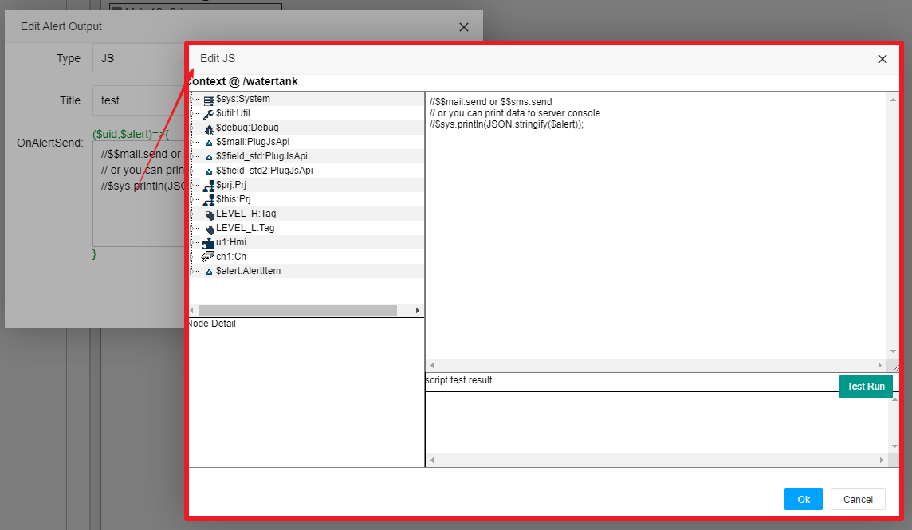

可以看到根部的成员中，$this等于$prj。此部分内容请参考:[JS脚本支持][js_idx].


你会发现在左边的上下文成员中，有个$alert:AlertItem成员，这个对象其实是报警数据，对应的是匿名函数的输入参数。之所以放在这个地方，是为了方便编写JS代码时的成员辅助参考。


##### 2 $uid和$alert输入参数


当某个报警输出被触发时，提供一个报警数据"$alert:AlertItem"，这个AlertItem内部会有一个uid和匿名函数输入参数$uid相同。

<font color=red>IOT-Tree规定:当某个报警源触发时，会新建立一个报警数据AlertItem，并且内部会生成一个新的唯一字符串uid。当此触发的报警被释放时，也会产生一个释放报警数据AlertItem，其内部的uid和之前的相同。</font>

因此，你如果在报警输出的实现时，要充分考虑触发和释放两种状态(两次先后调用)，通过uid来确定他们是同一个报警。

我们在上面的JS编辑辅助窗口展开$alert:AlertItem,可以看到这个对象内部所有成员。我们分别对此进行说明，如下图：


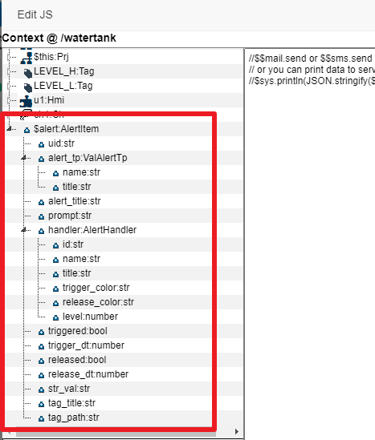

```
uid:str 触发报警时产生的唯一id

alert_tp:ValAlertTp 对应报警源设定的报警类型对象，有如下成员:
  name:str 类型名称，类型标识
  title:str 类型标题

prompt:str 报警提示，对应报警源设定的报警提示

handler:AlertHandler 报警处理器对象，有如下成员:
    id:str Handler ID
    name:str Handler Name,如果你要区分对应的处理器，请使用此名称作为标识
    title:str Handler 标题
    trigger_color:str 触发颜色，你可以在输出时，使用此颜色进行报警信息的展示
    level:number 报警级别

triggered:bool true说明是触发报警数据
trigger_dt:number 触发时间(自1970-1-1的毫秒数)，triggered=true时有效

released:bool true说明是释放报警数据
release_dt:number 释放时间(自1970-1-1的毫秒数)released=true时有效

str_val:str 触发报警时的数据值(字符串形式)

tag_title:str 对应标签项标题
tag_path:str 对应产生报警的标签路径
```

$alert的具体例子如下:

```
{
    uid: "e9NREyIqVV61gi7tCok",
    alert_tp:{
        name: "val_lt",
        title: "Value <"
        },
    alert_title: "Val<1.5+0",
    prompt: "Water Low",
    handler:{
        id: "dfBz3f8jSgJazPIa2UE",
        name: "serious",
        title: "Serious",
        trigger_color: "red",
        release_color: "",
        level: 5
        },
    triggered: true,
    trigger_dt: 1701678400460,
    released: false,
    release_dt: -1,
    str_val: "0.0025",
    tag_title: "water level value",
    tag_path: "/watertank/ch1/aio/wl_val"
}
```

很明显，你在实现报警输出时，要充分利用$alert这个对象。

比如：你可以通过此对象生成短信文本进行发送。也可以把此对象JSON格式数据直接推送到另外的处理程序，这个程序可以往自己的数据库中进行记录和更新。

又如：你可以根据$alert对象，判断是否要启动声光报警。如果此声光报警开关量对应自身项目的某个标签Tag。那么你只需要对此标签进行赋值操作即可。


#### 3.3.3 关联报警处理


在建立报警输出项之后，你可以把此输出项关联到报警处理(Handler)中。点击选中某个报警处理(Handler)项。你会发现报警输出项会出现复选框，点击此复选框你就可以把此报警输出项和报警处理建立或取消关联。

关联之后的报警输出和报警处理会有一个连接线。如下图：


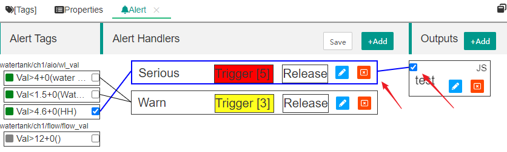

## 4 报警记录

### 4.1 基于Handler的报警记录参数


从1.0.3版本开始，IOT-Tree支持报警内部自动记录（通过内置SQLite数据源支持），并且此记录和必须由Alert Handler指定。

在上面的Alert Handler的新增或编辑界面中，你可以看到Record选项中，有Inner和Outer两个部分。其中，Inner代表报警触发之后的内部记录，并且可以指定报警信息的记录天数。缺省情况下这个是使能(Enabled)的。

而Outer则需要你使能(Enable),并且还需要指定配置好的数据源（数据源配置和项目无关，请参考相关内容）。并且也可以设定报警记录的存放天数。

注：如果你希望报警记录永久保存，那么请设置保留天数(Keep Days)为0或小于0即可。

通过这样的配置，IOT-Tree就会根据此Handler的配置指定对触发的报警进行存储。


### 4.2 报警记录查看


对于管理端：

有了这个报警记录储存，你可以在项目管理界面中的Alert标签中，点击按钮"History"进行查看。如下图：


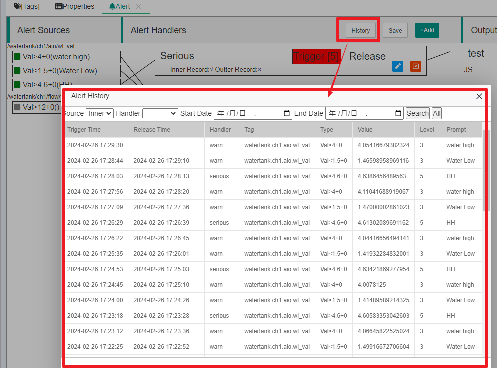

如果你在监控画面前端，点击报警图标，在实时报警窗口上方点击"History",就可以查看同样的信息了：


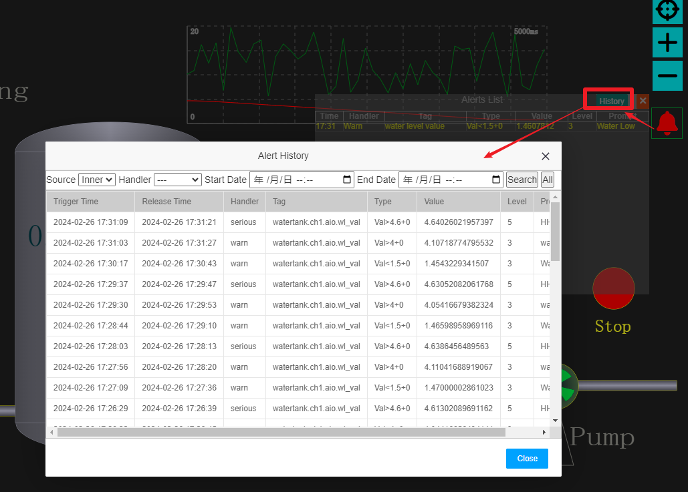

## 5 总结


总之，IOT-Tree的报警功能结构清晰，灵活和可扩展。可以让你花费最小的精力，实现最大化报警处理能力。


[js_idx]: ../js/index.md
