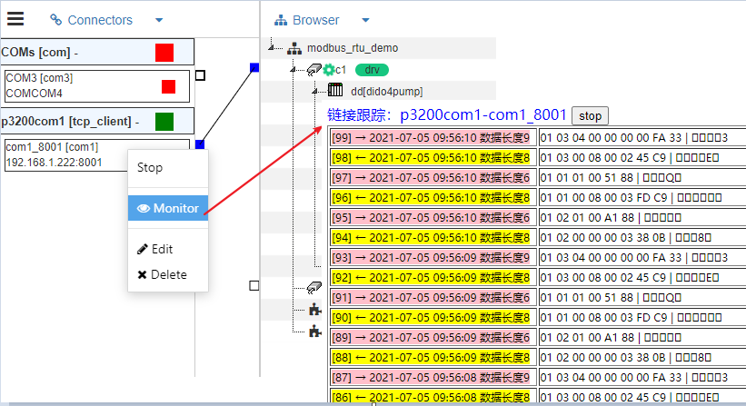

接入(Connector)-通道(Channel)-驱动(Driver)
==


[IOT-Tree Server的树][qn_tree]从纵向对一个项目涉及的所有设备和资源进行了规整。那么以通道(Channel)为中心，设备运行需要用到的通信和驱动从横向进行了整合。


```
               Project
                 |
Connector --> Channel (Driver)
                 |
            Device/Tag Group
                 |
               Tag Group
                 |
               Tag
```


在上下层次关系中，通道(Channel)某种意义上可以看成项目下面的设备分类，她是一种抽象概念。每个可以通道对应一个接入(Connector)。

如果接入(Connector)是Link方式的，则通道可能还需要设置对应的驱动，把设备可能用到的同一个接入和设备运行所需要的协议和驱动进行了统一。

当然，如果通道对应的接入是绑定(Bind)或消息(Message)，那么可能就不需要进行驱动设定。


## 1 设备驱动
当前物联网世间已经存在非常多的标准通信协议，如Modbus、Can...等等。IOT-Tree Server为了能够支持和扩展越来越多的设备，专门实现了可插拔的设备驱动支持。我们未来会有越来越多的驱动来支持你的需要。


### 1.1 设备定义Device Definition
为了能够更加方便使用。IOT-Tree Server专门设置了设备定义的组织和管理功能，这些功能独立与项目。，设备定义通过分类-设备两个层次进行管理。

通道下面定义设备需要对设备对应的协议比较了解，这需要相关的专业知识。和传统的OPC Server类似，专业人员可以通过选择设备驱动，设置设备参数，设置标签及标签对应驱动地址参数等完成设备的定义。

一旦设备定义完成，在项目中就可以直接引用定义好的设备，形成项目中具体的设备。这些具体的设备需要后续的参数设置非常少，甚至可以没有。

所有的设备定义都必须在驱动下面。如果一个设备支持多种协议，而IOT-Tree Server针对不同协议都有对应的驱动，那么一个设备在IOT-Tree Server中就可能会有多个定义，每个定义在不同的驱动下面。

需要了解更详细的设备定义，请点击这里： [设备定义 Device Definition][qn_devdef]


### 1.2 在通道上选择驱动

在某个通道(Channel)选定驱动之后，通道下面可使用的设备也就限定了——只能选择在这个驱动下面定义的设备。


## 2 通信接入Connector
当前不管在工业通信现场还是在互联网领域，已经存在了各种各样的通信方式和通信协议。

更进一步，在物联网领域，一个系统很可能存在分散在广大范围内的设备进行远程接入。

还有一种情况是，一些系统会有专门的物联网网关，网关下面接入很多设备，然后通过网关转换成互联网的Tcp/IP协议。

不同于一些传统的工业OPC软件系统（这些软件往往把设备驱动和通信组合在一起），IOT-Tree把通信和接入专门作为一个子系统存在，而驱动在设计时，则尽可能地重用通信接入。

通信接入Connector在IOT-Tree Server的项目中只能和通道(Channel)关联，由此和通道(Channel)下面选定的驱动间接的建立了联系。

很明显，通道和接入关联的时候，需要根据驱动进行有效性判断，如果接入和驱动不匹配，则也是无效的。

当然，某些驱动自身直接带了通信链接功能（这种情况在HttpClient等方式的一些驱动下面很常见），这种驱动也就不需要对应的通道(Channel)关联接入了。


### 2.1 通信监视功能

通信接入的独立，不仅可以简化驱动的开发和重用，还可也在通信层引入的更多的益处。如通信的维持、监视等。

IOT-Tree Server可以更加项目的需要设定或限定通信接入的相关参数，可以使得接入更加优化。同时，还可也更加接入提供的在线监视功能，跟踪项目运行过程中的通信数据。更加方便项目的运行。

如下图Modbus RTU通信数据的跟踪展示：





## 3 接入、通道和驱动的运行方式

在IOT-Tree Server中，接入可以独立运行，而驱动则在通道内部运行。驱动在实现时，需要考虑在通道中关联的接入状态的变化时做出相应的应对，如接入链接断开或恢复的情况。


[qn_tree]: ./quick_know_tree.md
[qn_devdef]: ./quick_know_devdef.md
