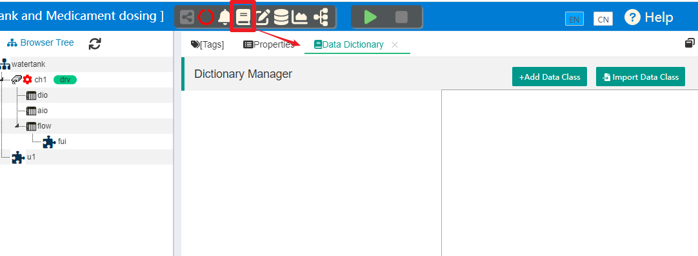

数据字典
==


IOT-Tree中的数据字典比较特殊，主要是为了项目树中容器节点和标签数据项的扩展数据内容。

我们定义项目树和标签时，只能输入基本和必要的信息，这构成了项目树基本数据内容。但在很多场合，这是不够的，比如有如下情景：

1）我们的某个项目如果要共享JSON数据给其他系统，如果能够让特定的标签节点带有其他系统需要的属性标识，那么会极大的方便其他系统使用IOT-Tree提供的数据。例如：某个系统只关心IOT-Tree中的温度数据，如果我们能够在温度对应的标签Tag中设置温度扩展属性。那么，IOT-Tree可以基于此扩展属性对输出标签进行过滤，减少数据传输，或者输出的JSON内容中，带有温度扩展属性也可以很容易的被其他系统准确识别过滤出来。

2）又如，我们可以自定义数据指标，如液位、电压、累积流量等扩展属性。基于这些扩展属性，提取相关数据存入不同的数据库表中。这些数据库表根据指标特点和查询方式的不同而结构不同，相同指标数据可以存入相同的表中。在后续的不同项目中，就可以利用相同的扩展属性设置IOT-Tree中的标签，而不需要重新编写代码。


## 1 数据字典总体说明

IOT-Tree中的数据字典管理上以数据类作为基本单元，每个项目中可以建立多个数据类。每个数据类代表一个扩展数据定义，除了名称标题之外，还可以设置此数据类可以和哪种类型的节点关联（这些节点可以是项目根节点、通道节点、设备节点、标签组节点和标签），并且可以设定此数据类的输入方式和数值类型。

如果某个数据类设置为选择输入，则代表了此类的数据值是离散的。因此，我们还可以设置此数据类可以使用的数据项。这些数据项在使用时只需要选择就可以完成管理。


## 2 数据字典管理

为了能够直观理解数据字典的作用，我们考虑这样一种典型的使用情景：项目中采集的数据和配置的标签Tag数量比较多，但不同项目可能会针对特定的一些标签Tag数据进行专门管理。比如，项目现场管理可能对材料的消耗比较关心，那么和材料消耗相关的流量等标签数据就需要单独记录和统计。顶层的ERP或MES系统会要求，下面的IOT-Tree Server实例，在提供json数据的时候，能够针对这些特定的标签，带有专门的指标扩展属性。

1) 我们针对流量字典类flow，设置四个选项值，这个字典必须限定到具体的标签数据中。


water_flow_rate （水瞬时流量）
water_total_flow （水累积流量）
gas_flow_rate （气瞬时流量）
gas_total_flow （气累积流量）


顶层系统可以很容易的抽取出这些数据，存放到不同的数据表中

2) 我们根据顶层系统的需要，对一些设备设置管理标识（字典类catid），这些标识是个字符串，需要手工输入。这个标识必须限定到容器节点中。

顶层系统可以根据此属性，确定某个节点下的所有的标签数据都属于某个标识。

在项目管理主界面中，点击上方的"Dictionary Manager"图标，就可以在右边出现对应的字典管理选项卡。如下图：





### 2.1 新建/编辑数据类

#### 2.1.1 新增字典类flow

点击“Add Data Class”，在弹出的对话框中填写如下信息：


```
Name=flow  Title=Flow
Bind For=Tag
Bind Style=Single Selection
```

其中，Bind For=Tag说明此字典类限定为标签Tag（也即是只能在标签中设置此属性），Bind Style=Single Select表示设置属性时，只能单选一个值。

点击"Ok"，就可以完成此字典类的添加。


#### 2.1.2 新增字典类catid

点击“Add Data Class”，在弹出的对话框中填写如下信息：


```
Name=catid  Title=Category Id In ERP
Bind For=Channel,Device,TagGroup 
Bind Style=Input String
```

其中，Bind For=Channel,Device,TagGroup说明此字典类限定为通道、设备和标签组三种容器节点，Bind Style=Input String表示设置属性时，由用户输入。

点击"Ok"，就可以完成此字典类的添加。

完成之后，两个字典类就在左边的列表中，我们点击"Category Id In ERP"这个字典类，右边会出现"Input By User"提示。如图：


而字典类Flow则需要设置4个可选项。

### 2.2 新增/编辑数据项

点击字典类Flow,右边就会出现此字典类数据项管理功能，其中，右上角有个“Add Data Item”按钮，点击就可以弹出数据项编写对话框。如图：


我们分别填写四个流量相关的数据项，最终列表如下：


```
Name=water_flow_rate  Title=Water Flow Rate
Name=water_total_flow  Title=Water Total Flow
Name=gas_flow_rate  Title=Gas Flow Rate
Name=gas_total_flow  Title=Gas Total Flow
```


## 3 数据字典的使用

上面我们已经配置了两个字典，那么接下来就是如何使用这些字典。我们需要把项目中的符合字典要求的节点与字典建立关联。

### 3.1 关联到树形内容中

IOT-Tree项目是一颗树，也即是我们要把字典内容，定义到项目树中。

#### 3.1.1 关联容器节点

我们点击项目树中的设备节点，然后在主内容区选择"\[Tags]"选项卡。你可以看到在上方容器节点路径右边有个曲别针的图标，点击此图标，就可以打开针对此节点的字典扩展属性设置对话框。如下图：


我们前面定义的字典"Category Id In ERP (catid)"由于绑定此类型的节点，因此显示在里面，并且此字典类需要手工输入。点击确定之后，就可以完成对应字典类属性值的设定。


#### 3.1.2 关联到标签Tag

我们在标签列表中选择flow_val，点击这一行内容的曲别针图标，就可以弹出针对此标签的字典扩展属性设置对话框。如下图：


可以看到里面显示出Flow这个字典选项，你只需要选择一个符合这个标签的内容即可。点击确定之后，就可以完成对应字典类属性值的设定。

这样，我们就完成了字典到项目树节点的关联设置。接下来，就可以使用这些内容了。


### 3.2 字典应用

IOT-Tree对于设置完成的字典扩展属性在很多方面做了输出支持

通过节点访问JSON实时数据中，每个字典属性都会通过 "ext_"前缀的属性名称输出。如鼠标右键点击项目树中的设备节点flow，选择"Access"打开此节点上下文下的实时JSON数据，可以看到flow容器节点，和flow_val这个标签对应的JSON对象，多了以"ext_"起始的扩展属性，每个扩展属性除了前缀之外，就是字典类名称，而对应的值是选择或输入的内容。如下图：


IOT-Tree在其他一些数据分析功能中，也会用到此扩展属性，其中有：

1) 基于相关的扩展属性条件，对节点或标签进行过滤

2) 输出带有此扩展属性信息的数据，满足其他系统的数据分辨要求


